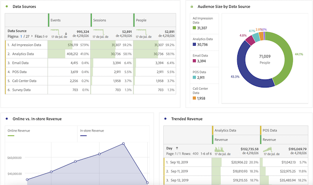

# Guía del usuario de CJA para usuarios de Adobe Analytics

>[!NOTE]
>
>Esta página está en construcción.

¡Felicidades, su empresa está empezando a trabajar Customer Journey Analytics! Como usuario de Adobe Analytics, ya tiene un bueno inicio del cabezal. Al trabajar con el Customer Journey Analytics, notará algunas grandes diferencias y algunas similitudes. Esta página pretende explicar las cosas que no han cambiado, así como algunas de las principales diferencias. También le explicaremos cómo puede obtener más información sobre nuevos conceptos y pasos adicionales para que el recorrido de sus clientes sea más fácil y exitoso.

## Qué no ha cambiado

Mucho de lo que está familiarizado con los informes no ha cambiado. Puede seguir utilizando la potencia de Analysis Workspace para analizar sus datos. También tiene a su disposición la misma versión de los paneles de Adobe Analytics. Workspace y los paneles funcionan básicamente igual que en la Adobe Analytics tradicional. Report Builder tiene una nueva interfaz y ahora se ejecuta en equipos, equipos Mac y la versión web de Excel. En cuanto a los informes, lo diferente es que tiene acceso a muchos más datos de canales cruzados para analizar. Este es un ejemplo de algunas visualizaciones multicanal:

## Nueva arquitectura

Customer Journey Analytics obtiene sus datos de Adobe Experience Platform. Experience Platform le permite centralizar y estandarizar los datos y el contenido de los clientes de cualquier sistema o canal y aplica la ciencia de datos y el aprendizaje automático para mejorar el diseño y el envío de las experiencias personalizadas.

Los datos del cliente en la plataforma se almacenan como conjuntos de datos que consisten en un esquema y lotes de datos. Para obtener más información sobre la plataforma, consulte la [Descripción general de arquitectura de Adobe Experience Platform](https://experienceleague.adobe.com/docs/platform-learn/tutorials/intro-to-platform/basic-architecture.html?lang=en).

Su administrador de CJA se ha establecido [conexiones](/help/connections/create-connection.md) a conjuntos de datos en Platform. Luego se construyeron [vistas de datos](/help/data-views/data-views.md) dentro de esas conexiones. Considere las vistas de datos como si fueran similares a los grupos de informes virtuales. Las vistas de datos son la base de los informes en Customer Journey Analytics.

## Nuevos conceptos y terminología

Se ha cambiado el nombre de varias funciones de CJA y se ha vuelto a diseñar, en comparación con la versión tradicional de Adobe Analytics, para que se ajusten a los estándares del sector. Algunos términos actualizados incluyen segmentos, grupos de informes virtuales, clasificaciones, atributos del cliente y nombres de contenedor. Ya no existen conceptos familiares como eVars y props, además de las limitaciones que imponen.

### eVars y props

Las [!UICONTROL eVars], las [!UICONTROL props] y los [!UICONTROL eventos] en el sentido tradicional de Adobe Analytics ya no existen en [!UICONTROL Customer Journey Analytics]. Tiene un número ilimitado de elementos de esquema (dimensiones, métricas, campos de lista). De modo que todos los ajustes de atribución que se aplicaron durante el proceso de recopilación de datos se aplican ahora en tiempo de consulta.

### Los segmentos ahora son &quot;Filtros&quot;

[!UICONTROL Customer Journey Analytics] ya no utiliza eVars, props ni eventos y, en su lugar, utiliza cualquier esquema de AEP. Esto significa que ninguno de los segmentos existentes es compatible con [!UICONTROL Customer Journey Analytics]. Además, se ha cambiado el nombre de &quot;segmentos&quot; a &quot;filtros&quot;.

Por el momento, no puede compartir/publicar [!UICONTROL filtros] ([!UICONTROL segmentos]) desde [!DNL Customer Journey Analytics] a Perfil unificado de Experience Platform u otras aplicaciones de Experience Cloud. Esta funcionalidad se está desarrollando actualmente.

### Métricas calculadas

[!UICONTROL Customer Journey Analytics] ya no utiliza eVars, props ni eventos y, en su lugar, utiliza cualquier esquema de AEP. Esto significa que ninguna de las métricas calculadas existentes es compatible con [!UICONTROL Customer Journey Analytics].

### Configuración de persistencia de variables y sesiones

[!UICONTROL Customer Journey Analytics] aplica todas estas configuraciones en el momento del informe y estas se encuentran ahora en Vistas de datos. Los cambios en esta configuración ahora son retroactivos y puede tener varias versiones con varias Vistas de datos.

### Los grupos de informes virtuales ahora son &quot;vistas de datos&quot;

### Las clasificaciones ahora son &quot;conjuntos de datos de búsqueda&quot;

### Los atributos del cliente ahora son &quot;Conjuntos de datos de perfil&quot;

### Los contenedores de visita individual ahora son contenedores de &quot;Evento&quot;

### Los contenedores de visita ahora son contenedores de &quot;sesión&quot;

### Los contenedores de visitante ahora son contenedores de &quot;persona&quot;

### `Uniques Exceeded` limitaciones

[!UICONTROL Customer Journey Analytics] no tiene limitaciones de valor único, por lo que no es necesario preocuparse por ellas.
