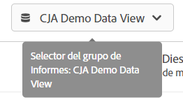

# Guía del usuario de CJA para usuarios de Adobe Analytics

>[!NOTE]
>
>Esta página está en construcción.

Su empresa está empezando a emplear a un Customer Journey Analytics. Como usuario que está familiarizado con Adobe Analytics, ya tiene un bueno inicio del cabezal. Al trabajar con el Customer Journey Analytics, notará algunas grandes diferencias y algunas similitudes. Esta página pretende explicar las cosas que no han cambiado, así como algunas de las principales diferencias. También le explicaremos cómo puede obtener más información sobre nuevos conceptos y pasos adicionales para que el recorrido de sus clientes sea más fácil y exitoso.

## Qué no ha cambiado

Mucho de lo que está familiarizado con los informes no ha cambiado.

* Puede seguir utilizando la potencia de [Analysis Workspace](/help/analysis-workspace/home.md) para analizar los datos. Workspace funciona igual que en la versión tradicional de Adobe Analytics.
* También tiene la misma versión de [Tableros de Adobe Analytics](/help/mobile-app/home.md) a su disposición. Los tableros (o aplicación Mobile) funcionan igual que en la versión tradicional de Adobe Analytics.
* [Report Builder](/help/report-builder/report-buider-overview.md) tiene una nueva interfaz y ahora se ejecuta en PC, Mac y la versión web de Excel.

En cuanto a los informes, lo que es diferente es que tiene acceso a muchos más datos de canales cruzados para analizar. Este es un ejemplo de algunas visualizaciones que incluyen fuentes de datos en canales múltiples:

## Nueva arquitectura

Customer Journey Analytics obtiene sus datos de Adobe Experience Platform. Experience Platform le permite centralizar y estandarizar los datos y el contenido de los clientes de cualquier sistema o canal y aplica la ciencia de datos y el aprendizaje automático para mejorar el diseño y el envío de las experiencias personalizadas.

Los datos del cliente en la plataforma se almacenan como conjuntos de datos que consisten en un esquema y lotes de datos. Para obtener más información sobre la plataforma, consulte la [Descripción general de arquitectura de Adobe Experience Platform](https://experienceleague.adobe.com/docs/platform-learn/tutorials/intro-to-platform/basic-architecture.html?lang=en).

Su administrador de CJA se ha establecido [conexiones](/help/connections/create-connection.md) a conjuntos de datos en Platform. Luego se construyeron [vistas de datos](/help/data-views/data-views.md) dentro de esas conexiones. Considere las vistas de datos como si fueran similares a los grupos de informes virtuales. Las vistas de datos son la base de los informes en Customer Journey Analytics. El concepto de grupo de informes ya no existe.

## Nuevos conceptos y terminología

Se ha cambiado el nombre de varias funciones de CJA y se ha vuelto a diseñar, en comparación con la versión tradicional de Adobe Analytics, para que se ajusten a los estándares del sector. Algunos términos actualizados incluyen segmentos, grupos de informes virtuales, clasificaciones, atributos del cliente y nombres de contenedor. Ya no existen conceptos familiares como eVars y props, además de las limitaciones que imponen.

## Los grupos de informes (virtuales) ahora son &quot;vistas de datos&quot;

[!UICONTROL Vistas de datos] tome el concepto de grupos de informes virtuales tal como existen hoy en día y expórtelo a [habilitar controles adicionales en los datos](/help/data-views/create-dataview.md) disponible mediante conexiones. Esto permite configurar los intervalos de zona horaria y de tiempo de espera de sesión. También puede aplicar propiedades de atribución y caducidad de forma dinámica para dimensiones individuales. Tenga en cuenta que se aplican retroactivamente en todos los datos.

**Qué debe hacer**:

* Tenga en cuenta que en Workspace, el selector de grupos de informes al que está acostumbrado ahora le permite elegir entre las vistas de datos que su administrador ha compartido con usted:

   

* Familiarícese con los muchos [casos de uso en vistas de datos](/help/data-views/data-views-usecases.md).

## No hay más eVars y props

Las [!UICONTROL eVars], las [!UICONTROL props] y los [!UICONTROL eventos] en el sentido tradicional de Adobe Analytics ya no existen en [!UICONTROL Customer Journey Analytics]. Tiene un número ilimitado de elementos de esquema (dimensiones, métricas, campos de lista). De modo que todos los ajustes de atribución que se aplicaron durante el proceso de recopilación de datos se aplican ahora en tiempo de consulta. Su administrador de CJA ha creado vistas de datos

**Qué debe hacer**:

* Familiarícese con las muchas formas en que estos elementos de esquema pueden utilizarse para profundizar en los datos.

## Los segmentos ahora son &quot;Filtros&quot;

[!UICONTROL Customer Journey Analytics] ya no utiliza eVars, props ni eventos y, en su lugar, utiliza cualquier esquema de AEP. Esto significa que ninguno de los segmentos existentes es compatible con [!UICONTROL Customer Journey Analytics]. Además, se ha cambiado el nombre de &quot;segmentos&quot; a &quot;filtros&quot;.

Por el momento, no puede compartir/publicar [!UICONTROL filtros] ([!UICONTROL segmentos]) desde [!DNL Customer Journey Analytics] a Perfil unificado de Experience Platform u otras aplicaciones de Experience Cloud. Esta funcionalidad se está desarrollando actualmente.

**Qué debe hacer**:

* Si desea mover los segmentos de Adobe Analytics existentes al Customer Journey Analytics, consulte [este vídeo](https://experienceleague.adobe.com/docs/customer-journey-analytics-learn/tutorials/moving-adobe-analytics-segments-to-customer-journey-analytics.html?lang=es).
* De lo contrario, vuelva a crear los filtros en el Customer Journey Analytics .

## Métricas calculadas

[!UICONTROL Customer Journey Analytics] ya no utiliza eVars, props ni eventos y, en su lugar, utiliza cualquier esquema de AEP. Esto significa que ninguna de las métricas calculadas existentes es compatible con [!UICONTROL Customer Journey Analytics].

**Qué debe hacer**:

* Si desea mover las métricas calculadas de Adobe Analytics al Customer Journey Analytics, consulte [este vídeo](https://experienceleague.adobe.com/docs/customer-journey-analytics-learn/tutorials/moving-your-calculated-metrics-from-adobe-analytics-to-customer-journey-analytics.html?lang=es).
* De lo contrario, vuelva a crear las métricas calculadas en Customer Journey Analytics.

## Datos de grupos de informes múltiples

Las implementaciones existentes de varios conjuntos de datos se pueden combinar en Experience Platform. Las conexiones y vistas de datos basadas en estos conjuntos de datos pueden combinar datos que existían anteriormente en grupos de informes separados.

**Qué debe hacer**:

## Configuración de persistencia de variables y sesiones

[!UICONTROL Customer Journey Analytics] aplica todos estos ajustes en el momento del informe y estos ajustes ahora se encuentran activos en [vistas de datos](/help/data-views/component-settings/persistence.md). Los cambios en esta configuración ahora son retroactivos y puede tener varias versiones con varias vistas de datos.

**Qué debe hacer**:

## Las clasificaciones ahora son &quot;conjuntos de datos de búsqueda&quot;

## Los atributos del cliente ahora son &quot;Conjuntos de datos de perfil&quot;

## Se ha cambiado el nombre de los contenedores

Especifique un contenedor para [cada vista de datos que cree](https://experienceleague.adobe.com/docs/analytics-platform/using/cja-dataviews/create-dataview.html?lang=en#containers).
* **Los contenedores de visita individual ahora son contenedores de &quot;Evento&quot;**. El contenedor [!UICONTROL Persona] incluye todas las visitas y vistas de página de los visitantes en un lapso de tiempo específico.
* **Los contenedores de visita ahora son contenedores de &quot;sesión&quot;**. El contenedor [!UICONTROL Sesión] le permite identificar interacciones de páginas, campañas o conversiones para una sesión específica.
* **Los contenedores de visitante ya están [!UICONTROL Persona] contenedores**. El contenedor [!UICONTROL Persona] incluye todas las visitas y vistas de página de los visitantes en un lapso de tiempo específico.

**Qué debe hacer**:

Tiene la opción de cambiar el nombre de cualquier contenedor para adaptarlo a las necesidades de su organización.

## `Uniques Exceeded` limitaciones

[!UICONTROL Customer Journey Analytics] no tiene limitaciones de valor único, por lo que no es necesario preocuparse por ellas.
