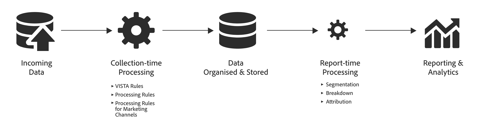
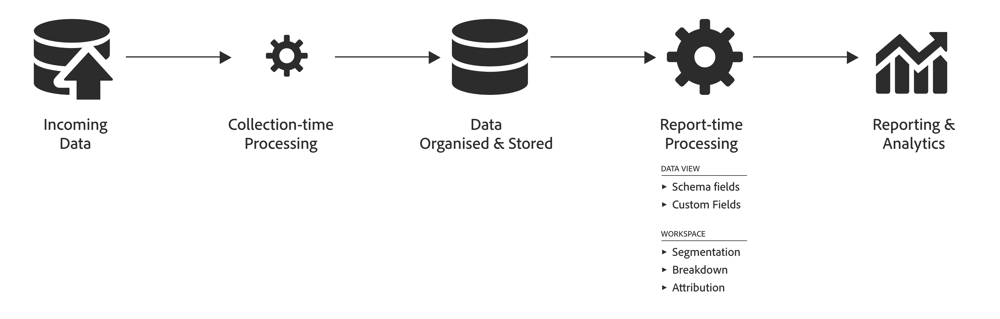

# Compare el procesamiento de datos entre Adobe Analytics y Customer Journey Analytics.

A menudo necesita la capacidad de procesar datos antes de que sean útiles para la creación de informes. Puede procesar esos datos en varias etapas del recorrido, desde la recopilación de datos hasta la generación del informe o la visualización.

En Adobe Analytics, la mayor parte de ese procesamiento de datos se produce inmediatamente después de recopilarlos. Funcionalidades como reglas de VISTA, reglas de procesamiento y reglas de procesamiento de canales de marketing están disponibles para admitir esto **procesamiento de tiempo de colección**.
A continuación, los datos se almacenan y, en el momento del informe, se puede aplicar un procesamiento adicional. Por ejemplo, desglose de dimensiones, aplique la segmentación o seleccione un modelo de atribución diferente. Esta **procesamiento de tiempo del informe** sucede sobre la marcha.

En Adobe Analytics, el procesamiento de tiempo de los informes suele representar una cantidad de procesamiento menor que lo que sucede en el momento de la recopilación.

Por el contrario, Customer Journey Analytics (CJA) está diseñado para requerir un procesamiento mínimo del tiempo de recopilación inicial antes de que se organicen y almacenen los datos. La arquitectura subyacente de CJA está más diseñada para trabajar con los datos almacenados en el tiempo del informe y ofrece su potente funcionalidad de procesamiento de tiempo del informe no solo en Workspace, sino también, lo que es más importante, a través de la definición de [componentes](/help/data-views/component-settings/overview.md) y [campos derivados](/help/data-views/derived-fields/derived-fields.md) en las vistas de datos.

Comprender las diferencias en el procesamiento de datos para las distintas funciones de informes puede ser útil para comprender qué métricas están disponibles, dónde y por qué pueden diferir.

Por ejemplo, dado que “visitas” como métrica en Adobe Analytics se define en el tiempo del procesamiento de datos y “sesiones” como métrica en CJA se calcula en el tiempo del informe, las dos métricas pueden diferir en función de las reglas utilizadas para la definición de sesión dentro de la vista de datos de CJA.

Además, ni las visitas ni las sesiones como métrica están disponibles en conjuntos de datos creados por el conector de origen de Analytics y, por lo tanto, requerirían que definiera la sesión en la lógica de consulta para poder hacer comparaciones.

## Terminología {#terms}

La siguiente tabla define la terminología para los diferentes tipos de lógica de procesamiento que se aplican a Adobe Analytics y CJA:

| Término | Definición | Notas |
| --- | --- | --- |
| Procesamiento de tiempo de colección | Lógica que se realiza cuando se recopilan y procesan datos, antes de almacenarse para fines de informes y análisis. | Esta lógica está “incorporada” a los datos históricos y, por lo general, no se puede cambiar fácilmente. |
| Procesamiento de intervalo de tiempo | Lógica que se realiza en el momento de ejecutar un informe. | Esta lógica se puede aplicar a datos futuros e históricos durante el tiempo de ejecución del informe de forma no destructiva. |
| Lógica de nivel de éxito individual | Lógica aplicada en un nivel fila a fila. | Ejemplos: Reglas de procesamiento, VISTA, ciertas reglas de canal de marketing. |
| Lógica de nivel de visita | Lógica aplicada en el nivel de visita. | Ejemplos: Visita y definición de sesión. |
| Lógica a nivel de visitante | Lógica aplicada en el nivel de persona. | Ejemplo: vinculación de personas entre dispositivos y canales. |
| Lógica de segmento (filtro) | Evaluación de las reglas del segmento (filtro) evento/visita/persona (evento/sesión/persona). | Ejemplo: Personas que compraron zapatos rojos. |
| Métricas calculadas | Evaluación de métricas personalizadas creadas por el cliente que pueden basarse en fórmulas complejas, incluidos segmentos y filtros. | Ejemplo: número de personas que compraron zapatos rojos. |
| Lógica de atribución | Lógica para calcular la atribución. | Ejemplo: Persistencia del eVar. |
| Configuración de componentes | Aplicación de personalizaciones a métricas o dimensiones, como atribución, comportamiento, formato, etc | Ejemplo: agrupación de valores para combinar valores numéricos basados en un rango |
| Campos personalizados | La lógica se aplica a los campos de esquema o estándar como parte de la definición de componentes en una vista de datos. | Ejemplo: creación de una nueva dimensión de canal de marketing |

{style="table-layout:auto"}

Con el tiempo, Adobe Analytics y ahora Customer Journey Analytics han mejorado su flexibilidad al permitir que la lógica de datos de nivel de persona y visita se realice durante el tiempo de ejecución del informe.

## Tipos de procesamiento de datos {#types}

Los pasos de procesamiento de datos que se realizan para Adobe y CJA y el tiempo que se debe pasar por estos pasos varían de la función de Analytics a la función de Analytics. La siguiente tabla proporciona un resumen de los tipos de procesamiento de datos para cada función de Analytics y cuándo se aplica el procesamiento de datos.

| Funcionalidad | Se aplica en el tiempo del procesamiento | Se aplica en el tiempo del informe | No disponible | Notas |
| --- | --- | --- | --- | --- |
| Creación de informes [Core AA](https://experienceleague.adobe.com/docs/analytics.html?lang=es)  (sin incluir los grupos de informes virtuales o los Attribution IQ con procesamiento de tiempo de los informes) | <ul><li>[Reglas de procesamiento](https://experienceleague.adobe.com/docs/analytics/admin/admin-tools/processing-rules/processing-rules.html?lang=es)</li><li>[Reglas de VISTA](https://experienceleague.adobe.com/docs/analytics/technotes/terms.html?lang=es)</li><li>[Reglas de canal de marketing](https://experienceleague.adobe.com/docs/analytics/admin/admin-tools/manage-report-suites/edit-report-suite/marketing-channels/c-rules.html?lang=es) de nivel de éxito</li><li>Reglas de canal de marketing de nivel de visita (consulte la nota)</li><li>Definición de la visita</li><li>Lógica de atribución</li></ul> | <ul><li>Lógica del segmento</li><li>Métricas calculadas</li></ul> | <ul><li>Análisis entre dispositivos (consulte la nota)</li></ul> | <ul><li>CDA requiere el uso de grupos de informes virtuales con procesamiento de tiempo de informes.</li><li>Las “reglas de canal de marketing de nivel de visita” incluyen: **Es la primera página de la visita**, **Anular canal de último toque** y **Caducidad del canal de marketing**. (Consulte la [documentación](https://experienceleague.adobe.com/docs/analytics-platform/using/cja-usecases/marketing-channels.html?lang=es).)</li></ul> |
| Core AA [Data Warehouse](https://experienceleague.adobe.com/docs/analytics/export/data-warehouse/data-warehouse.html?lang=es) | <ul><li>Reglas de procesamiento</li><li>Reglas de VISTA</li><li>Reglas de canal de marketing de nivel de éxito</li><li>Reglas de canal de marketing de nivel de visita</li><li>Definición de la visita</li><li>Lógica de atribución</li></ul> | <ul><li>Lógica del segmento</li></ul> | <ul><li>Métricas calculadas</li><li>Análisis entre dispositivos</li></ul> |  |
| [Fuentes de datos](https://experienceleague.adobe.com/docs/analytics/export/analytics-data-feed/data-feed-overview.html?lang=es) Core AA | <ul><li>Reglas de procesamiento</li><li>Reglas de VISTA</li><li>Reglas de canal de marketing de nivel de éxito</li><li>Reglas de canal de marketing de nivel de visita</li><li>Definición de visita (campo visitnum)</li><li>Lógica de atribución (en columnas posteriores)</li></ul> |  | <ul><li>Lógica del segmento</li><li>Métricas calculadas</li><li>Análisis entre dispositivos</li></ul> | <ul><li>Las asignaciones de ID para determinadas columnas relacionadas con los canales de marketing en fuentes de datos no se incluyen en las fuentes de datos. (Consulte la [documentación de fuentes de datos](https://experienceleague.adobe.com/docs/analytics/export/analytics-data-feed/data-feed-contents/datafeeds-reference.html?lang=es)).</li></ul> |
| [Livestream](https://github.com/AdobeDocs/analytics-1.4-apis/blob/master/docs/live-stream-api/getting_started.md) Core AA | <ul><li> Reglas de procesamiento</li><li>Reglas de VISTA</li><ul> |  | <ul><li>Reglas de canal de marketing de nivel de éxito</li><li>Reglas de canal de marketing de nivel de visita</li><li>Lógica de visita</li><li>Lógica de atribución</li><li>Lógica del segmento</li><li>Métricas calculadas</li><li>Análisis entre dispositivos</li></ul> |  |
| [Attribution IQ](https://experienceleague.adobe.com/docs/analytics/analyze/analysis-workspace/attribution/overview.html?lang=es) Core AA | <ul><li>Reglas de procesamiento</li><li>Reglas de VISTA</li><li>Definición de la visita (consulte la nota)</li><li>Análisis entre dispositivos (consulte la nota)</li></ul> | <ul><li>Reglas de canal de marketing de nivel de éxito (consulte la nota)</li><li>Reglas de canal de marketing de visita (consulte la nota) Lógica de atribución</li><li>Lógica del segmento</li><li>Métricas calculadas</li></ul> |  | <ul><li>CDA requiere el uso de grupos de informes virtuales con procesamiento de tiempo de informes.</li><li>Attribution IQ en Core Analytics usa canales de marketing que se derivan completamente en el tiempo del informe (es decir, valores medios derivados).</li><li>Attribution IQ utiliza una definición de visita en el tiempo del procesamiento excepto cuando se utiliza en un VRS de procesamiento de tiempo de informes.</li></ul> |
| Grupos de informes virtuales principales AA con [procesamiento del tiempo de los informes](https://experienceleague.adobe.com/docs/analytics/components/virtual-report-suites/vrs-report-time-processing.html?lang=es) (VRS RTP) | <ul><li>Reglas de procesamiento</li><li>Reglas de VISTA</li><li>[Análisis entre dispositivos](https://experienceleague.adobe.com/docs/analytics/components/cda/overview.html?lang=es)</li></ul> | <ul><li>Definición de la visita</li><li>Lógica de atribución</li><li>Lógica del segmento</li><li>Métricas calculadas</li><li>Otros ajustes de RTP de VRS</li></ul> | <ul><li>Reglas de canal de marketing de nivel de éxito</li><li>Reglas de canal de marketing de nivel de visita</li></ul> | <ul><li>Consulte la [documentación](https://experienceleague.adobe.com/docs/analytics/components/virtual-report-suites/vrs-report-time-processing.html?lang=es) de VRS RTP.</li></ul> |
| Conjunto de datos basado en el [conector de origen de Analytics](https://experienceleague.adobe.com/docs/experience-platform/sources/connectors/adobe-applications/analytics.html?lang=es) en el lago de datos AEP | <ul><li>Reglas de procesamiento</li><li>Reglas de VISTA</li><li>Reglas de canal de marketing de nivel de éxito</li><li>Vinculación basada en el campo (véase la nota)</li></ul> |  | <ul><li>[Reglas de canal de marketing de nivel de visita](https://experienceleague.adobe.com/docs/analytics-platform/using/cja-usecases/marketing-channels.html?lang=es)</li><li>Lógica de visita</li><li>Lógica de atribución</li><li>Lógica de filtro</li></ul> | <ul><li>Debe aplicar su propia lógica de filtro y métricas calculadas</li><li>La vinculación basada en el campo crea un conjunto de datos identificado independiente además del creado por el conector de origen de Analytics.</li></ul> |
| Creación de informes de [Customer Journey Analytics](https://experienceleague.adobe.com/docs/analytics-platform/using/cja-landing.html?lang=es) | <ul><li>Se implementa como parte de la recopilación de datos de Adobe Experience Platform</li></ul> | <ul><li>Definición de sesión</li><li>Configuración de [vista de datos](https://experienceleague.adobe.com/docs/analytics-platform/using/cja-dataviews/data-views.html?lang=es)<li>Lógica de atribución</li><li>Métricas calculadas</li><li>Lógica de filtro</li></ul> | <ul><li>Reglas de canal de marketing de nivel de visita</li></ul> | <ul><li>Debe utilizar conjuntos de datos enlazados para aprovechar el análisis entre canales.</li></ul> |

{style="table-layout:auto"}
