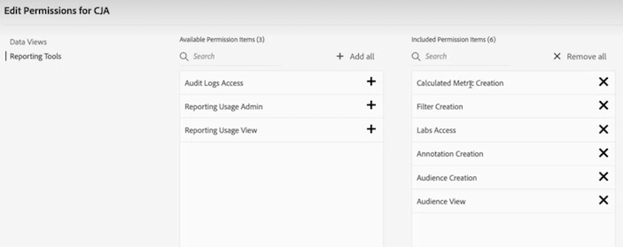

# Control de acceso de CJA

El Customer Journey Analytics (CJA) se rige por tres niveles de acceso o por tres funciones: Función de administrador de productos, función de administrador de perfil de producto y acceso de usuario. En este tema se explican estas funciones con más detalle.

## Función de administrador de productos

Los administradores de productos tienen permisos para completar cualquier tarea necesaria dentro de CJA. Debe agregarse como administrador de productos al **Perfil de producto del Customer Journey Analytics** en el [Admin Console](https://adminconsole.adobe.com/enterprise/) under [!UICONTROL Customer Journey Analytics] > [!UICONTROL Administradores] pestaña > [!UICONTROL Agregar administrador]. Los administradores de productos tienen los siguientes permisos:

* Crear/actualizar/eliminar conexiones o Vistas de datos
* Actualizar/eliminar proyectos, filtros, métricas calculadas, audiencias, anotaciones o filtros creados por otros usuarios
* Compartir proyectos de Workspace con todos los usuarios

Convertirse en administrador de productos solo en Customer Journey Analytics no es suficiente para crear, actualizar o eliminar un [connection](/help/connections/overview.md). Para crear una conexión a un conjunto de datos de Experience Platform, también necesita permisos de Experience Platform. Específicamente, debe formar parte de un **perfil del producto Experience Platform** que le proporciona los siguientes permisos:

* Modelado de datos: Esquemas de vista, Administrar esquemas
* Administración de datos: Ver conjuntos de datos, Administrar conjuntos de datos
* Ingesta de datos: Administrar fuentes
* Ver espacios de nombres de identidad

Para obtener más información sobre los permisos de Experience Platform, consulte [Control de acceso en Adobe Experience Platform](https://experienceleague.adobe.com/docs/experience-platform/access-control/home.html?lang=es).

## Función de administrador del perfil de producto

Un perfil de producto es un conjunto de permisos. Los administradores de perfil de producto pueden

* Cree y administre perfiles de producto individuales, como agregar nuevos usuarios.

* En CJA, edite las vistas de datos que forman parte de un perfil de producto que administra. No pueden crear nuevas vistas de datos.

## Acceso de nivel de usuario

Los usuarios en Customer Journey Analytics no pueden crear, editar ni ver conexiones o vistas de datos. Los usuarios pueden crear filtros, proyectos, audiencias y métricas calculadas con permisos especiales en el Admin Console.

## Revisión de proyecto de Workspace

Se puede utilizar otro nivel de control de acceso en el nivel de informes de Workspace. Puede limitar el acceso a componentes específicos para determinados usuarios. Para obtener más información sobre cómo limitar componentes (dimensiones, métricas, segmentos e intervalos de fechas) en el nivel de proyecto de Workspace y cómo se vincula la depuración a las vistas de datos, consulte [Depurar proyectos](/help/analysis-workspace/curate-share/curate.md).

## Conceder acceso a métricas o dimensiones individuales

No se puede otorgar ni rechazar permisos a métricas o dimensiones individuales en Customer Journey Analytics como se puede hacer en la versión tradicional de Adobe Analytics. Las métricas y dimensiones se pueden modificar en [vistas de datos](/help/data-views/data-views.md) y, por lo tanto, están sujetos a cambios en CJA. Si se cambian también de forma retroactiva, los informes se verán modificados.

## Casos prácticos

Estos son algunos casos de uso que ilustran cómo se puede utilizar el control de acceso en escenarios reales.

### Acceso de terceros

Un tercero con el que trabaja su empresa tiene un posible cliente de equipo que se puede convertir en administrador del perfil de producto. A continuación, este administrador puede agregar usuarios de su equipo a este perfil de producto. Este administrador puede proporcionar acceso a vistas de datos específicas y agregar otros usuarios a este perfil de productos. También pueden modificar las vistas de datos sobre las que tienen control para adaptarlas a las necesidades de su equipo.

### Control de acceso a nivel de fila

Supongamos que desea que los usuarios tengan acceso a los datos desde un solo día. Así se limitaría el acceso a esas filas específicas:

1. Cree un filtro en CJA donde **[!UICONTROL Día]** es igual a la fecha a la que desea que tengan acceso a los datos.
1. En [!UICONTROL Vistas de datos] > [!UICONTROL Configuración], agregue ese filtro a la vista de datos.
1. Guarde la vista de datos y aplicará automáticamente el filtro al conjunto de datos. Ahora, las filas que no se ajusten a la definición del filtro se excluyen automáticamente de la vista de datos editada.
1. Cree un nuevo perfil de producto en Admin Console, añada usuarios y limite su acceso a esta vista de datos.

### Control de acceso a nivel de valor

Los usuarios que tienen acceso a una vista de datos solo pueden trabajar con las métricas y dimensiones que el administrador ha incluido en esta vista de datos. Los administradores pueden utilizar la variable [Funcionalidad Incluir/Excluir](/help/data-views/component-settings/include-exclude-values.md) en las vistas de datos para, por ejemplo, excluir ciertos valores de dimensión de una vista de datos.

Este es un ejemplo relacionado con la atención médica: Supongamos que crea una métrica denominada &quot;Hipertensión&quot; en una vista de datos a partir de un conjunto de datos que incluya estos datos. El hecho de que sea una métrica le permitiría ver el valor agregado de esta métrica, pero no los pacientes individuales que entran dentro de ella.

## Permisos de CJA

La variable **[!UICONTROL Permisos]** forma parte de cada perfil de producto en [Admin Console](https://adminconsole.adobe.com/enterprise/). Puede agregar usuarios a perfiles de producto específicos. A continuación, asigne derechos a vistas de datos específicas y especifique los permisos que tienen los usuarios en un perfil de producto. Estos son los permisos específicos de CJA:

| Permiso | Definición |
| --- | --- |
| **[!UICONTROL Vistas de datos]** | Si cambia **[!UICONTROL Inclusión automática]** a **[!UICONTROL Activado]**, los usuarios que forman parte de este perfil de producto pueden ver todas las vistas de datos existentes y creadas recientemente. Si esta configuración está definida en **[!UICONTROL Off]**, puede seleccionar vistas de datos específicas a las que los usuarios tienen acceso. |
| **[!UICONTROL Herramientas de informes]**: |  |
| **[!UICONTROL Acceso a registros de auditoría]** | Actualmente, [registros de auditoría](https://adobe.io/cja-apis/docs/endpoints/auditlogs/) solo están disponibles a través de la API . Este permiso es para una interfaz de usuario futura en desarrollo. |
| **[!UICONTROL Administración de creación de informes]** | Permite a los usuarios ver y eliminar cualquier informe que se ejecute en su empresa. (La funcionalidad de uso de informes aún no está disponible). |
| **[!UICONTROL Vista del uso de creación de informes]** | Permite a los usuarios ver todas las solicitudes de informes simultáneos. (La funcionalidad de uso de informes aún no está disponible). |
| **[!UICONTROL Creación de métricas calculadas]** | Permite que los usuarios creen [métricas calculadas](/help/components/calc-metrics/calc-metr-overview.md). |
| **[!UICONTROL Creación de filtros]** | Permite que los usuarios creen [filtros](/help/components/filters/filters-overview.md). |
| **[!UICONTROL Acceso a Labs]** | Permite que los usuarios accedan al [Labs](/help/labs/labs.md) en CJA. |
| **[!UICONTROL Creación de anotación]** | Permite que los usuarios creen [anotaciones](/help/components/annotations/overview.md). |
| **[!UICONTROL Creación de audiencias]** | Permite que los usuarios creen [audiencias](/help/components/audiences/audiences-overview.md). |
| **[!UICONTROL Visualización de audiencias]** | Permite que los usuarios vean [audiencias](/help/components/audiences/audiences-overview.md). |