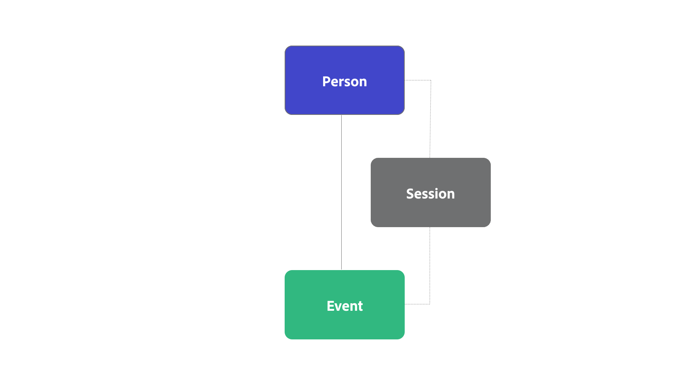
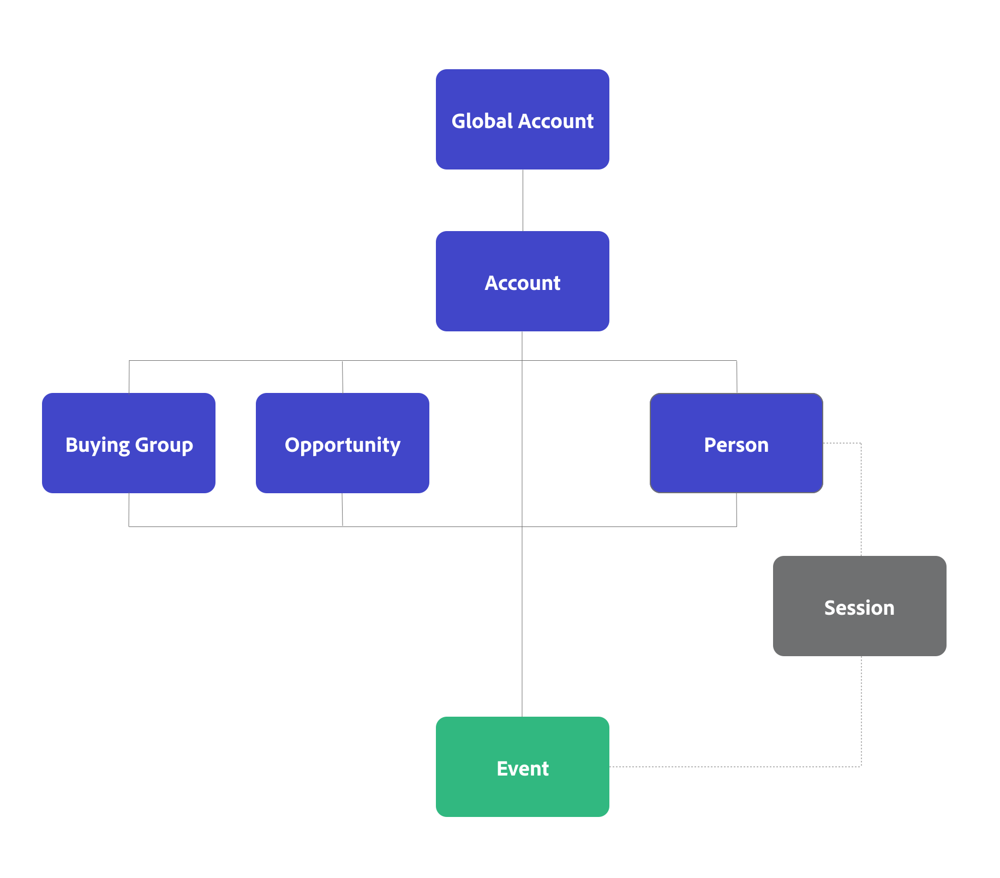

# Conceptos y funciones de B2B edition

{{draft-b2b}}

En este artículo se explican los conceptos y las funciones generales de los conjuntos de datos y los contenedores, y cómo difieren entre el estándar y el B2B edition de Customer Journey Analytics.

Los conjuntos de datos son el origen de una conexión. Como parte de la configuración de una conexión, puede definir conjuntos de datos para que formen parte de esa conexión.

Los contenedores son un complemento utilizado en Customer Journey Analytics para admitir y facilitar funciones como filtros, métricas calculadas y funciones de análisis avanzadas.

## Contenedores estándar

La versión *standard* de Customer Journey Analytics se basa en el concepto de tres contenedores: Persona, Sesión y Evento. En una configuración estándar de Customer Journey Analytics, estos contenedores relevantes se generan implícitamente en función de la configuración.

Puede redefinir cómo se asignan los nombres a estos contenedores cuando configura una vista de datos, pero conceptualmente la versión estándar utiliza una jerarquía de contenedores basada en persona.

{zoomable="yes"}

En la conexión, se agregan conjuntos de datos de evento, perfil y búsqueda y se seleccionan identidades para utilizar y definir la conexión entre estos conjuntos de datos. Como parte de la conexión, se genera automáticamente una jerarquía de contenedor basada en persona. En esa jerarquía, el contenedor de sesión está definido por la [configuración de sesión](/help/data-views/session-settings.md) de la vista de datos.

## Contenedores B2B

En Customer Journey Analytics B2B edition, se agrega un contenedor de cuenta a la lista de contenedores generados.  Además, tiene la opción de configurar la generación de contenedores adicionales, como Cuenta global, Grupo de compra y Oportunidad.

{zoomable="yes"}

En la conexión, agrega Evento, Cuenta, Cuenta global, Oportunidad, Grupo de compra y otros conjuntos de datos de búsqueda. Selecciona Cuenta como ID principal para la conexión, de modo que puede utilizar identidades basadas en cuentas para definir la conexión entre los conjuntos de datos. Como parte de la conexión, se genera automáticamente una jerarquía de contenedor basada en cuentas. En esa jerarquía, el contenedor de sesión entre el contenedor de persona y el contenedor de evento se define mediante la [configuración de sesión](/help/data-views/session-settings.md) en la vista de datos. Además, actualmente no se admiten contenedores de sesión, por ejemplo, entre Account y Event.

Oportunidad, grupo de compra y persona son contenedores del mismo nivel del contenedor de cuenta. Consulte la tabla siguiente para obtener una descripción y un uso básico.

| Contenedor B2B | Descripción Caso de uso básico |
|---|---|
| Cuenta | Una compañía que es cliente o cliente potencial de su negocio. Podría ser una filial o división de una organización más grande. La cuenta representa la organización a la que realiza ventas y a la que desea realizar un seguimiento en ese nivel de organización. |
| Cuenta global (opcional) | La sociedad matriz superior de un grupo de sociedades vinculadas. Una cuenta global no tiene compañía matriz, pero puede tener filiales o divisiones que pertenezcan a la cuenta global. Una cuenta que no tenga una cuenta principal o subsidiaria debe aparecer tanto en el campo de cuenta como en el campo de cuenta global, si ambos están habilitados como parte de la configuración de una conexión. |
| Oportunidad (opcional) | Una colección de productos y servicios que se venden juntos. Una oportunidad que a menudo implicaba varias etapas en el ciclo de ventas para cerrar como una venta. Utilizaría los datos de oportunidad para medir la progresión de la oportunidad a través del canal de ventas. Por ejemplo, un informe que proporciona detalles sobre las principales oportunidades que se trasladaron de la fase 3 a la fase 4. |
| Grupo comprador (opcional) | Colección de personas de una organización que participan en el proceso de toma de decisiones para adquirir un producto o servicio.  Utilizaría los datos del grupo de compra para rastrear los grupos de compra a través de la administración de campañas. Por ejemplo, cree un segmento de audiencia de grupos de compra clave.  Lo más probable es que desee una búsqueda del grupo comprador en los datos de perfil para poder informar sobre las personas de un grupo comprador. |
| Persona | Una persona, a menudo identificada por una dirección de correo electrónico única que ha interactuado con la compañía.  Utilizaría los datos de perfil para identificar a las personas que trabajan para una cuenta. Por ejemplo: diríjase a todas las personas de una cuenta que se hayan registrado en una conferencia. |

## Coincidir por contenedor o campo

Al definir una conexión en Customer Journey Analytics, puede definir para cada conjunto de datos de registro (perfil o búsqueda), si ese conjunto de datos coincide por contenedor o por campo.

### Coincidencia por contenedor

Si un conjunto de datos de registro coincide con un contenedor como, por ejemplo, un grupo de compra, el conjunto de datos de registro se trata como un tipo de conjunto de datos de perfil y como un conjunto de datos de perfil en la interfaz de usuario.

### Coincidencia por campo

Si un conjunto de datos de registro coincide con un campo, por ejemplo un miembro de la lista de marketing, el conjunto de datos de registro se trata como un tipo de conjunto de datos de búsqueda y como un conjunto de datos de búsqueda en la interfaz de usuario.

## Informar sobre datos basados en personas y cuentas

Si desea informar sobre contenedores basados en personas (e identidades de personas) y contenedores basados en cuentas (e identidades de cuentas), debe configurar dos conexiones independientes dentro de Customer Journey Analytics. Una conexión en la que selecciona Persona como ID principal y otra en la que selecciona Cuenta como ID principal. Customer Journey Analytics no admite informes basados en personas y cuentas desde el mismo contenedor.
