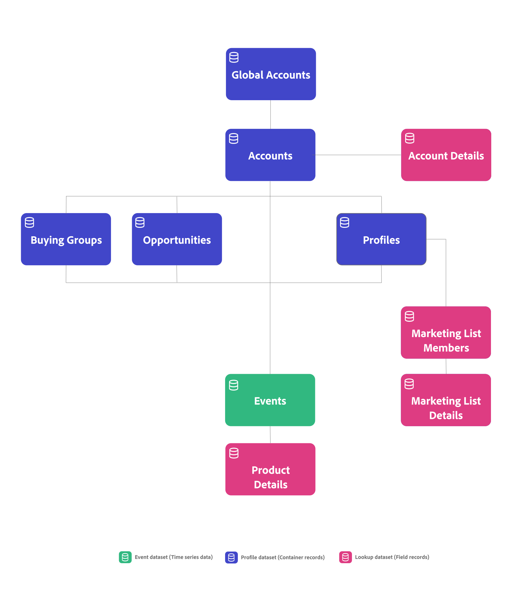

# Conceptos y funciones de B2B edition

En este artículo se explican conceptos como conexiones, identificadores, contenedores y conjuntos de datos, utilizados comúnmente en Customer Journey Analytics. Y cómo Customer Journey Analytics B2B edition agrega funciones adicionales a estos conceptos.

## Conexiones e identificadores

En Customer Journey Analytics, elige un identificador común, conocido como ID de persona, para conectar los datos de evento con otros conjuntos de datos, como conjuntos de datos de perfil y conjuntos de datos de búsqueda. Este tipo de conexión se conoce como conexión basada en personas que facilita los informes y análisis basados en personas.

En Customer Journey Analytics B2B edition, puede seleccionar entre una conexión basada en persona o en una conexión basada en cuenta. Una conexión basada en cuentas facilita la creación de informes y el análisis basados en cuentas.

* Para una conexión basada en persona, seleccione Persona como identificador principal. A continuación, puede configurar sus proyectos de conexión, vista de datos y espacio de trabajo para la creación de informes basados en personas.
* Para una conexión basada en cuentas, seleccione Cuenta como identificador principal. A continuación, puede añadir contenedores adicionales para Cuenta global, Grupo de compra y Oportunidad. Dependiendo de si añade una cuenta global o no, su identificador principal es un identificador de cuenta o un identificador de cuenta global.

## Contenedores

En Customer Journey Analytics, los contenedores se generan como parte de la configuración de una conexión y vista de datos, y proporcionan una estructura de datos y un ámbito determinados. Los contenedores almacenan grupos de identificadores para secuenciar todas las marcas de tiempo de evento por identificadores únicos. Ese almacenamiento facilita la ejecución rápida y eficaz de funcionalidades como la segmentación, la atribución y las visualizaciones.

### Contenedores estándar

Customer Journey Analytics se basa en el concepto de tres contenedores: Persona, Sesión y Evento. Durante una configuración, estos contenedores se generan implícitamente.

Puede redefinir cómo se asignan los nombres a estos contenedores al configurar una vista de datos, pero la jerarquía y las relaciones entre los contenedores están predeterminadas. El contenedor de sesión se genera en función de cómo defina una sesión en la [configuración de sesión](/help/data-views/session-settings.md) de la vista de datos.

{zoomable="yes"}

### Contenedores B2B

En Customer Journey Analytics B2B edition, se agrega un contenedor de cuenta a la lista de contenedores generados. Además, tiene la opción de configurar la generación de contenedores adicionales, como Cuenta global, Grupo de compra y Oportunidad.

La jerarquía y las relaciones entre los contenedores están predeterminadas. Oportunidad, grupo de compra y persona son contenedores del mismo nivel del contenedor de cuenta. En esa jerarquía, el contenedor de sesión entre el contenedor de persona y el contenedor de evento se genera en función de cómo defina una sesión en la [configuración de sesión](/help/data-views/session-settings.md) de la vista de datos. Actualmente no se generan ni admiten contenedores de sesión adicionales, por ejemplo, entre el contenedor de cuenta y el contenedor de evento. Consulte la tabla siguiente para obtener una descripción y un uso básico de los contenedores B2B.

{zoomable="yes"}

| Contenedor B2B | Descripción Caso de uso básico |
|---|---|
| Cuenta | Una compañía que es cliente o cliente potencial de su negocio. La empresa podría ser una filial o división de una organización más grande. La cuenta representa la organización a la que realiza ventas y a la que desea realizar un seguimiento en ese nivel de organización. |
| Cuenta global (opcional) | La sociedad matriz superior de un grupo de sociedades vinculadas. Una cuenta global no tiene compañía matriz, pero puede tener filiales o divisiones que pertenezcan a la cuenta global. Cuando tenga el contenedor de cuenta global configurado en la conexión, una cuenta que no tenga ninguna matriz o filiales deberá aparecer en el campo de cuenta y en el campo de cuenta global. |
| Oportunidad (opcional) | Una colección de productos y servicios que se venden juntos. Una oportunidad a menudo implicaba varias etapas en el ciclo de ventas hasta el cierre de la venta. Utilizaría datos para medir la progresión de la oportunidad a través del canal de ventas. Por ejemplo, un informe que proporciona detalles sobre las principales oportunidades que se movieron de la fase 3 a la fase 4. |
| Grupo comprador (opcional) | Colección de personas de una organización que participan en el proceso de toma de decisiones para adquirir un producto o servicio.  Utilizaría los datos del grupo de compra para rastrear los grupos de compra a través de la administración de campañas. Por ejemplo, cree un segmento de audiencia de grupos de compra clave.  Lo más probable es que desee una búsqueda del grupo comprador en los datos de perfil para poder informar sobre las personas de un grupo comprador. |
| Persona | Una persona, a menudo identificada por una dirección de correo electrónico única que ha interactuado con la compañía.  Utilizaría los datos de perfil para identificar a las personas que trabajan para una cuenta. Por ejemplo: diríjase a todas las personas de una cuenta que se hayan registrado en una conferencia. |

>[!IMPORTANT]
>
>* Si ha **habilitado** el contenedor de cuenta global en una conexión basada en cuentas, cada registro de los conjuntos de datos de evento debe contener un identificador de cuenta y un identificador de cuenta global. Si no es así, se omite el registro.
>* Si **no ha habilitado** el contenedor de cuenta global en una conexión basada en cuentas, cada registro de los conjuntos de datos de evento debe contener un identificador de cuenta. Si no es así, se omite el registro.

Puede utilizar los contenedores B2B para la funcionalidad B2B específica en Analysis Workspace:

* **Segmentación**: [Los contenedores de segmentos B2B](/help/components/segments/seg-overview.md#b2b-containers) le permiten generar segmentos con un ámbito de contenedor más allá de la persona, la sesión o el evento. Por ejemplo: una cuenta con un segmento de registro de evento o una cuenta de EE. UU. con grupos de compra y un segmento de oportunidades de la fase 5.

  >[!NOTE]
  >
  >Los datos de evento B2B de una configuración basada en cuentas de Customer Journey Analytics B2B edition pueden contener filas de datos sin una persona o sesión. Por ejemplo: una fila que detalla la progresión de la fase de oportunidad. Cuando evalúe el segmento, tenga en cuenta que las personas y las sesiones pueden dejar de ser los criterios correctos.
  >

* **Atribución**: puede usar los nuevos contenedores B2B en [panel de atribución](/help/analysis-workspace/c-panels/attribution.md), en [configuración de componentes de atribución](/help/data-views/component-settings/attribution.md), en [métricas calculadas](/help/components/calc-metrics/cm-workflow/m-metric-type-alloc.md) o en [columnas en una tabla de forma libre](/help/analysis-workspace/visualizations/freeform-table/column-row-settings/column-settings.md). Las retrospectivas de cuentas se amplían a 13 meses.

* **Visualizaciones**: [Abandonos](/help/analysis-workspace/visualizations/fallout/fallout-flow.md), [Flujo](/help/analysis-workspace/visualizations/c-flow/flow.md), [Lienzo de Recorrido](/help/analysis-workspace/visualizations/journey-canvas/journey-canvas.md) y [Tablas de cohorte](/help/analysis-workspace/visualizations/cohort-table/cohort-analysis.md) admiten los nuevos contenedores B2B. Por ejemplo: puede utilizar los nuevos contenedores para comprender cómo los grupos compradores consumen contenido o cómo las cohortes de oportunidades se mueven hacia el cierre de una venta.
También puede establecer el contenedor predeterminado para estas visualizaciones en las [preferencias de usuario](/help/analysis-workspace/user-preferences.md#visualizations-preferences).

Los segmentos, la atribución y las visualizaciones junto con los contenedores B2B le admiten en el análisis y las perspectivas profundos de B2B.

## Conjuntos de datos

Customer Journey Analytics B2B distingue entre los siguientes tipos de datos y conjuntos de datos.

| Tipo de datos | Serie temporal | Registros de contenedor | Registros de campo |
|---|---|---|---|
| **Conjuntos de datos** | **Conjuntos de datos de eventos**  Por ejemplo:<ul><li>Análisis digital</li><li>Eventos CRM</li><li>Eventos en persona</li><li>Datos del centro de llamadas</li></ul> | **Conjuntos de datos de perfil**  Por ejemplo:<ul><li>Registros CRM</li><li>Registros B2B de AJO</li><li>Registros CDP</li><ul> | **Clasificaciones**  Por ejemplo:<ul><li>Registros de campaña</li><li>Registros de lista de marketing</li><li>Metadatos de contenido</li><li>Registros de productos</li></ul> |
| Requisitos | **Marca de tiempo**  Cada registro necesita:<ul><li>ID de cuenta</li><li>ID de cuenta global</li><li>ID de la persona</li></ul> | **Los registros de identificador de cuenta**  necesitan un identificador de contenedor, como:<ul><li>Cuenta</li><li>Persona</li><li>Oportunidad</li><li>Grupo de compras</li></ul> | **Los registros de clave coincidente**  necesitan un identificador contenido en un contenedor o conjunto de datos de evento, como:<ul><li>ID de campaña</li><li>ID de contenido</li><li>ID del producto</li></ul> |

{style="table-layout:fixed"}

Un ejemplo de conexión basada en cuentas en Customer Journey Analytics B2B edition:

Customer Journey Analytics B2B edition ofrece la interfaz [Connection map](/help/connections/create-connection.md#connection-map) para ofrecerle una descripción general de las relaciones entre los conjuntos de datos de su conexión.

De forma similar a Customer Journey Analytics, los datos de series temporales basados en eventos son el núcleo de Customer Journey Analytics B2B edition. La principal diferencia de una conexión basada en cuentas es que necesita un ID de cuenta en cada registro del conjunto de datos de evento en lugar de un ID de persona.

Al configurar [configuración de conjuntos de datos](/help/connections/create-connection.md#dataset-settings) para la conexión basada en cuentas en Customer Journey Analytics B2B edition, las opciones disponibles para algunas de las opciones dependen del [tipo de conjunto de datos](/help/connections/create-connection.md#dataset-types). Por ejemplo, debe:

* Especifique identificadores para cada uno de los contenedores configurados para los conjuntos de datos de evento.
* Defina un campo de cuenta o un campo de cuenta global para sus conjuntos de datos de perfil.
* Defina las claves y cómo hacer coincidir estas claves (por contenedor de campo) para los conjuntos de datos de búsqueda.

## Coincidir por contenedor o campo

Puede definir para cada conjunto de datos de búsqueda, si coincide el conjunto de datos por campo o por contenedor.

### Coincidencia por contenedor

Si un conjunto de datos de registro utiliza una coincidencia por contenedor, el conjunto de datos de registro se trata como un tipo de conjunto de datos de perfil y como un conjunto de datos de perfil en la interfaz de usuario. Utilice la coincidencia por contenedor en conjuntos de datos que contienen registros de contenedor y que admiten los contenedores configurados. Por ejemplo, un conjunto de datos de grupo de compra.

### Coincidencia por campo

Si un conjunto de datos de registro utiliza una coincidencia por campo, el conjunto de datos de registro se trata como un tipo de conjunto de datos de búsqueda y como un conjunto de datos de búsqueda en la interfaz de usuario. Utilice el campo Coincidir por en conjuntos de datos que contengan detalles de clasificación adicionales mediante la búsqueda. Por ejemplo, un conjunto de datos de miembro de una lista de marketing o un conjunto de datos de detalles de producto.

## Informar sobre datos basados en personas y cuentas

Si desea informar sobre contenedores basados en personas (e identidades de personas) y contenedores basados en cuentas (e identidades de cuentas), debe configurar dos conexiones independientes dentro de Customer Journey Analytics. Una conexión en la que selecciona Persona como ID principal y otra en la que selecciona Cuenta como ID principal. Customer Journey Analytics no admite informes basados en personas y en cuentas desde una sola jerarquía de contenedor.

