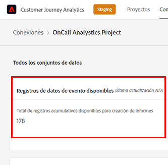
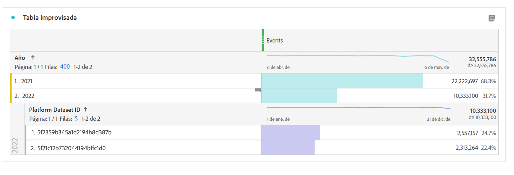

# Preguntas frecuentes

[!UICONTROL Customer Journey Analytics] (CJA) es nuestro producto de análisis de nueva generación. A continuación, encontrará respuestas a las preguntas más frecuentes acerca de CJA. Para obtener más información, consulte [Compatibilidad con funciones de Customer Journey Analytics](/help/getting-started/aa-vs-cja/cja-aa.md).

## 1. Requisitos previos {#prerequisites}

| Pregunta | Respuesta |
| --- | --- |
| ¿Necesito [!UICONTROL Private Device Graph] o [!UICONTROL Device Coop] para [!UICONTROL Customer Journey Analytics]? | No, [!UICONTROL Private Device Graph] y [!UICONTROL Device Coop] no son necesarios para [!UICONTROL Customer Journey Analytics]. De hecho, todavía no son compatibles. |
| ¿Necesito un [!UICONTROL Experience Cloud ID] (ECID) para [!UICONTROL Customer Journey Analytics]? | No, [!UICONTROL Customer Journey Analytics] admite cualquier ID de un conjunto de datos, ya sea [!UICONTROL ECID] o cualquier otro ID de su elección. |
| ¿Qué sucede si necesito extraer, transformar o cargar datos antes de utilizar [!UICONTROL Customer Journey Analytics]? | Customer Journey Analytics incluye capacidades de [Data Prep](https://experienceleague.adobe.com/docs/experience-platform/data-prep/api/overview.html?lang=es) para ayudar a transformar los datos antes de colocarlos en el lago de datos de Adobe Experience Platform. Si necesita extraer, transformar o cargar los datos después de haberlos introducido, [Adobe Experience Platform Query Service](https://experienceleague.adobe.com/docs/platform-learn/tutorials/queries/understanding-query-service.html?lang=es#queries) proporciona algunas opciones limitadas, aunque puede haber costes adicionales implicados. |

{style=&quot;table-layout:auto&quot;}

## 2. Unión de datos (Cross-Channel Analytics) {#stitching}

| Pregunta | Respuesta |
| --- | --- |
| ¿Puede [!UICONTROL Customer Journey Analytics] “unir” varios dispositivos o conjuntos de datos? | Sí. [!UICONTROL Customer Journey Analytics] tiene una solución de vinculación llamada [Cross-Channel Analytics](https://experienceleague.adobe.com/docs/analytics-platform/using/cja-connections/cca/overview.html?lang=es) (CCA). Permite volver a escribir el ID de la persona de un conjunto de datos, lo que ofrece una combinación perfecta de varios conjuntos de datos. |
| ¿Se admite la unión del comportamiento anónimo al comportamiento autenticado? | Sí. [Cross-Channel Analytics](https://experienceleague.adobe.com/docs/analytics-platform/using/cja-connections/cca/overview.html) busca los datos de usuario de las sesiones autenticadas y no autenticadas para generar un ID vinculado. |
| ¿Cómo funciona la &quot;repetición&quot; en CCA? | CCA &quot;reproduce&quot; los datos en función de los identificadores únicos que ha aprendido. Reproducir hace que los nuevos dispositivos de la conexión se vinculen. [Más información](https://experienceleague.adobe.com/docs/analytics-platform/using/cja-connections/cca/replay.html?lang=es#step-1%3A-live-stitching) |
| ¿Cómo funciona la vinculación de datos históricos (relleno) en CCA? | Cuando se active por primera vez, Adobe proporcionará un relleno de datos vinculados que se remontarán hasta el comienzo del mes anterior (hasta 60 días). Para poder rellenar este campo, los datos no vinculados en aquel momento deben tener un tipo de ID efímero. [Más información](https://experienceleague.adobe.com/docs/analytics-platform/using/cja-connections/cca/overview.html?lang=es#enable-cross-channel-analytics) |
| ¿Cuál es el comportamiento esperado para los registros de conjuntos de datos de perfil no vinculados? | **Caso de ejemplo**: Para unir dos conjuntos de datos en una conexión CJA, utilice `CRMid` como ID de persona. Uno es un conjunto de datos de eventos web con `CRMid` en todos los registros. El otro conjunto de datos es un conjunto de datos de perfil CRM. El 40 % del conjunto de datos CRM tiene `CRMid` presentes en el conjunto de datos de evento web. El otro 60 % no está presente en el conjunto de datos de evento web. ¿Aparecen estos registros en los informes de Analysis Workspace?
 **Respuesta**: Las filas de perfil que no tienen eventos vinculados a ellos se almacenan en CJA. Sin embargo, no puede verlos en Analysis Workspace hasta que aparezca un evento vinculado a ese ID. |

{style=&quot;table-layout:auto&quot;}

## 3. Introducción de datos en [!UICONTROL Customer Journey Analytics] {#ingest}

| Pregunta | Respuesta |
| --- | --- |
| ¿Puedo combinar datos de diferentes simuladores de pruebas de [!UICONTROL Adobe Experience Platform] en una conexión de [!UICONTROL Customer Journey Analytics]? | No. No puede acceder a los datos de entornos limitados. Solo se pueden combinar conjuntos de datos ubicados en el mismo entorno limitado. [Más información](https://experienceleague.adobe.com/docs/analytics-platform/using/cja-connections/create-connection.html?lang=es#select-sandbox-and-datasets) |
| ¿Cómo puede conectar datos en línea con datos sin conexión en [!UICONTROL Customer Journey Analytics]? | Siempre que el ID de usuario coincida entre conjuntos de datos, [!UICONTROL Customer Journey Analytics] puede conectar filtros, atribuciones, flujos, visitas en orden previsto, etc. entre conjuntos de datos. |
| ¿Cómo puedo llevar mis datos sin conexión a [!UICONTROL Customer Journey Analytics]? | Su asignación de derechos en Customer Journey Analytics le permite introducir datos en Experience Platform. A continuación, puede crear conexiones a esos datos y vistas de datos en [!UICONTROL Customer Journey Analytics] para crear informes en Analysis Workspace. El equipo de incorporación de datos de Experience Platform puede ofrecer recomendaciones o asesoría a los clientes si lo necesitan. |
| ¿Cómo puedo obtener datos de [!UICONTROL Adobe Analytics] en [!UICONTROL Customer Journey Analytics]? | Los datos de [!UICONTROL Adobe Analytics] se pueden conectar a Experience Platform mediante el [conector de origen de Adobe Analytics](https://experienceleague.adobe.com/docs/experience-platform/sources/connectors/adobe-applications/analytics.html?lang=es). La mayoría de los campos de [!UICONTROL Adobe Analytics] se transfieren en formato XDM, pero otros campos todavía no están disponibles. |
| ¿Cuánto tiempo se tarda en ensamblar elementos de conjuntos de datos a una vista de datos? | Tarda unas pocas horas en empezar y unos días en rellenar los últimos 13 meses de datos. |
| ¿Es necesario introducir datos PII para establecer conexiones entre ellos? | No, puede utilizar cualquier ID, incluido un hash de un ID de cliente, que no es PII. |
| ¿Cuáles son los límites para la ingesta de fechas/marcas de tiempo pasadas o futuras en conjuntos de datos de eventos de CJA? | <ul><li>Con respecto a las fechas y marcas de tiempo anteriores: datos de eventos de hasta 10 años.</li><li>Con respecto a las fechas y marcas de hora futuras: datos de eventos (predictivos) hasta 1 mes en el futuro.</li></ul> |

{style=&quot;table-layout:auto&quot;}

## 4. Consideraciones de latencia {#latency}

>[!NOTE]
>No hay un tamaño de datos fijo en CJA y, por lo tanto, Adobe no puede comprometerse con un tiempo de ingesta estándar. Estamos trabajando activamente para reducir estas latencias a través de nuevas actualizaciones y la optimización de la ingesta.

| Pregunta | Respuesta |
| --- | --- |
| ¿Cuál es la latencia esperada para [!UICONTROL Customer Journey Analytics] en [!UICONTROL Adobe Experience Platform]? | <ul><li>Eventos o datos activos: procesados e ingeridos en un plazo de 90 minutos, una vez que los datos estén disponibles en AEP. (Tamaño del lote > 50 millones de filas: más de 90 minutos.)</li><li>Rellenos secundarios pequeños: por ejemplo, un conjunto de datos de consulta de 10 millones de filas: en un plazo de 7 días<li>Rellenos de fondo grandes: por ejemplo, 500 000 millones de filas: 30 días</li></ul> |

## 5. Configurar la ventana móvil para la retención de datos de [!UICONTROL Conexión] {#data-retention}

>[!IMPORTANT]
>Póngase en contacto con el Servicio de atención al cliente o con el administrador de cuentas de Adobe para implementar esta configuración. Todavía no está disponible a través de la IU de CJA.

Esta configuración le permite definir la retención de datos de CJA como un período de tiempo variable en meses (tres o seis meses, etc.), en un nivel de [!UICONTROL conexión] (no en un nivel de [!UICONTROL conjunto de datos]). La retención de datos se basa en marcas de hora de conjuntos de datos de evento y se aplica solo a conjuntos de datos de evento. No existe ninguna configuración de retención de datos para conjuntos de datos de búsqueda o perfil, ya que no hay marcas de tiempo aplicables.

La principal ventaja es que solo almacena o genera informes sobre datos que son aplicables y útiles, y elimina los datos más antiguos que ya no son útiles. Le ayuda a mantenerse por debajo de los límites del contrato y reduce el riesgo de costes adicionales.

## 6. Implicaciones de la eliminación de componentes de datos {#deletion}

En cuanto a la eliminación de datos, nos interesan 6 tipos de componentes: simulación de pruebas, esquema, conjunto de datos, conexión, vista de datos y proyectos del Espacio de trabajo. Estos son algunos de los escenarios posibles en los que puede ser necesario eliminar cualquiera de estos componentes:

| Si usted... | Esto sucede... |
| --- | --- |
| Eliminar un simulador de pruebas en [!UICONTROL Adobe Experience Platform] | Al eliminar un simulador de pruebas, se detendrá el flujo de datos a cualquier conexión de [!UICONTROL Customer Journey Analytics] a conjuntos de datos de dicho simulador de pruebas. Actualmente, las [!UICONTROL conexiones] en CJA vinculadas a la zona protegida borrada no se eliminarán automáticamente. |
| Elimina un esquema en [!UICONTROL Adobe Experience Platform], pero no los conjuntos de datos asociados a dicho esquema | [!UICONTROL Adobe Experience Platform] no permite la eliminación de [!UICONTROL esquemas] que tienen uno o varios [!UICONTROL conjuntos de datos] asociados. Sin embargo, un administrador que tenga el conjunto de derechos adecuado podrá eliminar primero los conjuntos de datos y, a continuación, el esquema. |
| Eliminar un conjunto de datos en el lago de datos de [!UICONTROL Adobe Experience Platform] | La eliminación de un conjunto de datos en el lago de datos de AEP detendrá el flujo de datos de ese conjunto de datos a cualquier conexión de CJA que incluya ese conjunto de datos. Los datos de ese conjunto de datos no se eliminan automáticamente de las conexiones con CJA asociadas. |
| Eliminar un conjunto de datos en [!UICONTROL Customer Journey Analytics] | Póngase en contacto con el administrador de cuentas de Adobe para poner en marcha el proceso de eliminación de un conjunto de datos dentro de una conexión que se ha guardado. |
| Eliminar un lote de un conjunto de datos (en [!UICONTROL Adobe Experience Platform]) | Si se elimina un lote de un conjunto de datos de [!UICONTROL Adobe Experience Platform], se eliminará el mismo lote de cualquier conexión de CJA que contenga dicho lote específico. CJA recibirá una notificación de las eliminaciones de lotes que se produzcan en [!UICONTROL Adobe Experience Platform]. |
| Eliminar un lote **mientras se está introduciendo** en [!UICONTROL Customer Journey Analytics] | Si solo hay un lote en el conjunto de datos, no aparecerán datos ni datos parciales de dicho lote en [!UICONTROL Customer Journey Analytics]. La introducción se revertirá. Si, por ejemplo, hay 5 lotes en el conjunto de datos y 3 de ellos ya se han introducido cuando se elimine el conjunto de datos, los datos de esos 3 lotes aparecerán en [!UICONTROL Customer Journey Analytics]. |
| Eliminar una conexión en [!UICONTROL Customer Journey Analytics] | Aparecerá un mensaje de error para indicar lo siguiente:<ul><li>Las vistas de datos creadas para la conexión eliminada ya no funcionarán.</li><li> Del mismo modo, los proyectos del Espacio de trabajo que dependan de vistas de datos en la conexión eliminada dejarán de funcionar.</li></ul> |
| Eliminar una vista de datos en [!UICONTROL Customer Journey Analytics] | Un mensaje de error indicará que dejarán de funcionar todos los proyectos del Espacio de trabajo que dependan de esta vista de datos eliminada. |

## 7. Consideraciones al combinar grupos de informes en CJA {#merge-reportsuite}

Si tiene pensado incorporar datos de Adobe Analytics a través del [Conector de origen de Adobe Analytics](https://experienceleague.adobe.com/docs/experience-platform/sources/connectors/adobe-applications/analytics.html), tenga en cuenta estas ramificaciones al combinar dos o más grupos de informes de Adobe Analytics.

| Problema | Consideración |
| --- | --- |
| Variables | Es posible que las variables como [!UICONTROL eVars] no se alineen entre grupos de informes. Por ejemplo, eVar1 en el grupo de informes 1 puede apuntar a **[!UICONTROL Página]**. En el grupo de informes 2, eVar1 puede señalar a **[!UICONTROL Campaña interna]**, lo que produce informes mixtos e inexactos. |
| Recuentos de [!UICONTROL Sesiones] y [!UICONTROL Personas] | Se deduplican en los grupos de informes. Como resultado, es posible que los recuentos no coincidan. |
| Anulación de duplicación métrica | Anula la deduplicación de instancias de una métrica (por ejemplo, [!UICONTROL Pedidos]) si varias filas tienen el mismo ID de transacción (por ejemplo, [!UICONTROL ID de compra]). Esto evita el recuento excesivo de las métricas clave. Como resultado, es posible que las métricas como [!UICONTROL Pedidos] no se sumen teniendo en cuenta varios grupos de informes. |
| Moneda | La conversión de moneda aún no es compatible con CJA. Si los grupos de informes que intenta combinar utilizan distintas monedas base, pueden surgir problemas. |
| [!UICONTROL Persistencia] | La [persistencia](../data-views/component-settings/persistence.md) se extiende a los grupos de informes, lo que afecta a los [!UICONTROL filtros], la [!UICONTROL atribución], etc. Los números pueden no sumarse correctamente. |
| [!UICONTROL Clasificaciones] | Las [!UICONTROL clasificaciones] no se deduplican automáticamente al combinar grupos de informes. Al combinar varios archivos de clasificaciones en un único conjunto de datos de [!UICONTROL búsqueda], puede encontrar problemas. |

## 8. Componentes tradicionales de [!UICONTROL Adobe Analytics]

| Pregunta | Respuesta |
| --- | --- |
| ¿Puedo compartir/publicar [!UICONTROL filtros] ([!UICONTROL segmentos]) de [!DNL Customer Journey Analytics] en el perfil unificado de Experience Platform o en otras aplicaciones de Experience Cloud? | Aún no, pero estamos trabajando activamente para ofrecer esta capacidad. |
| ¿Qué ha pasado con mi antigua configuración de [!UICONTROL eVar]? | Las [!UICONTROL eVars], las [!UICONTROL props] y los [!UICONTROL eventos] en el sentido tradicional de Adobe Analytics ya no existen en [!UICONTROL Customer Journey Analytics]. Tiene un número ilimitado de elementos de esquema (dimensiones, métricas, campos de lista). De modo que todos los ajustes de atribución que se aplicaron durante el proceso de recopilación de datos se aplican ahora en tiempo de consulta. |
| ¿Dónde están ahora todas las configuraciones de persistencia de la variable y sesiones? | [!UICONTROL Customer Journey Analytics] aplica todas estas configuraciones en el momento del informe y estas se encuentran ahora en Vistas de datos. Los cambios en esta configuración ahora son retroactivos y puede tener varias versiones con varias Vistas de datos. |
| ¿Qué les sucede a nuestros segmentos o métricas calculadas existentes? | [!UICONTROL Customer Journey Analytics] ya no utiliza eVars, props ni eventos y, en su lugar, utiliza cualquier esquema de AEP. Esto significa que ninguno de los segmentos existentes ni las métricas de cálculo son compatibles con [!UICONTROL Customer Journey Analytics]. |
| ¿Cómo gestiona [!UICONTROL Customer Journey Analytics] las `Uniques Exceeded` limitaciones? | [!UICONTROL Customer Journey Analytics] no tiene limitaciones de valor único, por lo que no es necesario preocuparse por ellas. |
| Si soy un cliente de [!DNL Data Workbench], ¿puedo pasar a [!UICONTROL Customer Journey Analytics] ahora mismo? | Depende de su caso práctico; consúltelo con su equipo de cuenta de Adobe. Puede que sus casos prácticos actuales ya sean adecuados para Customer Journey Analytics. |

{style=&quot;table-layout:auto&quot;}

## 9. Cálculo del tamaño de la conexión {#estimate-size}

Es posible que necesite saber cuántas filas de datos tiene actualmente en [!UICONTROL Customer Journey Analytics]. Para obtener una cuenta precisa del uso de los registros de datos de evento (filas de datos) de su organización, haga lo siguiente **para cada una de las conexiones creadas por su organización**.

1. En [!UICONTROL Customer Journey Analytics], haga clic en la pestaña **[!UICONTROL Conexiones]**.

   Ahora puede ver una lista de todas sus conexiones actuales.

1. Haga clic en cada nombre de conexión para llegar al Administrador de conexiones.

1. Agregue los **[!UICONTROL Registros de datos de evento disponibles]** para todas las conexiones creadas. (Según el tamaño de la conexión, el número puede tardar un tiempo en aparecer).

   

1. Una vez que tenga una suma de todas las filas de datos de evento, busque la asignación “Filas de datos” en el contrato de Customer Journey Analytics que su empresa firmó con Adobe.

   Esto le proporciona el número máximo de filas de datos autorizadas en el pedido de ventas. Si el número de filas de datos resultantes del paso 3 es mayor que este número, se producirá un exceso.

1. Para solucionar esta situación, tiene varias opciones:

   * Cambie la [configuración de retención de datos](https://experienceleague.adobe.com/docs/analytics-platform/using/cja-connections/manage-connections.html?lang=es#set-rolling-window-for-connection-data-retention).
   * [Elimine conexiones no utilizadas](https://experienceleague.adobe.com/docs/analytics-platform/using/cja-overview/cja-faq.html?lang=es#implications-of-deleting-data-components).
   * [Elimine un conjunto de datos en AEP](https://experienceleague.adobe.com/docs/analytics-platform/using/cja-overview/cja-faq.html#implications-of-deleting-data-components).
   * Póngase en contacto con el administrador de cuentas de Adobe para obtener una licencia de capacidad adicional.

## 10. Con respecto a los excedentes de uso {#overage}

Adobe supervisa y aplica los límites de uso con regularidad. “Filas de datos” hace referencia a las filas medias diarias de datos disponibles para su análisis dentro de Customer Journey Analytics.

Por ejemplo, supongamos que su contrato le da derecho a un millón de filas de datos. Supongamos que en el día 1 del uso de Customer Journey Analytics se cargan dos millones de filas de datos. El día 2, se elimina 1 millón de filas y se mantiene el uso en el máximo comprometido (es decir, un millón de filas de datos) durante el resto del Término de licencia. Según las condiciones contractuales, es posible que siga incurriendo en cargos por sobreutilización prorrateados para el día 1, ya que ha superado el derecho de licencia de “filas de datos”.

## 11. Diagnóstico de discrepancias de datos {#discrepancies}

En algunos casos, es posible que observe que el número total de eventos que ha introducido su conexión es diferente al número de filas del conjunto de datos en [!UICONTROL Adobe Experience Platform]. En este ejemplo, el conjunto de datos Impresión B2B tiene 7650 filas, pero el conjunto de datos contiene 3830 filas en [!UICONTROL Adobe Experience Platform]. Existen varias razones por las que pueden producirse discrepancias y se pueden realizar los siguientes pasos para el diagnóstico:

1. Desglose esta dimensión por **[!UICONTROL ID de conjunto de datos de Platform]** y verá dos conjuntos de datos del mismo tamaño, pero con diferentes **[!UICONTROL ID de conjunto de datos de Platform]**. Cada conjunto de datos tiene 3825 registros. Esto significa que [!UICONTROL Customer Journey Analytics] ha omitido 5 registros debido a la falta de ID de persona o la falta de marcas de hora:

   

1. Además, si comprobamos [!UICONTROL Adobe Experience Platform], no hay ningún conjunto de datos con el ID &quot;5f21c12b732044194bffc1d0&quot;, por lo que alguien eliminó este conjunto de datos concreto de [!UICONTROL Adobe Experience Platform] cuando se creaba la conexión inicial. Más adelante se volvió a añadir a Customer Journey Analytics, pero se generó un [!UICONTROL ID de conjunto de datos de Platform] mediante [!UICONTROL Adobe Experience Platform].

Obtenga más información sobre las [implicaciones de la eliminación de conjuntos de datos y conexiones](https://experienceleague.adobe.com/docs/analytics-platform/using/cja-overview/cja-faq.html#implications-of-deleting-data-components) en [!UICONTROL Customer Journey Analytics] y [!UICONTROL Adobe Experience Platform].
