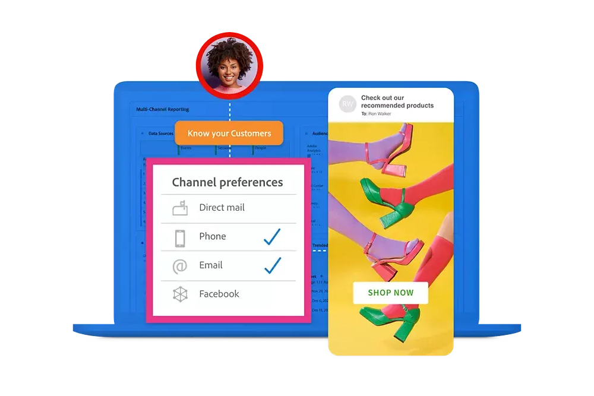
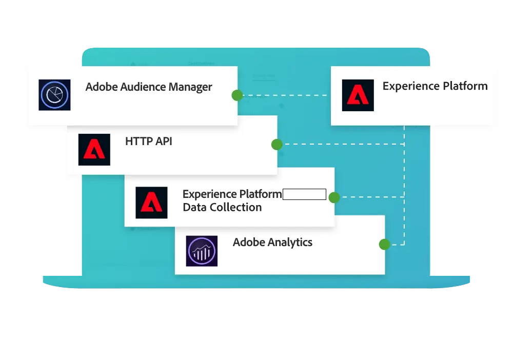
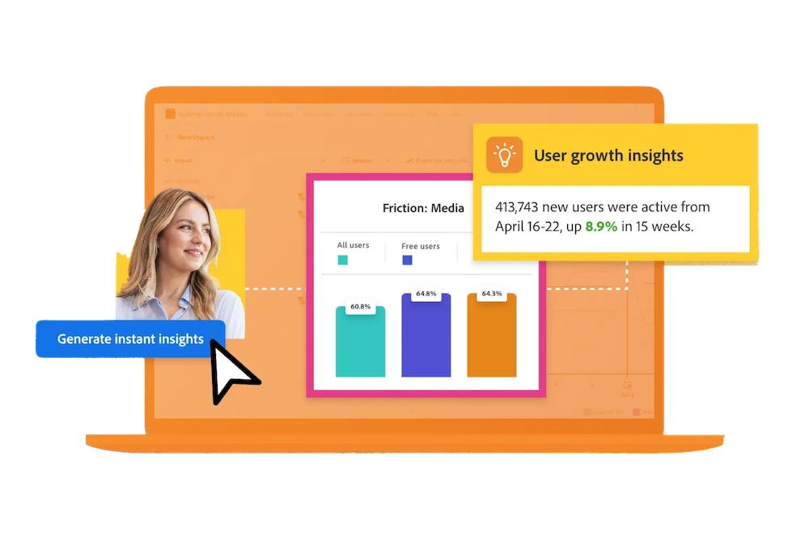
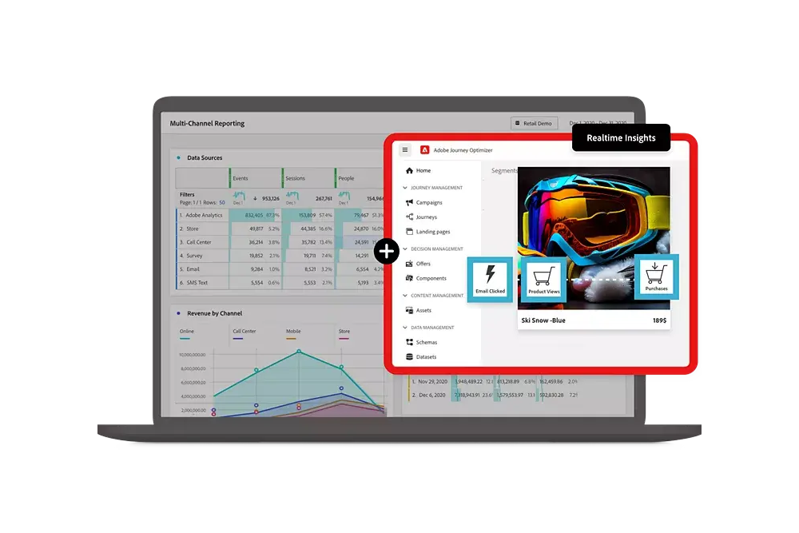

# Guía de Customer Journey Analytics

Esta guía de documentación técnica proporciona instrucciones para Customer Journey Analytics. Customer Journey Analytics le permite obtener los datos de clientes desde cualquier canal que elija (tanto en línea como sin conexión) e importarlos en Adobe Experience Platform. A continuación, analice estos datos del mismo modo que lo haría con los datos digitales existentes con Analysis Workspace.

Customer Journey Analytics permite controlar cómo conectar los datos en línea y sin conexión en Analysis Workspace en cualquier ID de cliente común, lo que permite realizar procesos de atribución, filtración, flujo, visitas en orden previsto, etc. en los datos de sus clientes.

## Novedades

Eche un vistazo a las mejoras más recientes del producto y a la documentación de Customer Journey Analytics. Para obtener una lista completa de funciones, mejoras y correcciones, consulte los detalles de las [Notas de la versión](../release-notes/latest.md). Visite la [página de actualizaciones de documentación](../release-notes/doc-changes.md) para mantenerse al día de los cambios más recientes.

>[!BEGINTABS]

>[!TAB Asistente de IA]

El asistente de IA es una experiencia conversacional que permite a los profesionales realizar tareas a un ritmo rápido, ya sea comprender conceptos, solucionar problemas o buscar información. También permite a los no expertos realizar tareas de expertos y aumenta la calidad global del trabajo.

>[!TAB Vinculación basada en gráficos]

Con la vinculación basada en gráficos, puede utilizar el gráfico de identidad del Servicio de identidad de Experience Platform para obtener una mejor vista del recorrido del cliente mediante: <ul><li>La unión de conjuntos de datos con diferentes identificadores sin tener que extraer, transformar ni cargar datos adicionales para reflejar un solo identificador.</li> <li>La mejora de la cobertura de la identidad preferida o dorada para un único conjunto de datos compartiendo identidades entre conjuntos de datos.</li><li>La alineación de perfiles creados en Real-Time Customer Data Platform y Journey Optimizer con personas de Customer Journey Analytics.</li></ul>

*_Debe tener el paquete Prime para la vinculación basada en gráficos._*

>[!TAB Búsquedas B2B]

Como parte de la configuración de una conexión, puede transformar conjuntos de datos para esquemas de búsqueda B2B específicos para admitir mejor las búsquedas basadas en personas en datos B2B.

>[!TAB Campos derivados]

Ya están disponibles las nuevas funciones de campos derivados (matemáticas, siguiente, anterior, resumir, deduplicar) y plantillas de función adicionales (como devoluciones, nombre de conjunto de datos descriptivo, temporada de vacaciones, objetivos mensuales, detección simple de bots y otras).

>[!TAB Extensión de BI*]

La extensión de BI habilita el acceso SQL a las vistas de datos que ha definido en Customer Journey Analytics. Ahora puede usar su herramienta de BI favorita para crear informes y tableros basados en las mismas vistas de datos que los usuarios de Customer Journey Analytics usan con sus proyectos de Analysis Workspace.

*_Debe tener el paquete Select o superior para utilizar la extensión de BI._*

<!--
>[!TAB Improved Audience Publising] 

Audiences that are published from Customer Journey Analytics are now available in the new **Audiences** section in Adobe Experience Platform. Audiences are now available in Experience Platform seconds after they are published from Customer Journey Analytics. Improved sorting and filter options in Experience Platform for Customer Journey Analytics audiences. 

-->

>[!TAB Previsión]

La previsión es una función de Analysis Workspace que permite prever una métrica estándar o calculada con cualquier granularidad de tiempo admitida (por hora, diario, semanal, mensual y anual). La previsión solo está disponible para datos relacionados con series temporales.

>[!TAB Nueva documentación]

Ya están disponibles nuevas secciones de documentación sobre:<ul><li>Cómo actualizar de Adobe Analytics a Customer Journey Analytics.</li><li>Casos de uso de exportación de datos y las funcionalidades de Experience Platform y Customer Journey requeridas. </li></ul>Seleccione **[!UICONTROL Más información]** para esta y otras actualizaciones de la documentación.

>[!ENDTABS]

## Empiece con lo básico

Empiece por leer el material de los vínculos siguientes para familiarizarse con las capacidades y funcionalidades de Customer Journey Analytics.

<table style="table-layout:fixed">
  <tr style="border: 0;">
    <td>
    
    
<strong>Más allá de los datos en línea</strong> Descubra cómo se compara Customer Journey Analytics con Adobe Analytics, qué funciones se comparten y cómo puede utilizar sus datos de Analytics.

    </td>
    <td>
    
    
<strong>Ingesta y uso de datos</strong> Descubra las opciones que tiene para introducir datos en Experience Platform y utilizarlos para el análisis y la creación de informes en Customer Journey Analytics.

    </td>
    <td>
    
    
<strong>Análisis guiado</strong> Aprenda a utilizar los flujos de trabajo para obtener datos e información sobre la experiencia del cliente con el producto. Product Analytics mediante análisis guiado...
    

    </td>
    <td>
    
    
<strong>Analysis Workspace</strong> Utilice Analysis Workspace para realizar análisis básico y avanzado, como diagramas de atribución, flujos y visitas en orden previsto, y desgloses de dimensiones.

    </td>
  </tr>
  <tr style="border: 0;">
    <td align="center"></td>
    <td align="center"></td>
    <td align="center"></td>
    <td align="center"></td>
    </tr>
</table>

## Explore la documentación

Comprenda cómo se compara Customer Journey Analytics con Adobe Analytics. Y cómo incluir sus datos en la solución para luego preparar, ver, analizar y democratizar esos datos y los análisis e informes resultantes.

<table style="table-layout:fixed">
  <tr style="border: 0;">
    <td>
       
      <strong>Comparación con Adobe Analytics</strong> <a href="/help/getting-started/aa-vs-cja/overview.md">Información general</a> - <a href="/help/getting-started/aa-to-cja.md">Evolución</a> - <a href="/help/getting-started/aa-vs-cja/aa-data-in-cja.md">Utilización de datos de Adobe Analytics</a> - <a href="/help/getting-started/aa-vs-cja/cja-aa.md">Soporte de funcionalidades</a> - <a href="/help/getting-started/aa-vs-cja/terminology.md">Terminología</a> - <a href="/help/getting-started/aa-vs-cja/data-processing-comparisons.md">Procesamiento de datos</a>
    </td>
    <td>
       
      <strong>Conexiones</strong> <a href="/help/connections/overview.md">Información general</a> - <a href="/help/connections/create-connection.md">Crear</a> - <a href="/help/connections/manage-connections.md">Administrar</a> - <a href="/help/stitching/overview.md">Unir</a> - <a href="/help/connections/combined-dataset.md">Conjuntos de datos de eventos combinados</a> - <a href="/help/connections/standard-lookups.md">Búsquedas estándar</a>
    </td>
     <td>
       
      <strong>Vistas de datos</strong> <a href="/help/data-views/data-views.md">Información general</a> - <a href="/help/data-views/create-dataview.md">Crear o editar</a> - <a href="/help/data-views/session-settings.md">Configuración de sesión</a> - <a href="/help/data-views/derived-fields/derived-fields.md">Campos derivados</a> - <a href="/help/data-views/component-reference.md">Referencia de componentes</a>
    </td>

</tr>
  <tr style="border: 0;">
    <td>
       
      <strong>Proyectos de Workspace</strong> <a href="/help/analysis-workspace/home.md">Analysis Workspace</a> - <a href="/help/analysis-workspace/perform-basic-analysis.md">Análisis básico</a> y <a href="/help/analysis-workspace/perform-adv-analysis.md">avanzado</a> - <a href="/help/analysis-workspace/build-workspace-project/freeform-overview.md">Proyectos</a> - <a href="/help/analysis-workspace/visualizations/freeform-analysis-visualizations.md">Visualizaciones</a> - <a href="/help/analysis-workspace/c-panels/freeform-panel.md">Paneles</a>
    </td>
    <td>
       
      <strong>Análisis guiado</strong> <a href="/help/guided-analysis/overview.md">Información general</a> - <a href="/help/guided-analysis/types/active.md">Crecimiento de usuarios</a> - <a href="/help/guided-analysis/types/usage.md">Tendencias</a> - <a href="/help/guided-analysis/types/friction.md">Canal</a> - <a href="/help/guided-analysis/types/release.md">Impacto</a> - <a href="/help/guided-analysis/industry-use-cases.md">Casos de uso en el sector</a>
    </td>
    <td>
       
      <strong>Compartir, exportar, integrar</strong> <a href="/help/analysis-workspace/curate-share/share-projects.md">Proyectos</a> - <a href="/help/mobile-app/home.md">Paneles de Analytics</a> - <a href="/help/report-builder/report-buider-overview.md">Report Builder</a> - <a href="/help/integrations/overview.md">Integraciones</a>
    </td>
  </tr>
</table>

## Recursos adicionales

<table style="table-layout:fixed"><tr style="border: 0;">
<td><strong>Customer Journey Analytics</strong> 
<a href="https://experienceleague.adobe.com/es/docs/customer-journey-analytics-learn/tutorials/overview" target="_blank">Tutoriales</a> - <a href="https://helpx.adobe.com/legal/product-descriptions/customer-journey-analytics.html?lang=es" target="_blank">Descripción del producto Customer Journey Analytics</a> - <a href="https://helpx.adobe.com/legal/product-descriptions/adobe-analytics-addon-customer-journey-analytics.html?lang=es" target="_blank">Descripción del producto Adobe Analytics (Complemento de Customer Journey Analytics)</a> - <a href="https://developer.adobe.com/cja-apis/docs/" target="_blank">API de Customer Journey Analytics</a> - <a href="/help/ai-assistant.md">Asistente de IA</a>
</td>
<td><strong>Ingestión de datos</strong> <a href="/help/data-ingestion/data-ingestion.md">Información general</a> - <a href="/help/data-ingestion/analytics.md">Análisis</a> - <a href="/help/data-ingestion/aepwebsdk.md">SDK web</a> - <a href="/help/data-ingestion/aepmobilesdk.md">SDK móvil</a> - <a href="/help/data-ingestion/batch.md">Lote</a> - <a href="/help/data-ingestion/streaming.md">Streaming</a> - <a href="/help/data-ingestion/sources.md">Fuentes</a> - <a href="/help/data-ingestion/serverapi.md">API de servidor</a>
</td>
</tr>
</table>

<table style="table-layout:auto" class="tablelayout-is-fixed"><tbody><tr style="border: 0;"><td></td><td>
<b>Manténgase informado, contribuya a la comunidad y mejore su experiencia con Customer Journey Analytics.</b> Visite la comunidad de Adobe Analytics para comentar las funcionalidades con otros profesionales. <a href="https://experienceleaguecommunities.adobe.com/t5/adobe-analytics/ct-p/adobe-analytics-community?profile.language=es">¡Únase a la comunidad hoy mismo!</a></td></tr></tbody></table>
