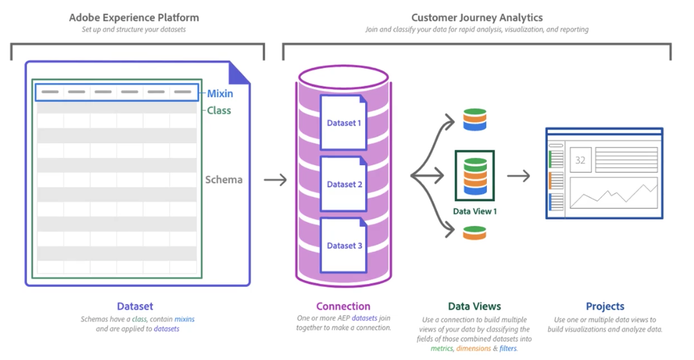

# Información general sobre Customer Journey Analytics

Customer Journey Analytics es una función de Analytics que le permite utilizar la potencia de Analysis Workspace con datos de Adobe Experience Platform. Puede desglosar, filtrar, consultar y visualizar datos de años, y se combina con la capacidad de Platform de albergar todo tipo de esquemas y tipos de datos. Con el **Experience Data Model (XDM)**, los datos se pueden representar y organizar de forma uniforme, listos para la combinación y exploración. **Los servicios de consulta de Experience** le permiten usar herramientas y marcos compatibles con SQL para hacer consultas y manipular todos los datos.

La arquitectura de CJA de alto nivel se muestra aquí:

A continuación, se muestra un vídeo sobre Customer Journey Analytics:

>[!VIDEO](https://video.tv.adobe.com/v/30090/?quality=12)

## Comparación de CJA con la versión tradicional de Adobe Analytics

Customer Journey Analytics amplía el ámbito de Adobe Analytics al ofrecer funciones fáciles de usar entre canales y al eliminar las limitaciones de versiones anteriores de Adobe Analytics. Algunas mejoras importantes:

* **Eventos y variables ilimitadas**: los conceptos de eVars, props y eventos ya no existen. Los datos se centran principalmente en dimensiones y métricas. Los conjuntos de datos pueden tener un número ilimitado de dimensiones y métricas únicas.
* **Valores únicos ilimitados**: Adobe Experience Platform no se limita a ninguna limitación única.
* **Modificar datos históricos**: con Adobe Experience Platform, los datos se pueden eliminar o corregir.
* **Datos de grupos de informes múltiples**: las implementaciones existentes de varios conjuntos de datos se pueden combinar en Platform.

>[!TIP]
>
>Si ha estado utilizando Adobe Analytics y desea utilizar los datos de Adobe Analytics en Customer Journey Analytics, consulte la guía de inicio rápido de [Ingesta y uso de datos de Adobe Analytics tradicional](../data-ingestion/analytics.md) como parte de la sección de [Ingesta de datos](../data-ingestion/data-ingestion.md).

La versión inicial de Customer Journey Analytics incluye muchas de las funciones incluidas en Analysis Workspace. Para obtener una lista completa, consulte [Compatibilidad con las funciones de Customer Journey Analytics](/help/getting-started/aa-vs-cja/cja-aa.md).

## Casos de uso clave

Customer Journey Analytics le permite:

* **Ver al cliente en un contexto de recorrido**: puede obtener vistas y análisis de datos de forma secuencial abarcando varios canales. Los datos del centro de llamadas, los sistemas de POS y las propiedades en línea se pueden combinar en una única vista del sistema de informes.
* **Poner perspectivas a disposición de todos**: democratizar el acceso a los datos y permitir que más personas tomen decisiones comerciales con perspectivas derivadas de los datos. Cualquier miembro de la organización responsable de cualquier aspecto de la experiencia del cliente puede tomar decisiones reales con mayor rapidez según datos más completos.
* **Aproveche el poder de la ciencia de datos para sus analistas**: Customer Journey Analytics nos permite utilizar la ciencia de datos para obtener una perspectiva y un análisis profundos.
* **Visualice e interactúe con sus conjuntos de datos mediante sistemas de informes a la carta**: Espacio de trabajo puede utilizar cualquier conjunto de datos de Adobe Experience Platform que se ajuste a algunas reglas básicas.
* **Vista de datos no web**: Espacio de trabajo ya no se limita a una definición rígida de “visita” o “evento”. Los esquemas personalizados permiten un control completo de los datos y las definiciones.
* **Ejerza un buen control sobre la manipulación de datos**: cambie los datos que ha cargado, cree conjuntos de datos e impórtelos a Espacio de trabajo. Adobe Experience Platform proporciona herramientas de consulta, extracción, transformación y carga a través del servicio de consulta de Experience Cloud.

## Requisitos previos

Para poder iniciar desde Customer Journey Analytics, se deben cumplir los siguientes requisitos previos:

* Su organización tiene un contrato activo con Adobe Analytics para Select, Prime o Ultimate con el complemento de Customer Journey Analytics. Si no está seguro de qué tipo de contrato tiene o no está seguro de si tiene el complemento de CJA, póngase en contacto con el equipo de cuenta de Adobe.
* Su organización se ha aprovisionado para Adobe Experience Platform.
* También puede adquirir Customer Journey Analytics como producto independiente, sin necesidad de tener Adobe Analytics.

## Control de acceso

Consulte el tema [Control de acceso](/help/admin/cja-access-control.md).

## Actualizaciones terminológicas

Se ha cambiado el nombre de varias funciones de CJA, en comparación con la versión clásica de Adobe Analytics, para que se ajusten a los estándares del sector. Algunos términos actualizados incluyen lo siguiente:

* Los segmentos ahora se conocen como “Filtros”.
* Los grupos de informes virtuales ahora se conocen como Vistas de datos.
* Las clasificaciones ahora se conocen como “Conjuntos de datos de búsqueda”.
* Los atributos del cliente ahora se conocen como “Conjuntos de datos de perfil”.
* Los contenedores de visita individual ahora se conocen como contenedores de “Evento”.
* Los contenedores de visitas ahora se conocen como contenedores de “Sesión”.
* Los contenedores de Visitante ahora se conocen como contenedores de “Persona”.

## Otras funciones creadas en Adobe Experience Platform

Customer Journey Analytics es una de las funciones de muchos que dependen de Adobe Experience Platform. Muchas otras capacidades, también integradas en Experience Platform, le permiten aprovechar al máximo sus datos.

Adobe Experience Platform le permite centralizar y estandarizar los datos y el contenido de los clientes de cualquier sistema y aplicar la ciencia de datos y el aprendizaje automático para mejorar el diseño y el envío de las experiencias personalizadas. Los datos del cliente en la plataforma se almacenan como conjuntos de datos que consisten en un esquema y lotes de datos. Para obtener más información sobre la plataforma, consulte la [Descripción general de arquitectura de Adobe Experience Platform](https://experienceleague.adobe.com/docs/platform-learn/tutorials/intro-to-platform/basic-architecture.html?lang=es).

Desde la ingestión de datos hasta el acceso directo a SQL, varios componentes de Experience Platform son fundamentales para Customer Journey Analytics y lo complementan:

* [Servicio de consulta](https://experienceleague.adobe.com/docs/experience-platform/query/home.html?lang=es): utilice SQL estándar para recuperar datos de Adobe Experience Platform, como datos de soluciones de Adobe, datos de origen de clientes o cualquier otro dato de Platform. Se trata de una herramienta sin servidor que le permite unirse a cualquier conjunto de datos y capturar los resultados de la consulta como un nuevo conjunto de datos para usar en el sistema de informes, en Data Science Workspace o para su inserción en el servicio de perfil. Puede utilizar el servicio de consulta para crear ecosistemas de análisis de datos creando una imagen de los consumidores en sus diversos canales de interacción. Estos canales pueden incluir sistemas de puntos de venta, web, móviles, CRM y demás.
* [Perfil del cliente en tiempo real](https://experienceleague.adobe.com/docs/experience-platform/profile/home.html?lang=es):
* [Servicio de identidad](https://experienceleague.adobe.com/docs/experience-platform/identity/home.html?lang=es):
* [Data Science Workspace](https://experienceleague.adobe.com/docs/experience-platform/data-science-workspace/home.html?lang=es) la opción “desarrollador”: puede utilizar inteligencia artificial (IA) prediseñada y modelos de aprendizaje automático en Adobe Experience Platform para influir en varios puntos del recorrido del cliente. Al descubrir perspectivas ocultas, puede hacer mejores predicciones en todo el viaje del cliente, sugerir los mejores pasos siguientes recomendados o automatizar procesos engorrosos.

## Vídeos

* Uso de datos en Customer Journey Analytics:

   >[!VIDEO](https://video.tv.adobe.com/v/32112/?quality=12)

* Arquitectura e integraciones de Customer Journey Analytics:

   >[!VIDEO](https://video.tv.adobe.com/v/32483/?quality=12)

