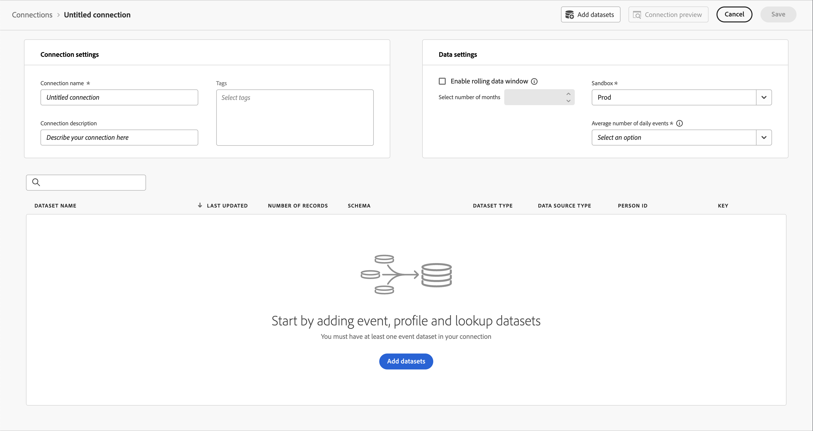

# Creación y configuración de una conexión para utilizarla con Customer Journey Analytics {#upgrade-create-connection}

<!-- markdownlint-disable MD034 -->

>[!CONTEXTUALHELP]
>id="cja-upgrade-connection"
>title="Crear una conexión en Customer Journey Analytics"
>abstract="Una conexión le permite convertir datos de Adobe Experience Platform a un formato optimizado para la creación de informes en Customer Journey Analytics. La creación de una conexión en Customer Journey Analytics es sencilla y solo tarda unos minutos en completarse."

<!-- markdownlint-enable MD034 -->

{{upgrade-note-step}}

<!-- Should we single source this instead of duplicate it? The following steps were copied from: /help/connections/create-connection.md -->

En la siguiente información se explica cómo crear y configurar una conexión, así como cómo agregar conjuntos de datos de Experience Platform a la conexión que cree. Para obtener información adicional acerca de cómo crear y configurar una conexión, vea [Crear o editar una conexión](/help/connections/create-connection.md).

## Creación y configuración de la conexión {#create-connection}

1. En Customer Journey Analytics, seleccione la pestaña **[!UICONTROL Conexiones]**.
1. Seleccione **[!UICONTROL Crear nueva conexión]**.

   

1. Configure los ajustes de conexión.

   | Configuración | Descripción |
   | --- | --- |
   | **[!UICONTROL Nombre de la conexión]** | Introduzca un nombre único para la conexión. |
   | **[!UICONTROL Descripción de la conexión]** | Describa el propósito de esta conexión. |
   | **[!UICONTROL Zona protegida]** | Elija una zona protegida en Experience Platform que contenga los conjuntos de datos a los que desea conectarse.
Adobe Experience Platform proporciona [zonas protegidas](https://experienceleague.adobe.com/es/docs/experience-platform/sandbox/home) limitadas que dividen una sola instancia de Platform en entornos virtuales independientes para ayudar a desarrollar y desarrollar aplicaciones de experiencia digital. Puede considerar las zonas protegidas como “silos de datos” que contienen conjuntos de datos. Las zonas protegidas se utilizan para controlar el acceso a los conjuntos de datos.
Una vez seleccionada la zona protegida, el carril izquierdo muestra todos los conjuntos de datos de la zona protegida desde los que puede extraer datos. |
   | **[!UICONTROL Activar la ventana de datos móviles]** | Si está marcada, esta casilla le permite definir la retención de datos de Customer Journey Analytics como un período de tiempo variable en meses (1 mes, 3 meses, 6 meses, etc.), a nivel de conexión.
La retención de datos se basa en marcas de hora de conjuntos de datos de evento y se aplica solo a conjuntos de datos de evento. No existe ninguna configuración de ventana de datos móviles para conjuntos de datos de búsqueda o perfil, ya que no hay marcas de tiempo aplicables. Sin embargo, si la conexión incluye perfiles o conjuntos de datos de búsqueda (además de uno o más conjuntos de datos de evento), esos datos se conservarán durante el mismo período de tiempo.
 La principal ventaja es que solo almacena o genera informes sobre datos que son aplicables y útiles, y elimina los datos más antiguos que ya no son útiles. Le ayuda a mantenerse por debajo de los límites del contrato y reduce el riesgo de costes adicionales.
Si deja el valor predeterminado (sin marcar), la configuración de retención de datos de Adobe Experience Platform reemplaza el período de retención. Si tiene datos de 25 meses en Experience Platform, Customer Journey Analytics recibirá 25 meses de datos mediante el relleno. Si eliminase 10 de esos meses en Platform, Customer Journey Analytics conservaría los 15 meses restantes. |
   | **[!UICONTROL Agregar conjuntos de datos]** (consulte más abajo) | Agregue conjuntos de datos si no aparecen conjuntos de datos en su lista de conjuntos de datos. |
   | **[!UICONTROL Nombre del conjunto de datos]** | Seleccione uno o varios conjuntos de datos que desee incluir en Customer Journey Analytics y seleccione **[!UICONTROL Añadir]**.
(Si tiene muchos conjuntos de datos para elegir, puede buscar los correctos mediante la barra de búsqueda Buscar conjuntos de datos que se encuentra arriba de la lista de conjuntos de datos). |
   | **[!UICONTROL Última actualización]** | Solo para conjuntos de datos de evento, esta configuración se establece automáticamente en el campo de marca de tiempo predeterminado de esquemas basados en eventos en Experience Platform. “N/A” significa que este conjunto de datos no contiene datos. |
   | **[!UICONTROL Número de registros]** | El total de registros del mes anterior para el conjunto de datos en Experience Platform. |
   | **[!UICONTROL Esquema]** | Este es el [esquema](https://experienceleague.adobe.com/es/docs/experience-platform/xdm/schema/composition) en función del cual se creó el conjunto de datos en Adobe Experience Platform. |
   | **[!UICONTROL Tipo de conjunto de datos]** | Para cada conjunto de datos que agregó a esta conexión, Customer Journey Analytics establece de manera automática el tipo de conjunto de datos en función de los datos que ingresan. Existen tres tipos diferentes de conjuntos de datos: datos: datos de evento, datos de perfil y datos de búsqueda. Consulte la siguiente tabla para obtener una explicación de los tipos de conjuntos de datos. |
   | **[!UICONTROL Granularidad]** | La granularidad de los datos del conjunto de datos; solo se aplica a los conjuntos de datos de resumen. |
   | **[!UICONTROL Tipo de fuente de datos]** | El tipo de fuente de datos del conjunto de datos. No es aplicable a los conjuntos de datos de resumen. |
   | **[!UICONTROL ID de la persona]** | Seleccione un ID de persona en la lista desplegable de identidades disponibles. Estas identidades se definieron en el esquema del conjunto de datos en Experience Platform. Consulte a continuación para obtener información sobre cómo usar el mapa de identidad como ID de persona.
IMPORTANTE: Si no hay ningún ID de persona para elegir, significa que uno o más ID de persona no se han definido en el esquema. Mire [este vídeo](https://www.youtube.com/watch?v=G_ttmGl_LRU) sobre cómo definir una identidad en Experience Platform. |
   | **[!UICONTROL Clave]** | Solo para conjuntos de datos de búsqueda (como _id). |
   | **[!UICONTROL Clave de coincidencia]** | Solo para conjuntos de datos de búsqueda (como _id). |
   | **[!UICONTROL Importar datos nuevos]** | Establézcalo en Activado o Desactivado. |
   | **[!UICONTROL Datos de relleno]** | Puede solicitar el relleno de los datos de un conjunto de datos. Por ejemplo, puede solicitar que se rellenen los datos de los últimos 7 días. Configure el conjunto de datos correctamente y pruebe la conexión. Si todo parece correcto, puede rellenar fácilmente todos los datos restantes.
Además, puede habilitar la importación de nuevos datos por el conjunto de datos. |
   | **[!UICONTROL Estado de relleno]** | Este estado indica si se están procesando datos de relleno. |

   {style="table-layout:auto"}

## Agregar y configurar conjuntos de datos {#add-dataset}

Puede agregar un conjunto de datos de Experience Platform al crear una conexión.

1. En el cuadro de diálogo Configuración de conexión, haga clic en **[!UICONTROL Añadir conjuntos de datos]**.

1. En el paso [!UICONTROL Seleccionar conjuntos de datos], verá una lista de los conjuntos de datos de Experience Platform.

   

   Para cada conjunto de datos, la lista muestra:

   | Columna | Descripción |
   |---|---|
   | Conjunto de datos | Nombre del conjunto de datos. Seleccione el nombre para dirigirle al conjunto de datos en Experience Platform. Seleccione  para mostrar una ventana emergente con más detalles para el conjunto de datos. Puede seleccionar **[!UICONTROL Editar en Platform]** para editar el conjunto de datos directamente en Experience Platform. |
   | Tipo de conjunto de datos | El tipo del conjunto de datos: evento, perfil, consulta o resumen. |
   | Número de registros | El total de registros del mes anterior para el conjunto de datos en Experience Platform. |
   | Esquema | El esquema del conjunto de datos. Seleccione el nombre para dirigirle al esquema en Experience Platform. |
   | Último lote | El estado del último lote ingerido en Experience Platform. Consulte [Estados de lotes](https://experienceleague.adobe.com/es/docs/experience-platform/ingestion/batch/troubleshooting#batch-states) para ver más información. |
   | ID de conjunto de datos | El ID del conjunto de datos. |
   | Última actualización | La última marca de tiempo actualizada del conjunto de datos. |

1. Seleccione uno o varios conjuntos de datos y seleccione **[!UICONTROL Siguiente]**. Al menos un conjunto de datos de evento debe formar parte de la conexión.
   * Para cambiar las columnas mostradas para la lista de conjuntos de datos, seleccione  y seleccione las columnas que desea mostrar en el cuadro de diálogo [!UICONTROL Personalizar tabla].
   * Para buscar un conjunto de datos específico, utilice el campo de búsqueda .
   * Para alternar entre mostrar u ocultar los conjuntos de datos seleccionados, seleccione  **[!UICONTROL Ocultar seleccionados]** o **[!UICONTROL Mostrar seleccionados]**.
   * Para quitar un conjunto de datos de la lista de conjuntos de datos seleccionados, utilice . Para quitar todos los conjuntos de datos seleccionados, seleccione **[!UICONTROL Borrar todo]**.

1. Ahora configure los conjuntos de datos uno a uno.

   

   | Configuración | Descripción |
   | --- | --- |
   | **[!UICONTROL ID de la persona]** | Solo disponible para conjuntos de datos de evento y perfil. Seleccione un ID de persona en la lista desplegable de identidades disponibles. Estas identidades se definieron en el esquema del conjunto de datos en Experience Platform. Consulte a continuación para obtener información sobre cómo usar el mapa de identidad como ID de persona.
Si no hay ningún ID de persona para elegir, significa que uno o más ID de persona no se han definido en el esquema. Consulte [Definición de campos de identidad en la IU](https://experienceleague.adobe.com/es/docs/experience-platform/xdm/ui/fields/identity) para obtener más información. 
El valor del ID de persona seleccionado se considera que distingue entre mayúsculas y minúsculas. Por ejemplo, `abc123` y `ABC123` son dos valores diferentes. |
   | **[!UICONTROL Marca de tiempo]** | Solo para conjuntos de datos de evento y resumen, esta configuración se establece automáticamente en el campo de marca de tiempo predeterminado de esquemas basados en eventos en Experience Platform. |
   | **[!UICONTROL Clave]** | Solo disponible para conjuntos de datos de búsqueda. Clave que se utiliza para un conjunto de datos de búsqueda. |
   | **[!UICONTROL Clave de coincidencia]** | Solo disponible para conjuntos de datos de búsqueda. La clave coincidente para unirse a uno de los conjuntos de datos de evento. Si esta lista está vacía, es probable que no haya añadido ni configurado ningún conjunto de datos de evento. |
   | **[!UICONTROL Zona horaria]** | Solo disponible para datos de resumen. Seleccione la zona horaria adecuada para los datos de resumen de las series temporales. |
   | **[!UICONTROL Tipo de fuente de datos]** | Seleccione un tipo de fuente de datos.  Los tipos de fuentes de datos incluyen los siguientes: <ul><li>[!UICONTROL Datos web]</li><li>[!UICONTROL Datos de aplicación móvil]</li><li>[!UICONTROL Datos POS]</li><li>[!UICONTROL Datos CRM]</li><li>[!UICONTROL Datos de las encuestas]</li><li>[!UICONTROL Datos de centro de llamadas]</li><li>[!UICONTROL Datos del producto]</li><li> [!UICONTROL Datos de cuentas]</li><li> [!UICONTROL Datos de transacción]</li><li>[!UICONTROL Datos de valoraciones del cliente]</li><li> [!UICONTROL Otro]</li></ul>Este campo se utiliza para estudiar los tipos de fuentes de datos que se utilizan. |
   | **[!UICONTROL Importar datos nuevos]** | Habilite esta opción si desea establecer una conexión continua. Con una conexión continua, los nuevos lotes de datos que se añaden a los conjuntos de datos están disponibles automáticamente en Workspace. |
   | **[!UICONTROL Relleno del conjunto de datos]** | Habilite **[!UICONTROL Relleno de todos los datos existentes]** para asegurarse de que se rellenan todos los datos existentes.  Seleccione **[!UICONTROL Solicitar relleno]** para rellenar los datos históricos de un período específico. Puede definir hasta 10 períodos de relleno de conjuntos de datos.<ol><li>Defina el periodo introduciendo datos de inicio y finalización o seleccionando fechas utilizando .</li><li>Seleccione **[!UICONTROL Relleno de cola]** para añadir el relleno a la lista o **[!UICONTROL Cancelar]** para cancelar.</li></ol>Para cada entrada, seleccione  para editar el periodo o seleccione  para eliminar la entrada.  En rellenos:<ul><li>Puede rellenar cada conjunto de datos individualmente.</li><li>Prioriza los nuevos datos agregados a un conjunto de datos en la conexión, por lo que estos datos tienen la latencia más baja.</li><li>Cualquier dato de relleno (datos históricos) se importa a una velocidad más lenta. La cantidad de datos históricos influye en la latencia.</li><li>El conector de origen de Analytics importa hasta 13 meses de datos, independientemente de su tamaño, para las zonas protegidas de producción. El relleno en zonas protegidas que no sean de producción está limitado a tres meses.</li></ul> |
   | **[!UICONTROL Transformación de un conjunto de datos]** | Para conjuntos de datos de búsqueda B2B específicos, puede habilitar la transformación de un conjunto de datos para escenarios de informes adecuados basados en personas B2B. |
   | **[!UICONTROL Estado de relleno]** | Los posibles indicadores de estado son:<ul><li>Correcto</li><li>Procesamiento de X rellenos</li><li>Off</li></ul> |
   | **[!UICONTROL ID de conjunto de datos]** | Este ID se genera automáticamente. |
   | **[!UICONTROL Descripción]** | La descripción dada a este conjunto de datos cuando se creó. |
   | **[!UICONTROL Tamaño del conjunto de datos]** | El tamaño del conjunto de datos. |
   | **[!UICONTROL Esquema]** | Este es el esquema en función del cual se creó el conjunto de datos en Adobe Experience Platform. |
   | **[!UICONTROL Conjunto de datos]** | El nombre del conjunto de datos. |
   | **[!UICONTROL Vista previa: *nombre del conjunto de datos *]** | Previsualiza el conjunto de datos con columnas de fecha, mi ID e Identificador. |
   | **[!UICONTROL Eliminar]** | Puede eliminar o quitar el conjunto de datos y cambiar el ID de persona sin eliminar toda la conexión. Eliminar o quitar reduce los costes que implica la ingesta de datos y el engorroso proceso de volver a crear toda la conexión y las vistas de datos asociadas. |

   {style="table-layout:auto"}

{{upgrade-final-step}}
