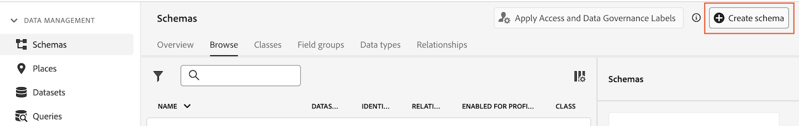
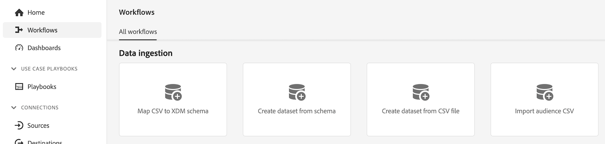
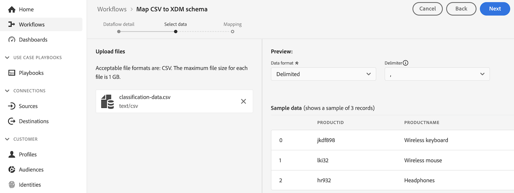

# Creación de conjuntos de datos de búsqueda para clasificar datos en Customer Journey Analytics {#upgrade-lookup-dataset}

<!-- markdownlint-disable MD034 -->

>[!CONTEXTUALHELP]
>id="cja-upgrade-lookup-dataset-create"
>title="Creación de un conjunto de datos de búsqueda para cada dimensión que contenga datos de clasificación"
>abstract="De forma similar a los datos de clasificaciones en Adobe Analytics, los conjuntos de datos de búsqueda son el método para clasificar datos en Customer Journey Analytics."

<!-- markdownlint-enable MD034 -->

{{upgrade-note-step}}

De forma similar a los datos de clasificaciones en Adobe Analytics, los conjuntos de datos de búsqueda son el método para clasificar datos en Customer Journey Analytics.

Al utilizar el conector de origen de Analytics, algunos conjuntos de datos de búsqueda estándar se aplican automáticamente en el momento del informe. Para obtener más información, consulte [Agregar búsquedas estándar a sus conjuntos de datos](/help/connections/standard-lookups.md).

Para clasificar los datos en Customer Journey Analytics al utilizar Experience Platform Web SDK, debe crear un esquema personalizado y un conjunto de datos de búsqueda para cada dimensión que contenga los datos que desea clasificar.

## Crear un esquema personalizado para utilizarlo con el conjunto de datos de consulta

Cree un nuevo esquema personalizado para cada dimensión que contenga datos que desee clasificar en Customer Journey Analytics. Cuando cree el conjunto de datos de búsqueda en un paso posterior, hará referencia a este esquema.

Repita este proceso para cada dimensión que contenga datos que desee clasificar.

Para crear un esquema para utilizarlo con un conjunto de datos de consulta en Customer Journey Analytics:

1. En Adobe Experience Platform, seleccione **[!UICONTROL Esquemas]** en la sección **[!UICONTROL Administración de datos]** del carril izquierdo.

1. Seleccione **[!UICONTROL Crear esquema]**.

   

1. Seleccione **[!UICONTROL Manual]**. Esto le permite agregar manualmente campos y grupos de campos al esquema. Elija **[!UICONTROL Seleccionar]** para continuar a la siguiente página del asistente de creación.

1. En la página **[!UICONTROL Detalles del esquema]**, seleccione **[!UICONTROL Otro]** y, a continuación, seleccione **[!UICONTROL Personalizado]**.

   

1. Seleccione **[!UICONTROL Crear clase]**.

   <!-- add screenshot -->

1. En el cuadro de diálogo **[!UICONTROL Crear clase]**, especifique un nombre y una descripción para el esquema, seleccione **[!UICONTROL Registro]** y, a continuación, seleccione **[!UICONTROL Crear]**.

1. Continuar con [Crear un conjunto de datos de consulta](#create-a-lookup-dataset).

## Crear un conjunto de datos de búsqueda

Después de [crear un esquema personalizado](#create-a-custom-schema-to-use-with-the-lookup-dataset) para utilizarlo en un conjunto de datos de consulta, debe crear el conjunto de datos de consulta y asignarlo a su esquema.

Repita este proceso para cada dimensión que contenga datos que desee clasificar.

Para crear un conjunto de datos de consulta para utilizarlo con un esquema en Customer Journey Analytics:

>[!NOTE]
>
>El siguiente proceso utiliza un archivo CSV para crear el conjunto de datos. También puede utilizar cualquier otro método disponible para importar datos en Experience Platform, como configurar una secuencia de datos.

1. En Adobe Experience Platform, seleccione **[!UICONTROL Flujos de trabajo]** en el carril izquierdo.

   

1. Seleccione **[!UICONTROL Asignar CSV al esquema XDM]** y, a continuación, seleccione **[!UICONTROL Iniciar]**.

1. En la sección **[!UICONTROL Detalles del conjunto de datos]**, seleccione **[!UICONTROL Nuevo conjunto de datos]**.

1. Especifique un nombre y una descripción para el conjunto de datos.

1. En el campo **[!UICONTROL Esquema]**, seleccione el esquema que creó para los conjuntos de datos de búsqueda, tal como se describe en [Crear un esquema para los conjuntos de datos de búsqueda](#create-a-schema-for-lookup-datasets).

1. Seleccione **[!UICONTROL Siguiente]**.

1. En la página de esquema **[!UICONTROL Asignar CSV a XDM]**, en la sección **[!UICONTROL Cargar archivos]**, seleccione **[!UICONTROL Elegir archivos]** y, a continuación, busque en el sistema de archivos el archivo que contiene la información de clasificación de la dimensión a la que desea aplicar los datos de clasificación. Por ejemplo, puede ser una hoja de cálculo que enumere los ID de campo y los nombres de campo correspondientes. <!-- correct? How can I better explain what this file is?-->

   

1. Seleccionar **[!UICONTROL Siguiente]**

1. Una vez cargado el archivo, revise las asignaciones para asegurarse de que sean precisas. Las columnas del archivo CSV se enumeran en **[!UICONTROL Datos de Source]** y sus campos de esquema XDM correspondientes en **[!UICONTROL Campo de destino]**.

   Platform proporciona automáticamente recomendaciones inteligentes para campos asignados automáticamente en función del esquema o el conjunto de datos de destino seleccionado. Puede ajustar manualmente las reglas de asignación para adaptarlas a sus casos de uso.

   Para obtener más información sobre el proceso de asignación, consulte [Asignación de un archivo CSV a un esquema XDM existente](https://experienceleague.adobe.com/en/docs/experience-platform/ingestion/tutorials/map-csv/existing-schema) en la documentación de Experience Platform.

1. Seleccione **[!UICONTROL Finalizar]**.

1. Continúe con [Agregue el conjunto de datos de búsqueda a su conexión en Customer Journey Analytics](#add-the-lookup-dataset-to-your-connection-in-customer-journey-analytics).

## Añadir el conjunto de datos de búsqueda a la conexión en Customer Journey Analytics

Después de [crear un esquema personalizado](#create-a-custom-schema-to-use-with-the-lookup-dataset) y [crear un conjunto de datos de consulta](#create-a-lookup-dataset), debe agregar el conjunto de datos de consulta a su conexión en Customer Journey Analytics.

Repita este proceso para cada dimensión que contenga datos que desee clasificar.

Para agregar el conjunto de datos de búsqueda a la conexión en Customer Journey Analytics:

1. En Customer Journey Analytics, seleccione la pestaña **[!UICONTROL Conexiones]**.

1. Seleccione el  junto a la conexión donde desea agregar el conjunto de datos de consulta y, a continuación, seleccione **[!UICONTROL Editar]**.

   <!-- add screenshot -->

1. Seleccione **[!UICONTROL Agregar conjuntos de datos]**.

1. En el cuadro de diálogo **[!UICONTROL Agregar conjuntos de datos]**, seleccione el conjunto de datos de búsqueda que ha creado y, a continuación, seleccione **[!UICONTROL Siguiente]**.

1. En el campo **[!UICONTROL ID de persona]**, seleccione un ID de persona de las identidades disponibles definidas en el esquema de su conjunto de datos que configuró en Experience Platform. <!-- fill out other fields? -->

1. Seleccione **[!UICONTROL Agregar conjuntos de datos]** y luego seleccione **[!UICONTROL Guardar]**.

   <!-- is there a step right in between here where you select the dataset -->

1. Usando el campo **[!UICONTROL Clave]** y el campo **[!UICONTROL Clave coincidente]**, cree una correlación entre el campo del conjunto de datos de búsqueda y el del conjunto de datos de resumen o evento.

1. Una vez que todos los conjuntos de datos de búsqueda se hayan agregado a su conexión en Customer Journey Analytics, continúe siguiendo los [pasos de actualización recomendados](/help/getting-started/cja-upgrade/cja-upgrade-recommendations.md#recommended-upgrade-steps-for-most-organizations) o los [pasos de actualización generados dinámicamente](https://gigazelle.github.io/cja-ttv/).

