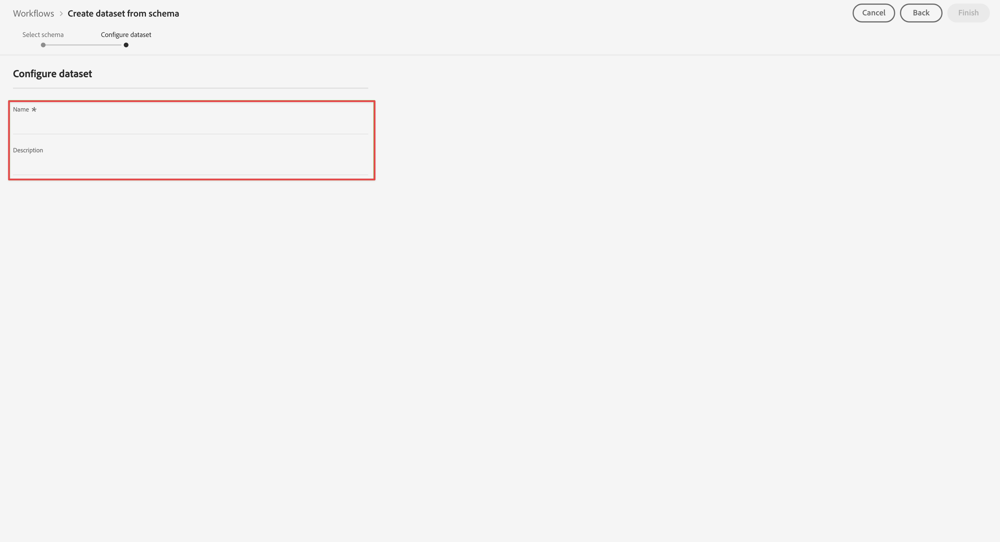
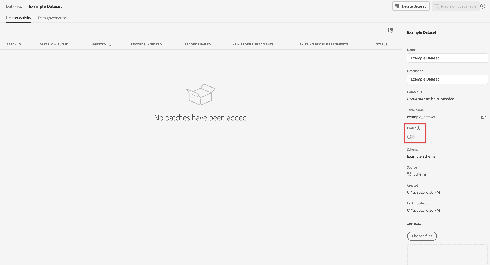

# Crear un conjunto de datos para utilizarlo con Customer Journey Analytics {#upgrade-create-dataset}

<!-- markdownlint-disable MD034 -->

>[!CONTEXTUALHELP]
>id="cja-upgrade-dataset-create"
>title="Crear un conjunto de datos en Adobe Experience Platform"
>abstract="Un conjunto de datos es una ubicación en la que residen los datos recopilados. Cree esta ubicación en Adobe Experience Platform.  Crear un conjunto de datos con un esquema en mente toma solo unos minutos."

<!-- markdownlint-enable MD034 -->

>[!NOTE]
> 
>Siga los pasos de esta página solo después de completar todos los pasos de actualización anteriores. Puede seguir los [pasos de actualización recomendados](/help/getting-started/cja-upgrade/cja-upgrade-recommendations.md#recommended-upgrade-steps-for-most-organizations), o puede seguir los pasos de actualización que se generaron dinámicamente para su organización con el [cuestionario de actualización de Adobe Analytics a Customer Journey Analytics](https://gigazelle.github.io/cja-ttv/).
>
>Después de completar los pasos de esta página, siga los pasos de actualización recomendados o los pasos de actualización generados dinámicamente.

<!-- Should we single source this instead of duplicate it? The following steps were copied from: /help/data-ingestion/aepwebsdk.md-->

Un conjunto de datos es la construcción que almacena y administra los datos que recopila en Adobe Experience Platform.

Para crear un conjunto de datos:

1. En Adobe Experience Platform, en el carril izquierdo, seleccione **[!UICONTROL Conjuntos de datos]** en [!UICONTROL ADMINISTRACIÓN DE DATOS].

1. Seleccione **[!UICONTROL Crear conjunto de datos]**.

   

1. Seleccione **[!UICONTROL Crear conjunto de datos a partir de esquema]**.

   

1. Seleccione el esquema creado anteriormente y, después, **[!UICONTROL Siguiente]**.

1. Asigne un nombre al conjunto de datos y (opcionalmente) proporcione una descripción.

   

1. Seleccione **[!UICONTROL Finalizar]**.

1. Seleccione el conmutador **[!UICONTROL Perfil]**.

   Se le pedirá que habilite el conjunto de datos para el perfil. Una vez habilitado, el conjunto de datos enriquece los perfiles de clientes en tiempo real con sus datos ingeridos.

   >[!IMPORTANT]
   >
   >    Solo puede habilitar un conjunto de datos para un perfil cuando el esquema, al que se adhiere el conjunto de datos, también esté habilitado para el perfil.

   

   Consulte [Guía de la interfaz de usuario de conjuntos de datos](https://experienceleague.adobe.com/docs/experience-platform/catalog/datasets/user-guide.html?lang=es) para obtener mucha más información sobre cómo ver, previsualizar, crear y eliminar un conjunto de datos. También puede aprender a habilitar un conjunto de datos para el perfil del cliente en tiempo real.

1. Siga los [pasos de actualización recomendados](/help/getting-started/cja-upgrade/cja-upgrade-recommendations.md#recommended-upgrade-steps-for-most-organizations) o los [pasos de actualización generados dinámicamente](https://gigazelle.github.io/cja-ttv/).
