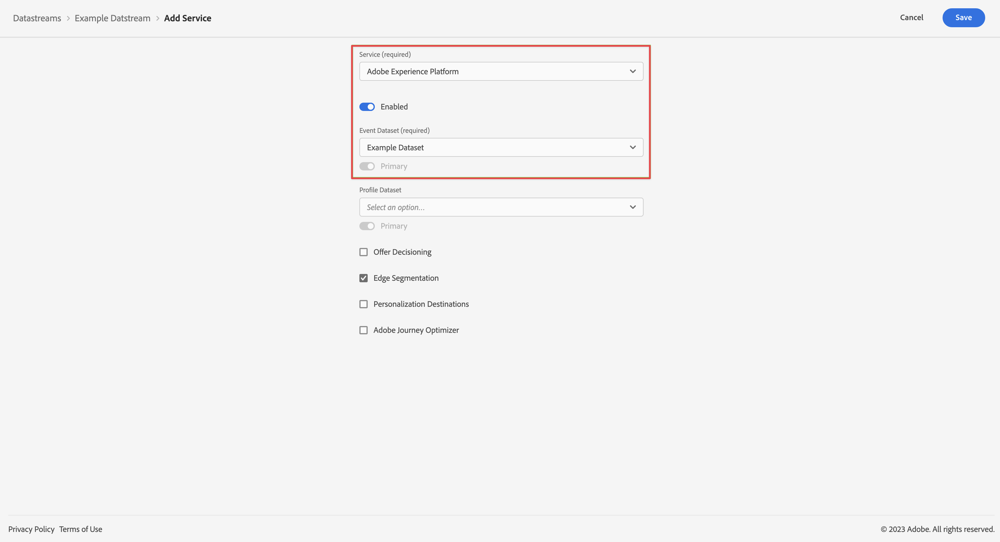

# Añadir Platform como servicio a la secuencia de datos {#upgrade-addplatform-datastream}

<!-- markdownlint-disable MD034 -->

>[!CONTEXTUALHELP]
>id="cja-upgrade-addplatform-datastream"
>title="Añadir Adobe Experience Platform como servicio a la secuencia de datos"
>abstract="Una secuencia de datos necesita uno o varios servicios a los que enviar datos. Configure Adobe Experience Platform como servicio en su secuencia de datos.  Añadir servicios a una secuencia de datos es un proceso sencillo que solo tarda unos minutos en completarse."

<!-- markdownlint-enable MD034 -->

{{upgrade-note-step}}

<!-- Should we single source this instead of duplicate it? The following steps were copied from: /help/data-ingestion/aepwebsdk.md-->

Debe existir una secuencia de datos antes de completar los pasos de esta sección. El momento y el modo en que se creó el conjunto de datos dependen de la implementación de Adobe Analytics, de la siguiente manera:

* Si la implementación de Adobe Analytics utiliza Web SDK o la extensión Web SDK, el conjunto de datos estaba disponible para el entorno de Adobe Analytics antes del proceso de actualización.

* Para otras implementaciones de Adobe Analytics, la creación de un conjunto de datos forma parte del proceso de actualización, tal como se describe en [Crear un conjunto de datos para usar con Customer Journey Analytics](/help/getting-started/cja-upgrade/cja-upgrade-datastream.md).

Con la secuencia de datos disponible, debe agregar Platform como servicio:

1. En la interfaz de usuario de Adobe Experience Platform, seleccione **[!UICONTROL Secuencias de datos]** desde [!UICONTROL RECOPILACIÓN DE DATOS] en el carril izquierdo.

1. Seleccione la secuencia de datos configurada anteriormente. <!--true?-->

1. Seleccione **[!UICONTROL Agregar servicio]**.

1. En la pantalla [!UICONTROL Agregar servicio], debe hacer lo siguiente:

   1. Seleccione **[!UICONTROL Adobe Experience Platform]** en la lista [!UICONTROL Servicio].

   1. Asegúrese de que **[!UICONTROL Habilitado]** esté seleccionado.

   1. Seleccione su conjunto de datos en la lista [!UICONTROL Conjunto de datos de evento].

      

   1. Deje los demás ajustes y seleccione **[!UICONTROL Guardar]** para guardar la secuencia de datos.

   La secuencia de datos ya está configurada para reenviar los datos recopilados de su sitio web a su conjunto de datos en Adobe Experience Platform.

   Consulte la [Información general sobre secuencias de datos](https://experienceleague.adobe.com/docs/experience-platform/datastreams/overview.html) para obtener más información sobre cómo configurar una secuencia de datos y cómo gestionar datos confidenciales.

1. Siga los [pasos de actualización recomendados](/help/getting-started/cja-upgrade/cja-upgrade-recommendations.md#recommended-upgrade-steps-for-most-organizations) o los [pasos de actualización generados dinámicamente](https://gigazelle.github.io/cja-ttv/).
