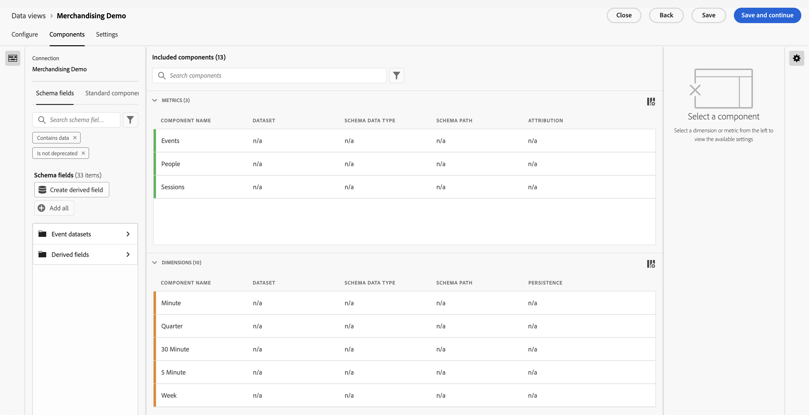

# Creación de una vista de datos en Customer Journey Analytics {#upgrade-create-dataview}

<!-- markdownlint-disable MD034 -->

>[!CONTEXTUALHELP]
>id="cja-upgrade-dataview"
>title="Creación de una vista de datos en Customer Journey Analytics"
>abstract="Una vista de datos es un contenedor específico de Customer Journey Analytics que le permite determinar cómo interpretar los datos de una conexión.  Aunque la creación inicial de la vista de datos tarda unos minutos, la configuración de cada dimensión y métrica con la configuración de componente deseada puede tardar varios días. El ajuste de esta configuración se aplica de forma retroactiva, por lo que su organización puede refinarla con el tiempo."

<!-- markdownlint-enable MD034 -->

>[!NOTE]
> 
>Siga los pasos de esta página solo después de completar todos los pasos de actualización anteriores. Puede seguir los [pasos de actualización recomendados](/help/getting-started/cja-upgrade/cja-upgrade-recommendations.md#recommended-upgrade-steps-for-most-organizations), o puede seguir los pasos de actualización que se generaron dinámicamente para su organización con el [cuestionario de actualización de Adobe Analytics a Customer Journey Analytics](https://gigazelle.github.io/cja-ttv/).
>
>Después de completar los pasos de esta página, siga los pasos de actualización recomendados o los pasos de actualización generados dinámicamente.

<!-- Should we single source this instead of duplicate it? The following steps were copied from: /help/data-views/create-dataview.md -->

La creación de una vista de datos implica crear métricas y dimensiones a partir de elementos de esquema o utilizar componentes estándares. La mayoría de los elementos de esquema pueden ser una dimensión o una métrica, según los requisitos de la empresa. Una vez arrastrado un elemento de esquema a una vista de datos, las opciones aparecen a la derecha, donde puede ajustar el funcionamiento de la dimensión o métrica en Customer Journey Analytics.

Para crear una vista de datos:

1. Inicie sesión en [Customer Journey Analytics](https://analytics.adobe.com) y vaya a la pestaña **[!UICONTROL Vistas de datos]**.

1. Seleccione **[!UICONTROL Crear nueva vista de datos]**. También puede seleccionar una vista de datos existente de la lista de vistas de datos para editarla.

1. En la ficha [!UICONTROL **Configurar**], especifique un nombre para la vista de datos y configure su configuración básica, componentes y opciones de calendario.

   Para obtener información detallada sobre cada campo, consulte [Configurar](/help/data-views/create-dataview.md#configure) en [Crear o editar una vista de datos](/help/data-views/create-dataview.md).

   

1. Seleccione la pestaña [!UICONTROL **Componentes**].

   En la pestaña [!UICONTROL **Componentes**] se establecen los componentes de una vista de datos, lo que significa que puede crear métricas y dimensiones a partir de elementos de esquema. También puede utilizar componentes estándares.

   

1. En la ficha [!UICONTROL **Componentes**], arrastre elementos de esquema desde el carril izquierdo a la sección [!UICONTROL **Métricas**] o a la sección [!UICONTROL **Dimensiones**]. Los elementos de esquema que agregue se convertirán en métricas o dimensiones en la vista de datos.

   Para obtener información detallada sobre las opciones disponibles al agregar componentes a una vista de datos, consulte [Componentes](/help/data-views/create-dataview.md#components) en [Crear o editar una vista de datos](/help/data-views/create-dataview.md).

1. Seleccione la pestaña [!UICONTROL **Configuración.**] Desde aquí, puede configurar filtros para aplicarlos a toda la vista de datos y configurar el tiempo de espera de la sesión y las métricas.

   Para obtener información detallada sobre las opciones disponibles al configurar opciones para una vista de datos, consulte [Configuración](/help/data-views/create-dataview.md#settings) en [Crear o editar una vista de datos](/help/data-views/create-dataview.md).

1. Seleccione **[!UICONTROL Guardar]** para guardar la configuración de la vista de datos.

1. Una vez especificada toda la configuración deseada, seleccione **[!UICONTROL Guardar y finalizar]**.

1. Siga los [pasos de actualización recomendados](/help/getting-started/cja-upgrade/cja-upgrade-recommendations.md#recommended-upgrade-steps-for-most-organizations) o los [pasos de actualización generados dinámicamente](https://gigazelle.github.io/cja-ttv/).
