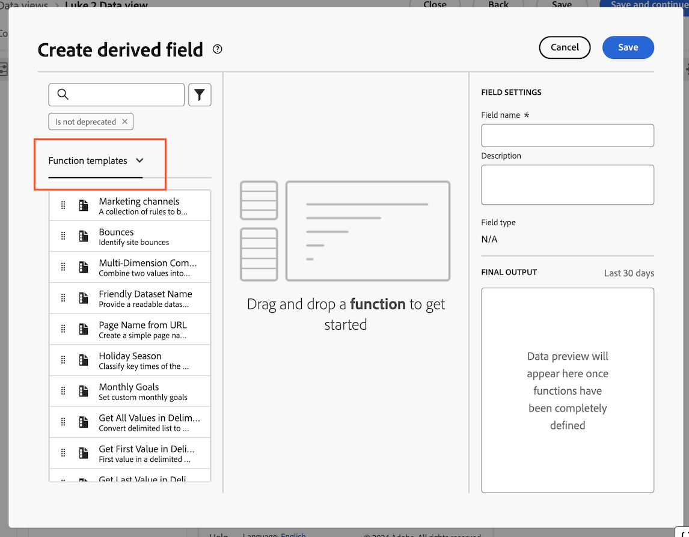

# Crear un campo derivado de canal de marketing para Customer Journey Analytics {#create-marketing-channel-derived-field}

<!-- markdownlint-disable MD034 -->

>[!CONTEXTUALHELP]
>id="cja-upgrade-marketing-channel"
>title="Crear un campo derivado de canal de marketing"
>abstract="Los campos derivados se crean dentro de una vista de datos.  El uso de una configuración de canal de marketing predeterminada solo lleva unos minutos; la creación de una configuración de canal de marketing altamente personalizada puede tardar varias horas."

<!-- markdownlint-enable MD034 -->

>[!NOTE]
> 
>Siga los pasos de esta página solo después de completar todos los pasos de actualización anteriores. Puede seguir los [pasos de actualización recomendados](/help/getting-started/cja-upgrade/cja-upgrade-recommendations.md#recommended-upgrade-steps-for-most-organizations), o puede seguir los pasos de actualización que se generaron dinámicamente para su organización con el [cuestionario de actualización de Adobe Analytics a Customer Journey Analytics](https://gigazelle.github.io/cja-ttv/).
>
>Después de completar los pasos de esta página, siga los pasos de actualización recomendados o los pasos de actualización generados dinámicamente.

Al utilizar el conector de origen de Analytics, los datos de los canales de marketing fluyen a Customer Journey Analytics a través de ese conector. Las reglas del canal de marketing deben seguir configurándose en la versión tradicional de Adobe Analytics y algunas no son compatibles. Para obtener más información, consulte [Usar dimensiones del canal de marketing](/help/use-cases/aa-data/marketing-channels.md).

Para utilizar canales de marketing en Customer Journey Analytics al utilizar Experience Platform Web SDK, puede utilizar campos derivados en una vista de datos para volver a crear los mismos canales de marketing y reglas de procesamiento para Customer Journey Analytics.

1. En Customer Journey Analytics, seleccione la vista de datos donde desee agregar canales de marketing.

1. En la vista de datos, seleccione la ficha **[!UICONTROL Componentes]**.

1. Seleccione **[!UICONTROL Crear campo derivado]** en el carril izquierdo.

1. En el cuadro de diálogo **[!UICONTROL Crear campo derivado]**, seleccione **[!UICONTROL Plantillas de función]** del menú desplegable.

   

1. Arrastre la plantilla **[!UICONTROL Canales de mercadotecnia]** al lienzo vacío.

1. Personalice la lógica de cada canal de marketing para asegurarse de que coincida con la lógica que utiliza para identificar cada canal en su entorno de Adobe Analytics.

   Puede modificar los nombres de los canales de salida o agregar lógica para identificar canales adicionales específicos de su organización.

1. En la columna derecha, especifique un nombre y una descripción para el canal de marketing.

1. Seleccione **[!UICONTROL Guardar]**.

   El nuevo campo derivado se agrega al contenedor Campos derivados > como parte de los Campos de esquema en el carril izquierdo de la vista Datos.

1. Siga los [pasos de actualización recomendados](/help/getting-started/cja-upgrade/cja-upgrade-recommendations.md#recommended-upgrade-steps-for-most-organizations) o los [pasos de actualización generados dinámicamente](https://gigazelle.github.io/cja-ttv/).
