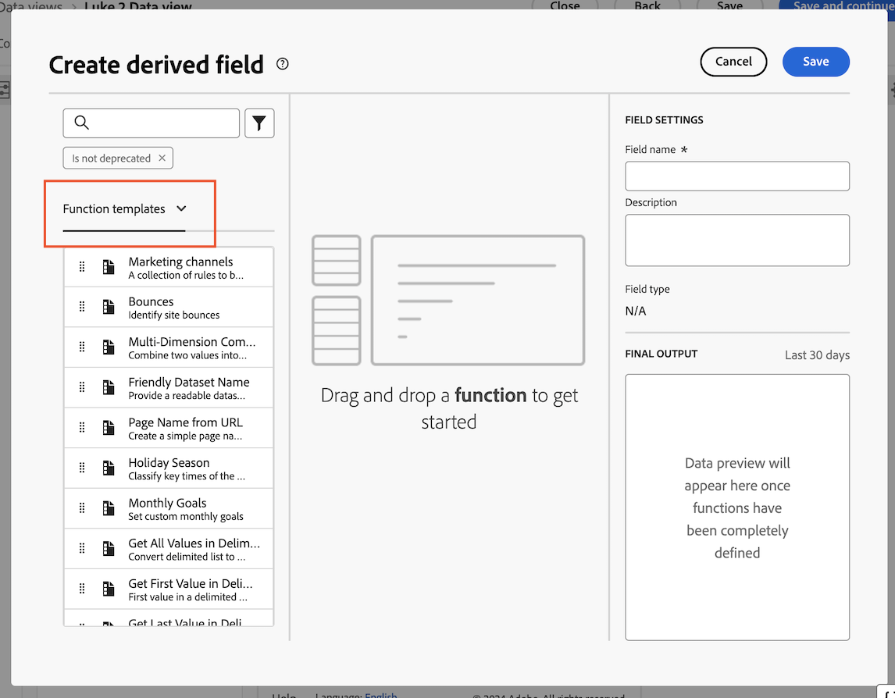

# Creación de un campo derivado de canal de marketing para Customer Journey Analytics {#create-marketing-channel-derived-field}

<!-- markdownlint-disable MD034 -->

>[!CONTEXTUALHELP]
>id="cja-upgrade-marketing-channel"
>title="Creación de un campo derivado de canal de marketing"
>abstract="Los campos derivados se crean dentro de una vista de datos.  Utilizar una configuración de canal de marketing predeterminada solo lleva unos minutos; crear una configuración de canal de marketing muy personalizada puede llevar varias horas."

<!-- markdownlint-enable MD034 -->

{{upgrade-note-step}}

Cuando se utiliza el conector de origen de Analytics, los datos de los canales de marketing fluyen hacia Customer Journey Analytics a través de ese conector. Las reglas del canal de marketing deben seguir configurándose en la versión tradicional de Adobe Analytics y algunas no son compatibles. Para obtener más información, consulte [Uso de dimensiones de canal de marketing](/help/use-cases/aa-data/marketing-channels.md).

Para poder utilizar canales de marketing en Customer Journey Analytics cuando se utiliza el SDK web de Experience Platform, puede utilizar campos derivados en una vista de datos para volver a crear los mismos canales de marketing y reglas de procesamiento para Customer Journey Analytics.

1. En Customer Journey Analytics, seleccione la vista de datos en la que desea añadir canales de marketing.

1. En la vista de datos, seleccione la pestaña **[!UICONTROL Componentes]**.

1. Seleccione **[!UICONTROL Crear campo derivado]** en el carril izquierdo.

1. En el cuadro de diálogo **[!UICONTROL Crear campo derivado]**, seleccione **[!UICONTROL Plantillas de funciones]** en el menú desplegable.

   

1. Arrastre la plantilla **[!UICONTROL Canales de marketing]** al lienzo vacío.

1. Personalice la lógica de cada canal de marketing para asegurarse de que coincida con la lógica que utiliza para identificar cada canal en su entorno de Adobe Analytics.

   Puede modificar los nombres de los canales de salida o añadir lógica para identificar canales adicionales específicos de su organización.

1. En la columna de la derecha, especifique un nombre y una descripción para el canal de marketing.

1. Seleccione **[!UICONTROL Guardar]**.

   El nuevo campo derivado se añade al contenedor Campos derivados > como parte de los Campos de esquema en el carril izquierdo de la vista Datos.

{{upgrade-final-step}}
