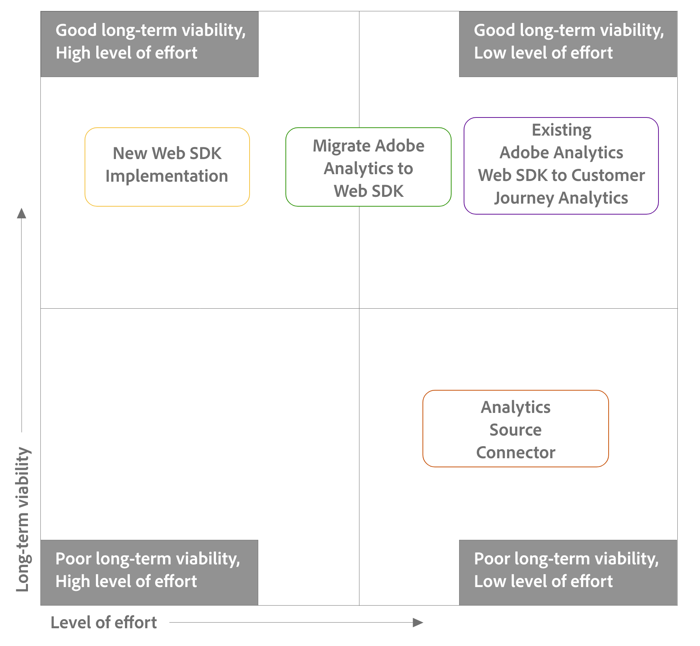

# Paso 2: Elegir la ruta de actualización

+++Expanda esta sección para ver dónde se integra la información de esta página en el proceso de actualización más amplio. Asegúrese de que se han completado todos los pasos de actualización anteriores.

Antes de continuar con esta sección, primero asegúrese de haber completado todas las tareas de actualización anteriores.

La información de esta página corresponde al paso 3 del proceso de actualización, tal como se indica en la tabla siguiente:

| Tarea de actualización | Detalles |
|---------|----------|
| **Paso 1: [Introducción a la actualización](/help/getting-started/cja-upgrade/cja-upgrade-getstarted.md)** | Conozca las ventajas de migrar a Customer Journey Analytics y el proceso de actualización básico. |
| **Paso 2: Elegir la ruta de actualización** | Hay varios métodos disponibles para actualizar a Customer Journey Analytics. Elija el método que mejor se adapte a su organización, en función del entorno de Adobe Analytics actual de su organización y los objetivos a largo plazo. |
| **Paso 3: [Enviar datos a Adobe Experience Platform](/help/getting-started/cja-upgrade/cja-upgrade-send-to-platform.md)** | El proceso de envío de datos a Adobe Experience Platform varía en función de la ruta de actualización elegida en el paso 2. |
| **Paso 4: [Conservar los datos históricos](/help/getting-started/cja-upgrade/cja-upgrade-historical-data.md)** | La mayoría de las organizaciones necesitan conservar sus datos históricos de Adobe Analytics durante un periodo de tiempo determinado. Hay varias opciones disponibles para hacerlo. |
| **Paso 5: [Realizar tareas de implementación adicionales](/help/getting-started/cja-getting-started.md)** | En este punto del proceso de actualización, debe realizar varias tareas para que el entorno de Customer Journey Analytics se pueda usar.
Estas tareas adicionales se aplican a las actualizaciones de Adobe Analytics, así como a las nuevas implementaciones de Customer Journey Analytics.

Esta tareas son:
<ul><li>Incorporación de datos a Experience Platform</li><li>Creación de conexiones entre conjuntos de datos de Platform y Customer Journey Analytics</li><li>Creación de vistas de datos </li><li>Transferencia del uso de API de informes</li><li>Contabilidad de fuentes de datos y Data Warehouse</li><li>Migración de proyectos y componentes</li><li>Planificación de la incorporación del usuario</li></ul> 
Para obtener más información, consulte [Introducción a Customer Journey Analytics](/help/getting-started/cja-getting-started.md). |

{style="table-layout:auto"}

+++

>[!AVAILABILITY]
>
>La información de esta página se reemplaza con la siguiente información de actualización más completa: <ul><li>**Pasos de actualización recomendados**
Para obtener más información, consulte [Ruta recomendada al actualizar de Adobe Analytics a Customer Journey Analytics](/help/getting-started/cja-upgrade/cja-upgrade-recommendations.md).
</li><li>**Guía de actualización de Customer Journey Analytics**
Hay disponible una nueva guía de actualización que genera dinámicamente pasos de actualización adaptados a su organización y a sus circunstancias únicas.

Para acceder a la guía desde Customer Journey Analytics, seleccione la pestaña **[!UICONTROL Workspace]** y, a continuación, seleccione **[!UICONTROL Actualizar a Customer Journey Analytics]** en el panel izquierdo. Siga las instrucciones que aparecen en la pantalla.
</li></ul>

Cuando haya decidido actualizar a Customer Journey Analytics, deberá determinar la ruta de actualización óptima para su organización.

La ruta que elija para actualizar de Adobe Analytics a Customer Journey Analytics dependerá de los siguientes factores:

* Su implementación de Adobe Analytics existente

* Sus metas para el futuro

Utilice la información de esta página para determinar qué ruta de actualización de Customer Journey Analytics se ajusta mejor a la implementación actual y a las futuras metas de su organización.

Para determinar la ruta de actualización óptima para su organización, debe leer las secciones siguientes secuencialmente:

1. Primero, deberá [conocer las rutas de actualización que están disponibles](#understand-upgrade-paths).

1. A continuación, deberá [evaluar qué rutas de actualización están a su disposición](#assess-the-upgrade-paths-available-to-you-based-on-your-current-adobe-analytics-implementation).

1. Y finalmente, deberá [sopesar las ventajas y desventajas de cada ruta de actualización](#weigh-the-advantages-and-disadvantages-of-the-upgrade-paths-available-to-you).

## Conocer las rutas de actualización

A la hora de actualizar de Adobe Analytics a Customer Journey Analytics, hay varias rutas de actualización disponibles.

En general, cada ruta de actualización es diferente en cuanto al nivel de esfuerzo necesario para ejecutar la actualización, así como en cuanto a la viabilidad a largo plazo alcanzada después de que se complete la actualización.

En la tabla siguiente se indica cada ruta de actualización, su nivel de esfuerzo y su viabilidad a largo plazo:

| Ruta de actualización | Nivel de esfuerzo | Viabilidad a largo plazo |
|---------|----------|---------|
| **Nueva implementación del SDK web de Experience Platform con el conector de origen de Analytics**  Puede empezar a utilizar Customer Journey Analytics mediante una nueva implementación del SDK web de Experience Platform. Esto le permite empezar a enviar datos a Adobe Experience Platform Edge Network y a Customer Journey Analytics. Además, deberá utilizar el conector de origen de Analytics para aportar datos históricos a Customer Journey Analytics.
En el caso de las organizaciones que aún no utilizan el SDK web, esta ruta de actualización es quizás la más directa para llevar los datos a Edge Network, ya que es la que requiere el menor número de pasos; sin embargo, como todo el trabajo se realiza por adelantado (como crear el esquema XDM), requiere un mayor esfuerzo inicial.

Los pasos básicos son:
<ol><li>Cree un esquema XDM para su organización.</li><li>Implemente el SDK de Adobe.</li><li>Envíe datos a Platform.</li><li>Configure un conector de origen de Adobe Analytics. El conector de origen de Analytics se usa para llevar datos históricos de Adobe Analytics a Customer Journey Analytics.<!-- For more information about this recommended upgrade path, see [Recommended path when upgrading from Adobe Analytics to Customer Journey Analytics](/help/getting-started/cja-upgrade/cja-upgrade-recommendations.md).--></li></ol>
<!-- **Note:** This is the recommended upgrade path when upgrading to Customer Journey Analytics. For more information about this recommended upgrade path, see [Recommended path when upgrading from Adobe Analytics to Customer Journey Analytics](/help/getting-started/cja-upgrade/cja-upgrade-recommendations.md). -->
 | Alto | Alto |
| **Nueva implementación del SDK web de Experience Platform**  Puede empezar a utilizar Customer Journey Analytics mediante una nueva implementación del SDK web de Experience Platform. Esto le permite empezar a enviar datos a Adobe Experience Platform Edge Network y a Customer Journey Analytics. 
En el caso de las organizaciones que aún no utilizan el SDK web, esta ruta de actualización es quizás la más directa para llevar los datos a Edge Network, ya que es la que requiere el menor número de pasos; sin embargo, como todo el trabajo se realiza por adelantado (como crear el esquema XDM), requiere un mayor esfuerzo inicial.

Los pasos básicos son:
<ol><li>Cree un esquema XDM para su organización.</li><li>Implemente el SDK de Adobe.</li><li>Envíe datos a Platform.</li></ol> | Alto | Alto |
| **Migrar la implementación de Adobe Analytics para utilizar el SDK web**  Si la implementación de Adobe Analytics es AppMeasurement o la extensión de Analytics, puede migrarla para utilizar el SDK web de Adobe Experience Platform y empezar a enviar datos a Edge Network y Adobe Analytics antes de enviarlos a Customer Journey Analytics.
En el caso de las organizaciones que aún no utilizan el SDK web, esta es la forma más fácil y fluida de obtener datos para Edge Network; requiere más pasos, pero ofrece una transición más metódica de Adobe Analytics a Customer Journey Analytics, con resultados más tangibles.

Los pasos básicos son:
<ol><li>Mueva la implementación de Adobe Analytics existente al SDK web y compruebe que todo funciona en Adobe Analytics.</li><li>Cree un esquema XDM para su organización si dispone de tiempo.</li><li>Utilice la asignación de secuencia de datos para asignar todos los campos del objeto de datos al esquema XDM.</li><li>Envíe datos a Platform.</li></ol> | Moderado | Alto |
| **Configurar la implementación existente del SDK web de Adobe Analytics**  Si la implementación de Adobe Analytics ya está utilizando el SDK web de Adobe Experience Platform, puede empezar a enviar datos a Customer Journey Analytics estableciendo una secuencia de datos. O bien, si ya está enviando datos a Platform, solo tiene que crear una conexión entre los conjuntos de datos de Platform y Customer Journey Analytics.
Antes de enviar datos a Platform para utilizarlos en Customer Journey Analytics, considere la posibilidad de actualizar el esquema de Adobe Analytics de acuerdo con las necesidades específicas de su organización y de cualquier otra aplicación de Platform que utilice.

Los pasos básicos son:
<ol><li>Comience a enviar datos a Platform.
Si ya está enviando datos a Platform con la implementación de Adobe Analytics, este paso no es obligatorio. Simplemente debe crear una conexión entre los conjuntos de datos de Platform y Customer Journey Analytics, tal como se describe más adelante en este proceso.
</li><li>(Opcional) Cree un esquema XDM para su organización si dispone de tiempo.</li><li>(Condicional) Si ha creado un esquema XDM, utilice la asignación de secuencia de datos para asignar todos los campos del objeto de datos al esquema XDM.</li></ol> | Bajo | Alto |
| **Uso del conector de origen de Analytics**  Si la implementación de Adobe Analytics es AppMeasurement para la extensión de Analytics, puede empezar a enviar datos a una vista de datos en Customer Journey Analytics.
Esta es la forma más sencilla de llevar los datos a Customer Journey Analytics, pero es el método menos viable a largo plazo.
 
**Nota:** Esta ruta de actualización se puede usar de forma independiente. Sin embargo, para obtener los mejores resultados, recomendamos utilizar esta ruta de actualización junto con una nueva implementación del SDK web de Experience Platform. <!-- For more information about this recommended upgrade path, see [Recommended path when upgrading from Adobe Analytics to Customer Journey Analytics](/help/getting-started/cja-upgrade/cja-upgrade-recommendations.md).--> 
 | Bajo | Bajo |

{style="table-layout:auto"}

Utilice el siguiente diagrama como ayuda para visualizar dónde se encuentra cada ruta de actualización en el espectro en términos de nivel de esfuerzo y viabilidad a largo plazo:

## Evaluar las rutas de actualización disponibles en función de la implementación de Adobe Analytics actual

No todas las rutas de actualización están disponibles para cada tipo de implementación de Adobe Analytics.

Utilice la siguiente información para poder conocer mejor qué ruta de actualización es la más adecuada para su organización.

Póngase en contacto con el representante de Adobe si necesita asesoramiento, ayuda o asistencia más específicos.

| Implementación existente de Adobe Analytics | Rutas de actualización disponibles |
|---------|----------|
| AppMeasurement | <ul><li>Nueva implementación del SDK web de Experience Platform</li><li>Migración de Adobe Analytics al SDK web</li><li>Conector de origen de Analytics</li><li>(Recomendado) Nueva implementación del SDK de Experience Platform con el conector de origen de Analytics</li></ul> |
| Extensión de Adobe Analytics | <ul><li>Nueva implementación del SDK web de Experience Platform</li><li>Migración de Adobe Analytics al SDK web</li><li>Conector de origen de Analytics</li><li>(Recomendado) Nueva implementación del SDK de Experience Platform con el conector de origen de Analytics</li></ul> |
| SDK web | <ul><li>Configurar la implementación del SDK web de Adobe Analytics para enviar datos a Customer Journey Analytics</li><li>(Recomendado) Nueva implementación del SDK de Experience Platform con el conector de origen de Analytics</li></ul> |

{style="table-layout:auto"}

## Sopesar las ventajas y desventajas de las rutas de actualización

Las ventajas y desventajas de una ruta de actualización determinada varían en función de la implementación de Adobe Analytics existente.

Antes de usar la siguiente información para determinar qué ruta de actualización es la adecuada, revise la información que se indica en [Conocer las rutas de actualización](#understand-migration-methods) si aún no lo ha hecho.

>[!NOTE]
>
>Aunque cada una de las rutas de actualización que se describen en las siguientes secciones se puede usar de forma independiente, Adobe recomienda un enfoque de actualización doble al actualizar de Adobe Analytics a Customer Journey Analytics, independientemente de la implementación actual de Adobe Analytics: **el conector de origen de Adobe Analytics** y una **nueva implementación del SDK web de Experience Platform**.
><!-- For more information about this recommended upgrade path, see [Recommended path when upgrading from Adobe Analytics to Customer Journey Analytics](/help/getting-started/cja-upgrade/cja-upgrade-recommendations.md) -->

### Para implementaciones de Adobe Analytics que utilicen: AppMeasurement y extensión de Adobe Analytics

A continuación se indican las rutas de actualización disponibles para las organizaciones que han implementado Adobe Analytics con AppMeasurement o con la extensión de Adobe Analytics. Expanda cada sección para ver las ventajas y desventajas de cada ruta de actualización.

#### Rutas de actualización

+++Nueva implementación del SDK web de Experience Platform

| Ventajas | Desventajas |
|----------|---------|
| <ul><li>**Ofrece todas las ventajas de alojar datos en Experience Edge Network**: 
Estas ventajas son:
<ul><li>Informes de alto rendimiento y disponibilidad de datos porque Adobe Experience Platform se ha creado para potenciar [casos de uso de personalización en tiempo real](https://experienceleague.adobe.com/docs/experience-platform/destinations/ui/activate/configure-personalization-destinations.html?lang=es)</li><li>Consolidación de la implementación de la recopilación de datos de Adobe Experience Cloud entre otros productos de Experience Cloud (AJO, RTCDP, etc.)</li><li>No depende de la nomenclatura de Adobe Analytics (prop, eVar, evento, etc.)</li></ul></li><li>**Preparación para el futuro**: las futuras actualizaciones de la implementación son más sencillas.</li></ul> | <ul><li>**Requiere una nueva implementación desde cero**: el requisito de realizar una nueva implementación desde cero aporta las siguientes desventajas: </li><ul><li>**Requiere mucho tiempo**: es la ruta de actualización que requiere más tiempo y es más exigente porque exige volver a empezar con una nueva implementación.</li><li>**Hay que volver a crear el esquema completo en XDM**: para poder empezar a implementar el SDK web, debe volver a crear el esquema completo en XDM.</li><li>**Hay que volver a crear reglas y elementos de datos**: para poder empezar a implementar el SDK web, debe volver a crear cualquier condición de regla y elemento de datos a partir de la implementación de Adobe Analytics.</li></ul><li>**No tiene en cuenta la retención de datos históricos:** Adobe recomienda usar el conector de origen de Analytics junto con una nueva implementación del SDK web de Experience Platform para conservar los datos históricos después de actualizar a Customer Journey Analytics. <!-- For more information about this recommended upgrade path, see [Recommended path when upgrading from Adobe Analytics to Customer Journey Analytics](/help/getting-started/cja-upgrade/cja-upgrade-recommendations.md) --></li><li>**No tiene en cuenta la comparación de datos de su implementación original con los de su nueva implementación:** Adobe recomienda usar el conector de origen de Analytics junto con una nueva implementación del SDK web de Experience Platform para comparar los datos después de actualizar a Customer Journey Analytics. <!-- For more information about this recommended upgrade path, see [Recommended path when upgrading from Adobe Analytics to Customer Journey Analytics](/help/getting-started/cja-upgrade/cja-upgrade-recommendations.md) --></li></ul> |

{style="table-layout:auto"}

+++

+++Migrar Adobe Analytics al SDK web de Experience Platform

| Ventajas | Desventajas |
|----------|---------|
| <ul><li>**Ofrece todas las ventajas de alojar datos en Experience Edge Network**: 
Estas ventajas son:
<ul><li>Informes de alto rendimiento y disponibilidad de datos porque Adobe Experience Platform se ha creado para potenciar [casos de uso de personalización en tiempo real](https://experienceleague.adobe.com/docs/experience-platform/destinations/ui/activate/configure-personalization-destinations.html?lang=es)</li><li>Consolidación de la implementación de la recopilación de datos de Adobe Experience Cloud entre otros productos de Experience Cloud (AJO, RTCDP, etc.)</li><li>No depende de la nomenclatura de Adobe Analytics (prop, eVar, evento, etc.)</li></ul><li>**Utiliza la implementación existente**: aunque este enfoque requiere algunos cambios de implementación, no requiere una implementación completamente nueva desde cero. Puede utilizar la capa de datos y el código existentes con cambios mínimos en la lógica de implementación sin que ello afecte a los informes de Adobe Analytics existentes.</li><li>**Ofrece flexibilidad para crear un esquema XDM para su organización más adelante**: puede migrar la implementación de Adobe Analytics existente para que utilice el SDK web y validar que todo funciona en Adobe Analytics y, a continuación, crear el esquema XDM. Esta flexibilidad le permite una actualización más metódica y meditada a Customer Journey Analytics.</li></ul> | <ul><li>**Requiere asignación para enviar datos a Platform**: cuando su organización esté lista para utilizar Customer Journey Analytics, debe enviar los datos a un conjunto de datos en Adobe Experience Platform. Esta acción requiere que cada campo del objeto de datos sea una entrada en la herramienta de asignación de la secuencia de datos que lo asigna a un campo de esquema XDM. La asignación solo debe realizarse una vez para este flujo de trabajo y no implica realizar cambios de implementación. Sin embargo, es un paso adicional que no es necesario cuando se envían datos en un objeto XDM.</li><li>**Deuda técnica**: debido a que este enfoque utiliza una forma modificada de la implementación existente, puede resultar más difícil rastrear la lógica de implementación y realizar cambios en el futuro cuando sea necesario. </li></ul> |

{style="table-layout:auto"}

+++

+++Uso del conector de origen de Analytics

| Ventajas | Desventajas |
|----------|---------|
| <ul><li>Ruta de actualización menos lenta y menos exigente. 
Los datos se migran rápidamente a Customer Journey Analytics con una inversión mínima
</li></ul> | <ul><li>**Los datos no se envían a Edge Network**: 
Como resultado se obtienen las siguientes desventajas:
<ul><li>Nivel máximo de [latencia](/help/technotes/guardrails.md#latencies) en los informes en todas las rutas de actualización; no optimizado para los casos de uso de personalización en tiempo real.</li><li>Los datos no se pueden compartir con otras aplicaciones de Adobe Experience Platform; están restringidos únicamente a Customer Journey Analytics</li><li>Depende de la nomenclatura de Adobe Analytics (prop, eVar, evento, etc.)</li></ul><li>**Dificultad para pasarse al SDK web en el futuro**: con el tiempo, es probable que desee tener acceso a las ventajas que proporciona el SDK web de Experience Platform. Para poder empezar a utilizar el SDK web de Experience Platform, debe realizar una nueva implementación.</li><li>**Utiliza el grupo de campos de evento de experiencia de Analytics en el esquema**: este grupo de campos añade muchos eventos de Adobe Analytics que no son necesarios en el esquema de Customer Journey Analytics.  Esto puede dar lugar a un esquema más complejo y desordenado de lo que sería necesario para Customer Journey Analytics.</li></ul>
Debido a estas desventajas, Adobe recomienda utilizar el conector de origen de Analytics junto con una nueva implementación del SDK web de Experience Platform. <!-- For more information about this recommended upgrade path, see [Recommended path when upgrading from Adobe Analytics to Customer Journey Analytics](/help/getting-started/cja-upgrade/cja-upgrade-recommendations.md) -->
 |

{style="table-layout:auto"}

+++

### Para implementaciones de Adobe Analytics que usen: SDK web

La siguiente ruta de actualización está disponible para las organizaciones que han implementado Adobe Analytics con el SDK web de Experience Platform.

Al elegir esta ruta de actualización, también debe elegir el esquema.

#### Ruta de actualización

Configurar la implementación del SDK web de Adobe Analytics para enviar datos a Customer Journey Analytics

| Ventajas | Desventajas |
|----------|---------|
| Es la ruta de actualización preferida si la implementación de Adobe Analytics ya utiliza el SDK web.<ul><li>**Ofrece todas las ventajas de alojar datos en Experience Edge Network**: 
Estas ventajas son:
<ul><li>Informes de alto rendimiento y disponibilidad de datos porque Adobe Experience Platform se ha creado para potenciar [casos de uso de personalización en tiempo real](https://experienceleague.adobe.com/docs/experience-platform/destinations/ui/activate/configure-personalization-destinations.html?lang=es)</li><li>Consolidación de la implementación de la recopilación de datos de Adobe Experience Cloud entre otros productos de Experience Cloud (AJO, RTCDP, etc.)</li><li>No depende de la nomenclatura de Adobe Analytics (prop, eVar, evento, etc.)</li></ul><li>**Utiliza la implementación existente**: aunque este enfoque requiere algunos cambios de implementación, no requiere una implementación completamente nueva desde cero. Puede utilizar la capa de datos y el código existentes con cambios mínimos en la lógica de implementación sin que ello afecte a los informes de Adobe Analytics existentes.</li><li>**Proporciona una opción para utilizar un esquema XDM**: puede elegir utilizar el esquema de Adobe Analytics existente o crear un esquema XDM y asignar campos en el objeto de datos al esquema XDM. [Esquemas XDM](https://experienceleague.adobe.com/en/docs/experience-platform/xdm/home#xdm-schemas): son un esquema flexible para definir cualquier campo que necesite y solo aquellos campos que sean relevantes. 
Consulte &quot;Uso de su propio esquema XDM&quot; a continuación para obtener más información sobre las ventajas de utilizar su propio esquema XDM.
</li><li>**Conserva reglas y elementos de datos**: aunque requiere nuevas acciones de regla, puede reutilizar los elementos de datos y las condiciones de regla existentes con cambios mínimos.</li><li>**Preparación para el futuro**: si decide utilizar su propio esquema XDM, las futuras actualizaciones de implementación son más sencillas.</li></ul> | Ninguno |

{style="table-layout:auto"}

+++

#### Elección del esquema

Si elige la ruta de actualización que le permite configurar la implementación del SDK web de Adobe Analytics para enviar datos a Customer Journey Analytics, puede elegir el esquema que desea utilizar.

Puede elegir si desea utilizar el esquema de Adobe Analytics existente o puede actualizar a su propio esquema XDM para que se ajuste mejor a las necesidades de su organización a cuando empiece a utilizar otros servicios de Platform.

+++Usar el esquema de Adobe Analytics con la implementación del SDK web de Adobe Analytics

| Ventajas | Desventajas |
|----------|---------|
| 
Las ventajas de utilizar el esquema de Adobe Analytics son:
<ul><li>Fácil actualización
Si ya está enviando datos a Adobe Analytics con el SDK web de Adobe Experience Platform, puede añadir un servicio adicional a la secuencia de datos para que envíe los datos a Adobe Experience Platform (que luego se podrán utilizar en la configuración de Customer Journey Analytics).
</li></ul> | 
Las desventajas de utilizar el esquema de Adobe Analytics son:
<ul><li>Aunque el uso del esquema de Adobe Analytics no le limita en términos de cómo se puede utilizar con otras aplicaciones de Platform, sí da lugar a un esquema más complejo de lo que podría ser. Esto se debe a que el esquema de Adobe Analytics contiene muchos objetos específicos de Adobe Analytics que es poco probable que su organización utilice.
Cuando es necesario realizar cambios en el esquema, hay que rebuscar entre miles de campos no utilizados para encontrar el campo que requiere actualización.
</li></ul> |

+++

+++Utilizar su propio esquema XDM con la implementación del SDK web de Adobe Analytics

| Ventajas | Desventajas |
|----------|---------|
| <ul>
Las ventajas de actualizar a su propio esquema XDM son:
<ul><li>Un esquema optimizado que se adapta a las necesidades de su organización y a las aplicaciones de Platform específicas que utiliza.</li>
Cuando es necesario realizar cambios en el esquema, no es necesario rebuscar entre miles de campos no utilizados para encontrar el campo que requiere actualización.
</ul> | 
Las desventajas de actualizar a su propio esquema XDM son:
<ul><li>Actualizar el esquema es un proceso que lleva tiempo y que es necesario antes de empezar a enviar datos a Customer Journey Analytics.</li></ul> |

+++

## A continuación, envíe datos a Adobe Experience Platform

Después de utilizar la información anterior para elegir una ruta de actualización, aprenda a [enviar datos a Adobe Experience Platform](/help/getting-started/cja-upgrade/cja-upgrade-send-to-platform.md) en función de la ruta de actualización elegida.
