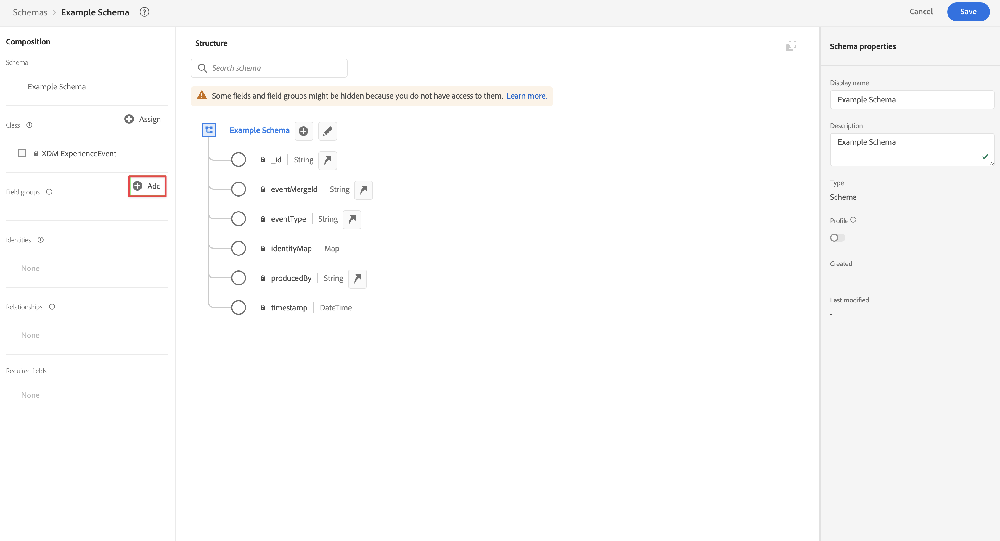
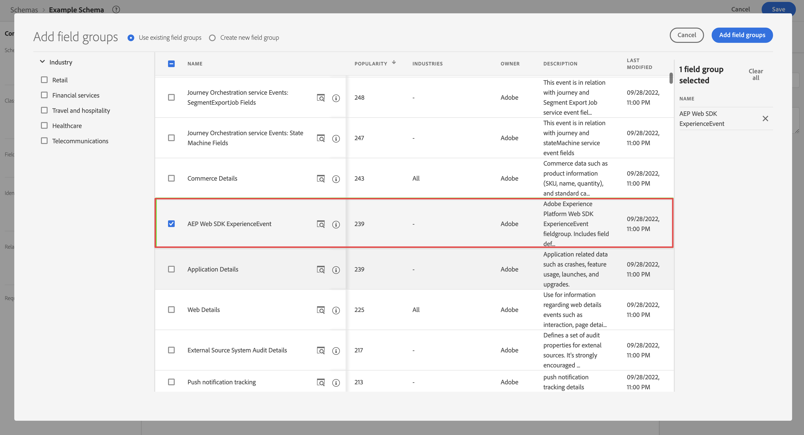
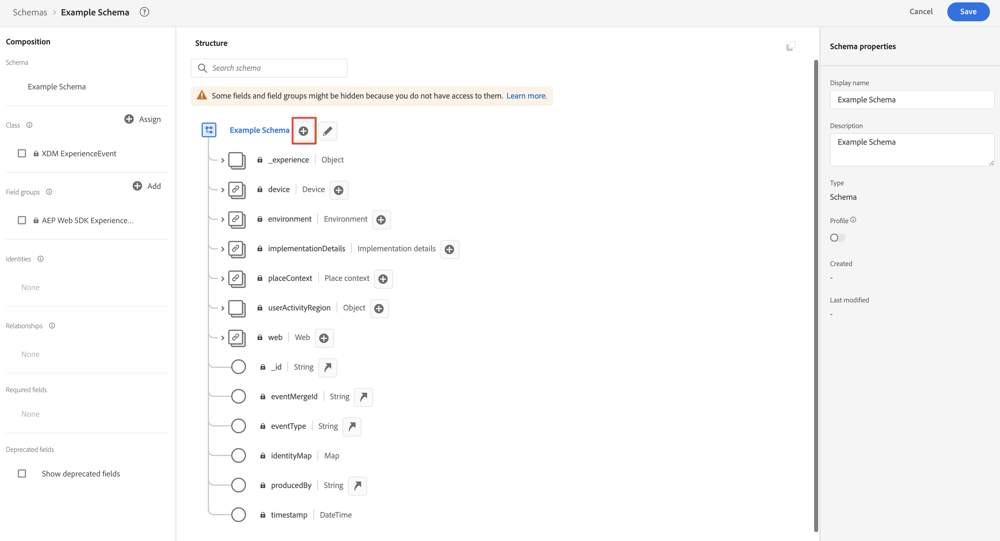
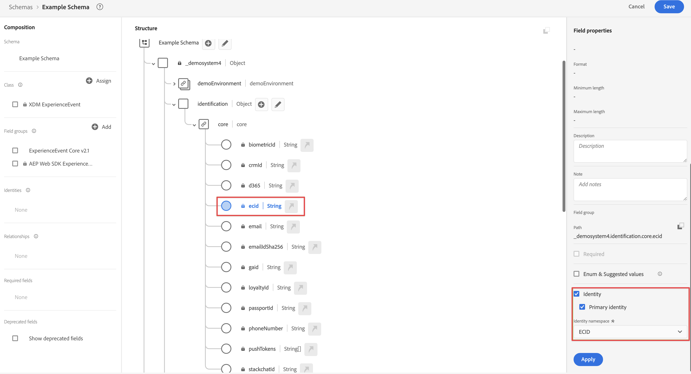
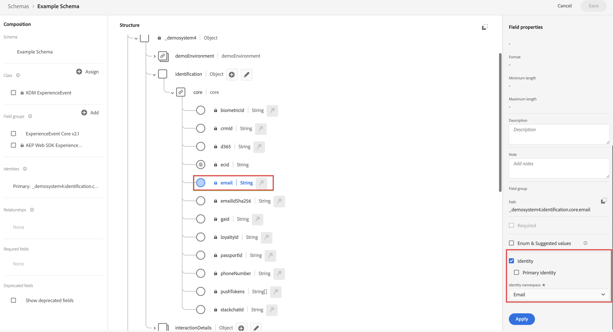

# Creación de un esquema XDM para utilizarlo con la implementación del SDK web de Customer Journey Analytics

>[!NOTE]
> 
>Siga los pasos de esta página solo después de completar todos los pasos de actualización anteriores. Puede seguir los [pasos de actualización recomendados](/help/getting-started/cja-upgrade/cja-upgrade-recommendations.md#recommended-upgrade-steps-for-most-organizations), o puede seguir los pasos de actualización que se generaron dinámicamente para su organización con el [cuestionario de actualización de Adobe Analytics a Customer Journey Analytics](https://gigazelle.github.io/cja-ttv/).
>
>Después de completar los pasos de esta página, siga los pasos de actualización recomendados o los pasos de actualización generados dinámicamente.

>[!IMPORTANT]
>
>Antes de empezar a crear el esquema XDM, trabaje con su equipo de datos y otras partes interesadas de toda la organización para identificar el diseño de esquema ideal de su organización para Customer Journey Analytics y las demás aplicaciones de Adobe Experience Platform que utilice. Para obtener más información, vea [Arquitectar su esquema para utilizarlo con el Customer Journey Analytics](/help/getting-started/cja-upgrade/cja-upgrade-schema-architect.md).

Adobe recomienda crear un esquema de modelo de datos de experiencia (XDM) personalizado al actualizar a Customer Journey Analytics. Un esquema personalizado permite un esquema optimizado que se adapta a las necesidades de su organización y a las aplicaciones de Platform específicas que utiliza. Cuando es necesario realizar cambios en el esquema, no es necesario rebuscar entre miles de campos no utilizados para encontrar el campo que requiere actualización.

## Creación del esquema

El esquema XDM definido representa el modelo de los datos que recopila en Adobe Experience Platform.

Para crear un esquema personalizado:

<!-- Should we single source this instead of duplicate it? The following steps were copied from: /help/data-ingestion/aepwebsdk.md-->

1. En Adobe Experience Platform, en el carril izquierdo, seleccione **[!UICONTROL Esquemas]** en [!UICONTROL ADMINISTRACIÓN DE DATOS].

1. Seleccione **[!UICONTROL Crear esquema]**.

1. En el paso **[!UICONTROL Seleccionar una clase]** del asistente Crear esquema:

   1. Seleccione **[!UICONTROL Evento de experiencia]**.

      

      >[!INFO]
      >
      >    Se usa un esquema de Experience Event para modelar el _comportamiento_ de un perfil (como el nombre de la escena, el botón secundario para agregar al carro de compras). Se utiliza un esquema de perfil individual para modelar los _atributos_ del perfil (como nombre, correo electrónico o sexo).

   1. Seleccione **[!UICONTROL Siguiente]**.

1. En el [!UICONTROL paso Nombre y revisión] del asistente [!UICONTROL Crear esquema]:

   1. Escriba un **[!UICONTROL nombre para mostrar en el esquema]** y (opcional) una **[!UICONTROL Descripción]**.

      

   1. Seleccione **[!UICONTROL Finalizar]**.

1. Agregue todos los grupos de campos que contengan cualquier campo que desee incluir en el esquema.

   Los grupos de campos son colecciones reutilizables de objetos y atributos que le permiten ampliar fácilmente su esquema.

   1. En la sección **[!UICONTROL Grupos de campos]**, seleccione **[!UICONTROL + Agregar]**.

      

   1. En el cuadro de diálogo [!UICONTROL Agregar grupos de campos], seleccione el grupo de campos **[!UICONTROL ExperienceEvent del SDK web de AEP]** en la lista.

      

      Puede seleccionar el botón de vista previa para ver una vista previa de los campos que forman parte de este grupo de campos, como `web > webPageDetails > name`.

      

      Seleccione **[!UICONTROL Atrás]** para cerrar la vista previa.

   1. (Opcional) Seleccione los grupos de campos adicionales que desee incluir.

   1. Seleccione **[!UICONTROL Agregar grupos de campos]**.

1. (Opcional) Si tiene campos personalizados que desea incluir en el esquema, cree un grupo de campos personalizados y agréguelos al grupo de campos.

   1. En la sección **[!UICONTROL Grupos de campos]**, seleccione **[!UICONTROL + Agregar]**.

      

   1. En el cuadro de diálogo [!UICONTROL Agregar grupos de campos], seleccione **[!UICONTROL Crear nuevo grupo de campos]**.

   1. Especifique un nombre para mostrar y una descripción opcional y, a continuación, seleccione **[!UICONTROL Agregar grupos de campos]**.

1. Seleccione **[!UICONTROL +]** junto al nombre del esquema en el panel [!UICONTROL Estructura].

   

1. En el panel [!UICONTROL Propiedades de campo], introduzca `Identification` como nombre, **[!UICONTROL Identificación]** como [!UICONTROL Nombre para mostrar], seleccione **[!UICONTROL Objeto]** como [!UICONTROL Tipo] y seleccione **[!UICONTROL ExperienceEvent Core v2.1]** como [!UICONTROL Grupo de campos].

   >[!NOTE]
   >
   >Si ese grupo de campos no está disponible, busque otro grupo de campos que contenga campos de identidad. O [cree un nuevo grupo de campos](https://experienceleague.adobe.com/docs/experience-platform/xdm/ui/resources/field-groups.html) y [agregue nuevos campos de identidad](https://experienceleague.adobe.com/docs/experience-platform/xdm/ui/fields/identity.html#define-a-identity-field) (como `ecid`, `crmId` y otros que necesite) al grupo de campos y seleccione ese nuevo grupo de campos.

   

   El objeto de identificación agrega capacidades de identificación al esquema. En su caso, desea identificar los perfiles que visitan el sitio mediante el ID de Experience Cloud y la dirección de correo electrónico. Hay muchos otros atributos disponibles para rastrear la identificación de su persona (por ejemplo, ID de cliente, ID de fidelidad).

   Seleccione **[!UICONTROL Aplicar]** para agregar este objeto al esquema.

1. Seleccione el campo **[!UICONTROL ECID]** en el objeto de identificación que acaba de agregar y seleccione **[!UICONTROL Identidad]**, **[!UICONTROL Identidad principal]** y **[!UICONTROL ECID]** en la lista de [!UICONTROL Área de nombres de identidad] en el panel derecho.

   

   Está especificando la identidad de Experience Cloud como la identidad principal que el servicio de identidad de Adobe Experience Platform puede utilizar para combinar (unir) el comportamiento de los perfiles con el mismo ECID.

   Seleccione **[!UICONTROL Aplicar]**. Verá que aparece un icono de huella digital en el atributo de ECID.

1. Seleccione el campo de **[!UICONTROL correo electrónico]** en el objeto de identificación que acaba de añadir y seleccione **[!UICONTROL Identidad]** y **[!UICONTROL Correo electrónico]** en la lista de [!UICONTROL Área de nombres de identidad] del panel [!UICONTROL Propiedades de campo].

   

   Está especificando la dirección de correo electrónico como otra identidad que el servicio de identidad de Adobe Experience Platform puede utilizar para combinar (unir) el comportamiento de los perfiles.

   Seleccione **[!UICONTROL Aplicar]**. Verá que aparece un icono de huella digital en el atributo de correo electrónico.

   Seleccione **[!UICONTROL Guardar]**.

1. (Opcional) Si desea integrar Customer Journey Analytics con RTCDP, seleccione el elemento raíz del esquema que muestra el nombre del esquema y, a continuación, seleccione el conmutador **[!UICONTROL Perfil]**.

   Se le pedirá que habilite el esquema para el perfil. Tras la habilitación, cuando los datos se incorporan en conjuntos de datos basados en este esquema, los datos se combinan en el perfil del cliente en tiempo real.

   Consulte [Habilitar el esquema para utilizarlo en el perfil del cliente en tiempo real](https://experienceleague.adobe.com/docs/experience-platform/xdm/tutorials/create-schema-ui.html#profile) para obtener más información.

   >[!IMPORTANT]
   >
   >Después de habilitar un esquema para el perfil, no se puede deshabilitar para el perfil.

   

1. Seleccione **[!UICONTROL Guardar]** para guardar el esquema.

   Ha creado un esquema mínimo que modela los datos que puede capturar del sitio web. El esquema permite identificar perfiles mediante la identidad de Experience Cloud y la dirección de correo electrónico. Al habilitar el esquema para el perfil, se asegura de que los datos capturados del sitio web se agregan al perfil del cliente en tiempo real.

   Junto a los datos de comportamiento, también puede capturar datos de atributos de perfil de su sitio (por ejemplo, detalles de perfiles que se subscriben a un boletín informativo).

   Para capturar estos datos de perfil, debe hacer lo siguiente:

   * Crear un esquema basado en la clase Perfil individual XDM.

   * Agregar el grupo de campos Profile Core v2 al esquema.

   * Agregar un objeto de identificación basado en el grupo de campos Profile Core v2.

   * Defina el ID de Experience Cloud como identificador principal y el correo electrónico como identificador.

   * Habilitar el esquema para el perfil

   Consulte [Crear y editar esquemas en la interfaz de usuario](https://experienceleague.adobe.com/docs/experience-platform/xdm/ui/resources/schemas.html?lang=es) para obtener más información sobre cómo agregar y quitar grupos de campos y campos individuales a un esquema.

1. Siga los [pasos de actualización recomendados](/help/getting-started/cja-upgrade/cja-upgrade-recommendations.md#recommended-upgrade-steps-for-most-organizations) o los [pasos de actualización generados dinámicamente](https://gigazelle.github.io/cja-ttv/).
