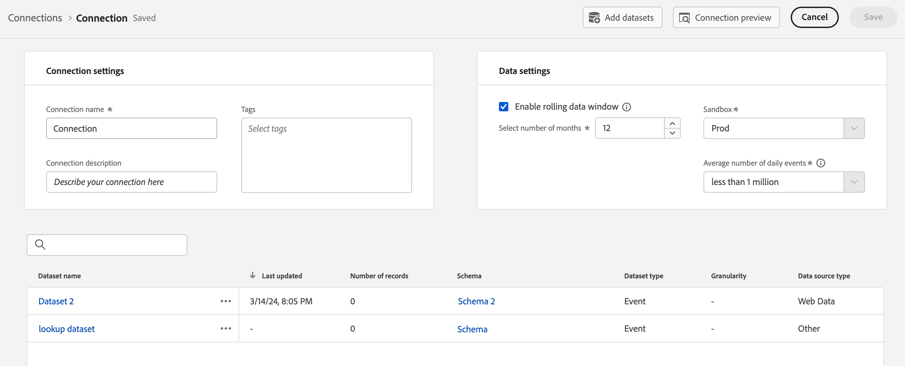
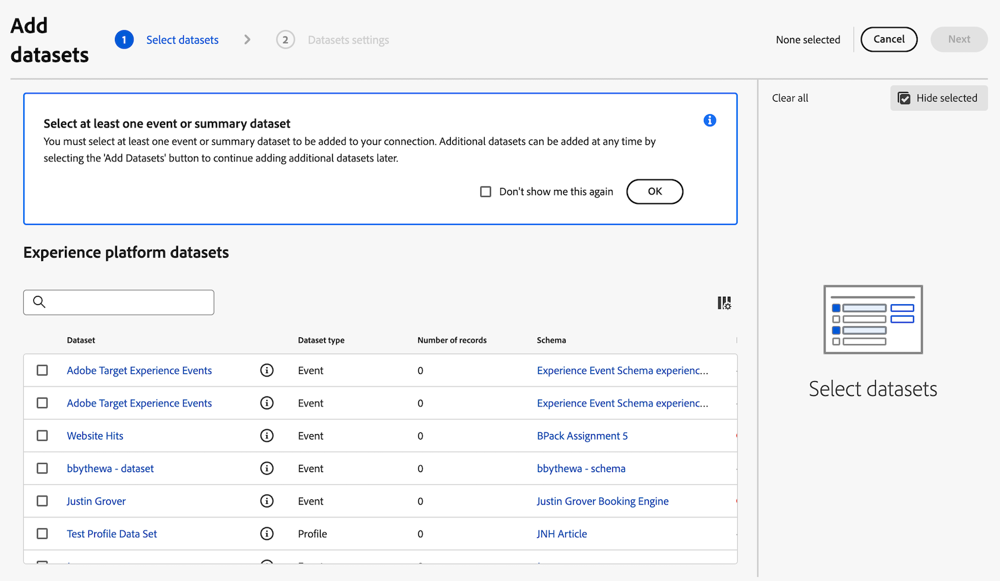
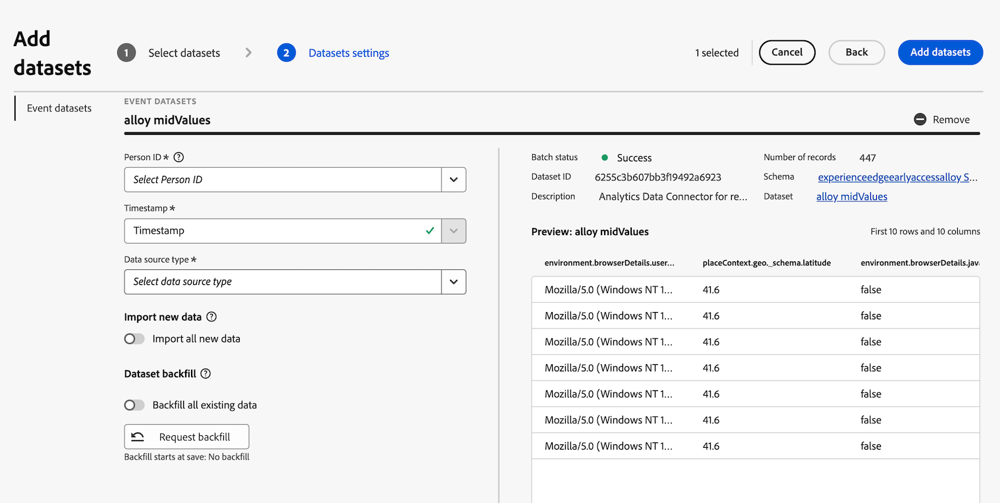

# Adición del conjunto de datos del conector de origen de Analytics a la conexión {#upgrade-source-connector-dataset}

<!-- markdownlint-disable MD034 -->

>[!CONTEXTUALHELP]
>id="cja-upgrade-source-connector-dataset"
>title="Añadir el conjunto de datos del conector de origen de Analytics a la conexión"
>abstract="Ahora que los datos históricos del grupo de informes de Analytics se encuentran en Adobe Experience Platform, agregue ese conjunto de datos a la conexión existente que creó al configurar inicialmente Customer Journey Analytics. Una vez completado este paso, los datos históricos de Customer Journey Analytics están disponibles.  Agregar un conjunto de datos a una conexión en Customer Journey Analytics es sencillo y tarda solo unos minutos en completarse."

<!-- markdownlint-enable MD034 -->

>[!NOTE]
> 
>Siga los pasos de esta página solo después de completar todos los pasos de actualización anteriores. Puede seguir los [pasos de actualización recomendados](/help/getting-started/cja-upgrade/cja-upgrade-recommendations.md#recommended-upgrade-steps-for-most-organizations), o puede seguir los pasos de actualización que se generaron dinámicamente para su organización con el [cuestionario de actualización de Adobe Analytics a Customer Journey Analytics](https://gigazelle.github.io/cja-ttv/).
>
>Después de completar los pasos de esta página, siga los pasos de actualización recomendados o los pasos de actualización generados dinámicamente.

## Descubra cómo el conector de origen de Analytics puede llevar datos históricos a Customer Journey Analytics

Puede utilizar el conector de origen de Analytics para incorporar datos del grupo de informes de Adobe Analytics a Adobe Experience Platform. Estos datos se pueden utilizar como datos históricos en Customer Journey Analytics.

Este proceso supone que desea [crear un esquema XDM al actualizar a Customer Journey Analytics](/help/getting-started/cja-upgrade/cja-upgrade-schema-create.md), ya que desea un esquema optimizado que se adapte a las necesidades de su organización y a las aplicaciones de Platform específicas que utiliza.

Para utilizar el conector de origen de Analytics para introducir datos históricos en Customer Journey Analytics, debe:

1. [Creación de un esquema XDM para el conector de origen de Analytics](/help/getting-started/cja-upgrade/cja-upgrade-source-connector-schema.md)

1. Si aún no tiene un conector de origen de Analytics, [cree el conector de origen de Analytics y asigne campos de al esquema XDM](/help/getting-started/cja-upgrade/cja-upgrade-source-connector.md).

   O

   Si ya tiene un conector de origen de Analytics, [asigne campos del conector de origen al esquema XDM](/help/getting-started/cja-upgrade/cja-upgrade-from-source-connector.md).

1. Agregue el conjunto de datos del conector de origen de Analytics a la conexión, como se describe a continuación.

## Adición del conjunto de datos del conector de origen de Analytics a la conexión

Después de [crear un conector de origen de Analytics para los datos históricos](/help/getting-started/cja-upgrade/cja-upgrade-source-connector.md), se crea automáticamente un conjunto de datos para los datos de Analytics.

Debe agregar este conjunto de datos creado automáticamente a la misma conexión que creó para su implementación de Web SDK. Al hacerlo, los datos de Analytics pasan a la misma vista de datos en Customer Journey Analytics que los datos de SDK web.

Para agregar el conjunto de datos creado automáticamente a la misma conexión creada para la implementación de Web SDK:

1. En Customer Journey Analytics, seleccione la pestaña **[!UICONTROL Conexiones]**.

1. Seleccione la conexión que [creó para su implementación de Web SDK](/help/getting-started/cja-upgrade/cja-upgrade-connection.md).

1. Seleccione **[!UICONTROL Editar]**.

   

1. Seleccione **[!UICONTROL Agregar conjuntos de datos]** en la esquina superior derecha.

   

1. Desplácese hasta el conjunto de datos que se creó automáticamente al crear el conector de origen de Analytics o búsquelo.

   El nombre de este conjunto de datos es el nombre del grupo de informes, seguido de `midValues`. Por ejemplo: `My report suite midValues`

1. Seleccione la casilla de verificación situada junto al nombre del conjunto de datos y, a continuación, seleccione **[!UICONTROL Siguiente]**.

   

1. Especifique la siguiente información:

   <!-- Copied from help/connections/create-connection.md. Should we single source? -->

   | Configuración | Descripción |
   | --- | --- |
   | **[!UICONTROL ID de la persona]** | Solo disponible para conjuntos de datos de evento y perfil. Seleccione un ID de persona en la lista desplegable de identidades disponibles. Estas identidades se definieron en el esquema del conjunto de datos en Experience Platform. Consulte a continuación para obtener información sobre cómo usar el mapa de identidad como ID de persona.
Si no hay ningún ID de persona para elegir, significa que uno o más ID de persona no se han definido en el esquema. Consulte [Definición de campos de identidad en la IU](https://experienceleague.adobe.com/es/docs/experience-platform/xdm/ui/fields/identity) para obtener más información. 
El valor del ID de persona seleccionado se considera que distingue entre mayúsculas y minúsculas. Por ejemplo, `abc123` y `ABC123` son dos valores diferentes. |
   | **[!UICONTROL Marca de tiempo]** | Solo para conjuntos de datos de evento y resumen, esta configuración se establece automáticamente en el campo de marca de tiempo predeterminado de esquemas basados en eventos en Experience Platform. |
   | **[!UICONTROL Zona horaria]** | Solo disponible para datos de resumen. Seleccione la zona horaria adecuada para los datos de resumen de las series temporales. |
   | **[!UICONTROL Tipo de fuente de datos]** | Seleccione un tipo de fuente de datos.  Los tipos de fuentes de datos incluyen los siguientes: <ul><li>[!UICONTROL Datos web]</li><li>[!UICONTROL Datos de aplicación móvil]</li><li>[!UICONTROL Datos POS]</li><li>[!UICONTROL Datos CRM]</li><li>[!UICONTROL Datos de las encuestas]</li><li>[!UICONTROL Datos de centro de llamadas]</li><li>[!UICONTROL Datos del producto]</li><li> [!UICONTROL Datos de cuentas]</li><li> [!UICONTROL Datos de transacción]</li><li>[!UICONTROL Datos de valoraciones del cliente]</li><li> [!UICONTROL Otro]</li></ul>Este campo se utiliza para estudiar los tipos de fuentes de datos que se utilizan. |

   {style="table-layout:auto"}

1. En la sección **[!UICONTROL Importar datos nuevos]**, deje deshabilitada la opción **[!UICONTROL Importar todos los datos nuevos]**.

   Como está utilizando el conjunto de datos del conector de origen de Analytics para datos históricos, no desea incluir datos futuros que se recopilen en este conjunto de datos.

1. En la sección **[!UICONTROL Relleno de conjuntos de datos]**, seleccione **[!UICONTROL Solicitar relleno]**.

1. Defina el período que desea que incluya el relleno de conexión en Customer Journey Analytics introduciendo las fechas de inicio y finalización o seleccionando el icono de calendario .

   Sea explícito al especificar las fechas que solicita para el relleno. Según varios factores, es posible que desee realizar cualquiera de las siguientes acciones:

   * Elija una fecha de finalización que sea la misma fecha que cuando empezó a recopilar datos con la implementación de Web SDK.

   * Elija una fecha de finalización que sea poco después de la fecha en la que empezó a recopilar datos con la implementación de Web SDK y, a continuación, utilice segmentos de vista de datos para filtrar los datos superpuestos.

   * Elija una fecha de finalización que resulte en una mayor superposición de datos y, a continuación, utilice segmentos de vista de datos para filtrar los datos superpuestos.

     **Nota:** Esta opción aumentaría los costos porque habría más filas en la conexión.

   <!-- Include any of the following?  Make sure you're explicit as to the dates you request backfill to. You want to request it to the date that you start gathering data with your Web SDK implementation. Also possibly include segments for any overlapping date. So you could request everything and then use a segment to exclude data that you don't want. That way if you need to move up the date, then you could change the date in the filter. Downside would be that you might pay for double rows.  When they do that, they're going to see all schema fields from both their custom schema and their Analytics schema. So they'll need to be cognizant to select the right fields, and never select any Analytics fields, because they will be mapped as part of the source connector. Never select any Analytics field group fields because they'll be mapped.  -->

1. Seleccionar **[!UICONTROL relleno de cola]**.

1. Seleccione **[!UICONTROL Agregar conjuntos de datos]** y, a continuación, seleccione **[!UICONTROL Guardar]** para guardar la conexión.

1. (Condicional) Si utiliza conjuntos de datos de búsqueda, debe crear el conjunto de datos de búsqueda y agregarlo a la conexión. Para obtener más información, consulte [Crear conjuntos de datos de búsqueda para clasificar datos en Customer Journey Analytics](/help/getting-started/cja-upgrade/cja-upgrade-dataset-lookup.md).

   Esto solo es necesario si aún no lo ha hecho al configurar la implementación de Web SDK.

1. Siga los [pasos de actualización recomendados](/help/getting-started/cja-upgrade/cja-upgrade-recommendations.md#recommended-upgrade-steps-for-most-organizations) o los [pasos de actualización generados dinámicamente](https://gigazelle.github.io/cja-ttv/).
