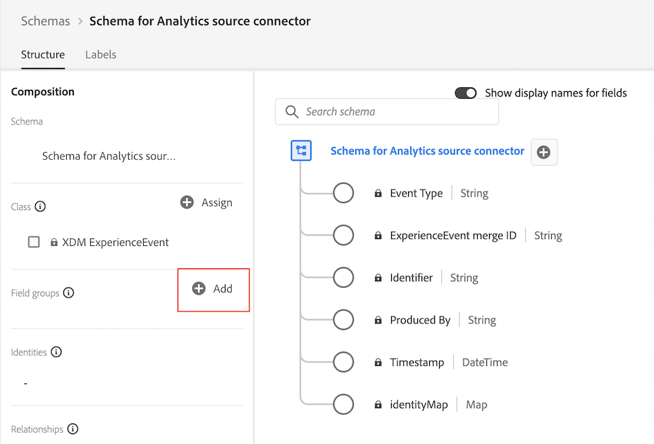
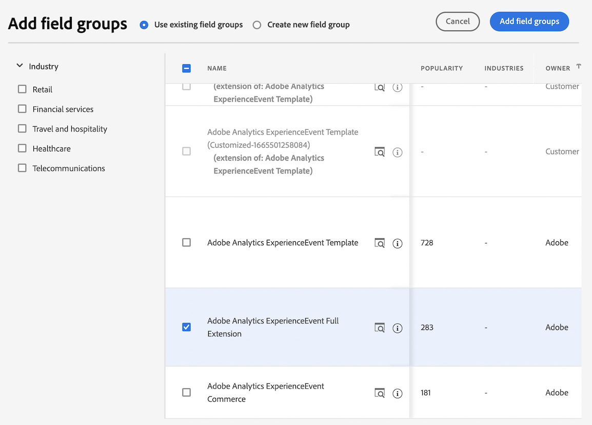

# Creación de un esquema personalizado para el conector de origen de Analytics {#create-custom-schema}

<!-- markdownlint-disable MD034 -->

>[!CONTEXTUALHELP]
>id="cja-upgrade-source-connector-create-schema"
>title="Creación de un esquema para el conector de origen de Analytics"
>abstract="Este esquema es una combinación del grupo de campos Adobe Analytics ExperienceEvent con todos los grupos de campos que conforman el esquema personalizado de su organización. Permite asignar los campos utilizados por el conector de origen de Analytics al esquema de su organización y solo se utiliza para los datos históricos.  Aunque es de tipo técnico, la creación de este esquema puede completarse en horas, posiblemente más rápido si sabe exactamente qué grupos de campos conforman el esquema personalizado de su organización."

<!-- markdownlint-enable MD034 -->

{{upgrade-note-step}}

## Descubra cómo el conector de origen de Analytics puede llevar datos históricos a Customer Journey Analytics

Puede utilizar el conector de origen de Analytics para incorporar datos del grupo de informes de Adobe Analytics a Adobe Experience Platform. Estos datos se pueden utilizar como datos históricos en Customer Journey Analytics.

Este proceso supone que desea [crear un esquema personalizado para utilizarlo con su implementación de Customer Journey Analytics Web SDK](/help/getting-started/cja-upgrade/cja-upgrade-schema-create.md), ya que desea un esquema optimizado que se adapte a las necesidades de su organización y a las aplicaciones específicas de Platform que utiliza.

Para utilizar el conector de origen de Analytics para introducir datos históricos en Customer Journey Analytics, debe:

1. Cree un esquema personalizado para el conector de origen de Analytics, como se describe a continuación.

1. Si todavía no tiene un conector de origen de Analytics, [cree el conector de origen de Analytics y asigne campos a su esquema personalizado](/help/getting-started/cja-upgrade/cja-upgrade-source-connector.md).

   O

   Si ya tiene un conector de origen de Analytics, [asigne campos del conector de origen al esquema XDM](/help/getting-started/cja-upgrade/cja-upgrade-from-source-connector.md).

1. [Adición del conjunto de datos del conector de origen de Analytics a la conexión](/help/getting-started/cja-upgrade/cja-upgrade-source-connector-dataset.md)

## Creación de un esquema personalizado para el conector de origen de Analytics

Ya debería haber [creado un nuevo esquema personalizado](/help/getting-started/cja-upgrade/cja-upgrade-schema-create.md) para su implementación de Experience Platform Web SDK para usarlo con Customer Journey Analytics. Este esquema debe contener cualquier grupo de campos para los campos en los que planee recopilar datos.

Ahora debe utilizar esos mismos grupos de campos del esquema de Web SDK y agregarlos a un nuevo esquema que pueda utilizar con el conector de origen de Analytics.

Este esquema para el conector de origen de Analytics debe contener:

* Todos los grupos de campos (incluidos los grupos de campos personalizados que haya creado) que se incluyen en el esquema personalizado que ha creado para la implementación de Web SDK. (Todos los campos personalizados que no formen parte de un grupo de campos predeterminado deberían haberse agregado al esquema de Web SDK como parte de un grupo de campos personalizados).

* El grupo de campos Plantilla de Adobe Analytics ExperienceEvent

Para crear el esquema personalizado que se utilizará con el conector de origen de Analytics:

1. En Adobe Experience Platform, empiece a crear un nuevo esquema personalizado como se describe en [Cree un esquema personalizado para utilizarlo con su implementación de Customer Journey Analytics Web SDK](/help/getting-started/cja-upgrade/cja-upgrade-schema-create.md).

1. Añada todos los grupos de campos (incluidos los grupos de campos personalizados) que se incluyen en el esquema creado para la implementación de Web SDK.

1. Cuando termine de agregar estos grupos de campos, agregue el grupo de campos Adobe Analytics ExperienceEvent:

   En la sección **[!UICONTROL Grupos de campos]**, seleccione **[!UICONTROL Agregar]** para agregar un grupo de campos adicional.

   

1. Busque y seleccione el grupo de campos **[!UICONTROL Plantilla de Adobe Analytics ExperienceEvent]**.

   

1. Seleccione **[!UICONTROL Agregar grupos de campos]**.

1. Seleccione **[!UICONTROL Guardar]** para guardar el esquema.

{{upgrade-final-step}}
