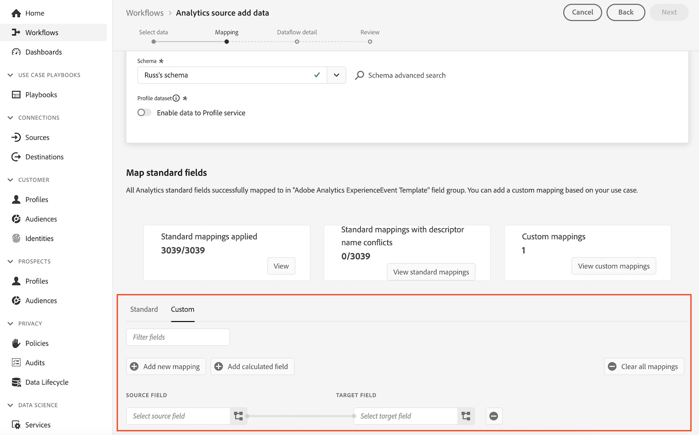
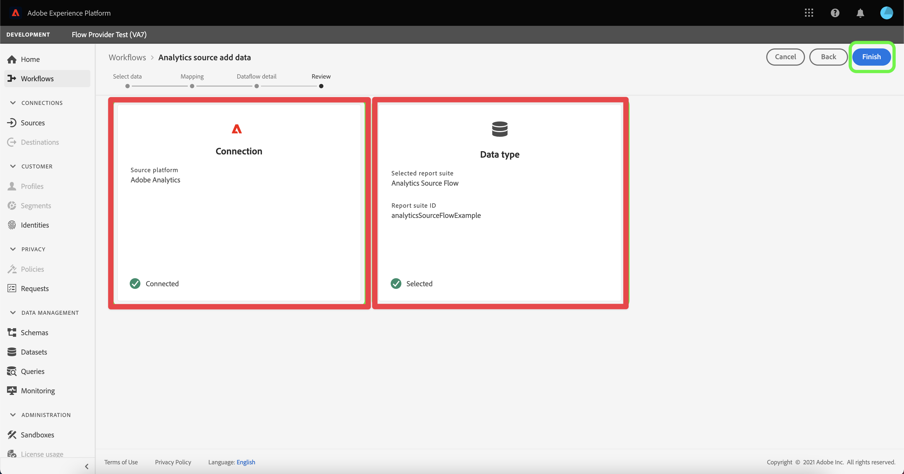

# Creación del conector de origen de Analytics y asignación de campos

>[!NOTE]
> 
>Siga los pasos de esta página solo después de completar todos los pasos de actualización anteriores. Puede seguir los [pasos de actualización recomendados](/help/getting-started/cja-upgrade/cja-upgrade-recommendations.md#recommended-upgrade-steps-for-most-organizations), o puede seguir los pasos de actualización que se generaron dinámicamente para su organización con el [cuestionario de actualización de Adobe Analytics a Customer Journey Analytics](https://gigazelle.github.io/cja-ttv/).
>
>Después de completar los pasos de esta página, siga los pasos de actualización recomendados o los pasos de actualización generados dinámicamente.

## Descubra cómo el conector de origen de Analytics puede llevar datos históricos a Customer Journey Analytics

Puede utilizar el conector de origen de Analytics para incorporar datos del grupo de informes de Adobe Analytics a Adobe Experience Platform. Estos datos se pueden utilizar como datos históricos en Customer Journey Analytics.

Este proceso supone que desea [crear un esquema personalizado para utilizarlo con la implementación del SDK web de Customer Journey Analytics](/help/getting-started/cja-upgrade/cja-upgrade-schema-create.md), ya que desea un esquema optimizado que se adapte a las necesidades de su organización y a las aplicaciones específicas de Platform que utiliza.

Para utilizar el conector de origen de Analytics para llevar los datos históricos a Customer Journey Analytics, debe:

1. [Creación de un esquema personalizado para el conector de origen de Analytics](/help/getting-started/cja-upgrade/cja-upgrade-source-connector-schema.md)

1. Si aún no tiene un conector de origen de Analytics, cree el conector de origen de Analytics y asigne campos de al esquema del SDK web personalizado, como se describe a continuación.

   O

   Si ya tiene un conector de origen de Analytics, [asigne campos del conector de origen al esquema personalizado del SDK web](/help/getting-started/cja-upgrade/cja-upgrade-from-source-connector.md).

1. [Adición del conjunto de datos del conector de origen de Analytics a la conexión](/help/getting-started/cja-upgrade/cja-upgrade-source-connector-dataset.md)

## Creación del conector de origen de Analytics y asignación de campos

Con el esquema personalizado creado, debe crear el conector de origen de Adobe Analytics para utilizarlo con los datos históricos. (Para obtener instrucciones generales más completas sobre cómo crear un conector de origen, consulte [Crear una conexión de origen de Adobe Analytics en la interfaz de usuario](https://experienceleague.adobe.com/docs/experience-platform/sources/ui-tutorials/create/adobe-applications/analytics.html?lang=es)).

Para crear un conector de origen de Adobe Analytics para utilizarlo con datos históricos:

1. En la interfaz de usuario de Platform, en la sección **[!UICONTROL Conexiones]** del carril izquierdo, seleccione **[!UICONTROL Fuentes]**.

1. Seleccione **[!UICONTROL Aplicaciones de Adobe]** en la lista de [!UICONTROL CATEGORÍAS].

1. Seleccione **[!UICONTROL Agregar datos]** en el mosaico de Adobe Analytics.

   

1. Seleccione **[!UICONTROL Grupo de informes]** y, a continuación, en la lista de grupos de informes, seleccione el grupo de informes que contiene los datos históricos que desea utilizar en Customer Journey Analytics.

   

1. Seleccione **[!UICONTROL Siguiente]** en la esquina superior derecha de la pantalla.

1. Seleccione **[!UICONTROL Esquema personalizado]** y, a continuación, seleccione el esquema que creó en [Crear un esquema personalizado que incluya el grupo de campos de Adobe Analytics](/help/getting-started/cja-upgrade/cja-upgrade-source-connector-schema.md). <!-- Deleted this, because I changed this from choosing the default schemawe're pointing them now at the schema they just created: "Adobe Experience Platform  automatically creates the schema and the corresponding dataset to map all standard fields from the selected Adobe Analytics report suite." -->

   <!-- add screenshot -->

1. Asigne cada dimensión de Adobe Analytics a una dimensión de esquema personalizada.

   1. En la sección **[!UICONTROL Asignar campos estándar]**, seleccione la pestaña **[!UICONTROL Personalizado]**.

   1. Seleccione **[!UICONTROL Agregar nueva asignación]**.

   

   1. En el **[!UICONTROL campo Source]**, seleccione un campo Adobe Analytics del grupo de campos Plantilla de Adobe Analytics ExperienceEvent. A continuación, en el **[!UICONTROL campo de destino]**, seleccione el campo personalizado en el esquema XDM al que desea asignarlo.

      No todos los campos de Adobe Analytics tienen un campo correspondiente en XDM debido a las diferencias de arquitectura inherentes entre AppMeasurement y XDM.

   1. Repita este proceso para cada campo del grupo de campos Plantilla de Adobe Analytics ExperienceEvent que esté utilizando para recopilar datos en Adobe Analytics.

1. Seleccione **[!UICONTROL Siguiente]** en la esquina superior derecha de la pantalla.

1. Asigne un nombre al flujo de datos y (opcionalmente) proporcione una descripción.

   

1. Seleccione **[!UICONTROL Siguiente]** en la esquina superior derecha de la pantalla.

1. Revise la conexión y, a continuación, seleccione **[!UICONTROL Finalizar]**.

   

   Una vez creada la conexión, el flujo de datos se crea automáticamente para rellenar un conjunto de datos con los datos de Adobe Analytics del grupo de informes. El flujo de datos ingiere hasta 13 meses de datos históricos para las zonas protegidas de producción. El relleno en zonas protegidas que no sean de producción está limitado a tres meses.

   Si utiliza el conector de origen de Analytics para incorporar datos históricos a la implementación del SDK web de Customer Journey Analytics, debe agregar este conjunto de datos creado automáticamente a la conexión que creó para la implementación del SDK web.

1. Siga los [pasos de actualización recomendados](/help/getting-started/cja-upgrade/cja-upgrade-recommendations.md#recommended-upgrade-steps-for-most-organizations) o los [pasos de actualización generados dinámicamente](https://gigazelle.github.io/cja-ttv/).
