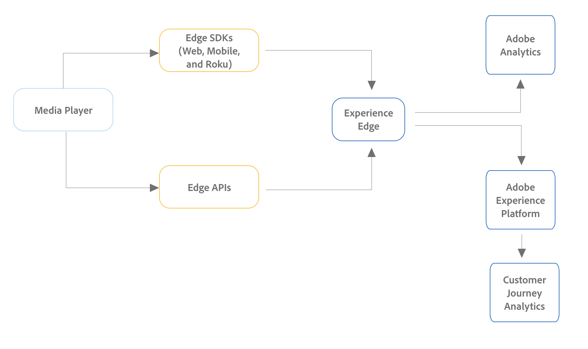
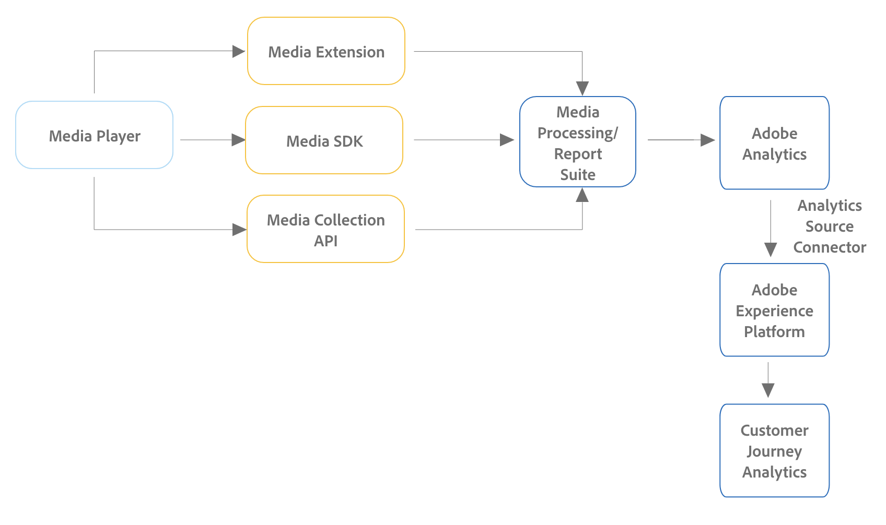

# Configuración de la recopilación de medios de streaming para Customer Journey Analytics {#streaming-media-setup}

<!-- markdownlint-disable MD034 -->

>[!CONTEXTUALHELP]
>id="cja-upgrade-media-edge"
>title="Configuración e implementación de Media Edge"
>abstract="Puede configurar la recopilación de medios de streaming de Adobe para que utilice Experience Platform Edge a fin de que los datos estén disponibles en Customer Journey Analytics."

<!-- markdownlint-enable MD034 -->

{{upgrade-note-step}}

Los pasos para implementar la recopilación de medios de streaming en Customer Journey Analytics difieren según la implementación actual de la recopilación de medios de streaming en Adobe Analytics.

La recopilación de medios de streaming se puede implementar en Adobe Analytics de cualquiera de las siguientes maneras:

* [Implementaciones de Edge Network para la recopilación de medios de streaming](#edge-network-implementations)

+++ Ver infografía

  

+++

* [Implementaciones solo de Adobe Analytics para la colección de medios de streaming](#adobe-analytics-only-implementations)

+++ Ver infografía

  

+++

Para obtener más información sobre las diferencias entre estos métodos de implementación, consulte [Implementar la recopilación de medios de streaming](https://experienceleague.adobe.com/en/docs/media-analytics/using/implementation/overview) en la Guía de recopilación de medios de streaming.

## Implementaciones de Edge Network para la recopilación de medios de streaming

Si la recopilación de medios de streaming está [implementada con Edge Network en su implementación de Adobe Analytics](https://experienceleague.adobe.com/en/docs/media-analytics/using/implementation/overview#edge-implementation-methods), significa que algunos pasos necesarios para actualizar la recopilación de medios de streaming a Customer Journey Analytics ya se han completado como parte de su implementación de Adobe Analytics. A continuación se indican los pasos completados:

* [Configurar el esquema en Adobe Experience Platform](https://experienceleague.adobe.com/en/docs/media-analytics/using/implementation/edge-recommended/media-edge-sdk/implementation-edge#set-up-the-schema-in-adobe-experience-platform)

* [Crear un conjunto de datos en Adobe Experience Platform](https://experienceleague.adobe.com/en/docs/media-analytics/using/implementation/edge-recommended/media-edge-sdk/implementation-edge#create-a-dataset-in-adobe-experience-platform)

* [Configurar una secuencia de datos en Adobe Experience Platform](https://experienceleague.adobe.com/en/docs/media-analytics/using/implementation/edge-recommended/media-edge-sdk/implementation-edge#configure-a-datastream-in-adobe-experience-platform)

Es necesario completar los siguientes pasos adicionales como parte de la actualización a Customer Journey Analytics:

>[!NOTE]
>
>A medida que complete los pasos de actualización de Customer Journey Analytics, asegúrese de utilizar el esquema, el conjunto de datos y la secuencia de datos de su implementación de recopilación de medios de streaming en Adobe Analytics.

* [Crear una conexión en Customer Journey Analytics](/help/getting-started/cja-upgrade/cja-upgrade-connection.md)

* [Cree una vista de datos en Customer Journey Analytics](/help/getting-started/cja-upgrade/cja-upgrade-dataview.md)

## Implementaciones solo de Adobe Analytics para la colección de medios de streaming

Si la recopilación de medios de streaming está [implementada usando una implementación solo de Adobe Analytics en su entorno de Adobe Analytics](https://experienceleague.adobe.com/en/docs/media-analytics/using/implementation/overview#adobe-analytics-only-implementation-methods), los datos de medios de streaming aún no se dirigen a Edge Network.

A medida que crea el esquema, el conjunto de datos, el flujo de datos, la conexión y la vista de datos como parte de la actualización de Adobe Analytics a Customer Journey Analytics, realice las siguientes selecciones para tener en cuenta los datos de recopilación de medios de streaming:

* Al crear el esquema para Customer Journey Analytics, incluya el grupo de campos `MediaAnalytics Interaction Details`.

  Para obtener más información sobre cómo agregar este grupo de campos, consulte [Configurar el esquema en Adobe Experience Platform](https://experienceleague.adobe.com/en/docs/media-analytics/using/implementation/edge-recommended/media-edge-sdk/implementation-edge#set-up-the-schema-in-adobe-experience-platform) en la Guía de recopilación de medios de streaming.

  Para obtener información acerca de cómo crear el esquema, vea [Crear un esquema personalizado para utilizarlo con Customer Journey Analytics](/help/getting-started/cja-upgrade/cja-upgrade-schema-create.md).

* Al configurar la secuencia de datos para Customer Journey Analytics, habilite Media Analytics.

  Para obtener más información sobre cómo habilitar esta opción, consulte [Configuración de un conjunto de datos en Adobe Experience Platform](https://experienceleague.adobe.com/en/docs/media-analytics/using/implementation/edge-recommended/media-edge-sdk/implementation-edge#configure-a-datastream-in-adobe-experience-platform) en la Guía de recopilación de medios de streaming.

  Para obtener información acerca de cómo crear la secuencia de datos, vea [Crear una secuencia de datos para usar con Customer Journey Analytics](/help/getting-started/cja-upgrade/cja-upgrade-datastream.md).

* Al crear una vista de datos para Customer Journey Analytics, incluya los campos de esquema necesarios para la recopilación de medios de streaming.

  Asegúrese de asignar estos campos de esquema a los valores correctos en el objeto XDM.

  Para obtener más información sobre los campos obligatorios, consulte [Crear una vista de datos en Customer Journey Analytics](/help/getting-started/cja-upgrade/cja-upgrade-dataview.md) en la Guía de recopilación de medios de streaming.

  Para obtener información sobre cómo crear la vista de datos, consulte [Crear una vista de datos en Customer Journey Analytics](/help/getting-started/cja-upgrade/cja-upgrade-dataview.md).

