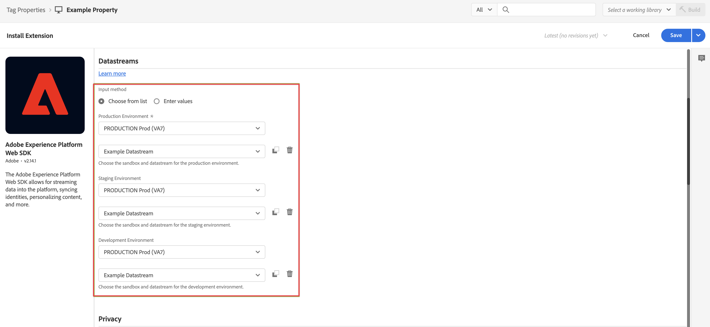

# Adición de la extensión del SDK web a la etiqueta {#upgrade-tag-extension}

<!-- markdownlint-disable MD034 -->

>[!CONTEXTUALHELP]
>id="cja-upgrade-tag-extension"
>title="Añadir la extensión del SDK web de Platform a la propiedad de etiqueta"
>abstract="Añada la extensión del SDK web de Adobe Experience Platform a la propiedad de etiqueta. Añadir la extensión del SDK web a la propiedad de etiqueta es más sencillo y solo tarda unos minutos en completarse."

<!-- markdownlint-enable MD034 -->

{{upgrade-note-step}}

Puede utilizar la función Etiquetas en Adobe Experience Platform para implementar código en el sitio para recopilar datos. Esta solución de administración de etiquetas le permite implementar código de junto con otros requisitos de etiquetado. Las etiquetas ofrecen una integración perfecta con Adobe Experience Platform mediante la extensión del SDK web de Adobe Experience Platform.

En la siguiente información se describe cómo agregar la extensión Web SDK a la etiqueta. Para obtener información adicional, consulte [Configuración de la extensión de etiquetas Web SDK](https://experienceleague.adobe.com/en/docs/experience-platform/tags/extensions/client/web-sdk/web-sdk-extension-configuration) en la documentación de Experience Platform. Web SDK incluye el [!UICONTROL servicio Adobe Experience Cloud ID] de forma nativa, por lo que no es necesario que agregue la extensión del servicio de ID a la etiqueta.

Después de [crear una etiqueta](/help/getting-started/cja-upgrade/cja-upgrade-tag-property.md), debe configurarla con la extensión Adobe Experience Platform Web SDK. Esto garantiza que pueda enviar datos a Adobe Experience Platform (a través de su conjunto de datos).

Para agregar la extensión Web SDK a la etiqueta:

1. Inicie sesión en experience.adobe.com con sus credenciales de Adobe ID.

1. En Adobe Experience Platform, vaya a **[!UICONTROL Recopilación de datos]** > **[!UICONTROL Etiquetas]**.

1. Seleccione la etiqueta recién creada de la lista de [!UICONTROL Propiedades de la etiqueta] para abrirla.

1. Seleccione **[!UICONTROL Extensiones]** en el carril izquierdo.

1. Seleccione **[!UICONTROL Catálogo]** en la barra superior.

1. Busque o desplácese hasta la **[!UICONTROL extensión de Adobe Experience Platform Web SDK]** y, a continuación, seleccione **[!UICONTROL Instalar]** para instalarla.

   

1. Seleccione la zona protegida y la secuencia de datos que ha creado anteriormente para su [!UICONTROL Entorno de producción], (opcionalmente) su [!UICONTROL Entorno de ensayo] y su [!UICONTROL Entorno de desarrollo].

   

1. Seleccione **[!UICONTROL Guardar]**.

1. Siga los [pasos de actualización recomendados](/help/getting-started/cja-upgrade/cja-upgrade-recommendations.md#recommended-upgrade-steps-for-most-organizations) o los [pasos de actualización generados dinámicamente](https://gigazelle.github.io/cja-ttv/).
