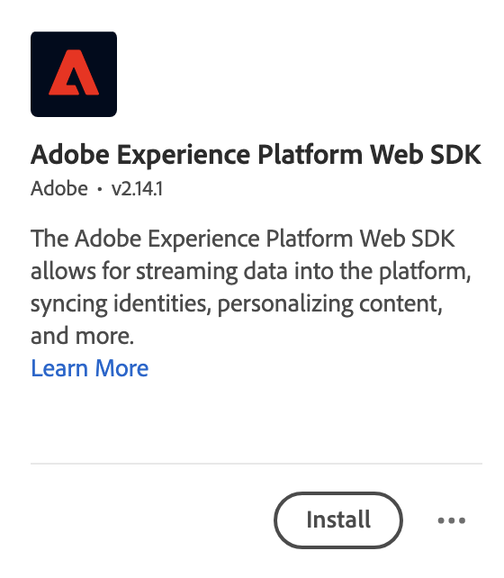

# Añada la extensión del SDK web a la etiqueta {#upgrade-tag-extension}

<!-- markdownlint-disable MD034 -->

>[!CONTEXTUALHELP]
>id="cja-upgrade-tag-extension"
>title="Añada la extensión del SDK web de Platform a su propiedad de etiqueta"
>abstract="Añada la extensión del SDK web de Adobe Experience Platform a su propiedad de etiqueta Añadir la extensión del SDK web a la propiedad de etiquetas es más sencillo y solo le llevará unos minutos."

<!-- markdownlint-enable MD034 -->

{{upgrade-note-step}}

Utilice la función Etiquetas de Adobe Experience Platform a fin de implementar código en el sitio para recopilar datos. Esta solución de administración de etiquetas le permite implementar código de junto con otros requisitos de etiquetado. Las etiquetas ofrecen una integración perfecta con Adobe Experience Platform mediante la extensión del SDK web de Adobe Experience Platform.

En la siguiente información se describe cómo añadir la extensión del SDK web a la etiqueta. Para obtener información adicional, consulte [Configuración de la extensión de la etiqueta del SDK web](https://experienceleague.adobe.com/es/docs/experience-platform/tags/extensions/client/web-sdk/web-sdk-extension-configuration) en la documentación de Experience Platform. Web SDK incluye el servicio de identidad de Experience Platform, por lo que no es necesario agregar la extensión del [!UICONTROL Servicio de Experience Cloud ID] a su etiqueta.

Después de [crear una etiqueta](/help/getting-started/cja-upgrade/cja-upgrade-tag-property.md), debe configurarla con la extensión del SDK web de Adobe Experience Platform. Esto garantiza que se puedan enviar datos a Adobe Experience Platform (a través de la secuencia de datos).

Para añadir la extensión del SDK web a la etiqueta:

1. Inicie sesión en experience.adobe.com con sus credenciales de Adobe ID.

1. En Adobe Experience Platform, vaya a **[!UICONTROL Recopilación de datos]** > **[!UICONTROL Etiquetas]**.

1. Seleccione la etiqueta recién creada de la lista de [!UICONTROL Propiedades de la etiqueta] para abrirla.

1. Seleccione **[!UICONTROL Extensiones]** en el carril izquierdo.

1. Seleccione **[!UICONTROL Catálogo]** en la barra superior.

1. Busque o desplácese hasta la **[!UICONTROL extensión del SDK web de Adobe Experience Platform]** y seleccione **[!UICONTROL Instalar]** para instalarla.

   

1. Seleccione la zona protegida y la secuencia de datos que ha creado anteriormente para su [!UICONTROL Entorno de producción], (opcionalmente) su [!UICONTROL Entorno de ensayo] y su [!UICONTROL Entorno de desarrollo].

   

1. Seleccione **[!UICONTROL Guardar]**.

{{upgrade-final-step}}
