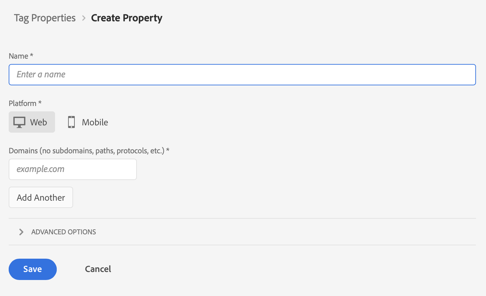

# Creación de una etiqueta para su propiedad {#upgrade-tag-property}

<!-- markdownlint-disable MD034 -->

>[!CONTEXTUALHELP]
>id="cja-upgrade-tag-property"
>title="Cree una propiedad de etiqueta en la recopilación de datos de Adobe Experience Platform"
>abstract="El uso de etiquetas es el estándar habitual para la recopilación de datos. Cree una etiqueta en la interfaz de Adobe Experience Platform para poder actualizar las variables de recopilación de datos en cualquier momento.  La creación de una propiedad de etiqueta puede completarse en varios clics y solo tarda unos minutos."

<!-- markdownlint-enable MD034 -->

{{upgrade-note-step}}

Utilice la función Etiquetas de Adobe Experience Platform a fin de implementar código en el sitio para recopilar datos. Esta solución de administración de etiquetas le permite implementar código de junto con otros requisitos de etiquetado. Las etiquetas ofrecen una integración perfecta con Adobe Experience Platform mediante la extensión del SDK web de Adobe Experience Platform.

En la siguiente información se describe cómo crear una etiqueta para la propiedad. Para obtener información adicional, consulte [Configuración de la extensión de la etiqueta del SDK web](https://experienceleague.adobe.com/es/docs/experience-platform/tags/extensions/client/web-sdk/web-sdk-extension-configuration) en la documentación de Experience Platform. El SDK web incluye el [!UICONTROL servicio de Adobe Experience Cloud ID] de forma nativa, por lo que no es necesario que añada la extensión del servicio de ID a la etiqueta.

Una propiedad es básicamente un contenedor que se rellena con extensiones, reglas, elementos de datos y bibliotecas al implementar etiquetas en el sitio. Muchas personas crean una propiedad para cada sitio web (o grupo de sitios relacionados) donde desean implementar el mismo conjunto de etiquetas. Para obtener más información sobre las propiedades, consulte [Propiedades](https://experienceleague.adobe.com/es/docs/experience-platform/tags/admin/companies-and-properties) en la documentación de recopilación de datos de Experience Platform.

Para crear una etiqueta para su propiedad:

1. Inicie sesión en experience.adobe.com con sus credenciales de Adobe ID.

1. En Adobe Experience Platform, vaya a **[!UICONTROL Recopilación de datos]** > **[!UICONTROL Etiquetas]**.

1. Seleccione **[!UICONTROL Nueva propiedad]**.

   Asigne un nombre a la etiqueta, seleccione **[!UICONTROL Web]** e introduzca un nombre de dominio. Seleccione **[!UICONTROL Guardar]** para continuar.

   

{{upgrade-final-step}}
