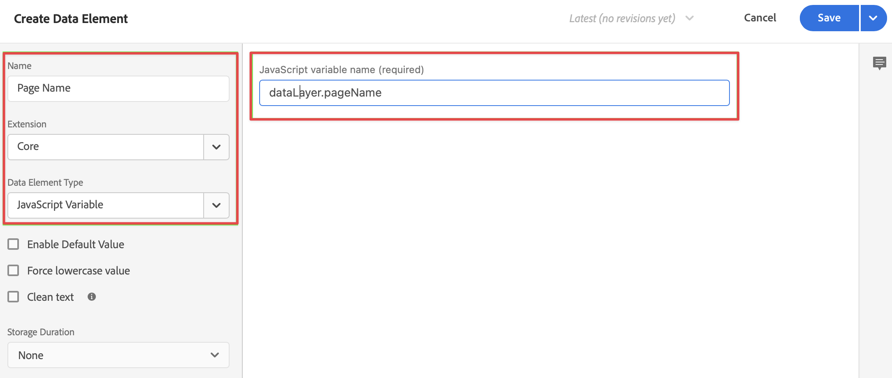
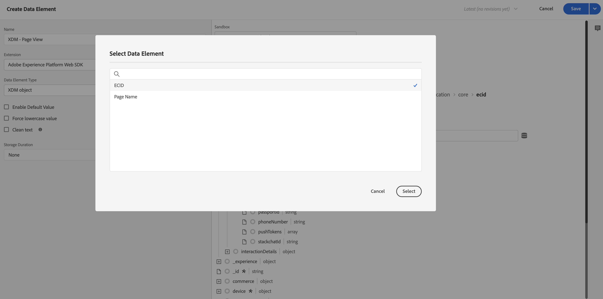
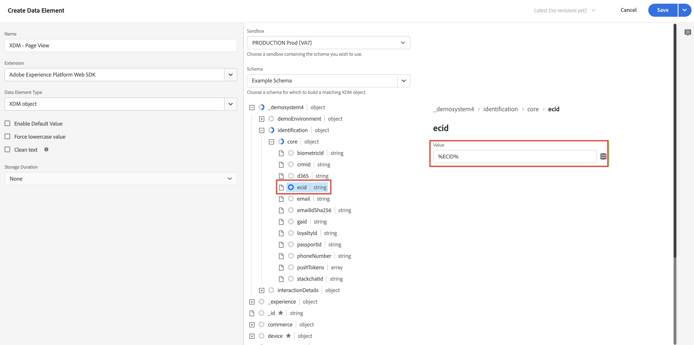
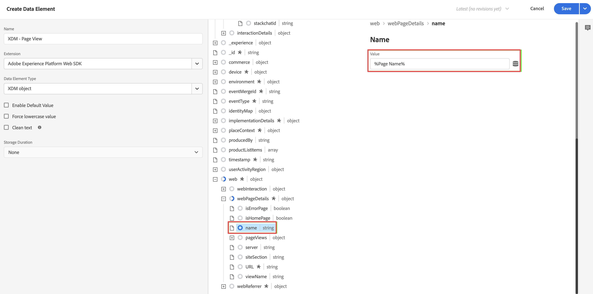
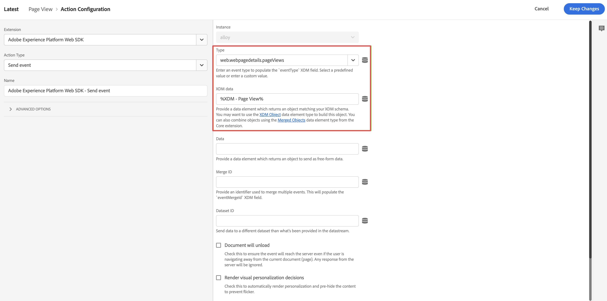
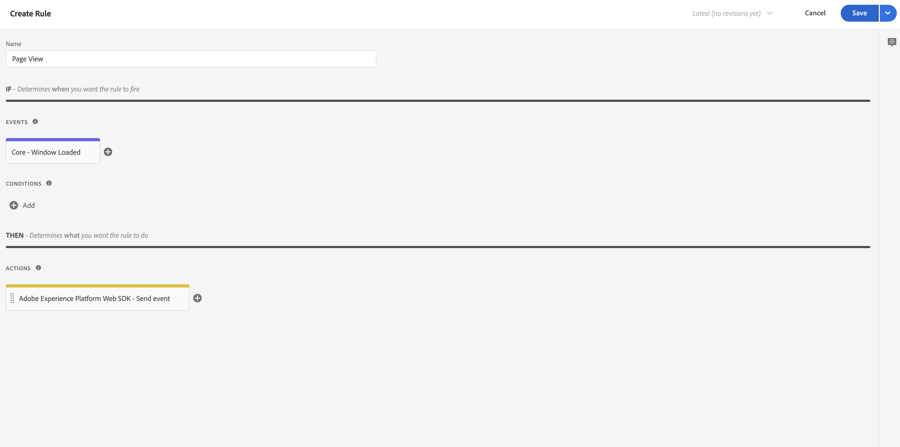

# Adición de la lógica de recopilación de datos XDM a la etiqueta {#upgrade-tag-xdm}

<!-- markdownlint-disable MD034 -->

>[!CONTEXTUALHELP]
>id="cja-upgrade-tag-xdm"
>title="Adición de la lógica de recopilación de datos XDM a la etiqueta"
>abstract="Con la etiqueta de carga instalada en el sitio, puede añadir reglas y elementos de datos para rellenar un objeto XDM y enviarlo a Adobe. Adobe recomienda mantener un documento de diseño de solución para realizar un seguimiento de la configuración de las etiquetas.  Este paso es mucho trabajo, ya que implica configurar toda la lógica de Analytics para su propiedad. Espere dedicar un mes o más a establecer las reglas de etiquetas correctas, probarlas e implementarlas en el sitio."

<!-- markdownlint-enable MD034 -->

>[!NOTE]
> 
>Siga los pasos de esta página solo después de completar todos los pasos de actualización anteriores. Puede seguir los [pasos de actualización recomendados](/help/getting-started/cja-upgrade/cja-upgrade-recommendations.md#recommended-upgrade-steps-for-most-organizations), o puede seguir los pasos de actualización que se generaron dinámicamente para su organización con el [cuestionario de actualización de Adobe Analytics a Customer Journey Analytics](https://gigazelle.github.io/cja-ttv/).
>
>Después de completar los pasos de esta página, siga los pasos de actualización recomendados o los pasos de actualización generados dinámicamente.

Después de [crear la etiqueta y agregar la extensión Web SDK](/help/getting-started/cja-upgrade/cja-upgrade-tag-property.md), debe configurarla con elementos de datos y reglas, según cómo desee realizar el seguimiento del sitio y enviar datos a Adobe Experience Platform. Después de configurar los elementos de datos y las reglas para la etiqueta, puede crearlos y publicarlos.

## Configuración de elementos de datos

Los Data Elements son los componentes básicos del diccionario de datos (o mapa de datos). Utilice Data Elements para recopilar, organizar y entregar datos a través de la tecnología de marketing y publicidad. Puede configurar elementos de datos en la etiqueta de que se lean desde la capa de datos y se puedan utilizar para enviar datos a Adobe Experience Platform. (Para obtener más información sobre los elementos de datos, consulte [Elementos de datos](https://experienceleague.adobe.com/en/docs/experience-platform/tags/ui/data-elements) en la documentación de etiquetas).

Las secciones siguientes describen elementos de datos sugeridos y otros elementos de datos comunes que puede configurar.

Existen varios tipos de elementos de datos. Dos elementos de datos comunes que puede que desee configurar son: uno que captura el nombre de página que las personas están viendo en el sitio y otro que captura el ID de Experience Cloud de cada persona que visita el sitio.

Después de configurar estos dos elementos de datos, puede configurar elementos de datos adicionales para los datos específicos que desea capturar.

Finalmente, después de definir todos los elementos de datos deseados, debe asignar los elementos de datos al [esquema que creó](/help/getting-started/cja-upgrade/cja-upgrade-schema-create.md) anteriormente. Para ello, defina un elemento de datos XDM, que proporciona una representación del esquema XDM.

<!-- Assigning data elements to an XDM object. All of the available XDM objects are based on the schema -->

### Creación de elementos de datos sugeridos

Las secciones siguientes describen cómo crear elementos de datos comunes que se aplican a la mayoría de las organizaciones.

#### Elemento de datos Page name

Un elemento de datos común que se aplica a la mayoría de las organizaciones es un elemento de datos que captura el nombre de página que están viendo las personas.

Para crear un elemento de datos de nombre de página:

1. Inicie sesión en experience.adobe.com con sus credenciales de Adobe ID.

1. En Adobe Experience Platform, vaya a **[!UICONTROL Recopilación de datos]** > **[!UICONTROL Etiquetas]**.

1. En la página **[!UICONTROL Propiedades de la etiqueta]**, seleccione la etiqueta recién creada en la lista de propiedades para abrirla.

1. Seleccione **[!UICONTROL Elementos de datos]** en el carril izquierdo.

1. Seleccione **[!UICONTROL Agregar elemento de datos]**.

1. En el cuadro de diálogo **[!UICONTROL Crear elemento de datos]**, especifique la siguiente información:

   * **[!UICONTROL Nombre]**: El nombre del elemento de datos. Por ejemplo `Page Name`.

   * **[!UICONTROL Extensión]**: selecciona **[!UICONTROL Core]** de la lista.

   * **[!UICONTROL Tipo de elemento de datos]**: seleccione **[!UICONTROL Información de página]** de la lista.

   * **[!UICONTROL Atributo]**: seleccione **[!UICONTROL Título]** de la lista.

     

     Como alternativa, podría haber utilizado el valor de una variable de la capa de datos, por ejemplo `pageName`, y el tipo de elemento de datos [!UICONTROL Variable JavaScript] para definir el elemento de datos.

     

1. Seleccione **[!UICONTROL Guardar]**.

   Ahora desea configurar un elemento de datos que haga referencia al Experience Cloud ID que proporciona automáticamente el SDK web de Adobe Experience Platform y que está disponible a través de la extensión del servicio de ID de Experience Cloud.

1. Continuar con [elemento de datos ECID](#ecid-data-element).

#### Elemento de datos ECID

Un elemento de datos común que se aplica a la mayoría de las organizaciones es un elemento de datos que captura el Experience Cloud ID de cada persona que visita el sitio.

Para crear un elemento de datos ECID:

1. Inicie sesión en experience.adobe.com con sus credenciales de Adobe ID.

1. En Adobe Experience Platform, vaya a **[!UICONTROL Recopilación de datos]** > **[!UICONTROL Etiquetas]**.

1. Seleccione la etiqueta recién creada de la lista de [!UICONTROL Propiedades de la etiqueta] para abrirla.

1. (Condicional) Instale la extensión del Servicio de Experience Cloud ID si aún no está instalada:

   1. Seleccione **[!UICONTROL Extensiones]** en el carril izquierdo.

   1. La ficha **[!UICONTROL Instalado]** está seleccionada de forma predeterminada. Si el mosaico **[!UICONTROL Servicio de Experience Cloud ID]** aparece en la lista, vaya al paso 5.

   1. Si el mosaico **[!UICONTROL Servicio de Experience Cloud ID]** no aparece en la lista, seleccione la pestaña **[!UICONTROL Catálogo]**.

   1. En el campo de búsqueda, busque **[!UICONTROL Servicio de Experience Cloud ID]** y, a continuación, seleccione el mosaico cuando aparezca

   1. Seleccione **[!UICONTROL Instalar]** > **[!UICONTROL Guardar]**.

1. Seleccione **[!UICONTROL Elementos de datos]** en el carril izquierdo.

1. Seleccione **[!UICONTROL Agregar elemento de datos]**.

1. En el cuadro de diálogo **[!UICONTROL Crear elemento de datos]**, especifique la siguiente información:

   * **[!UICONTROL Nombre]**: El nombre del elemento de datos. Por ejemplo `ECID`.

   * **[!UICONTROL Extensión]**: seleccione **[!UICONTROL Servicio de Experience Cloud ID]** de la lista.

   * **[!UICONTROL Tipo de elemento de datos]**: seleccione **[!UICONTROL ECID]** de la lista.

     

1. Seleccione **[!UICONTROL Guardar]**.

1. Continuar con [Crear elementos de datos adicionales](#create-additional-data-elements).

### Creación de elementos de datos adicionales

Cree un elemento de datos para cada tipo de datos que desee recopilar. Utilice el mismo proceso descrito en [Elemento de datos de nombre de página](#page-name-data-element) y [elemento de datos ECID](#ecid-data-element) para crear cada elemento de datos adicional.

Los elementos de datos que cree deben tener un campo correlativo en el esquema.

Los elementos de datos comunes varían según los requisitos del sector y de la empresa. Considere los siguientes elementos de datos comunes, organizados por sector:

**Elementos de datos comerciales**

* Productos

* Adiciones al carro de compras

* Cierres de compra

**Elementos de datos financieros**

* ID de transacción

* Fecha de transacción

* Tipo de servicio

**Elementos de datos de atención médica**

* Identificador de proveedor

* Fecha de visita

* Tipo de tratamiento

Después de crear todos los elementos de datos requeridos por su organización para la implementación, continúe con [elemento de datos de objeto XDM](#xdm-object-data-element).

### Elemento de datos del objeto XDM

Por último, ahora desea asignar cualquier elemento de datos que haya creado al [esquema que creó](/help/getting-started/cja-upgrade/cja-upgrade-schema-create.md) anteriormente. Para ello, defina un elemento de datos de objeto XDM que proporcione una representación del esquema XDM.

Para definir un elemento de datos de objeto XDM, debe hacer lo siguiente:

1. Inicie sesión en experience.adobe.com con sus credenciales de Adobe ID.

1. En Adobe Experience Platform, vaya a **[!UICONTROL Recopilación de datos]** > **[!UICONTROL Etiquetas]**.

1. Seleccione la etiqueta recién creada de la lista de [!UICONTROL Propiedades de la etiqueta] para abrirla.

1. Seleccione **[!UICONTROL Elementos de datos]** en el carril izquierdo.

1. Seleccione **[!UICONTROL Agregar elemento de datos]**.

1. En el cuadro de diálogo **[!UICONTROL Crear elemento de datos]**, especifique la siguiente información:

   * **[!UICONTROL Nombre]**: El nombre del elemento de datos. Por ejemplo `XDM - Page View`.

   * **[!UICONTROL Extensión]**: seleccione **[!UICONTROL Adobe Experience Platform Web SDK]** de la lista.

   * **[!UICONTROL Tipo de elemento de datos]**: seleccione **[!UICONTROL Objeto XDM]** de la lista.

   * **[!UICONTROL Zona protegida]**: Seleccione la zona protegida en la lista.

   * **[!UICONTROL Esquema]**: seleccione el esquema en la lista.

1. Asigne el atributo `identification > core > ecid`, definido en el esquema, al elemento de datos ECID. Seleccione el icono del cilindro para elegir fácilmente el elemento de datos ECID de su lista de elementos de datos.

   

   

1. Asigne el atributo `web > webPageDetails > name`, definido en el esquema, al elemento de datos Nombre de página.

   

1. Seleccione **[!UICONTROL Guardar]**.

1. Continuar con [Configurar reglas](#configure-rules).

## **Configurar reglas**

Las etiquetas de Adobe Experience Platform siguen un sistema basado en reglas. Buscan la interacción de usuarios y datos asociados. Cuando se cumplen los criterios descritos en las reglas, la regla activa la extensión, script o el código del lado del cliente identificados. Puede utilizar reglas para enviar datos (como un objeto XDM) a Adobe Experience Platform mediante la extensión del SDK web de Adobe Experience Platform.

Para definir una regla, debe hacer lo siguiente:

>[!NOTE]
>
>Los siguientes pasos son un ejemplo de definición de una regla que envía datos XDM a Adobe Experience Platform, que contienen valores de otros elementos de datos.
>
>Puede utilizar las reglas de varias formas en la etiqueta para manipular las variables (mediante los elementos de datos).
>
>Consulte [Reglas](https://experienceleague.adobe.com/docs/experience-platform/tags/ui/rules.html?lang=es) para obtener más información.

1. Inicie sesión en experience.adobe.com con sus credenciales de Adobe ID.

1. En Adobe Experience Platform, vaya a **[!UICONTROL Recopilación de datos]** > **[!UICONTROL Etiquetas]**.

1. Seleccione la etiqueta recién creada de la lista de [!UICONTROL Propiedades de la etiqueta] para abrirla.

1. Seleccione **[!UICONTROL Reglas]** en el carril izquierdo.

1. Seleccione **[!UICONTROL Agregar regla]**.

1. En el cuadro de diálogo **[!UICONTROL Crear regla]**, especifique la siguiente información:

   * **[!UICONTROL Nombre]**: El nombre de la regla. Por ejemplo `Page View`.

   * **[!UICONTROL Eventos]**: selecciona **[!UICONTROL + Agregar]**. A continuación, en el cuadro de diálogo **[!UICONTROL Configuración de eventos]**, especifique la siguiente información. Cuando haya terminado, seleccione **[!UICONTROL Conservar cambios]**.

      * **[!UICONTROL Extensión]**: selecciona **[!UICONTROL Core]** de la lista.

      * **[!UICONTROL Tipo de evento]**: seleccione **[!UICONTROL Ventana cargada]** de la lista.

        

   * **[!UICONTROL Acciones]**: Seleccione **[!UICONTROL + Agregar]**. A continuación, en el cuadro de diálogo [!UICONTROL Configuración de la acción], especifique la siguiente información. Cuando haya terminado, seleccione **[!UICONTROL Conservar cambios]**.

      * **[!UICONTROL Extensión]**: seleccione **[!UICONTROL Adobe Experience Platform Web SDK]** de la lista.

      * **[!UICONTROL Tipo de acción]**: selecciona **[!UICONTROL Enviar evento]** de la lista.

      * **[!UICONTROL Tipo]**: seleccione **[!UICONTROL Vistas de página de detalles de páginas web]** de la lista.

      * **[!UICONTROL Datos XDM]**: Seleccione el icono del cilindro y, a continuación, seleccione **[!UICONTROL XDM - Vista de página]** de la lista de elementos de datos.

        

        La regla debe tener el siguiente aspecto:

        

1. Seleccione **[!UICONTROL Guardar]**.

1. Repita este proceso para cada regla que desee agregar al sitio.

   Para obtener más información sobre las reglas, consulte [Reglas](https://experienceleague.adobe.com/en/docs/experience-platform/tags/ui/rules) en la documentación de etiquetas.

1. Continúa con [Crea y publica tu etiqueta](#build-and-publish-your-tag).

## Cree y publique su etiqueta

Después de definir los elementos de datos y las reglas, debe generar y publicar la etiqueta. Al crear una compilación de biblioteca, debe asignarla a un entorno. Las extensiones, reglas y elementos de datos de la compilación se compilan y colocan en el entorno asignado. Cada entorno proporciona un código incrustado único que le permite integrar su compilación asignada en el sitio.

Las etiquetas de Adobe Experience Platform admiten flujos de trabajo de publicación simples o complejos que deben adaptarse a la implementación de Adobe Experience Platform Web SDK. Consulte la [Información general de la publicación](https://experienceleague.adobe.com/docs/experience-platform/tags/publish/overview.html?lang=es) para obtener más información.

Para compilar y publicar una etiqueta, debe hacer lo siguiente:

1. Inicie sesión en experience.adobe.com con sus credenciales de Adobe ID.

1. En Adobe Experience Platform, vaya a **[!UICONTROL Recopilación de datos]** > **[!UICONTROL Etiquetas]**.

1. Seleccione la etiqueta recién creada de la lista de [!UICONTROL Propiedades de la etiqueta] para abrirla.

1. Seleccione **[!UICONTROL Flujo de publicación]** en el carril izquierdo.

1. Seleccione **[!UICONTROL Agregar biblioteca]**.

1. En el cuadro de diálogo **[!UICONTROL Crear biblioteca]**, especifique la siguiente información:

   * **[!UICONTROL Nombre]**: El nombre de la biblioteca.

   * **[!UICONTROL Entorno]**: seleccione **[!UICONTROL Desarrollo (desarrollo)]** de la lista.

1. Seleccione **[!UICONTROL + Agregar todos los recursos modificados]**.

   

1. Seleccione **[!UICONTROL Guardar y compilar para desarrollo]**.

   La etiqueta se guardará y se creará para su entorno de desarrollo. Un punto verde indica que la compilación de la etiqueta se ha realizado correctamente en el entorno de desarrollo.

1. Puede seleccionar **[!UICONTROL ...]** para recompilar la biblioteca o moverla a un entorno de ensayo o producción.

   
