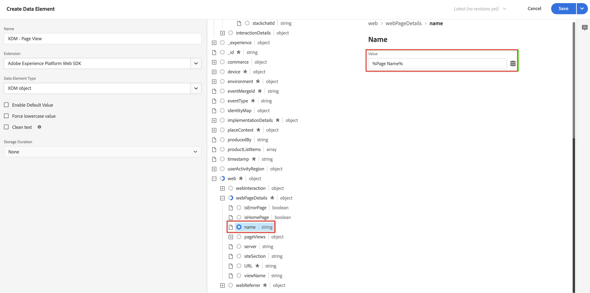
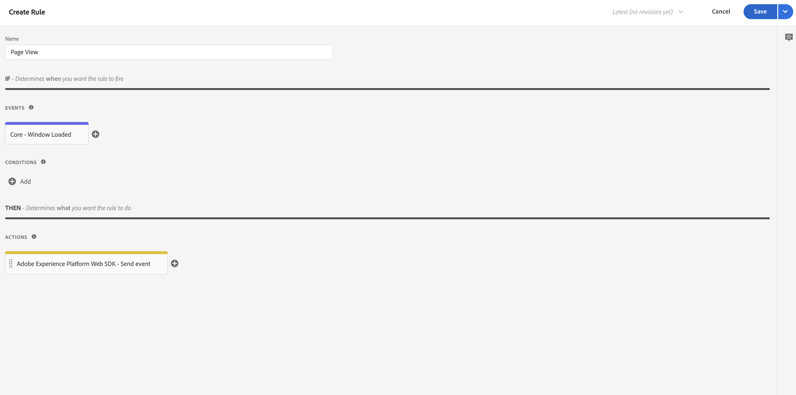

# Añada la lógica de recopilación de datos XDM a la etiqueta {#upgrade-tag-xdm}

<!-- markdownlint-disable MD034 -->

>[!CONTEXTUALHELP]
>id="cja-upgrade-tag-xdm"
>title="Añada la lógica de recopilación de datos XDM a la etiqueta"
>abstract="Con la etiqueta de carga instalada en el sitio, puede añadir reglas y elementos de datos para rellenar un objeto XDM y enviarlo a Adobe. Adobe recomienda mantener un documento de diseño la de solución para realizar un seguimiento de la configuración de las etiquetas.  Este paso lleva mucho trabajo, ya que implica configurar toda la lógica de Analytics para su propiedad. Establecer las reglas de etiquetas correctas, probarlas e implementarlas en el sitio le llevará un mes o más."

<!-- markdownlint-enable MD034 -->

{{upgrade-note-step}}

Después de [crear la etiqueta y añadir la extensión del SDK web](/help/getting-started/cja-upgrade/cja-upgrade-tag-property.md), debe configurarla con los elementos de datos y las reglas según cómo quiera hacer el segiumiento del sitio y enviar datos a Adobe Experience Platform. Después de configurar los elementos de datos y las reglas para la etiqueta, puede crearla y publicarla.

## Configuración de elementos de datos

Los Data Elements son los componentes básicos del diccionario de datos (o mapa de datos). Utilice Data Elements para recopilar, organizar y entregar datos a través de la tecnología de marketing y publicidad. Los elementos de datos de la etiqueta se configuran para que se lean en la capa de datos y se puedan utilizar para enviar datos a Adobe Experience Platform. (Para obtener más información sobre los elementos de datos, consulte [Elementos de datos](https://experienceleague.adobe.com/es/docs/experience-platform/tags/ui/data-elements) en la documentación de etiquetas).

Las secciones siguientes describen elementos de datos sugeridos y otros elementos de datos comunes que puede configurar.

Existen diferentes tipos de elementos de datos. Un elemento de datos común que puede querer configurar es el que captura el nombre de página que las personas están viendo en el sitio.

Después de configurar el elemento de datos del nombre de página, puede configurar elementos de datos adicionales para los datos específicos que desea capturar.

Por último, después de definir todos los elementos de datos deseados, debe asignar los elementos de datos al [esquema que creó](/help/getting-started/cja-upgrade/cja-upgrade-schema-create.md) anteriormente. Para ello, es preciso definir un elemento de datos XDM que proporcione una representación del esquema XDM.

<!-- Assigning data elements to an XDM object. All of the available XDM objects are based on the schema -->

### Creación de elementos de datos sugeridos

En las siguientes secciones se describe cómo crear elementos de datos comunes que se aplican a la mayoría de las organizaciones.

#### Elemento de datos de nombre de página

Un elemento de datos común que se aplica a la mayoría de las organizaciones es un elemento de datos que captura el nombre de la página que están viendo las personas.

Para definir un elemento de datos de nombre de página:

1. Inicie sesión en experience.adobe.com con sus credenciales de Adobe ID.

1. En Adobe Experience Platform, vaya a **[!UICONTROL Recopilación de datos]** > **[!UICONTROL Etiquetas]**.

1. En la página **[!UICONTROL Propiedades de la etiqueta]**, seleccione la etiqueta recién creada en la lista de propiedades para abrirla.

1. Seleccione **[!UICONTROL Elementos de datos]** en el carril izquierdo.

1. Seleccione **[!UICONTROL Agregar elemento de datos]**.

1. En el cuadro de diálogo **[!UICONTROL Crear elemento de datos]**, especifique la siguiente información:

   * **[!UICONTROL Nombre]**: el nombre del elemento de datos. Por ejemplo `Page Name`.

   * **[!UICONTROL Extensión]**: seleccione **[!UICONTROL Principal]** en la lista.

   * **[!UICONTROL Tipo de elemento de datos]**: seleccione **[!UICONTROL Información de página]** en la lista.

   * **[!UICONTROL Atributo]**: seleccione **[!UICONTROL Título]** en la lista.

     

     Como alternativa, podría haber utilizado el valor de una variable de la capa de datos, por ejemplo `pageName`, y el tipo de elemento de datos [!UICONTROL Variable JavaScript] para definir el elemento de datos.

     

1. Seleccione **[!UICONTROL Guardar]**.

1. Continúe con [Creación de elementos de datos adicionales](#create-additional-data-elements).

### Creación de elementos de datos adicionales

Cree un elemento de datos para cada tipo de datos que desee recopilar. Utilice el mismo proceso descrito en [Elemento de datos Page name](#page-name-data-element) para crear cada elemento de datos adicional.

Los elementos de datos que cree deben tener un campo correlativo en el esquema.

Los elementos de datos comunes varían según los requisitos del sector y de la empresa. Considere los siguientes elementos de datos comunes, organizados por sector:

**Elementos de datos al por menor**

* Productos

* Adiciones al carro de compras

* Cierres de compra

**Creación de elementos de datos financieros**

* ID de transacción

* Fecha de transacción

* Tipo de servicio

**Creación de elementos de datos de asistencia sanitaria**

* Identificador de proveedor

* Fecha de visita

* Tipo de tratamiento

Después de crear todos los elementos de datos requeridos por su organización para la implementación, continúe con [Elemento de datos de objeto XDM](#xdm-object-data-element).

### Elemento de datos de objeto XDM

Por último, ahora desea asignar cualquiera de los elementos de datos que haya creado al [esquema creado](/help/getting-started/cja-upgrade/cja-upgrade-schema-create.md) anteriormente. Para ello, debe definir un elemento de datos de objeto XDM que proporcione una representación del esquema XDM.

Para definir un elemento de datos de objeto XDM, debe hacer lo siguiente:

1. Inicie sesión en experience.adobe.com con sus credenciales de Adobe ID.

1. En Adobe Experience Platform, vaya a **[!UICONTROL Recopilación de datos]** > **[!UICONTROL Etiquetas]**.

1. Seleccione la etiqueta recién creada de la lista de [!UICONTROL Propiedades de la etiqueta] para abrirla.

1. Seleccione **[!UICONTROL Elementos de datos]** en el carril izquierdo.

1. Seleccione **[!UICONTROL Agregar elemento de datos]**.

1. En el cuadro de diálogo **[!UICONTROL Crear elemento de datos]**, especifique la siguiente información:

   * **[!UICONTROL Nombre]**: el nombre del elemento de datos. Por ejemplo `XDM - Page View`.

   * **[!UICONTROL Extensión]**: seleccione **[!UICONTROL SDK web de Adobe Experience Platform]** en la lista.

   * **[!UICONTROL Tipo de elemento de datos]**: seleccione **[!UICONTROL Objeto XDM]** en la lista.

   * **[!UICONTROL Zona protegida]**: seleccione la zona protegida en la lista.

   * **[!UICONTROL Esquema]**: seleccione el esquema en la lista.

1. Asigne el atributo `web > webPageDetails > name`, definido en el esquema, al elemento de datos Nombre de página.

   

1. Seleccione **[!UICONTROL Guardar]**.

1. Continúe con [Configuración de reglas](#configure-rules).

## **Configuración de reglas**

Las etiquetas de Adobe Experience Platform siguen un sistema basado en reglas. Buscan la interacción de usuarios y datos asociados. Cuando se cumplen los criterios descritos en las reglas, la regla activa la extensión, script o el código del lado del cliente identificados. Puede utilizar reglas para enviar datos (como un objeto XDM) a Adobe Experience Platform mediante la extensión del SDK web de Adobe Experience Platform.

Para definir una regla, debe hacer lo siguiente:

>[!NOTE]
>
>Los pasos siguientes son un ejemplo de definición de una regla que envía datos XDM, que contienen valores de otros elementos de datos, a Adobe Experience Platform.
>
>Puede utilizar las reglas de varias formas en la etiqueta para manipular las variables (mediante los elementos de datos).
>
>Consulte [Reglas](https://experienceleague.adobe.com/docs/experience-platform/tags/ui/rules.html?lang=es) para obtener más información.

1. Inicie sesión en experience.adobe.com con sus credenciales de Adobe ID.

1. En Adobe Experience Platform, vaya a **[!UICONTROL Recopilación de datos]** > **[!UICONTROL Etiquetas]**.

1. Seleccione la etiqueta recién creada de la lista de [!UICONTROL Propiedades de la etiqueta] para abrirla.

1. Seleccione **[!UICONTROL Reglas]** en el carril izquierdo.

1. Seleccione **[!UICONTROL Añadir regla]**.

1. En el cuadro de diálogo **[!UICONTROL Crear regla]**, especifique la siguiente información:

   * **[!UICONTROL Nombre:]** el nombre de la regla. Por ejemplo `Page View`.

   * **[!UICONTROL Eventos]**: seleccione **[!UICONTROL + Agregar]**. A continuación, en el cuadro de diálogo **[!UICONTROL Configuración de eventos]**, especifique la siguiente información. Cuando haya terminado, seleccione **[!UICONTROL Conservar cambios]**.

      * **[!UICONTROL Extensión]**: seleccione **[!UICONTROL Principal]** en la lista.

      * **[!UICONTROL Tipo de evento]**: seleccione **[!UICONTROL Ventana cargada]** en la lista.

        

   * **[!UICONTROL Acciones]**: seleccione **[!UICONTROL + Agregar]**. A continuación, en el cuadro de diálogo [!UICONTROL Configuración de la acción], especifique la siguiente información. Cuando haya terminado, seleccione **[!UICONTROL Conservar cambios]**.

      * **[!UICONTROL Extensión]**: seleccione **[!UICONTROL SDK web de Adobe Experience Platform]** en la lista.

      * **[!UICONTROL Tipo de acción]**: seleccione **[!UICONTROL Enviar evento]** en la lista.

      * **[!UICONTROL Tipo]**: seleccione **[!UICONTROL Vistas de página de detalles de páginas web]** en la lista.

      * **[!UICONTROL Datos XDM]**: seleccione el icono de cilindro y, a continuación, seleccione **[!UICONTROL XDM - Vista de página]** en la lista de elementos de datos.

        

        La regla debe tener el siguiente aspecto:

        

1. Seleccione **[!UICONTROL Guardar]**.

1. Repita este proceso para cada regla que desee añadir al sitio.

   Para obtener más información sobre las reglas, consulte [Reglas](https://experienceleague.adobe.com/es/docs/experience-platform/tags/ui/rules) en la documentación de etiquetas.

1. Continúe con [Generar y publicar la etiqueta](#build-and-publish-your-tag).

## Generar y publicar la etiqueta

Después de haber definido elementos de datos y reglas, debe generar y publicar la etiqueta. Al crear una compilación de biblioteca, debe asignarla a un entorno. Las extensiones, reglas y elementos de datos de la compilación se compilan y colocan en el entorno asignado. Cada entorno proporciona un código incrustado único que le permite integrar su compilación asignada en el sitio.

Las etiquetas de Adobe Experience Platform admiten flujos de trabajo de publicación simples o complejos que deben adaptarse a su implementación del SDK web de Adobe Experience Platform. Consulte la [Información general de la publicación](https://experienceleague.adobe.com/docs/experience-platform/tags/publish/overview.html?lang=es) para obtener más información.

Para compilar y publicar una etiqueta, debe hacer lo siguiente:

1. Inicie sesión en experience.adobe.com con sus credenciales de Adobe ID.

1. En Adobe Experience Platform, vaya a **[!UICONTROL Recopilación de datos]** > **[!UICONTROL Etiquetas]**.

1. Seleccione la etiqueta recién creada de la lista de [!UICONTROL Propiedades de la etiqueta] para abrirla.

1. Seleccione **[!UICONTROL Flujo de publicación]** en el carril izquierdo.

1. Seleccione **[!UICONTROL Añadir biblioteca]**.

1. En el cuadro de diálogo **[!UICONTROL Crear biblioteca]**, especifique la siguiente información:

   * **[!UICONTROL Nombre:]** nombre de la biblioteca.

   * **[!UICONTROL Entorno]**: seleccione **[!UICONTROL Desarrollo (desarrollo)]** en la lista.

1. Seleccione **[!UICONTROL + Agregar todos los recursos modificados]**.

   

1. Seleccione **[!UICONTROL Guardar y compilar para desarrollo]**.

   La etiqueta se guardará y se generará para su entorno de desarrollo. Un punto verde indica que la compilación de la etiqueta se ha realizado correctamente en el entorno de desarrollo.

1. Puede seleccionar **[!UICONTROL ...]** para recompilar la biblioteca o moverla a un entorno de ensayo o producción.

   

{{upgrade-final-step}}

