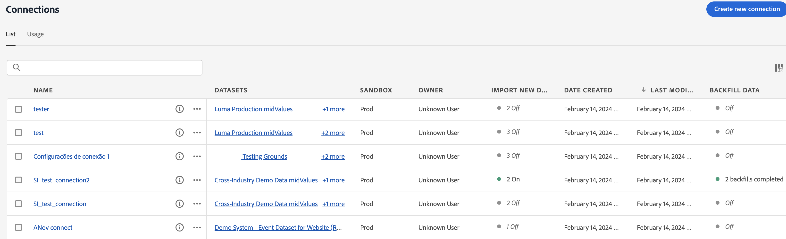
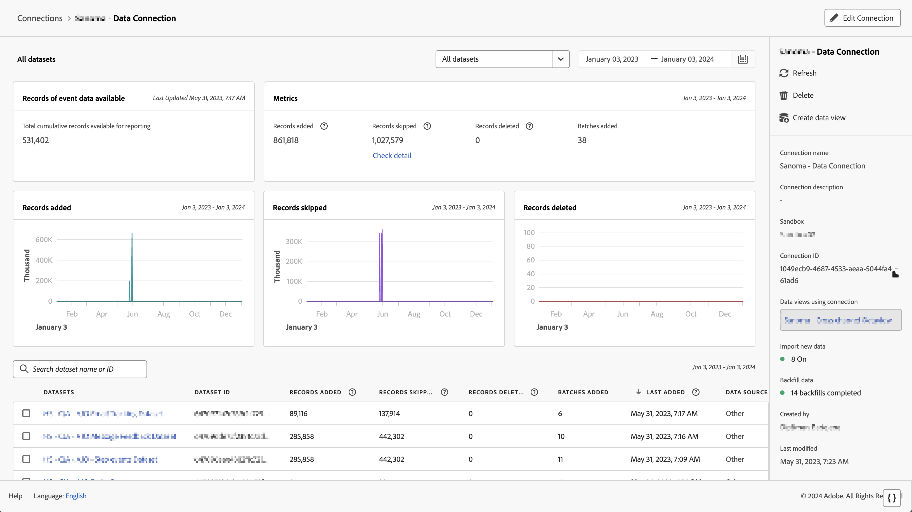

# Validar que los datos fluyen al Customer Journey Analytics

>[!NOTE]
>
>Esta documentación se debe usar después de completar el [cuestionario de actualización de Adobe Analytics a Customer Journey Analytics](https://gigazelle.github.io/cja-ttv/).
> 
>Siga los pasos de esta página solo después de completar todos los pasos anteriores generados dinámicamente para su organización.
>
>Después de completar los pasos de esta página, continúe siguiendo los pasos de actualización que se generaron dinámicamente para su organización desde el [cuestionario de actualización de Adobe Analytics a Customer Journey Analytics](https://gigazelle.github.io/cja-ttv/).

Puede validar que la conexión está activa y que los datos fluyen a las vistas de datos de Customer Journey Analytics.

1. En Customer Journey Analytics, seleccione la pestaña Conexiones.

   

1. Seleccione la [conexión que configuró](/help/getting-started/cja-upgrade/cja-upgrade-connection.md).

   

1. Consulte [Detalles de conexión](/help/connections/manage-connections.md#manage-connections) en [Administrar conexiones](/help/connections/manage-connections.md) para obtener información acerca de los detalles disponibles sobre cada conexión.

1. Continúe siguiendo los pasos de actualización generados dinámicamente para su organización desde el [cuestionario de actualización de Adobe Analytics a Customer Journey Analytics](https://gigazelle.github.io/cja-ttv/).

<!-- Should we duplicate the content here or single source it with /help/connections/manage-connections.md -->