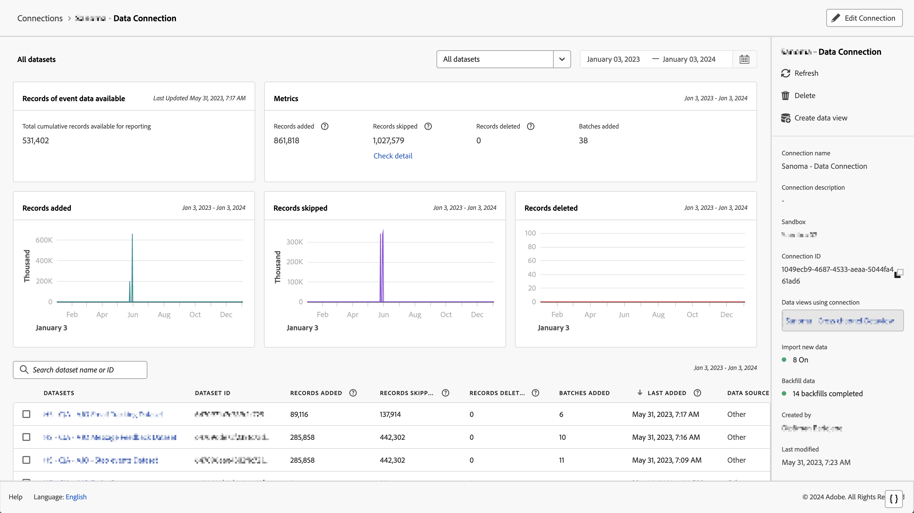

# Verifique que los datos fluyen en Customer Journey Analytics {#validate-data}

<!-- markdownlint-disable MD034 -->

>[!CONTEXTUALHELP]
>id="cja-upgrade-data-validate"
>title="Validar que los datos estén fluyendo"
>abstract="Use los detalles de conexión para validar si los datos fluyen en Customer Journey Analytics.  Si todo se hizo correctamente y sin errores, este paso se puede realizar en menos de un día. Si aparecen varios problemas de recopilación de datos, solucionarlos puede llevar considerablemente más tiempo."

<!-- markdownlint-enable MD034 -->

{{upgrade-note-step}}

Puede validar que la conexión está activa y que los datos fluyen a las vistas de datos de Customer Journey Analytics.

1. En Customer Journey Analytics, seleccione la pestaña Conexiones

   

1. Seleccione la [conexión que configuró](/help/getting-started/cja-upgrade/cja-upgrade-connection.md).

   

1. Consulte [Detalles de conexión](/help/connections/manage-connections.md#manage-connections) en [Administrar conexiones](/help/connections/manage-connections.md) para obtener información acerca de los detalles disponibles sobre cada conexión.

{{upgrade-final-step}}

<!-- Should we duplicate the content here or single source it with /help/connections/manage-connections.md -->
