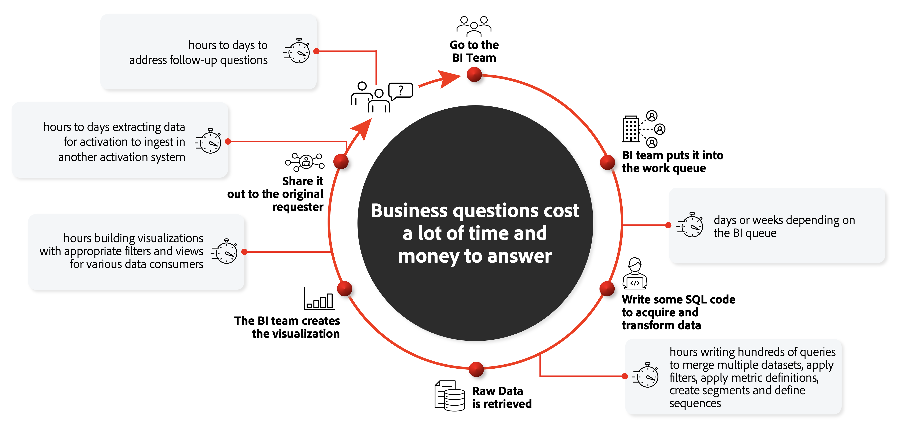
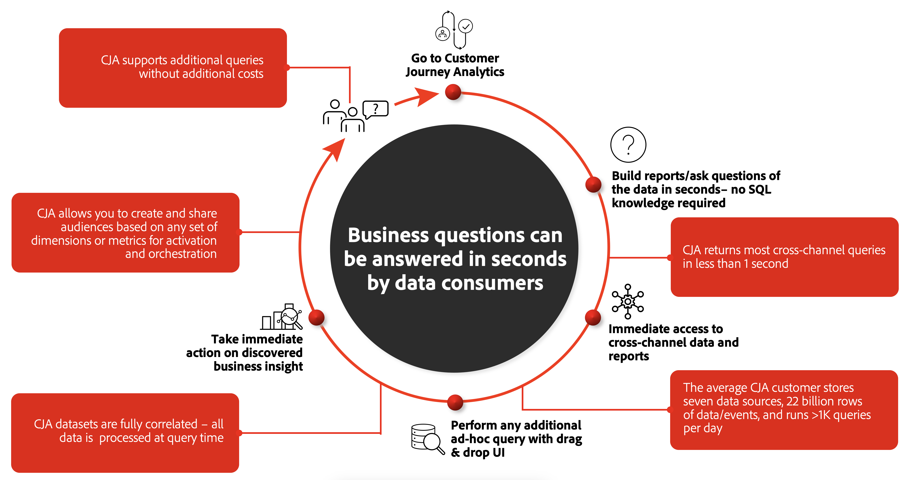

# Comparar soluciones de CJA con BI

Con el enfoque actual en la experiencia del cliente, las marcas requieren soluciones avanzadas para comprender mejor el recorrido holístico del cliente. Comprender este recorrido completo del cliente le permite analizar y obtener perspectivas valiosas sobre cómo los canales en línea y sin conexión atraen a los clientes y generan un aumento de la conversión, la retención y la lealtad. Un recorrido del cliente en este contexto puede ser el pedido directo en línea de una comida en una cadena de comida de sushi. O la compra de un coche nuevo, donde el cliente combina la investigación en línea con visitas a la sala de exposición del distribuidor, y una compra en persona final.

Muchas organizaciones han consolidado sus datos omnicanal en un lago de datos o almacén de datos. Las herramientas de inteligencia empresarial (BI) se utilizan sobre estos almacenes de datos para proporcionar los informes, las visualizaciones y las perspectivas que la empresa necesita para comprender el recorrido del cliente. A menudo, esta combinación de soluciones y herramientas tiene un propósito general por naturaleza y diseño, y no se centra explícitamente en el cliente. Customer Journey Analytics (CJA) se centra en potenciar a los responsables de la experiencia del cliente, como especialistas en marketing, analistas de datos y científicos de datos. La herramienta les permite visualizar el recorrido del cliente en contexto completo en todos los canales en tiempo real sin limitaciones que muchas otras herramientas de BI tienen.

Esta sección de la documentación explica las diferencias fundamentales entre CJA y las herramientas de BI más utilizadas, primero mirando el flujo de trabajo general utilizado para lograr el objetivo mencionado anteriormente: comprender ese recorrido del cliente. A continuación, proporciona más detalles sobre cómo se almacenan, recopilan y consultan los datos de forma diferente entre las herramientas de CJA y BI. Finalmente, explica las diferencias en las capacidades de visualización.

## Flujo de trabajo de BI tradicional

Un obstáculo frecuente con los enfoques tradicionales para analizar los recorridos de los clientes es que no se centra en los clientes. Cada equipo recopila datos en silos, analizando y optimizando experiencias en función de los datos a los que tiene acceso.

Si desea comprender cómo una campaña digital específica afecta a una acción sin conexión almacenada en un silo de datos diferente, envíe una solicitud a la cola del equipo de BI. El equipo de BI escribe la consulta necesaria para adquirir y transformar los datos. Una vez recuperados los datos sin procesar, el equipo de BI crea la visualización. Los datos se comparten con usted y pasa tiempo analizando las perspectivas y extrayendo datos para activarlos en otros sistemas.

Cada uno de estos pasos puede tardar horas, días o incluso semanas. Si hay preguntas de seguimiento o problemas con los datos consultados, puede llevar aún más tiempo abordar esas preguntas y continuar el ciclo. Para un análisis, exploración y comprensión continuos del recorrido del cliente, este proceso es ineficiente y no escalable. Además, los equipos de BI normalmente abordan más que solo preguntas relacionadas con el recorrido de los clientes.

## CJA: Flujo de trabajo democratizado para datos en línea y sin conexión

CJA proporciona un entorno para conectar datos en línea y sin conexión entre canales a nivel de cliente global con el único propósito de comprender el recorrido del cliente. Requiere una configuración inicial para conectar y definir vistas a los datos que califique como relevantes. Sin embargo, una vez completados, esos datos se pueden consultar fácilmente para análisis y exploración en curso, lo que da lugar a que se obtengan perspectivas y se comprendan progresivamente los recorridos de los clientes. Al democratizar los datos combinados en línea y sin conexión, puede responder a las preguntas relacionadas con el recorrido de los clientes en segundos.

Puede utilizar CJA para hacer preguntas utilizando el entorno del espacio de trabajo de análisis visual y obtener perspectivas casi instantáneamente. Los datos e informes de canales cruzados están disponibles de forma inmediata, sin necesidad de código SQL. Se pueden realizar consultas y análisis adicionales con tan solo arrastrar y soltar en la interfaz de usuario, con datos completamente correlacionados. Puede seguir haciendo preguntas, explorando progresivamente más detalles según necesite. A continuación, puede realizar acciones inmediatas sobre las perspectivas que descubra, como compartir audiencias para activación y orquestación.

## El poderoso motor de generación de informes de CJA

CJA utiliza una potente arquitectura propietaria que distribuye el análisis entre cientos o incluso miles de servidores para mostrar los datos en Analysis Workspace en cuestión de segundos. Algunas propiedades importantes de esta arquitectura de procesamiento son:

* **Optimizado para consultas individuales relacionadas con el cliente**: Técnicamente, CJA almacena los datos en un motor de informes distribuido que utiliza ampliamente el almacenamiento en caché. Ese motor está bien adaptado para consultas interactivas sobre datos de eventos de nivel individual y, como tal, perfectamente optimizado para consultas relacionadas con el cliente. El motor de informes almacena datos en índices de mapa de bits orientados a columnas que permiten un cálculo rápido sobre la marcha de las métricas agregadas. Cuenta con un amplio motor de filtrado que permite una potente segmentación/análisis de audiencia. Y tiene una comprensión básica de la secuencia entre puntos de datos que resulta útil para analizar el comportamiento en esos puntos de datos (el orden en que se produjeron las cosas) y para asignar la atribución mediante varios modelos complejos.

* **Aplicación rápida de rutas y filtros complejos**: El motor de informes funciona en conjuntos de datos jerárquicos ordenados parcialmente (por ejemplo, persona -> sesiones -> eventos). Todos los datos de un objeto de nivel superior (perfiles individuales) residen en un solo nodo de procesamiento para obtener resultados precisos. Esta partición permite la rápida aplicación de rutas y filtros complejos. Las operaciones complejas como la sesionización, la atribución, la persistencia de los atributos de datos con estado y las opciones complejas de manipulación de datos se ejecutan a escala con un tiempo de creación de informes rápido. En el mundo de BI, estos tipos de operaciones generalmente requieren que se creen nuevos cubos OLAP para cada caso de uso. El motor de generación de informes de CJA permite el acceso sin restricciones a todo el conjunto de datos en cada consulta, lo que da como resultado datos completamente correlacionados sin requerir ningún corte por anticipado.

* **Consulta eficiente de flujos de datos complejos**: Una de las mayores diferencias del motor de informes con respecto a las bases de datos SQL y NoSQL tradicionales es su capacidad para determinar predicados basados en relaciones orientadas a secuencias a un nivel fundamental. Estas operaciones fundamentales de consulta pueden ver el flujo de registros, que está compuesto por muchas secuencias intercaladas (e incluso anidadas). Realizan una consulta con todos estos flujos de datos entrelazados con la eficacia de una única operación de secuencia contigua.

* **Diseñado para responder rápidamente a consultas grandes**: El motor de generación de informes no tiene un propósito general tan general como los sistemas tradicionales de grandes datos. Sin embargo, está diseñado específicamente para responder consultas que abarcan millones o incluso miles de millones de registros (datos de evento/eventos de experiencia), generalmente en menos de un segundo. A diferencia de otros grandes sistemas de datos, no lo hace muestreando los datos o precomputando las respuestas a todas las preguntas que crea que puede hacerse. En su lugar, puede calcular las respuestas lo suficientemente rápido como para admitir casos de uso de consultas interactivas. Este diseño específico del motor de generación de informes de CJA facilita la disponibilidad de los datos y su rápida exploración y análisis continuos, lo que le permite obtener perspectivas y conocimientos progresivos sobre los recorridos de los clientes.

* **Actuar como una solución de BI sin objetivos**: Puede definir sus dimensiones, métricas, filtros en un lugar y, a continuación, cualquier cliente de CJA (incluida nuestra API pública de CJA) puede acceder a esos componentes. Esto abstrae las consultas complejas lejos de los usuarios finales y garantiza que los resultados sean los mismos, independientemente del cliente de informes o visualización que utilice.

## Funciones de visualización únicas de CJA

El motor de creación de informes es fundamental para que CJA le permita interactuar de forma progresiva con todos los datos de recorrido de clientes de ese motor de creación de informes y actuar en consecuencia. CJA viene con un amplio conjunto de componentes que le permiten hacer esto visualmente y mediante arrastrar y soltar. Las herramientas de visualización de BI le permiten explorar dentro de los límites de los datos preparados por SQL (según se definen en TI). CJA le permite desglosar y cortar todo lo que desee, sin tener que volver a TI para crear otra vista SQL.

&quot;Progresivamente&quot; es un concepto clave aquí: al contrario que la mayoría de las visualizaciones de las herramientas de BI, la IU visual de arrastrar y soltar en CJA le permite desglosar continuamente sus datos según sus necesidades específicas: genere consultas de forma interactiva mediante métricas, dimensiones, filtros (segmentos), cálculos, líneas de tiempo, anotaciones y otros valores de análisis relevantes.

Estos componentes de visualización incluyen funciones inteligentes como:

* **Funciones de analista virtual** como [Detección de anomalías](/help/analysis-workspace/virtual-analyst/c-anomaly-detection/anomaly-detection.md) que utilizan algoritmos predictivos y aprendizaje automático para ofrecer perspectivas sobre qué es lo que impulsa comportamientos inusuales en sus datos.

* **Funciones de análisis avanzado** que se centran específicamente en las perspectivas de recorrido de los clientes, como [diagramas de flujo](/help/analysis-workspace/visualizations/c-flow/flow.md), [Attribution IQ](/help/analysis-workspace/attribution/overview.md), [diagramas de visitas en el orden previsto](/help/analysis-workspace/visualizations/fallout/fallout-flow.md)y [desgloses de dimensión](/help/components/dimensions/t-breakdown-fa.md). Algunos ejemplos de visualizaciones listas para usar son:

   * [Análisis de retención de clientes a través de tablas de cohorte/latencia](/help/analysis-workspace/visualizations/cohort-table/cohort-use-cases.md), donde simplemente arrastra y suelta métricas/dimensiones en un generador y lo hace en menos de 30 segundos,

   * [Visita en el orden previsto](/help/analysis-workspace/visualizations/fallout/configuring-fallout.md) / [flujo](/help/analysis-workspace/visualizations/c-flow/create-flow.md) visualizaciones. configurar en menos de un minuto

   * [Modelos de atribución](/help/analysis-workspace/attribution/algorithmic.md) como el primer contacto, el último contacto, la participación, la disminución de tiempo, incluso los personalizados que tardan unos pocos clics en configurarse,

* **Capacidad de segmentación en cada paso de su exploración progresiva**: siempre que crea que tiene sentido, puede volver a publicar la audiencia en Experience Platform y desde allí en cualquiera de los destinos admitidos,

* **Sessionization** que es totalmente [personalizable](/help/data-views/component-settings/persistence.md): usted determina cuándo una sesión, como parte de un canal en un recorrido de cliente, comienza y finaliza.

* **Depuración y democratización**: Los paneles creados en CJA pueden ser:

   * [Depurado](/help/analysis-workspace/curate-share/curate.md) a otras personas de la organización para la exploración continua,
   * Exportado a Excel mediante [Report Builder](/help/report-builder/report-buider-overview.md) (un complemento dedicado),
   * [Compartido](/help/analysis-workspace/curate-share/share-projects.md) en varios formatos, incluyendo [PDF](/help/analysis-workspace/curate-share/download-send.md), [CSV](/help/analysis-workspace/curate-share/download-send.md) y a través de un [aplicación móvil dedicada](/help/mobile-app/home.md), para aquellos que estén interesados en los informes finales o en las visualizaciones.

Comparar las capacidades de visualización de CJA con lo que ofrecen las herramientas de BI es difícil debido a la variedad de visualizaciones disponibles. Algunas herramientas de BI tienen visualizaciones más avanzadas, pero CJA se centra en visualizaciones interactivas e interoperables de recorrido de clientes que le permiten desglosar los datos en cuestión de segundos sin &quot;cobrarle&quot; cada consulta adicional.

## Resumen

CJA difiere de las herramientas de BI en cómo integra un motor de informes altamente optimizado centrado en el recorrido del cliente sin problemas con herramientas y componentes fáciles de usar para realizar análisis y crear informes y visualizaciones avanzadas. Todo desde una sola interfaz de usuario, sin que usted como usuario tenga que moverse de un lado a otro entre el motor de consultas y el entorno de visualización.

