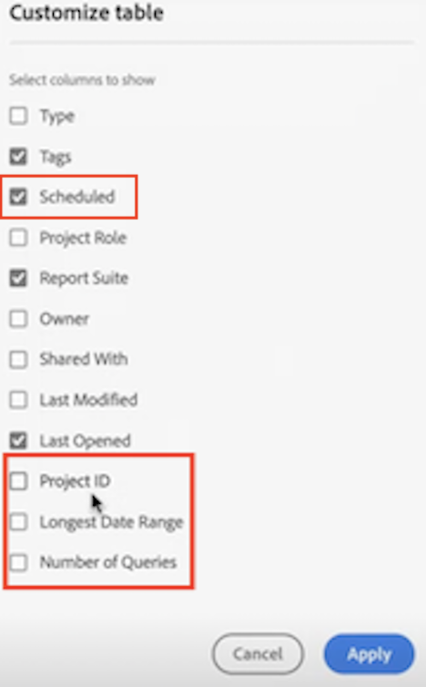

# Página de aterrizaje de Customer Journey Analytics

Se resalta la página de aterrizaje para el Customer Journey Analytics [!DNL Analysis Workspace] y cuenta con una página de inicio y una sección de aprendizaje del administrador de proyectos para ayudarle a administrar los datos de recorrido de los clientes de forma más eficaz.

>[!VIDEO](https://video.tv.adobe.com/v/334278/?quality=12)

## Características de la nueva página de aterrizaje {#new-features}

| Función | Descripción | Captura de pantalla |
| --- | --- | --- |
| Expandir la tabla de [!UICONTROL Proyectos] a pantalla completa | Para expandir la tabla, haga clic en el icono de menú de hamburguesa. Esta acción contraerá las pestañas del carril izquierdo. |  |
| Personalizar anchura de columna | Anteriormente, la anchura de la columna era fija. Ahora puede ajustarla arrastrando el separador de columnas. |  |
| Reordenar elementos anclados | Para mover los elementos anclados hacia arriba y hacia abajo, haga clic en los puntos suspensivos junto al elemento anclado y seleccione **[!UICONTROL Subir]** o **[!UICONTROL Bajar]**. |  |
| Nuevas columnas de tabla | Haga clic en el icono [!UICONTROL Personalizar tabla] en la parte superior derecha de la tabla. Las nuevas columnas de la tabla incluyen las siguientes: <ul><li>**[!UICONTROL Programado]**: establecer como [!UICONTROL Activado] cuando un proyecto está programado o [!UICONTROL Desactivado] cuando no lo está. Al hacer clic en el vínculo [!UICONTROL Activado], permite ver información sobre el proyecto programado. También puede [editar la programación del proyecto](../analysis-workspace/curate-share/t-schedule-report.md) si es el propietario del proyecto.</li><li>**[!UICONTROL ID del proyecto]**: el ID de proyecto se puede usar para depurar proyectos.</li><li>**[!UICONTROL Intervalo de fecha más largo]**: los intervalos de fechas más largos aumentan la complejidad del proyecto y pueden aumentar los tiempos de procesamiento y carga. </li><li>**[!UICONTROL Número de consultas]**: el número total de solicitudes realizadas a Analytics cuando se carga el proyecto. Un número mayor de consultas de proyectos aumenta la complejidad del proyecto y puede aumentar los tiempos de procesamiento y carga. Estos datos solo están disponibles después de que se haya cargado un proyecto o de que se haya enviado un proyecto programado. </li></ul> |  |
| **[!UICONTROL Crear proyecto]** el modal vuelve | Al hacer clic en **[!UICONTROL Crear proyecto]** en Workspace, una vez más puede elegir entre una [!UICONTROL Proyecto en blanco] y [!UICONTROL Informe de valoración móvil en blanco]. También puede elegir entre cualquier plantilla que haya creado su compañía. |  |
| También disponible en Customer Journey Analytics | Esta página de aterrizaje, en un formulario modificado, también está disponible en CJA. |  |

{style=&quot;table-layout:auto&quot;}

## Vaya a la pestaña [!UICONTROL Proyectos] {#navigate-projects}

[!UICONTROL Proyectos] sirve como página de inicio del [!UICONTROL Espacio de trabajo]. La pestaña Proyectos muestra la carpeta Empresa, las carpetas personales que ha creado, los proyectos y los informes de valoración de Mobile. Utilice esta página para ver, crear y modificar carpetas, proyectos y informes de valoración móviles. Para obtener más información, consulte [Acerca de las carpetas en Analytics](/help/analysis-workspace/build-workspace-project/workspace-folders/about-folders.md).

**[!UICONTROL Proyectos]** son diseños personalizados que combinan componentes de datos, tablas y visualizaciones que ha creado o que alguien más ha creado y compartido con usted. [!UICONTROL Proyectos] también hace referencia a proyectos y cuadros de resultados móviles en blanco.

>[!NOTE]
>
>Varias de las siguientes configuraciones persisten durante la sesión y entre sesiones. Por ejemplo, la ficha seleccionada, los filtros seleccionados, las columnas seleccionadas y la dirección de clasificación de las columnas. Los resultados de la búsqueda no son persistentes.

| Elemento de la IU | Definición |
| --- | --- |
| Editar preferencias | Le permite [!UICONTROL Ver tutoriales] y [Editar preferencias de usuario](/help/analysis-workspace/user-preferences.md). |
| [!UICONTROL Crear nuevo] | Abre el modal del proyecto, donde puede crear un proyecto de Workspace o un informe de valoración móvil o abrir una plantilla de empresa. |
| [!UICONTROL Mostrar menos  Mostrar más] | Alterna entre no mostrar y mostrar el titular:   |
| [!UICONTROL Proyecto del Espacio de trabajo] | Crea un espacio en blanco [Proyecto de Workspace](https://experienceleague.adobe.com/docs/analytics/analyze/analysis-workspace/home.html?lang=es) para que diseñe y construya. |
| [!UICONTROL Informe de valoración móvil] | Crea un espacio en blanco [informe de valoración móvil](https://experienceleague.adobe.com/docs/analytics/analyze/mobapp/curator.html?lang=es) para que diseñe y construya. |
| [!UICONTROL Tutorial de formación abierta] | Abre el tutorial de formación de Workspace que le guía a través del proceso de creación de un nuevo proyecto de inicio en un tutorial paso a paso. |
| [!UICONTROL Abrir notas de la versión] | Abre la sección Adobe Analytics de las últimas notas de la versión de Adobe Experience Cloud. |
| Icono de filtro | Filtros por etiquetas, grupos de informes, propietarios, tipos y otros filtros (Míos, Compartidos conmigo, Favoritos y Aprobados) |
| Barra de búsqueda | Busca todas las columnas de la tabla. |
| Cuadro de selección | Selecciona uno o varios proyectos para mostrar las acciones de administración de proyectos que puede realizar: **Eliminar**, **Compartir**, **Cambiar nombre**, **Copiar**, **Desanclar**, **Subir**, **Bajar**, **Etiqueta**, **Aprobar**, **Exportar CSV** y **Mover a**. Es posible que no tenga permisos para realizar todas las acciones de la lista. |
| [!UICONTROL Favoritos] | Agrega una estrella junto a un proyecto o carpeta favoritos que se puede usar como filtro. |
| [!UICONTROL Nombre] | Identifica el nombre del proyecto. |
| Icono de anclaje | Anclar elementos para que siempre aparezcan en la parte superior de la lista, pero puede volver a ajustar el orden moviéndolos hacia arriba o hacia abajo en el orden. Utilice el menú de opciones de elipsis y seleccione **Subir** o **Bajar** en la lista. |
| Icono de información (i) | Muestra la siguiente información sobre un proyecto: Escriba, función del proyecto, propietario, descripción y con quién se comparte. También indica quién puede [editar o duplicar](https://experienceleague.adobe.com/docs/analytics/analyze/analysis-workspace/curate-share/share-projects.html?lang=es) este proyecto. |
| Puntos suspensivos (...) | Muestra las acciones de administración de proyectos que puede realizar: **Eliminar**, **Compartir**, **Cambiar nombre**, **Copiar**, **Desanclar**, **Subir**, **Bajar**, **Etiqueta**, **Aprobar**, **Exportar CSV** y **Mover a**. Es posible que no tenga permisos para realizar todas las acciones de la lista. |
| [!UICONTROL Tipo] | Indica si este tipo es un proyecto de Workspace, un informe de valoración móvil o una carpeta. |
| [!UICONTROL Etiquetas] | Etiqueta proyectos para organizarlos en grupos. |
| [!UICONTROL Función del proyecto] | Identifica las funciones del proyecto: si es el propietario del proyecto y si tiene permisos para editar o duplicar el proyecto. |
| [!UICONTROL Grupo de informes] | Identifica los grupos de informes asociados al proyecto. Las tablas y visualizaciones de un panel derivan datos del grupo de informes seleccionado en la parte superior derecha del panel. El grupo de informes también determina qué componentes están disponibles en el carril izquierdo. Dentro de un proyecto, puede utilizar uno o varios grupos de informes en función de los casos de uso del análisis. La lista de grupos de informes se ordena según la relevancia. Adobe define la relevancia en función del uso reciente y de la frecuencia con que el usuario actual ha utilizado el grupo, y en función de la frecuencia con la que el grupo se utiliza dentro de la organización. |
| [!UICONTROL Propietario] | Identifica a la persona que creó el proyecto. |
| [!UICONTROL Última apertura] | Identifica la última fecha en que abrió el proyecto. |
| Icono Personalizar tabla | Selecciona qué columnas se verán en la tabla. Para agregar o quitar columnas de la lista de proyectos, haga clic en el icono de columna ( ) en la parte superior derecha, seleccione o anule la selección de los títulos de las columnas. |
| MOSTRAR: Carpetas y proyectos para todos los proyectos | Cambia la configuración de vista de la tabla para mostrar carpetas y proyectos según la organización de carpetas **o** mostrar todos los proyectos en una lista desorganizada. |
| &lt; (Botón Atrás) | Le devuelve a la configuración de página de aterrizaje más reciente de un proyecto de Workspace. La configuración de página que tenía al salir de la página de aterrizaje persistirá cuando vuelva. |

## Vaya a la pestaña Aprendizaje {#navigate-learning}

La página Aprendizaje contiene tutoriales y recorridos en vídeo prácticos, además de vínculos a documentación.

* El recorrido [!UICONTROL Conceptos básicos del Espacio de trabajo] le lleva directamente a Espacio de trabajo, y le explica el diseño del Espacio de trabajo y dónde encontrar y realizar las acciones más comunes. También se puede reiniciar en cualquier momento directamente en el Espacio de trabajo en la ventana emergente de información del panel del encabezado.
* Al hacer clic en un vídeo/recorrido, se agrega la etiqueta **[!UICONTROL Visto]**. Esta etiqueta le ayuda a realizar un seguimiento del progreso por el contenido de aprendizaje. Puede hacer clic en la etiqueta y desaparece, en caso de que aún no haya completado el contenido.
* El botón **[!UICONTROL Más información]** del modo de vídeo le lleva a una página de documentación de Adobe Experience League con más contenido de ayuda relacionado con el vídeo que acaba de ver.  **[!UICONTROL Ver más vídeos]** le dirige a la lista de reproducción completa de YouTube de Analysis Workspace.

## Establecer la página de aterrizaje {#set-landing}

Los usuarios pueden establecer su página de aterrizaje preferida.

1. Vaya a Analytics > [!UICONTROL Componentes] > [!UICONTROL Preferencias] > [!UICONTROL General].
1. Compruebe qué página de aterrizaje preferiría:

   

## Preguntas frecuentes sobre la página de aterrizaje {#landing-faq}

| Pregunta | Respuesta |
| --- | --- |
| ¿El trabajo realizado en la IU del programa beta se transfiere a la experiencia de producción del [!UICONTROL espacio de trabajo]? | Sí, cualquier trabajo realizado en la versión beta se transfiere a la experiencia antigua/actual del [!UICONTROL Espacio de trabajo]. |
| ¿Hay un número máximo de proyectos que pueda fijar? | No, no hay límite en el número de proyectos que puede fijar. |
| ¿Pueden los administradores designar esta página de aterrizaje para sus usuarios? | No, los administradores no pueden designar la página de aterrizaje en nombre de los usuarios. Los usuarios individuales deben activar la opción ellos mismos. |
<!-- | Are all reports that currently exist in [!DNL Reports & Analytics] still available? | No, the following reports were phased out, based on overall usage data: <ul><li>Any custom eVars/props/events/classifications<li>My Recommended Reports</li><li>Hourly/Daily/Weekly/Monthly/Quarterly/Yearly unique visitors</li><li>DailyWeekly/Monthly/Quarterly/Yearly unique customers</li><li>Action name depth</li><li>Action name summary</li><li>Add dashboard</li><li>Age</li><li>Audio support</li><li>Billing information</li><li>Clicks to page</li><li>Color depth</li><li>Cookie support</li><li>Cookies</li><li>Connection types</li><li>Creative elements</li><li>Credit card type</li><li>Cross sell</li><li>Custom event funnels</li><li>Custom links</li><li>Customer ID</li><li>Day of week</li><li>Entry action name</li><li>Exit action name</li><li>Exit links</li><li>Fallout</li><li>File downloads</li><li>Find in store</li><li>Full paths</li><li>Gender</li><li>Hit ype VISTA rule</li><li>Image support</li><li>Java</li><li>JavaScript</li><li>JavaScript version</li><li>Manage bookmarks</li><li>Manage dashboards</li><li>Monitor color depth</li><li>Monitor resolutions</li><li>Newsletter signups</li><li>Next action name</li><li>Next action name flow</li><li>Null searches</li><li>Operating system</li><li>Order review</li><li>Page of day</li><li>Pages not found</li><li>Pathfinder</li><li>Path length</li><li>Previous action name</li><li>Previous action name flow</li><li>Product activity</li><li>Product cost</li><li>Product department</li><li>Product inventory category</li><li>Product name</li><li>Product reviews</li><li>Product season</li><li>Product shares</li><li>Product zooms</li><li>Reload</li><li>Searches</li><li>Servers</li><li>Single page visits</li><li>Shipping information</li><li>Site hierarchy</li><li>Social mentions</li><li>Time of day</li><li>Time spent on action name</li><li>Video support</li><li>Visitor state</li></ul> | -->
