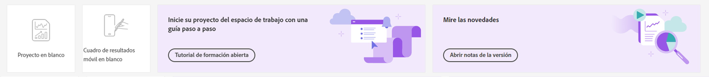

# Página de aterrizaje de Customer Journey Analytics

La página de aterrizaje para Customer Journey Analytics incluye una página de inicio del administrador de proyectos y una sección de aprendizaje para ayudarle a empezar de forma más eficaz.

>[!VIDEO](https://video.tv.adobe.com/v/334278/?quality=12)

## Acceso a la página de aterrizaje {#access-landing}

Después de iniciar sesión en Adobe Experience Cloud y Customer Journey Analytics, habilite la variable [!UICONTROL Nueva página de aterrizaje: beta] botón de alternancia en la esquina inferior izquierda. El acceso al botón de alternancia es específico del usuario por organización, no por empresa.

Puede

* Expanda el [!UICONTROL Proyectos] a pantalla completa. Para expandir la tabla, haga clic en el icono de menú hamburguesa. Esta acción contraerá las pestañas del carril izquierdo.
* Personalice el ancho de la columna arrastrando el separador de columnas.
* Reordenar los elementos anclados. Para mover los elementos anclados hacia arriba y hacia abajo, haga clic en los puntos suspensivos junto al elemento anclado y seleccione **[!UICONTROL Subir]** o **[!UICONTROL Bajar]**.

## Vaya a la pestaña [!UICONTROL Proyectos] {#navigate-projects}

[!UICONTROL Proyectos] sirve como página de inicio del [!UICONTROL Espacio de trabajo]. Aquí se muestra cualquier proyecto del Espacio de trabajo, incluidos los cuadros de resultados móviles. **[!UICONTROL Proyectos]** son cosas que ha creado usted, o que otra persona ha creado y compartido con usted. [!UICONTROL Proyectos] también hace referencia a proyectos y cuadros de resultados móviles en blanco.

>[!NOTE]
>
>Varias de las siguientes configuraciones persisten (se recuerdan) durante la sesión y entre sesiones. Ejemplos: En qué pestaña se encuentra, qué filtros y qué columnas se seleccionaron y la dirección de clasificación de las columnas. Los resultados de la búsqueda, sin embargo, no se mantienen.

| Elemento de la IU | Definición |
| --- | --- |
| ... Más | Le permite [!UICONTROL Ver tutoriales] y [Editar preferencias de usuario](/help/analyze/analysis-workspace/user-preferences.md). |
| **[!UICONTROL Crear nuevo]** el modal vuelve | Al hacer clic en **[!UICONTROL Crear nuevo]** en Workspace, una vez más puede elegir entre una [!UICONTROL Proyecto en blanco] y [!UICONTROL Informe de valoración móvil en blanco]. También puede elegir entre cualquier plantilla que haya creado su empresa. |
| [!UICONTROL Mostrar menos/más] | Alterna entre no mostrar y mostrar el banner:  |
| [!UICONTROL Proyecto en blanco] | Crea un [proyecto del Espacio de trabajo](https://experienceleague.adobe.com/docs/analytics/analyze/analysis-workspace/home.html?lang=es) en blanco para que lo rellene. |
| [!UICONTROL Cuadro de resultados móvil en blanco] | Crea un [cuadro de resultados móvil](https://experienceleague.adobe.com/docs/analytics/analyze/mobapp/curator.html?lang=es) en blanco para que lo rellene. |
| [!UICONTROL Tutorial de formación abierta] | Abre el tutorial de aprendizaje del Espacio de trabajo que guía paso a paso a los nuevos usuarios durante el proceso de creación de un proyecto. |
| [!UICONTROL Abrir notas de la versión] | Abre las últimas notas de la versión de Adobe Experience Cloud. |
| Icono de filtro | Puede filtrar por etiquetas, grupos de informes, propietarios, tipos y otros filtros (Míos, Compartidos conmigo, Favoritos y Aprobados) |
| Barra de búsqueda | La búsqueda ahora incluye todas las columnas de la tabla. |
| Cuadro de selección | Al hacer clic en este cuadro junto a uno o varios proyectos, se muestran las acciones de administración de proyectos que puede realizar: eliminar, etiquetar, fijar, aprobar, compartir, cambiar el nombre, copiar y exportar a CSV. Es posible que no tenga permisos para realizar todas estas acciones. |
| [!UICONTROL Favoritos] | Al marcar como favorito un proyecto, se coloca una estrella al lado y se etiqueta como favorito, categoría por la que podrá filtrar. |
| [!UICONTROL Nombre] | El nombre del proyecto. |
| Icono de información (i) | Al hacer clic en el icono de información, se muestra la siguiente información acerca de este proyecto: tipo, función del proyecto, propietario, descripción y con quién se comparte. También indica quién puede [editar o duplicar](https://experienceleague.adobe.com/docs/analytics-platform/analysis-workspace/curate-share/share-projects.html) este proyecto. |
| Puntos suspensivos (...) | Al hacer clic en los puntos suspensivos junto a un proyecto, se muestran las acciones de administración de proyectos que puede realizar: eliminar, etiquetar, fijar, aprobar, compartir, cambiar nombre, copiar y exportar a CSV. Tenga en cuenta que es posible que no tenga permisos para realizar todas estas acciones. |
| [!UICONTROL Tipo] | Indica si este tipo se trata de un proyecto del Espacio de trabajo o de un cuadro de resultados móvil. |
| [!UICONTROL Etiquetas] | Los informes se pueden etiquetar para organizarlos en grupos. |
| [!UICONTROL Función del proyecto] | Las funciones de proyecto hacen referencia a si es el propietario del proyecto y si tiene permisos para editar o duplicar el proyecto. |
| [!UICONTROL Vista de datos] | Las tablas y visualizaciones de un panel obtienen datos de la vista de datos seleccionada en la parte superior derecha del panel. La vista de datos también determina qué componentes están disponibles en el carril izquierdo. Dentro de un proyecto, puede utilizar una o varias vistas de datos, según los casos de uso del análisis. La lista de vistas de datos se ordena según la relevancia. El Adobe define la relevancia en función de la frecuencia y la frecuencia con que el usuario actual ha utilizado la vista de datos y la frecuencia con que se utiliza la vista de datos dentro de la organización. |
| [!UICONTROL Propietario] | La persona que creó el proyecto. |
| [!UICONTROL Compartido con] | Con quién se compartió este proyecto. |
| [!UICONTROL Última modificación] | La última vez que se modificó este proyecto. |
| [!UICONTROL Última apertura] | La última vez que abrió este proyecto. |
| [!UICONTROL Programado] | Establecer como [!UICONTROL Activado] cuando un proyecto está programado o **[!UICONTROL Off]** cuando no lo sea. Al hacer clic en **[!UICONTROL Activado]** link permite ver información sobre el proyecto programado. También puede [editar la programación del proyecto](/help/analyze/analysis-workspace/curate-share/t-schedule-report.md) si es el propietario del proyecto. |
| [!UICONTROL ID de proyecto] | El ID de proyecto se puede usar para depurar proyectos. |
| [!UICONTROL Intervalo de fecha más largo] | Los intervalos de fechas más largos aumentan la complejidad del proyecto y pueden aumentar los tiempos de procesamiento y carga. |
| [!UICONTROL Cantidad de consultas] | Un número mayor de consultas de proyectos aumenta la complejidad del proyecto y puede aumentar los tiempos de procesamiento y carga. |
| Icono Personalizar tabla | (Parte superior derecha) Si desea añadir o eliminar columnas de la lista de proyectos, puede hacerlo seleccionándolas o anulándolas. |
| &lt; (Botón Atrás) | Este botón de un proyecto de Workspace le lleva de nuevo a la configuración más reciente de la página de aterrizaje. Cualquiera que sea la configuración de la página que tenía cuando abandonó la página de aterrizaje, se mantendrá cuando regrese. |

## Vaya a la pestaña Aprendizaje {#navigate-learning}

La página Aprendizaje contiene tutoriales y recorridos en vídeo prácticos, además de vínculos a documentación.

* El recorrido [!UICONTROL Conceptos básicos del Espacio de trabajo] le lleva directamente a Espacio de trabajo, y le explica el diseño del Espacio de trabajo y dónde encontrar y realizar las acciones más comunes. También se puede reiniciar en cualquier momento directamente en el Espacio de trabajo en la ventana emergente de información del panel del encabezado.
* Al hacer clic en un vídeo/recorrido, se agrega la etiqueta **[!UICONTROL Visto]**. Esta etiqueta le ayuda a realizar un seguimiento del progreso por el contenido de aprendizaje. Puede hacer clic en la etiqueta y desaparece, en caso de que aún no haya completado el contenido.
* El botón **[!UICONTROL Más información]** del modo de vídeo le lleva a una página de documentación de Adobe Experience League con más contenido de ayuda relacionado con el vídeo que acaba de ver.  **[!UICONTROL Ver más vídeos]** le dirige a la lista de reproducción completa de YouTube de Analysis Workspace.

## Preguntas frecuentes sobre la página de aterrizaje {#landing-faq}

| Pregunta | Respuesta |
| --- | --- |
| ¿Hay un número máximo de proyectos que pueda fijar? | No, no hay límite en el número de proyectos que puede fijar. |
| ¿Pueden los administradores designar esta página de aterrizaje para sus usuarios? | No, los administradores no pueden designar la página de aterrizaje en nombre de los usuarios. Los usuarios individuales deben activar la opción ellos mismos. |