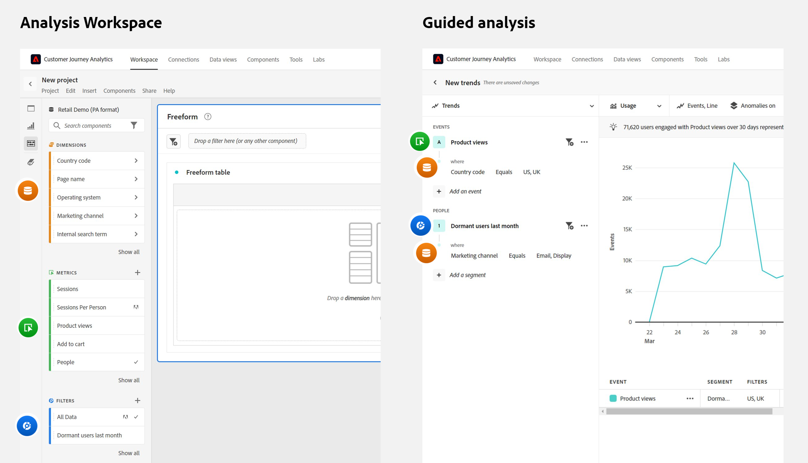
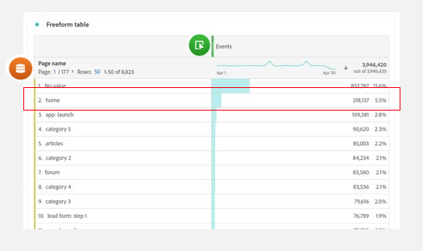
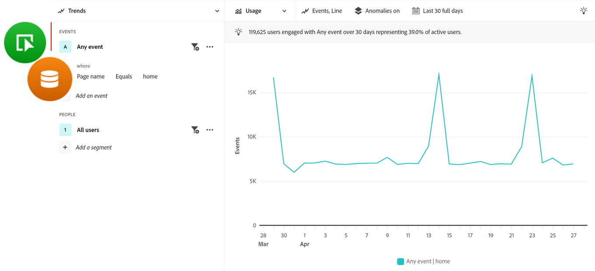

# Preguntas frecuentes sobre análisis guiados

Preguntas frecuentes sobre el análisis guiado.

+++**¿Cómo se puede aprovisionar a mi organización para el análisis guiado?**

El análisis guiado es un complemento de pago para Customer Journey Analytics. Si desea empezar a utilizar este complemento, póngase en contacto con el equipo de cuenta de Adobe.

+++

+++**¿Qué cambios de implementación se requieren para utilizar el análisis guiado?**

Si ya utiliza Customer Journey Analytics hoy, no es necesario realizar cambios de implementación adicionales. El análisis guiado utiliza el mismo [Vistas de datos](../data-views/data-views.md) y [Conexiones](../connections/overview.md) como otras interfaces de CJA, como [Analysis Workspace](../analysis-workspace/home.md).

Para permitir que los usuarios finales tengan más éxito con el análisis guiado, se recomienda tener un esquema de eventos y una estrategia de administración sólidos en Adobe Experience Platform y [Vistas de datos](../data-views/data-views.md).

+++

+++**¿Cuándo se debe utilizar el análisis guiado o Analysis Workspace?**

**Análisis guiado** puede ayudar a los usuarios a obtener perspectivas de alta calidad rápidamente. Resulta útil para equipos de productos, usuarios que buscan trabajar con datos con mayor confianza e incluso analistas como punto de partida para un análisis más profundo.

**[Analysis Workspace](../analysis-workspace/home.md)** es un espacio de forma más libre que le permite profundizar en los datos para descubrir más perspectivas. Resulta útil para analistas y usuarios avanzados que comprenden bien los datos y desean profundizar en ellos.

+++

+++**¿En qué se diferencia la terminología entre Análisis guiado y Analysis Workspace?**

El análisis guiado utiliza términos que se utilizan con mayor frecuencia entre los equipos de productos. Puede hacer referencia a esta tabla al cambiar entre Análisis guiado y [Analysis Workspace](../analysis-workspace/home.md).

| Término del análisis guiado | Término de Analysis Workspace |
| --- | --- |
| Evento | Métrica |
| Usuarios | Personas |
| Propiedad | Dimensión |
| Valor | Elemento de dimensión |
| Segmento | Filtro |

{style="table-layout:auto"}

+++

+++**¿Cuáles son algunas diferencias en la forma en que el análisis guiado y el enfoque de Analysis Workspace aplican la creación de informes?**

While [Analysis Workspace](../analysis-workspace/home.md) y el análisis guiado utilizan los mismos datos subyacentes; la forma en que cada herramienta permite formar consultas de esos datos es diferente.

* **Analysis Workspace es una experiencia centrada en las dimensiones.** Las tablas suelen consistir en filas dimensionales, mientras que las columnas suelen ser métricas. Los filtros se pueden aplicar tanto en filas como en columnas para obtener los datos deseados.

* **El análisis guiado es una experiencia centrada en eventos.** Cada análisis comienza seleccionando eventos. A continuación, se pueden añadir dimensiones y filtros para restringir los datos de evento.

Preste atención al siguiente ejemplo, en el que se centra en los datos de la página principal del sitio web. Los equipos hacen preguntas similares, pero el enfoque del análisis puede ser diferente.

* Un enfoque típico de Analysis Workspace centrado en las dimensiones sería, &quot;Veamos la página de inicio y cuántas vistas de página recibió&quot;.

  

* Un enfoque típico del análisis guiado centrado en eventos sería: &quot;¿Cuántos usuarios han visto la página principal?&quot;

  

+++
