# Casos de uso del sector

Esta página proporciona algunos ejemplos ilustrativos del sector de lo que los equipos de experiencia del cliente, desde analistas hasta equipos de producto y especialistas en marketing, pueden lograr con un análisis guiado.

+++**Comercial**

| Caso de uso | Ejemplo | Impacto | Análisis |
| --- | --- | --- | --- |
| **Optimización de la aplicación de compras móvil** | Muchos clientes descargaron la aplicación móvil de una organización, pero nunca regresaron. La compañía descubre que los clientes lo utilizan solo para la oferta inicial. Volvieron a atraer a esos clientes latentes. | **Aumente el LTV de los usuarios móviles.** Mida y aumente el uso de la aplicación para desarrollar una experiencia de usuario de “ruta feliz”. | [Vista de crecimiento activo del usuario](types/active.md) [Vista de crecimiento neto](types/net-growth.md) |
| **Cuantificar el impacto de las nuevas funciones de cierre de compra** | Un supermercado prueba su camino en las compras en línea. Miden rápidamente el impacto de las nuevas funciones de cierre de compra, como las recomendaciones de productos o la recogida en la acera. | **Aumentar las tasas de conversión.** Mida el impacto en la empresa en lugar de usar solamente las funciones. | [Vista de impacto de versión](types/release.md) [Vista de primer uso](types/first-use.md) |
| **Reducir la cancelación de abonos** | Una organización descubre puntos de fricción en los recorridos del cliente que hacen que los clientes se pierdan. Les permite revisar los programas de abono y analizar los comportamientos de los miembros en riesgo. | **Reduzca la cancelación.** Identifique formas de fomentar y nutrir las relaciones con los clientes para evitar el desgaste y reducir la cancelación. | [Vista de crecimiento activo del usuario](types/active.md) [Vista de fricción](types/friction.md) |
| **Encuentre recorridos de ventas ineficientes** | Una organización descubre ineficiencias en el recorrido de los socios comerciales en el establecimiento, cuando se alejan de los clientes. Ajustan su proceso, lo que ofrece a los clientes una experiencia de compra en la tienda más agradable. | **Mejorar la respuesta de ventas.** Reduzca los procesos ineficientes, lo que mejora los recorridos internos y la experiencia del cliente. | [Vista de fricción](types/friction.md) |

{style="table-layout:auto"}

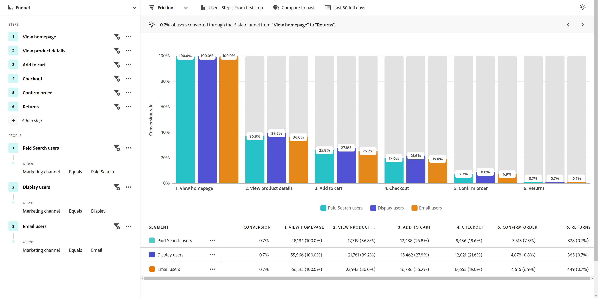{style="border:1px solid gray"}

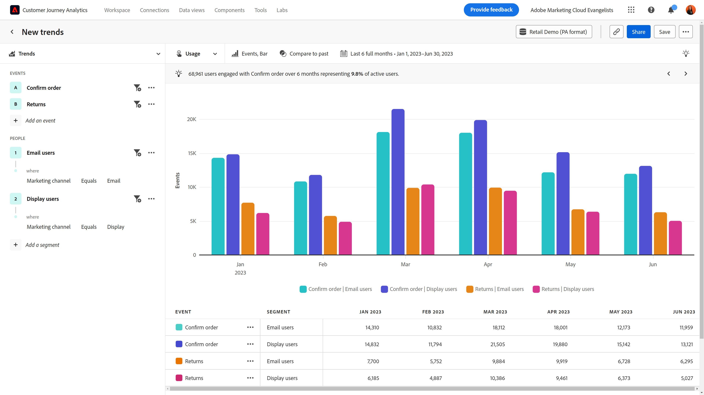{style="border:1px solid gray"}

+++

+++**Servicios financieros**

| Caso de uso | Ejemplo | Impacto | Análisis |
| --- | --- | --- | --- |
| **Cuantificar el impacto de las nuevas funciones** | Una institución financiera implanta transferencias bancarias con Zelle y quiere entender el impacto de la nueva función en las transferencias finales. El análisis guiado les permite ver cómo reaccionan los clientes para que el equipo de marketing pueda implementarlo. | **Aumentar las tasas de conversión.** Mida el impacto de las nuevas funciones en las conversiones de transferencia. | [Vista de impacto de versión](types/release.md) [Vista de primer uso](types/first-use.md) |
| **Desviar llamadas al centro de llamadas** | El análisis guiado revela que el proceso de reclamación móvil de cinco pasos de una organización dirige las llamadas a su centro de llamadas. Crean una audiencia y envían un correo electrónico a esos clientes para comprender mejor su experiencia. | **Aísle la fricción en la experiencia.** Mejore los recorridos de “ruta feliz” y reduzca las llamadas. | [Vista de fricción](types/friction.md) [Vista de tendencias de conversión](types/conversion-trends.md) |
| **Reducir la cancelación de cliente** | Una organización sabe que los clientes que inician sesión en la aplicación móvil de banca con frecuencia mensual siguen siendo clientes durante más tiempo. El análisis guiado les permite identificar quién está en riesgo de cancelación y crear una estrategia de recuperación. | **Reduzca la cancelación.** Mantenga el nivel de clientes mientras gasta para adquirir nuevos clientes reales. | [Vista de crecimiento activo del usuario](types/active.md) [Vista de crecimiento neto](types/net-growth.md) |
| **Recomendación de nuevas funciones** | Una organización observa que los retiros digitales han disminuido en los últimos meses. El número de llamadas a un asesor financiero ha aumentado. El análisis guiado ayuda a la organización a priorizar las optimizaciones de procesos digitales con un comité directivo. | **Cree una hoja de ruta basada en datos.** Utilice los datos para planificar e implementar las optimizaciones. | [Vista de tendencias de uso](types/usage.md) |

{style="table-layout:auto"}

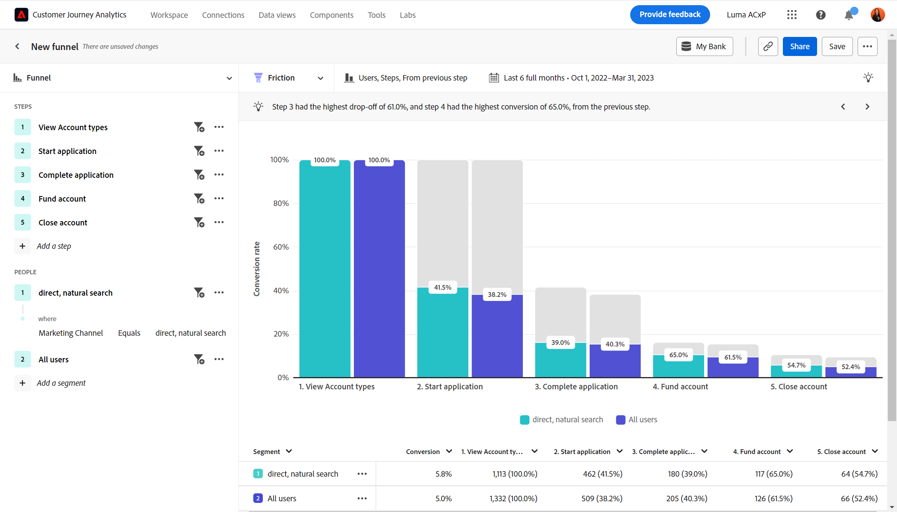{style="border:1px solid gray"}

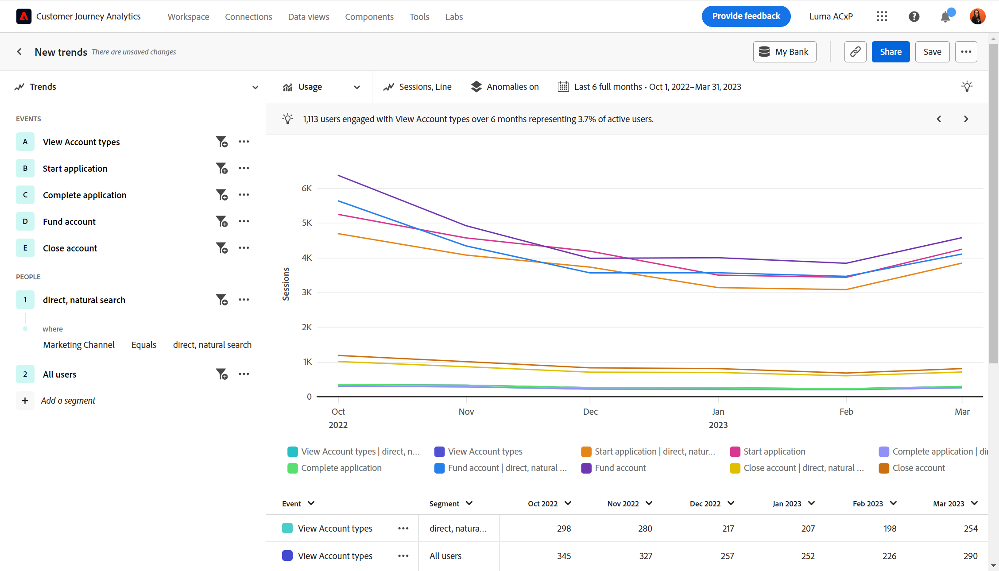{style="border:1px solid gray"}

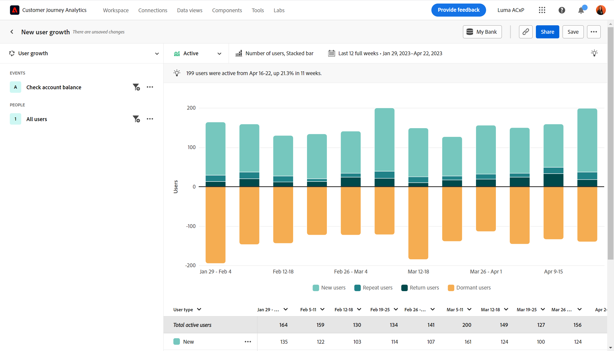{style="border:1px solid gray"}

+++

+++**Viajes y hostelería**

| Caso de uso | Ejemplo | Impacto | Análisis |
| --- | --- | --- | --- |
| **Cuantificar el impacto de las nuevas funciones de flujo de reservas** | Una organización utiliza el análisis guiado para ver rápidamente el impacto de una nueva función de pasos de reserva en las tasas de conversión. Identifican la parte de la experiencia con las mayores ganancias. | **Aumente las tarifas de reserva.** Mida el impacto en la empresa en lugar de usar solamente las funciones. | [Vista de impacto de versión](types/release.md) [Vista de fricción](types/friction.md) |
| **Optimizar la experiencia de la aplicación móvil** | Una organización comprende rápida y fácilmente a los usuarios de aplicaciones activas mensuales a lo largo del tiempo e identifica el impacto positivo por versión. | **Aumente las MAU.** Mida y aumente el uso de la aplicación, que se correlaciona con la felicidad del cliente. | [Vista de crecimiento activo del usuario](types/active.md) [Vista de crecimiento neto](types/net-growth.md) |
| **Encuentre fricción en el flujo de facturación móvil** | Ver si las personas tienen éxito o abandonan el proceso de registro móvil esperado permite a una organización identificar fácilmente las áreas para la optimización de experiencias. | **Aumente el CSAT y reduzca los IROP.** La eliminación de la fricción conduce a una experiencia de “día de viaje” más fluida. | [Vista de fricción](types/friction.md) [Vista de tendencias de conversión](types/conversion-trends.md) |
| **Desviar llamadas al centro de llamadas** | Ver la experiencia del usuario en una vista de canal muestra a un usuario donde los visitantes entran en fricción, lo que conduce a un volumen costoso del centro de llamadas. Los siguientes pasos en los que centrarnos son claros. | **Reduzca el uso del centro de llamadas.** Obtenga más experiencias de usuario de “ruta feliz” y reduzca las llamadas costosas. | [Vista de fricción](types/friction.md) [Vista de tendencias de conversión](types/conversion-trends.md) |

{style="table-layout:auto"}

{style="border:1px solid gray"}

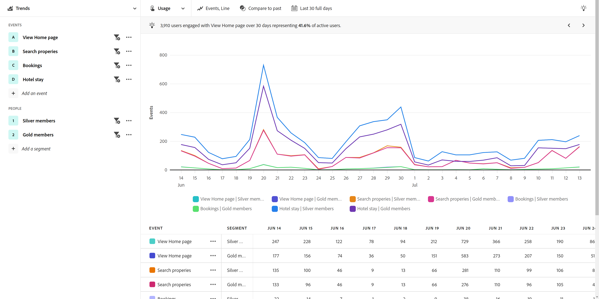{style="border:1px solid gray"}

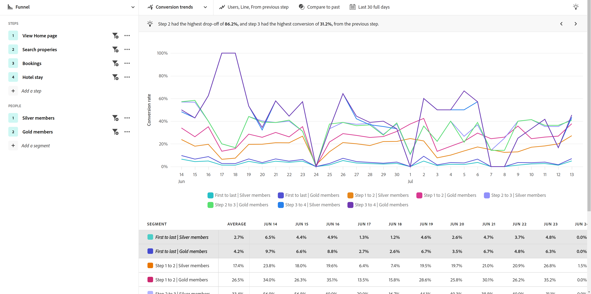{style="border:1px solid gray"}

+++

+++**Medios de comunicación y entretenimiento**

| Caso de uso | Ejemplo | Impacto | Análisis |
| --- | --- | --- | --- |
| **Cuantificar el impacto de los nuevos programas o series** | Un servicio de streaming puede analizar el efecto en el espectador después de que los usuarios vean un nuevo programa o serie y comprender mejor qué contenido resuena. | **Aumentar audiencia.** Encuentre el contenido que tenga un mayor impacto en la audiencia. | [Vista de primer uso](types/first-use.md) |
| **Identificar riesgo de cancelación** | Una organización ve una alta tasa de rotación de clientes que se suscriben a su plataforma para ver un evento de temporada y cancelar inmediatamente después de que termine el evento. La identificación rápida de estos usuarios les permite mostrar recomendaciones que atraen a los clientes para que sigan participando en la plataforma. | **Conservar suscriptores satisfechos.** Encuentre contenido que involucre a un segmento de crecimiento para que intervenga con recomendaciones. | [Vista de crecimiento activo del usuario](types/active.md) [Vista de crecimiento neto](types/net-growth.md) |
| **Buscar oportunidades para impulsar las ventas** | Una parte vital del crecimiento de los ingresos de una organización es comprender qué ofertas en la aplicación son más atractivas para los aficionados mientras están en el estadio. El análisis guiado les permite ver exactamente qué ofertas son más efectivas. | **Aumentar los ingresos complementarios.** Comprenda el impacto de las ofertas en la aplicación en los comportamientos de compra. | [Vista de primer uso](types/first-use.md) [Vista de fricción](types/friction.md) |
| **Optimización de la experiencia entre dispositivos** | Una organización desea analizar cómo los suscriptores interactúan con varios dispositivos o aplicaciones. Este conocimiento les permite comprender los patrones de consumo de contenido y determinar dónde sería mejor redirigirlos. | **Personalice la experiencia.** Comprenda qué contenido resuena mejor con los suscriptores de cada dispositivo. | [Vista de tendencias de uso](types/usage.md) |
| **Desviar llamadas al centro de llamadas** | Una organización utiliza el análisis guiado para identificar un problema por el que la pago automático no funciona, lo que provocó que los clientes frustrados llamaran a su centro de asistencia para cancelar el plan. | **Reducir las llamadas de asistencia.** Cree una mejor experiencia del cliente y reduzca las llamadas al servicio de atención al cliente. | [Vista de fricción](types/friction.md) [Vista de tendencias de conversión](types/conversion-trends.md) |

{style="table-layout:auto"}

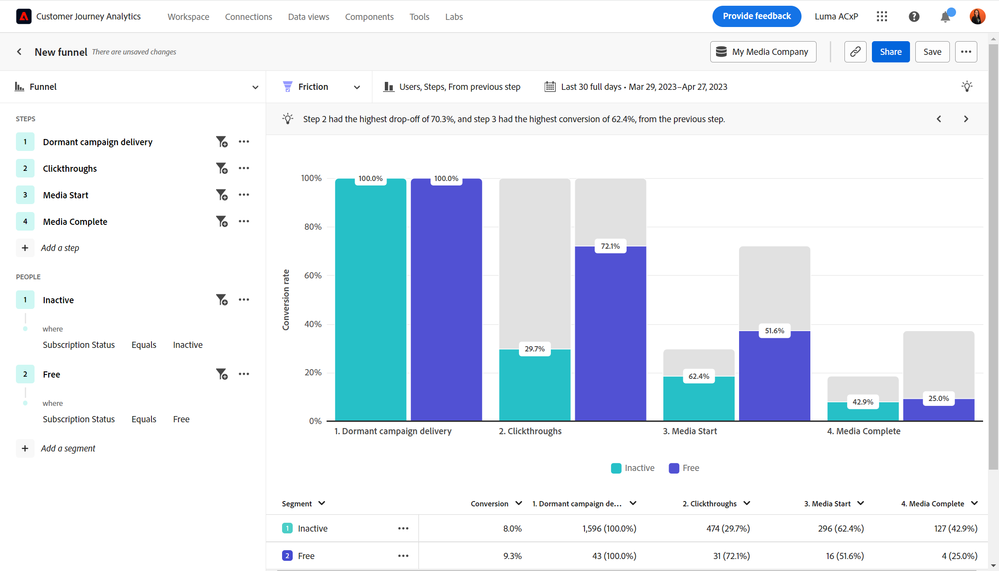{style="border:1px solid gray"}

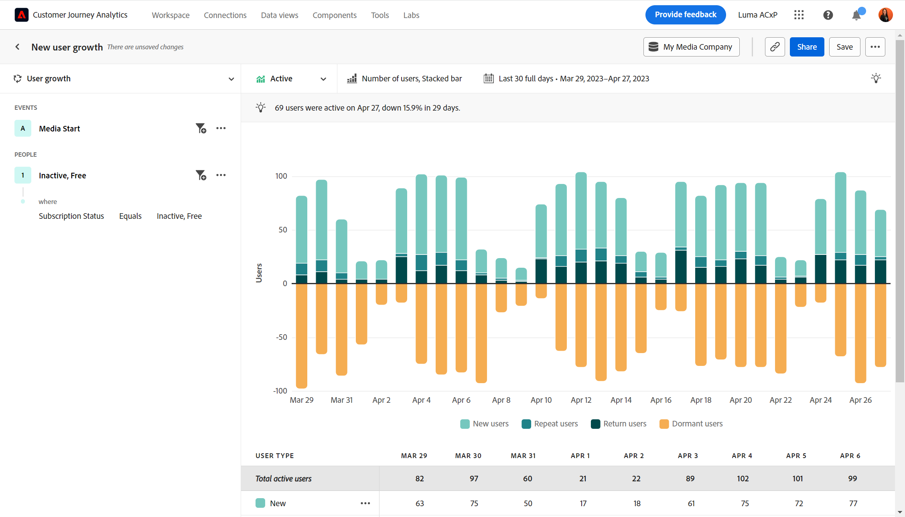{style="border:1px solid gray"}

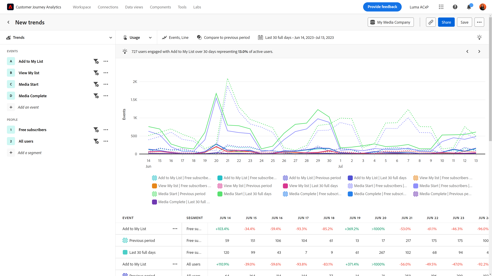{style="border:1px solid gray"}

+++

+++**Sanidad**

| Caso de uso | Ejemplo | Impacto | Análisis |
| --- | --- | --- | --- |
| **Mejorar los resultados de salud del paciente** | Una organización tiene los datos para enfocar sus esfuerzos en el crecimiento. Antes de usar el análisis guiado, no tenían una idea clara de cuántos miembros del plan de bienestar por semana simplemente dejaron de usarlo por completo. | **Reducir las visitas al médico.** Se identificaron rápidamente usuarios inactivos para volver a participar. | [Vistas del crecimiento de usuarios activos](types/active.md) |
| **Mejorar la experiencia del paciente** | La visibilidad de cuántos pacientes contactan con centros de llamadas para un simple restablecimiento de contraseña renovó la pasión de un analista por centrarse con láser en fortalecer su experiencia del paciente. | **Reduzca el coste total del servicio.** Cree una mejor experiencia del paciente y reduzca las llamadas a los servicios para pacientes. | [Vista de tendencias de uso](types/usage.md) [Vista de fricción](types/friction.md) |
| **Identificación de acciones repetidas en canales múltiples por segmento** | Una organización quiere entender cómo los miembros elegibles de Medicare están activos con el uso de su plan para proporcionarles mensajes específicos en sus productos digitales. Los conocimientos obtenidos del análisis guiado ayudan a que el marketing sea más eficaz. | **Personalice las opciones de inscripción en Medicare.** Comparar acciones secuenciales comunes de los miembros de mi plan más activo. | [Vista de fricción](types/friction.md) [Vista de crecimiento activo del usuario](types/active.md) |
| **Conservar los mejores talentos de la industria** | Los recursos de Analytics para una organización están limitados por el tiempo. El análisis guiado permite a la organización obtener rápidamente los datos de uso del producto necesarios para las llamadas de actualización de liderazgo. | **Reduzca la carga de trabajo de analistas.** Obtenga respuestas más rápido. Informes accesibles para cuando sea más crucial. | [Análisis guiado](overview.md) |

{style="table-layout:auto"}

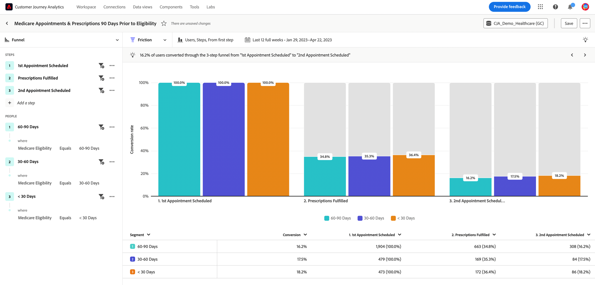{style="border:1px solid gray"}

+++

+++**Alta tecnología y B2B**

| Caso de uso | Ejemplo | Impacto | Análisis |
| --- | --- | --- | --- |
| **Cuantificar el impacto de las nuevas funciones** | Una organización puede analizar el aumento del uso de una nueva función de producto y determinar qué segmentos funcionan mejor. Este análisis les ayuda a priorizar dónde gastar los recursos para maximizar la participación del usuario y fortalecer su asociación con el marketing. | **Priorización basada en datos.** Tome decisiones informadas sobre la asignación de recursos. | [Vista de impacto de versión](types/release.md) [Vista de primer uso](types/first-use.md) |
| **Identificar funciones que están infrautilizando el producto** | Una organización diseña un producto para que lo utilicen los ingenieros, los jefes de producto y el departamento de marketing. El análisis guiado mostró que, si bien los gestores de producto y los especialistas en marketing lo utilizan casi a diario, el personal de ingeniería no lo adoptó en gran medida. | **Aumente la adopción de productos.** Identifique rápidamente el comportamiento del usuario de varias formas. | [Vista de crecimiento activo del usuario](types/active.md) [Vista de crecimiento neto](types/net-growth.md) |
| **Eliminación de puntos de fricción en el proceso de conversión** | Si se requiere un número de pedido de compra en el flujo de compra, se impide que los usuarios que prefieren tarjetas de crédito completen sus pedidos. Las conversiones aumentaban cuando ese campo se convertía en opcional. | **Mejore la experiencia del cliente.** Reduzca la cancelación potencial. | [Vista de fricción](types/friction.md) [Vista de tendencias de conversión](types/conversion-trends.md) |
| **Desbloquear análisis de autoservicio** | Obtener acceso a las perspectivas es un desafío y algunos usuarios de una organización no están formados para el análisis. El análisis guiado les permite obtener respuestas y aprovechar los mismos datos que utiliza el resto de la organización, lo que conduce a asociaciones más sólidas y permite tomar decisiones verdaderas basadas en datos. | **Colaboraciones más estrechas en toda la organización.** Conceda a los gestores de producto acceso a los datos que antes estaban en silo. | [Análisis guiado](overview.md) |

{style="table-layout:auto"}

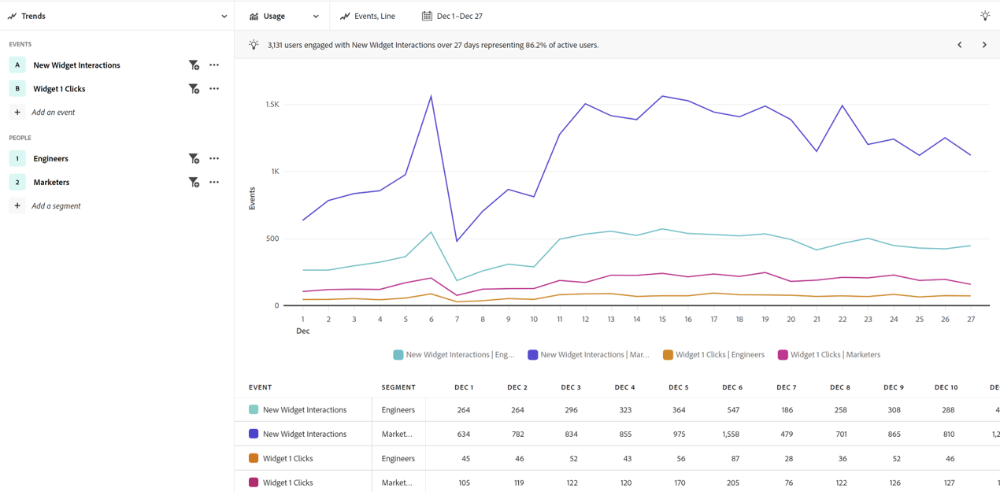{style="border:1px solid gray"}

+++
