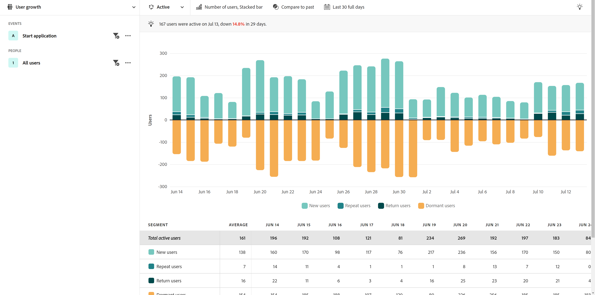

# Casos de uso del sector

Los casos de uso para el análisis guiado variarán según el sector. Esta página proporciona algunos ejemplos ilustrativos de lo que los equipos de productos pueden lograr con el análisis guiado y las capacidades de Adobe Product Analytics.

+++**Comercial**

| Caso de uso | Ejemplo | Impacto | Analysis |
| --- | --- | --- | --- |
| **Optimización de la aplicación de compras móvil** | Muchos clientes descargaron nuestra aplicación móvil, pero nunca regresaron. Descubrimos que lo estaban utilizando solo para la oferta inicial y volvimos a atraer a esos clientes inactivos. | **Aumente el LTV de los usuarios móviles.** Mida y aumente el uso de la aplicación para desarrollar una experiencia de usuario de &quot;ruta feliz&quot;. | [Vista de crecimiento activo del usuario](types/active.md) 

 [Vista de crecimiento neto](types/net-growth.md) |
| **Cuantificar el impacto de las nuevas funciones de cierre de compra** | Como tienda de comestibles que está probando su camino hacia las compras en línea, podemos medir rápidamente el impacto de las nuevas funciones de pago como &quot;¿Olvidó la mantequilla?&quot; recomendaciones de productos o nuevos métodos de pago, como Curbside Pickup. | **Aumentar las tasas de conversión.** Mida el impacto en la empresa en lugar de usar solamente las funciones. | [Vista de impacto de versión](types/release.md) 

 [Vista de primer uso](types/first-use.md) |
| **Reducir la pérdida de miembros** | Hemos descubierto puntos de fricción en los recorridos de los clientes que hacen que los clientes se pierdan. Esto nos dio la oportunidad de revisar los programas de membresía y analizar los comportamientos y señales de los miembros en riesgo. | **Reduzca la pérdida.** Identifique formas de fomentar y nutrir las relaciones con los clientes para evitar la desgaste y reducir la pérdida. | [Vista de crecimiento activo del usuario](types/active.md) 

 [Vista de fricción](types/friction.md) |
| **Encuentre recorridos de ventas ineficientes** | Descubrimos ineficiencias en el recorrido de nuestros socios comerciales en el establecimiento, que se apartaban de los clientes. Hemos ajustado su proceso, lo que ha hecho que los clientes disfruten de una experiencia de compra en la tienda más agradable. | **Mejorar la respuesta de ventas.** Mejorar los recorridos internos para reducir los procesos ineficientes, lo que resulta en experiencias positivas para los clientes. | [Vista de fricción](types/friction.md) |

{style="table-layout:auto"}

+++

+++**Servicios financieros**

| Caso de uso | Ejemplo | Impacto | Analysis |
| --- | --- | --- | --- |
| **Cuantificar el impacto de las nuevas funciones** | Hace poco implementamos transferencias bancarias con Zelle, y necesitábamos entender el impacto de la nueva función en las transferencias de finalización. Ahora que podemos ver cómo reaccionan los clientes, el equipo de marketing puede implementarlo. | **Aumentar las tasas de conversión.** Mida el impacto de las nuevas funciones en las conversiones de transferencia. | [Vista de impacto de versión](types/release.md) 

 [Vista de primer uso](types/first-use.md) |
| **Desviar llamadas al centro de llamadas** | Nuestro proceso de reclamación móvil de 5 pasos dirigía las llamadas al centro de llamadas. Analizamos esto rápidamente, creamos una audiencia y enviamos un correo electrónico a esos clientes para que entendieran su experiencia&quot;. | **Aísle la fricción en la experiencia.** Mejore los recorridos de &quot;ruta feliz&quot; y reduzca las llamadas. | [Vista de fricción](types/friction.md) 

 [Vista de tendencias de conversión](types/conversion-trends.md) |
| **Reducir la pérdida de clientes** | Sabemos que los clientes que inician sesión en la aplicación móvil de banca con frecuencia mensual siguen siendo clientes durante más tiempo. Cuando vemos el crecimiento de nuestros usuarios de aplicaciones, podemos identificar quién está en riesgo de perder y crear una estrategia de recuperación. | **Reduzca la pérdida.** Mantenga el nivel de clientes mientras gasta para adquirir nuevos clientes reales. | [Vista de crecimiento activo del usuario](types/active.md) 

 [Vista de crecimiento neto](types/net-growth.md) |
| **Recomendación de nuevas funciones** | Los retiros digitales han disminuido con el tiempo en lugar de llamar a un asesor financiero. Nos gustaría optimizar el proceso digital, y las tendencias de datos nos ayudan a priorizar las optimizaciones con un comité de dirección. | **Cree una hoja de ruta basada en datos.** Aproveche los datos para planificar e implementar las optimizaciones. | [Vista de tendencias de uso](types/usage.md) |

{style="table-layout:auto"}

+++

+++**Viajes y hospitalidad**

| Caso de uso | Ejemplo | Impacto | Analysis |
| --- | --- | --- | --- |
| **Cuantificar el impacto de las nuevas funciones de flujo de reservas** | Analizamos rápidamente el impacto de una nueva función de pasos de reserva en las tasas de conversión e identificamos la parte de la experiencia con las mayores ganancias. | **Aumente las tarifas de reserva.** Mida el impacto en la empresa en lugar de usar solamente las funciones. | [Vista de impacto de versión](types/release.md) 

 [Vista de fricción](types/friction.md) |
| **Optimizar la experiencia de la aplicación móvil** | Pudimos entender rápida y fácilmente a nuestros usuarios de aplicaciones activas mensuales (MAU) a lo largo del tiempo e identificar el impacto positivo por versión. | **Aumente las MAU.** Mida y aumente el uso de la aplicación, que se correlaciona con la felicidad del cliente. | [Vista de crecimiento activo del usuario](types/active.md) 

 [Vista de crecimiento neto](types/net-growth.md) |
| **Encuentra fricción en el flujo de facturación móvil** | Ver dónde tienen éxito las personas o dónde abandonan el proceso de registro móvil esperado nos permite identificar fácilmente las áreas para la optimización de experiencias. | **Aumente el CSAT y reduzca los IROP.** La eliminación de la fricción conduce a una experiencia de &quot;día de viaje&quot; más fluida. | [Vista de fricción](types/friction.md) 

 [Vista de tendencias de conversión](types/conversion-trends.md) |
| **Desviar llamadas al centro de llamadas** | Ver mi experiencia de usuario en una vista de canal me mostró dónde estaban nuestros usuarios golpeando fricción, lo que llevaba a un volumen de centro de llamadas costoso. Sabíamos dónde necesitábamos centrarnos a continuación. | **Reduzca el uso del centro de llamadas.** Obtenga más experiencias de usuario de &quot;ruta feliz&quot; y reduzca las llamadas costosas. | [Vista de fricción](types/friction.md) 

 [Vista de tendencias de conversión](types/conversion-trends.md) |

{style="table-layout:auto"}

+++

+++**Medios de comunicación y entretenimiento**

| Caso de uso | Ejemplo | Impacto | Analysis |
| --- | --- | --- | --- |
| **Identificar riesgo de pérdida** | Vimos una alta tasa de rotación de clientes que se inscribieron en nuestra plataforma para ver un evento de temporada y luego cancelaron tan pronto como el evento terminó. Al identificar rápidamente a estos usuarios, podemos mostrarles recomendaciones que les animen a seguir participando en la plataforma. | **Conservar suscriptores satisfechos.** Encuentre contenido que involucre a un segmento de crecimiento para que intervenga con recomendaciones. | [Vista de crecimiento activo del usuario](types/active.md) 

 [Vista de crecimiento neto](types/net-growth.md) |
| **Buscar oportunidades de ampliación de venta** | La clave del crecimiento de nuestros ingresos es poder entender qué ofertas en la aplicación son más atractivas para nuestros fans mientras están en el estadio. | **Aumentar los ingresos complementarios.** Comprenda el impacto de las ofertas en la aplicación en los comportamientos de compra. | [Vista de primer uso](types/first-use.md) 

 [Vista de fricción](types/friction.md) |
| **Optimización de la experiencia entre dispositivos** | Quiero poder analizar cómo interactúan mis suscriptores con varios dispositivos/aplicaciones para poder comprender los patrones de consumo de contenido y determinar dónde sería mejor redirigirme a ellos. | **Personalice la experiencia.** Comprenda qué contenido resuena mejor con los suscriptores de cada dispositivo. | [Vista de tendencias de uso](types/usage.md) |
| **Desviar llamadas al centro de llamadas** | Pude identificar un problema con la función de pago automático que no funcionaba, lo que llevó a los clientes frustrados a llamar a nuestro centro de soporte para cancelar su plan. | **Reducir las llamadas de asistencia.** Cree una mejor experiencia del cliente y reduzca las llamadas al servicio de atención al cliente. | [Vista de fricción](types/friction.md) 

 [Vista de tendencias de conversión](types/conversion-trends.md) |

{style="table-layout:auto"}

+++

+++**Sanidad**

| Caso de uso | Ejemplo | Impacto | Analysis |
| --- | --- | --- | --- |
| **Mejorar los resultados de salud del paciente** | No tenía una idea clara de cuántos miembros del plan de bienestar por semana simplemente dejaron de usarlo por completo. Ahora tenemos datos para centrar nuestros esfuerzos en el crecimiento. | **Reducir las visitas al médico.** Se identificaron rápidamente usuarios inactivos para volver a participar. | [Vistas de crecimiento activo del usuario](types/active.md) |
| **Mejorar la experiencia del paciente** | Tener visibilidad directa de cuántos pacientes llamaban a nuestros centros de llamadas para simples restablecimientos de contraseña renovó mi pasión por centrarse en reducir el costo total de nuestra compañía para servir y fortalecer nuestra experiencia del paciente. | **Reduzca el coste total del servicio.** Cree una mejor experiencia del paciente y reduzca las llamadas a los servicios para pacientes. | [Vista de tendencias de uso](types/usage.md) 

 [Vista de fricción](types/friction.md) |
| **Identificación de acciones repetidas en canales múltiples por segmento** | Necesito entender cómo los miembros elegibles de Medicare están activos con el uso de su plan para proporcionarles mensajes específicos en nuestros productos digitales. Las señales de producto ayudan a que nuestro marketing sea más efectivo. | **Personalice las opciones de inscripción en Medicare.** Comparar acciones secuenciales comunes de los miembros de mi plan más activo. | [Vista de fricción](types/friction.md) 

 [Vista de crecimiento activo del usuario](types/active.md) |
| **Conservar los mejores talentos de la industria** | Nuestros recursos de análisis están muy limitados por el tiempo. Necesito obtener rápidamente los datos de uso del producto que necesito para mis llamadas de actualización de liderazgo. | **Reduzca la carga de trabajo de analistas.** Obtenga respuestas más rápido. Informes accesibles para cuando más lo necesito. | [Análisis guiado](overview.md) |

{style="table-layout:auto"}

+++

+++**Alta tecnología y B2B**

| Caso de uso | Ejemplo | Impacto | Analysis |
| --- | --- | --- | --- |
| **Cuantificar el impacto de las nuevas funciones** | Podríamos analizar el aumento en el uso de una nueva función del producto y determinar qué segmentos funcionaban mejor. Esto nos ayudó a priorizar dónde gastamos los recursos para maximizar la participación del usuario y fortalecer nuestra asociación con el marketing. | **Priorización basada en datos.** Tome decisiones informadas sobre la asignación de recursos. | [Vista de impacto de versión](types/release.md) 

 [Vista de primer uso](types/first-use.md) |
| **Identificar funciones que están infrautilizando el producto** | Nuestro producto está diseñado para ser utilizado por ingenieros, gerentes de productos y especialistas en marketing. El análisis mostró que, si bien los primeros ministros y los especialistas en marketing lo utilizaban casi a diario, el personal de ingeniería no lo había adoptado en gran medida. | **Aumente la adopción de productos.** Identifique rápidamente el comportamiento del usuario de varias formas. | [Vista de crecimiento activo del usuario](types/active.md) 

 [Vista de crecimiento neto](types/net-growth.md) |
| **Eliminación de puntos de fricción en el proceso de conversión** | Los datos de los usuarios mostraron que el hecho de requerir un número de orden de compra en nuestro flujo de compra impedía que los usuarios que preferían comprar con una tarjeta de crédito completaran sus pedidos. Al convertir ese campo en opcional, las conversiones aumentaron. | **Mejore la experiencia del cliente.** Reduzca la pérdida potencial. | [Vista de fricción](types/friction.md) 

 [Vista de tendencias de conversión](types/conversion-trends.md) |
| **Desbloquear análisis de autoservicio** | Intentar obtener acceso a las perspectivas es todo un desafío y nuestros usuarios no están formados para el análisis. Necesitan poder obtener respuestas y aprovechar los mismos datos que utiliza toda la organización, lo que conduce a asociaciones más sólidas y permite tomar decisiones verdaderas basadas en datos. | **Colaboraciones más estrechas en toda la organización.** Conceda a los gestores de producto acceso a los datos que antes estaban en silo. | [Análisis guiado](overview.md) |

{style="table-layout:auto"}

+++
