# Información general sobre el análisis guiado

El análisis guiado permite a los usuarios, desde marketing hasta productos y analistas, ofrecer datos de alta calidad y perspectivas sobre el recorrido del cliente a través de flujos de trabajo guiados, basados en los datos de canales cruzados de Customer Journey Analytics. Al igual que los cuadros de resultados de Analysis Workspace y Mobile, el análisis guiado usa datos de [Data view](/help/data-views/data-views.md), que hace referencia a los datos de Adobe Experience Platform a través de una [conexión](../connections/overview.md). Muchos informes creados en Guided analysis pueden transferirse sin problemas a Analysis Workspace para realizar investigaciones adicionales.

>[!NOTE]
>
>Consulte las [preguntas más frecuentes](faq.md) para ver las diferencias terminológicas (segmentos, filtros y más) entre Análisis guiado y Analysis Workspace.

Los siguientes análisis guiados están disponibles:

| Icono | Análisis | Descripción |
| :----:|--- | --- |
|  | [Crecimiento activo](types/active-growth.md) | Identifique quién es nuevo, retenido, retornado o inactivo. |
|  | [Tendencias de conversión](types/conversion-trends.md) | Haga un seguimiento de los cambios en las tasas de conversión a lo largo del tiempo. |
|  | [Participación](types/engagement.md) | Comprenda la amplitud y profundidad de la participación de la característica. |
|  | [Impacto de primer uso](types/first-use-impact.md) | Mida el impacto del uso de funciones por primera vez en indicadores clave. |
|  | [Frecuencia](types/frequency.md) | Mida la participación en función de la frecuencia de uso. |
|  | [Canal](types/funnel.md) | Compare las tasas de conversión entre pasos. |
|  | [Crecimiento neto](types/net-growth.md) | ¿Está ganando o perdiendo usuarios? |
|  | [Impacto de la versión](types/release-impact.md) | Compare el rendimiento en períodos iguales antes y después de la publicación. |
|  | [Retención](types/retention.md) | Mida los hábitos de retorno continuo de sus usuarios. |
|  | [Cronología](types/timeline.md) | Explore patrones en la actividad de la sesión. |
|  | [Tendencias](types/trends.md) | Medir la participación del usuario a lo largo del tiempo. |

## Acceso

Puede acceder a Análisis guiado desde la página principal del Customer Journey Analytics.

1. Seleccione **[!UICONTROL Análisis guiado]** de la página principal, que lo lleva directamente al [Análisis de tendencias](types/trends.md).

   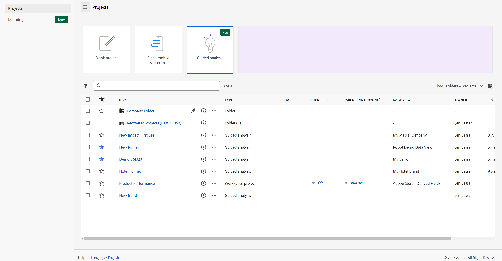{style="border:1px solid gray"}

1. Seleccione **[!UICONTROL Crear nuevo]** para ver las diferentes opciones de vista y elegir un punto de partida diferente para su análisis.

   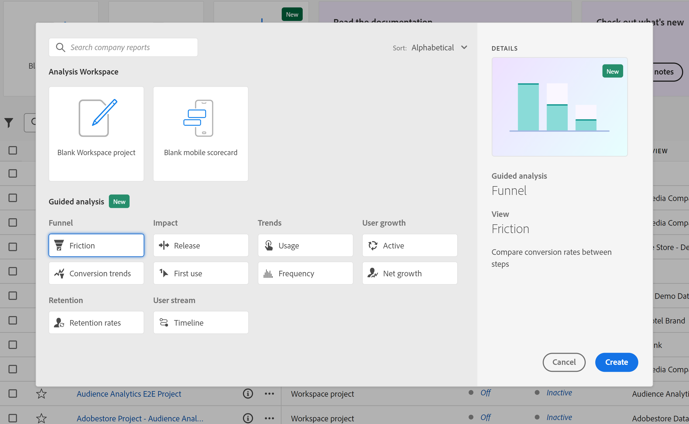{style="border:1px solid gray"}

También puede acceder al análisis guiado desde un proyecto de Analysis Workspace.

1. Seleccione **[!UICONTROL Proyecto en blanco]** de la página principal para crear un proyecto de Workspace vacío.

   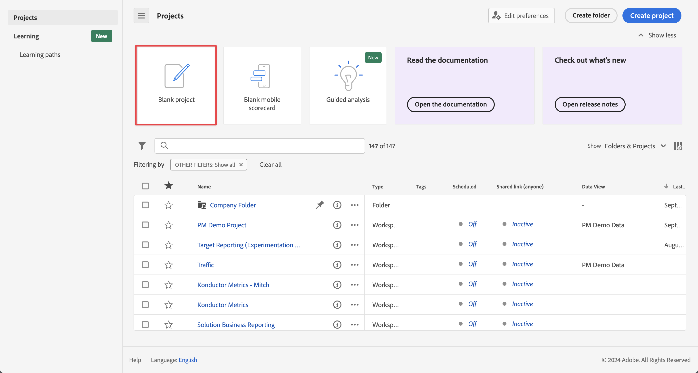{style="border:1px solid gray"}

1. Seleccione  **[!UICONTROL Análisis guiado]** en el carril izquierdo.

   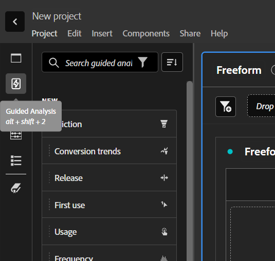{style="border:1px solid gray"}

1. Arrastre cualquier nuevo análisis al lienzo de Workspace y, a continuación, seleccione **[!UICONTROL Crear]** para generar el análisis deseado (por ejemplo: **[!UICONTROL Crear tendencias]**). También puede arrastrar un análisis existente al lienzo de Workspace desde la sección **[!UICONTROL Guardado]**.

   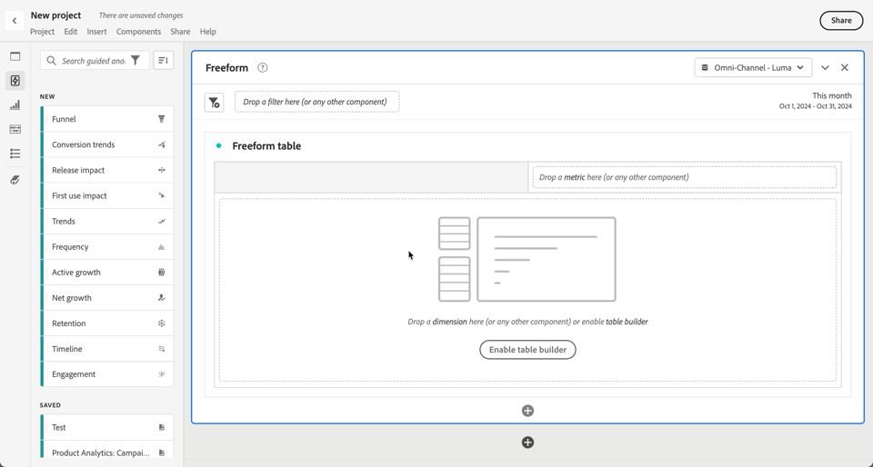

## Interfaz

La interfaz para el análisis guiado sigue un formato de pregunta y respuesta. Formule su pregunta en el carril de consulta y, a continuación, obtenga una respuesta con una perspectiva escrita, un gráfico y una tabla. A continuación, puede hacer la siguiente pregunta con análisis y configuración de visualización.

El análisis guiado utiliza los siguientes elementos de la interfaz de usuario:

| Vista previa de la interfaz | Elemento de la IU | Descripción |
| --- | --- | --- |
| 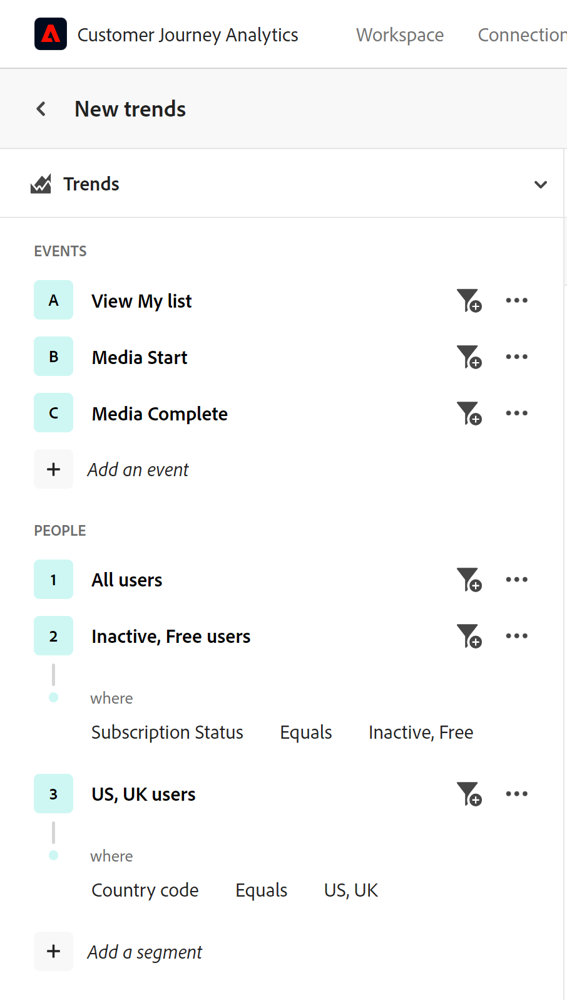{style="border:1px solid gray"} | **[!UICONTROL Carril de consulta]** | Configure su *pregunta* seleccionando los componentes deseados (eventos, propiedades y segmentos) que conforman un análisis. Las siguientes opciones están disponibles en todos los análisis, con ajustes adicionales disponibles por vista. <ul><li>**Vista**: seleccione entre las opciones para cambiar a un nuevo análisis. Las selecciones de consulta se mantienen dentro de los límites permitidos para el nuevo análisis.</li><li>**Eventos**: los eventos que desea medir. Cada análisis impone límites diferentes al número de eventos que se pueden configurar.  Los eventos a veces se etiquetan como **[!UICONTROL eventos Start y return]**, **[!UICONTROL Pasos]** o **[!UICONTROL indicadores clave]**. Los eventos se identifican en el análisis usando 1, 2, ... Seleccione  **[!UICONTROL Agregar un evento]** para agregar nuevos eventos.</li><li>**[!UICONTROL Factores]**: si están disponibles, le permiten especificar factores como la fecha desde y el primer evento.</li><li>**Contado como**: El método de conteo que desea aplicar a los eventos seleccionados. Seleccione en el menú desplegable.</li><li>**Segmentos**: los segmentos que desea medir. Cada análisis impone límites diferentes al número de segmentos que se pueden configurar. Los segmentos se identifican en el análisis mediante A, B, ... Seleccione  **[!UICONTROL Agregar un segmento]** para agregar nuevos segmentos.</li><li>**[!UICONTROL Desglose]**: si está disponible, el desglose que desee aplicar al análisis.</li></ul>En algunas de las opciones, hay disponible una configuración adicional.<ul><li>**Filtros**: Use  para reducir eventos o segmentos por dimensiones específicas. Cuando se selecciona una dimensión, están disponibles tanto los criterios de filtro estándar (como **[!UICONTROL Es igual a]**, **[!UICONTROL Contiene]** o **[!UICONTROL Termina con]**) como los 1000 valores de dimensión principales. Seleccione  para agregar filtros adicionales. Seleccione  para quitar un filtro.</li><li>**Más acciones**: usa  para seleccionar acciones, como<ul><li> **[!UICONTROL Cambiar nombre]**: para cambiar el nombre de un evento o segmento.</li><li> **[!UICONTROL Duplicar]**: para duplicar un evento o segmento.</li><li> **[!UICONTROL Eliminar]**: para eliminar un evento, segmento o desglose.</li><li> **[!UICONTROL Editar segmento]**: para editar un segmento en el [Generador de filtros](/help/components/filters/filter-builder.md).</li><li> **[!UICONTROL Agregar a favoritos]**: para agregar el segmento a la lista de filtros favoritos en el [Administrador de filtros](/help/components/filters/manage-filters.md).</li><li> **[!UICONTROL Guardar como]**: para guardar el segmento como un componente nuevo. En el cuadro de diálogo **[!UICONTROL Guardar segmentos en componentes]**, puede especificar un nombre de segmento y una descripción. Puede seleccionar  para marcar el nuevo segmento como favorito. Seleccione **[!UICONTROL Guardar]** para guardar el segmento como un nuevo filtro.</li><li> **[!UICONTROL Eventos de inicio y retorno de vínculo]**.: para vincular eventos de inicio y retorno en un análisis [Retención](types/retention.md).</li><li> **[!UICONTROL Desvincular eventos de inicio y retorno]**: para desvincular eventos de inicio y retorno en un análisis de [Retención](types/retention.md).</li></ul></li></ul> |
| 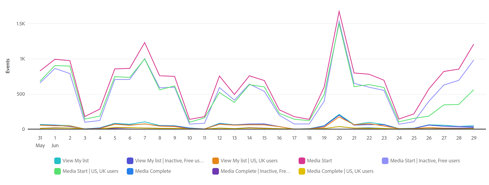{style="border:1px solid gray"} | **[!UICONTROL Gráfico]** | Una visualización de los datos devueltos en función de los datos que haya introducido desde el carril de consulta y la configuración. La visualización que vea depende de la vista y la configuración encima del gráfico. El gráfico también incluye: <ul><li>**Herramientas**: pase el ratón sobre cualquier punto de los datos del gráfico para mostrar una herramienta con más información.</li><li>**Leyenda**: pase el ratón sobre la serie de leyendas del gráfico para ver las definiciones donde estén disponibles, centrarse en esa serie y ocultar temporalmente otras series. Seleccione una serie de la leyenda para ocultarla.</li><li>**Anotaciones**: las [anotaciones](../components/annotations/overview.md) aplicables son visibles entre la visualización y la leyenda. Se muestra como un  en el color configurado de la anotación. Los análisis que muestran datos a lo largo del tiempo colocan el icono  bajo la fecha o el intervalo de fechas configurado. Los análisis que no muestran datos a lo largo del tiempo muestran el icono  en la esquina inferior derecha del gráfico.</li><li>**Seleccionar acciones**: expone las siguientes acciones disponibles al seleccionar cualquier punto de datos. Las opciones incluyen **Guardar segmento**.</li></ul> |
| 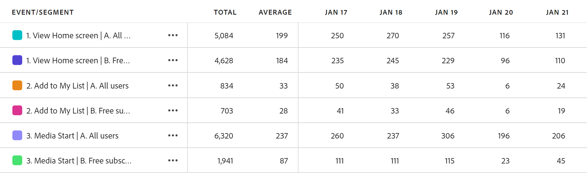{style="border:1px solid gray"} | **[!UICONTROL Tabla]** | Una representación en tabla de los datos devueltos en función de los datos introducidos desde el carril de consulta y la configuración. Filas en la tabla que utilizan identificadores de evento (1, 2, ...) y de segmento (A, B, ...) como referencia. Las columnas de la tabla dependen del análisis situado encima del gráfico. La tabla también incluye para cada fila: <ul><li>**Seleccionar acciones**: alternar  para ocultar o exponer una serie de gráficos para una fila. Seleccione  para realizar acciones adicionales. Las opciones incluyen **Guardar segmento**.</li></ul> |
| 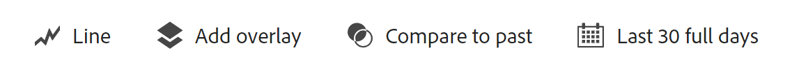{style="border:1px solid gray"} | **[!UICONTROL Configuración de visualización]** | Opciones situadas encima del gráfico que le permiten formular la siguiente pregunta y personalizar la forma en que el gráfico y la tabla devuelven los datos. Las siguientes opciones están disponibles en todos los análisis, con ajustes adicionales disponibles por análisis. <ul><li> **Configuración del gráfico**: Ajuste la visualización del gráfico y la tabla. Las opciones disponibles dependen del análisis seleccionado.</li><li> **Configuración de superposición**: agregue una superposición. Las opciones disponibles dependen del análisis seleccionado.</li><li> **[!UICONTROL Configuración del contenedor]**: Bloque automático o aplique la configuración del contenedor personalizado a los datos. Las opciones disponibles dependen del análisis seleccionado.<li> **[!UICONTROL Comparar configuración]**: Compare datos con un intervalo de fechas específico. Las opciones disponibles dependen del análisis seleccionado.</li><li> **[!UICONTROL Configuración de pantalla]**: selecciona cómo mostrar los datos. Las opciones disponibles dependen del análisis seleccionado.<li> **Intervalo de fecha**: Selector de calendario que le permite determinar el intervalo de fecha del análisis. También puede seleccionar un intervalo para los análisis de tendencias, como diario, semanal o mensual.</li><li> **Información**: Información contextual según el análisis que visualice. Esta información proporciona observaciones para el análisis actual. Si hay varias informaciones disponibles, puede verlas con las flechas a la derecha. Puede alternar la visibilidad de este cuadro utilizando el icono de bombilla en la parte superior derecha.</li></ul> |
| 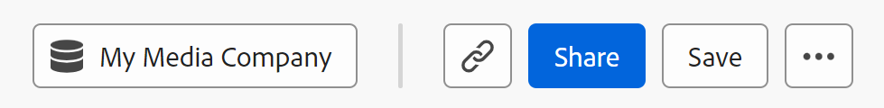{style="border:1px solid gray"} | **[!UICONTROL Menú]** Disponible en un proyecto de análisis guiado | Comandos en la parte superior derecha de un proyecto de análisis guiado que proporcionan acciones generales para el análisis.<ul><li> ***nombre de la vista de datos***: cambie la vista de datos que utiliza el análisis. Al cambiar la vista de datos, también cambian los componentes disponibles en el carril de consulta.</li><li> **Copiar vínculo**: copia un vínculo al análisis en el portapapeles. Se le solicitará que guarde antes de compartir.</li><li>**Compartir**: abre el modal de uso compartido, con más opciones para compartir con usuarios o grupos individuales. Puede compartir un análisis con otros usuarios o generar un vínculo para compartirlo con cualquiera.</li><li>**Guardar**: guarda el análisis. Si está guardando un nuevo análisis, aparecerá el cuadro de diálogo **[!UICONTROL Guardar análisis]** que solicita un nombre y una descripción. Una vez guardado, un cuadro de diálogo **[!UICONTROL Análisis guardado]** le permite compartir su análisis.</li></ul>Seleccione  para obtener más acciones, como:<ul><li>**Guardar como**: guarda el análisis de forma independiente del análisis actual y crea una copia. Aparece un cuadro de diálogo que solicita un nuevo nombre y una descripción.</li><li>**Exportar a Workspace**: vuelve a crear la consulta de análisis guiado actual en Analysis Workspace. El proyecto de Workspace se crea en una nueva pestaña, lo que evita interrupciones mientras se trabaja dentro del análisis guiado. Es una copia del análisis y no permanece sincronizado con el análisis original una vez abierto. Utilice este comando cuando desee transferir datos a su equipo de analistas o profundizar en los datos más de lo que permite el análisis.</li><li>**Copiar gráfico en el portapapeles**: copia el gráfico en el portapapeles para pegarlo en otras aplicaciones. El carril de consulta y la tabla no se incluyen en el gráfico.</li><li>**Descargar PNG**: descarga el gráfico del gráfico como `.png`. El carril de consulta y la tabla no se incluyen en el gráfico.</li><li>**Descargar CSV**: descarga los datos de tabla como un `.csv`. El carril de consulta y el gráfico no se incluyen en el archivo.</li></ul> |
| 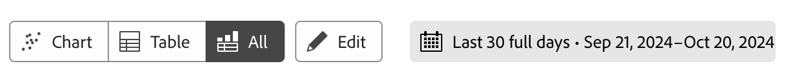{style="border:1px solid gray"} | **Menú**  Disponible en una visualización de análisis guiado en Analysis Workspace. | Comandos en una visualización de análisis guiado en Analysis Workspace.<ul><li> **[!UICONTROL Chart]**: para mostrar solo el gráfico del análisis.</li><li> **[!UICONTROL Tabla]**: para mostrar solamente la tabla del análisis.</li><li> **[!UICONTROL All]**: para mostrar el gráfico y la tabla del análisis.</li><li> **[!UICONTROL Editar]**: para editar la configuración del análisis</li><li> **[!UICONTROL *Intervalo de fechas *]**: para configurar el intervalo de fechas para el análisis.</li></ul> |

## Aprovisionamiento

Los análisis guiados se incluyen en los paquetes de Customer Journey Analytics de la siguiente manera:

| Paquete | Análisis disponibles |
| --- | --- |
| [!UICONTROL complementos de Customer Journey Analytics] | Crecimiento activo, Tendencias de conversión, Frecuencia, Canal, Crecimiento neto, Retención, Tendencias |
| [!UICONTROL Fundamento de Customer Journey Analytics] | Tendencias |
| [!UICONTROL Selección de Customer Journey Analytics] | Vistas de base + Crecimiento activo, Tendencias de conversión, Frecuencia, Canal, Crecimiento neto, Retención |
| [!UICONTROL Customer Journey Analytics Prime] | Seleccionar vistas + Participación, Impacto del primer uso, Impacto de la versión, Cronología |
| [!UICONTROL Customer Journey Analytics Ultimate] | Vistas de Prime |

{style="table-layout:auto"}

Los administradores de perfil de producto pueden añadir o eliminar el acceso a Análisis guiado en Adobe Admin Console.

1. Inicie sesión en [Adobe Admin Console](https://adminconsole.adobe.com).
1. Seleccione **[!UICONTROL Customer Journey Analytics]** en la lista de productos.
1. Seleccione el perfil de producto que desee para los permisos que desee editar.
1. Seleccione la ficha **[!UICONTROL Permisos]** y haga clic en **[!UICONTROL Editar]** en [!UICONTROL Herramientas de informes].
1. Seleccione  junto a **[!UICONTROL Acceso guiado al análisis]** en la lista de [!UICONTROL Elementos de permisos disponibles], que lo agrega a la lista de [!UICONTROL Elementos de permisos incluidos].
1. Seleccione **[!UICONTROL Guardar]**.

Consulte [Acceso de nivel de usuario](/help/technotes/access-control.md#user-level-access) para obtener más información.

>[!TIP]
>
>Algunos administradores prefieren habilitar el análisis guiado y deshabilitar Analysis Workspace para los nuevos usuarios en Customer Journey Analytics. Una vez que estos usuarios hayan madurado con el producto y los datos de su organización, puede habilitar el acceso a Analysis Workspace.
