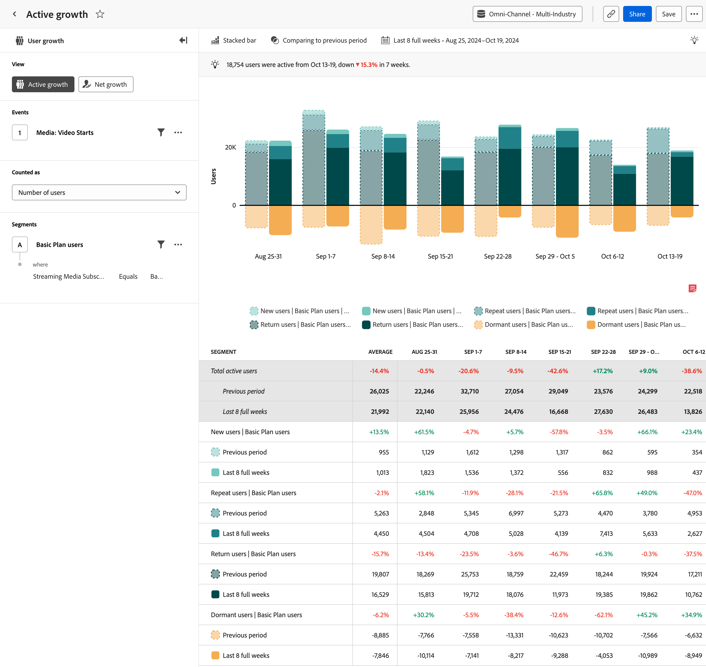

# Análisis del [!UICONTROL crecimiento activo] {#active-growth}

>[!CONTEXTUALHELP]
>id="workspace_guidedanalysis_activegrowth_button"
>title="Crecimiento activo"
>abstract="Identifique quién es nuevo, se mantiene, es recurrente o está inactivo."

El análisis del  **[!UICONTROL Crecimiento activo]** proporciona información sobre el crecimiento y la adquisición de usuarios durante un período específico. El eje horizontal es un intervalo de tiempo, mientras que el eje vertical indica una medición de los usuarios. Los usuarios se dividen en cuatro categorías:

* **[!UICONTROL Nuevo]**: el usuario estaba activo durante el período actual, pero no anteriormente. Vea hasta dónde retrocede el análisis pasando el puntero por encima de _[!UICONTROL Nuevos usuarios]_ en la leyenda del gráfico. El intervalo de retroactividad se determina dinámicamente en función del intervalo de fechas y del intervalo seleccionados.
* **[!UICONTROL Habitual]**: el usuario estaba activo en el período actual y en el inmediatamente anterior.
* **[!UICONTROL Recurrente]**: el usuario estaba activo en el período actual y no estaba activo en el período inmediatamente anterior, pero anteriormente estaba activo en algún momento. Vea hasta dónde retrocede el análisis pasando el puntero por encima de _[!UICONTROL Usuarios recurrentes]_ en la leyenda del gráfico. El intervalo de retroactividad se determina dinámicamente en función del intervalo de fechas y del intervalo seleccionados.
* **[!UICONTROL Inactivo]**: el usuario estaba activo en el período inmediatamente anterior, pero no lo está en el período actual. Los usuarios inactivos no se contabilizan en el número total de usuarios activos.

Todos los usuarios activos (nuevos + habituales + recurrentes) aparecen como un tono verde azulado encima del eje horizontal, mientras que todos los usuarios inactivos aparecen en naranja debajo del eje horizontal.

>[!VIDEO](https://video.tv.adobe.com/v/3421667/?quality=12&learn=on)

## Casos prácticos

Los casos de uso de este análisis incluyen:

* **Retención y cancelación de usuarios:** proporciona una clara visualización de los períodos de retención de usuarios alta o baja. Reconocer estos períodos de retención alta o baja puede ayudarle a tomar decisiones sobre productos para fomentar una retención alta o ayudar a minimizar la cancelación.
* **Evaluación de la campaña**: ver una campaña específica puede ayudarle a comprender cuánto tráfico generó y en qué medida ayudó a los usuarios a seguir participando.
* **Análisis del ciclo de vida del usuario**: analizar el crecimiento activo del usuario a lo largo del ciclo de vida del usuario puede ayudar a identificar fases específicas en las que disminuye la participación del usuario. Por ejemplo, si hay un alto porcentaje de usuarios inactivos en una fase de incorporación, puede indicar problemas de uso o la necesidad de una mejor orientación dentro del producto.

## Interfaz

Consulte [Interfaz](../overview.md#interface) para obtener información general sobre la interfaz de análisis guiado. Las siguientes configuraciones son específicas de este análisis:

### Carril de consulta

El carril de consulta permite configurar los siguientes componentes:

* **[!UICONTROL Vista]**: cambie entre este análisis y [Crecimiento neto](net-growth.md).
* **[!UICONTROL Eventos]**: el evento que desea medir. Dado que este análisis se basa en el usuario, un usuario que interactúa con el evento una vez dentro del periodo se cuenta como un usuario activo. Puede incluir un evento en una consulta.
* **[!UICONTROL Contabilizado como]**: método de contabilización que desea aplicar a los eventos seleccionados. <ul><li>**[!UICONTROL Las opciones]** incluyen [!UICONTROL Número de usuarios] y [!UICONTROL Porcentaje de usuarios].</li><li>[!BADGE B2B edition]{type=Informative url="https://experienceleague.adobe.com/en/docs/analytics-platform/using/cja-overview/cja-b2b/cja-b2b-edition" newtab=true tooltip="Customer Journey Analytics B2B edition"} Hay **[!UICONTROL opciones B2B]** adicionales disponibles para Customer Journey Analytics B2B edition: [!UICONTROL Cuentas globales], [!UICONTROL Cuentas], [!UICONTROL Grupos de compras], [!UICONTROL Oportunidades], [!UICONTROL Porcentaje de cuentas globales], [!UICONTROL Porcentaje de cuentas], [!UICONTROL Porcentaje de grupos de compras] y [!UICONTROL Porcentaje de oportunidades].</li></ul>
* **[!UICONTROL Segmentos]**: El segmento por el que desea segmentar los datos. Puede incluir un segmento en una consulta.

### Configuración del gráfico

El análisis de [!UICONTROL Crecimiento activo] ofrece la siguiente configuración de gráfico, que se puede ajustar en el menú situado encima del gráfico:

* **[!UICONTROL Tipo de gráfico]**: el tipo de visualización que desea utilizar. Las opciones incluyen [!UICONTROL Barra apilada] y [!UICONTROL Área apilada].

### Comparación del tiempo

{{apply-time-comparison}}

### Intervalo de fechas

El intervalo de fechas deseado para el análisis. Esta configuración consta de dos componentes:

* **[!UICONTROL Intervalo]**: la granularidad de la fecha por la que desea ver los datos de tendencias. Las opciones válidas incluyen Por hora, Diario, Semanal, Mensual y Trimestral. El mismo intervalo de fechas puede tener intervalos diferentes, que afectan al número de puntos de datos del gráfico y al número de columnas de la tabla. Por ejemplo, si se ve un análisis que abarca tres días con granularidad diaria, solo se mostrarían tres puntos de datos, mientras que un análisis que abarca tres días con granularidad horaria, mostraría 72 puntos de datos.
* **[!UICONTROL Fecha]**: la fecha de inicio y finalización. Los ajustes preestablecidos de intervalo de fechas móviles y los intervalos personalizados guardados anteriormente están disponibles para su comodidad, o puede utilizar el selector de calendario para elegir un intervalo de fechas fijo.

<!--
## Example

See below for an example of the analysis.

-->
