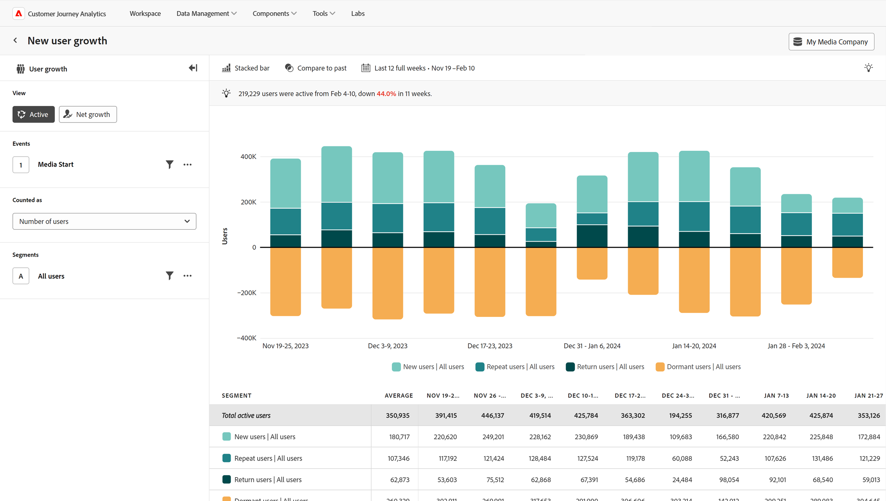
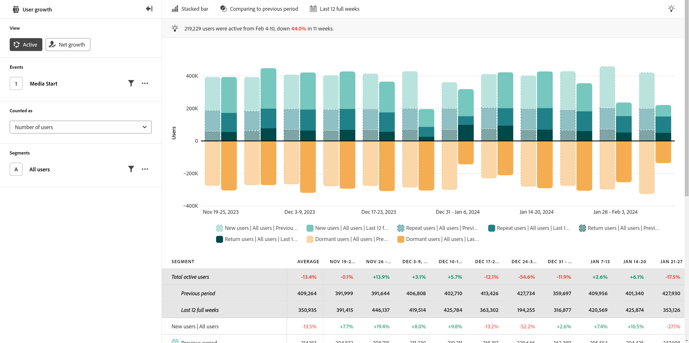

# Vista activa

El **Activo** La vista de proporciona perspectivas sobre el crecimiento y la adquisición de usuarios durante un periodo específico. El eje horizontal es un intervalo de tiempo, mientras que el eje vertical es una medida de usuarios. Los usuarios se dividen en cuatro categorías:

* **Nuevo**: el usuario estuvo activo durante el periodo actual, pero no anteriormente. Ver hasta dónde llega el análisis pasando el puntero sobre &#39;[!UICONTROL Nuevos usuarios]&#39; en la leyenda del gráfico. El intervalo de retrospectiva se determina dinámicamente en función del intervalo de fechas y del intervalo seleccionados.
* **Repetir**: el usuario estaba activo en el periodo actual y en el anterior.
* **Volver**: el usuario estaba activo en el periodo actual y no en el periodo inmediatamente anterior, pero anteriormente estaba activo en algún momento. Ver hasta dónde llega el análisis pasando el puntero sobre &#39;[!UICONTROL Devolver usuarios]&#39; en la leyenda del gráfico. El intervalo de retrospectiva se determina dinámicamente en función del intervalo de fechas y del intervalo seleccionados.
* **Inactivo**: el usuario estuvo activo en el periodo inmediatamente anterior, pero no lo está en el periodo actual. Los usuarios inactivos no se contabilizan en el número total de usuarios activos.

Todos los usuarios activos (nuevos + repetidos + devueltos) aparecen como un tono de verde azulado encima del eje horizontal, mientras que todos los usuarios inactivos aparecen en naranja debajo del eje horizontal.

## Casos prácticos

Los casos de uso para este tipo de vista incluyen:

* **Retención y pérdida de usuarios:** Proporciona una visualización clara de los períodos de retención de usuarios alta o baja. Reconocer estos períodos de retención alta o baja puede ayudarle a tomar decisiones sobre productos para fomentar una retención alta o ayudar a minimizar la pérdida.
* **Evaluación de campaña**: Ver una campaña específica puede ayudarle a comprender no solo cuánto tráfico generó, sino también en qué medida la campaña ayudó a los usuarios a seguir participando.
* **Análisis del ciclo vital de usuario**: El análisis del crecimiento activo del usuario a lo largo del ciclo vital de este puede ayudar a identificar fases específicas en las que disminuye la participación del usuario. Por ejemplo, si hay una alta proporción de usuarios latentes para personas en una fase de incorporación, puede indicar problemas de uso o la necesidad de mejorar la orientación interna del producto.

## Carril de consulta

El carril de consulta permite configurar los siguientes componentes:

* **Eventos**: el evento que desea medir. Dado que este tipo de vista se basa en el usuario, cualquier usuario que interactúe con el evento una vez dentro del periodo se contará como un usuario activo. Puede incluir un evento en una consulta.
* **People**: El segmento que desea medir. Puede incluir un segmento en una consulta.

## Ajustes del gráfico

La vista activa ofrece la siguiente configuración de gráfico, que se puede ajustar en el menú situado encima del gráfico:

* **Métrica**: La métrica que desea medir. Las opciones incluyen Número de usuarios y Porcentaje de usuarios.
* **Tipo de gráfico**: el tipo de visualización que desea utilizar. Las opciones incluyen Barra apilada y Área apilada.

## Aplicar comparación de tiempo

{{apply-time-comparison}}

## Intervalo de fechas

El intervalo de fechas deseado para el análisis. Esta configuración consta de dos componentes:

* **Intervalo**: La granularidad de fecha por la que desea ver los datos de tendencias. Las opciones válidas incluyen Por hora, Diario, Semanal, Mensual y Trimestral. El mismo intervalo de fechas puede tener diferentes intervalos que afectan al número de puntos de datos del gráfico y al número de columnas de la tabla. Por ejemplo, si se ve un análisis que abarca tres días con granularidad diaria, solo se mostrarían tres puntos de datos, mientras que un análisis que abarca tres días con granularidad horaria, mostraría 72 puntos de datos.
* **Fecha**: la fecha de inicio y finalización. Los ajustes preestablecidos de intervalo de fechas móviles y los intervalos personalizados guardados anteriormente están disponibles para su comodidad, o puede utilizar el selector de calendario para elegir un intervalo de fechas fijo.
