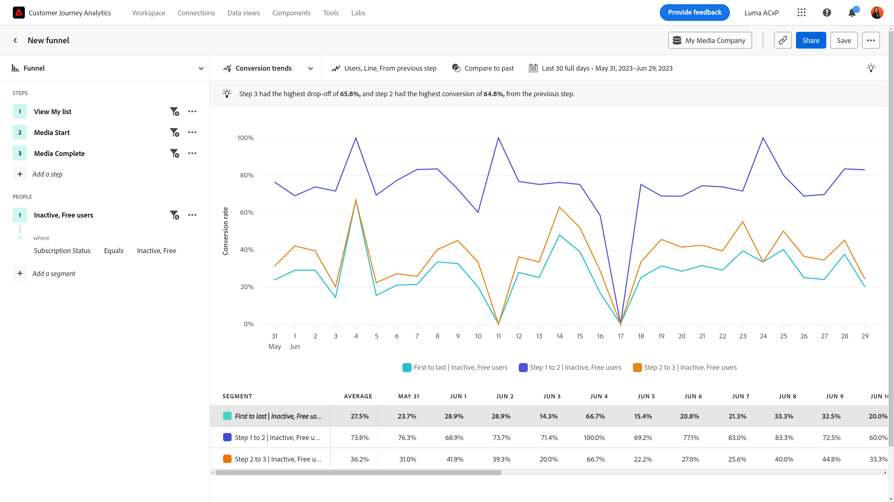
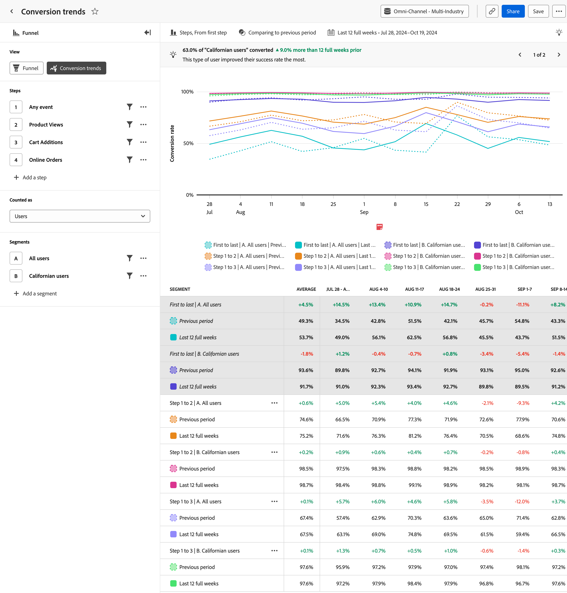

# Tendencias de conversión

{{release-limited-testing}}

El **Tendencias de conversión** La vista de proporciona una visualización de tendencias en torno a las tasas de conversión a lo largo del tiempo. El eje horizontal es un intervalo de tiempo, mientras que el eje vertical representa la tasa de conversión. Los casos de uso para este tipo de vista incluyen:

* **Seguimiento de esfuerzos de optimización**: Después de identificar los cuellos de botella clave que desea mejorar mediante [Fricción](friction.md)Sin embargo, puede utilizar esta vista para rastrear cómo esas optimizaciones afectan a la tasa de conversión a lo largo del tiempo.
* **Evaluación de las pruebas A/B**: Evalúe la eficacia de las pruebas A/B o los experimentos realizados en el contexto de un canal. Al comparar las tasas de conversión entre diferentes variaciones, puede determinar fácilmente qué pruebas proporcionan tasas de conversión más altas, lo que lleva a decisiones basadas en datos sobre qué variaciones implementar de forma permanente.
* **Evaluación de campañas a lo largo del tiempo**: mida la eficacia de las campañas de marketing a lo largo del tiempo. Puede crear un segmento que se centre en los usuarios que hayan utilizado una campaña determinada y comparar sus tasas de conversión con las de otras campañas. También puede comparar las tasas de conversión actuales con campañas similares que se ejecutaron en el pasado.

## Carril de consulta

El carril de consulta permite configurar los siguientes componentes:

* **Pasos**: los puntos de contacto del evento que desea rastrear. Cada barra del gráfico representa un paso. Se pueden incluir hasta diez pasos.
* **People**: Los segmentos con los que desea comparar el canal. Cada segmento seleccionado divide cada paso en varias barras. Cada color representa un segmento diferente. Se pueden incluir hasta tres segmentos.

## Ajustes del gráfico

La vista Tendencias de conversión ofrece la siguiente configuración de gráfico, que se puede ajustar en el menú situado encima del gráfico:

* **Métrica**: La métrica que desea medir. Las opciones incluyen Sesiones y Usuarios.
* **Tipo de gráfico**: el tipo de visualización que desea utilizar. Las opciones incluyen Línea.
* **Conversión de**: Determina el cálculo de porcentaje de paso a paso. Las opciones incluyen el cálculo de la conversión desde el primer paso o el paso anterior.

## Aplicar comparación de tiempo

{{apply-time-comparison}}

## Intervalo de fechas

El intervalo de fechas deseado para el análisis. Esta configuración consta de dos componentes:

* **Intervalo**: La granularidad de fecha por la que desea ver los datos de tendencias. Las opciones válidas incluyen Por hora, Diario, Semanal, Mensual y Trimestral. El mismo intervalo de fechas puede tener diferentes intervalos que afectan al número de puntos de datos del gráfico y al número de columnas de la tabla. Por ejemplo, si se ve un análisis que abarca tres días con granularidad diaria, solo se mostrarían tres puntos de datos, mientras que un análisis que abarca tres días con granularidad horaria, mostraría 72 puntos de datos.
* **Fecha**: la fecha de inicio y finalización. Los ajustes preestablecidos de intervalo de fechas móviles y los intervalos personalizados guardados anteriormente están disponibles para su comodidad, o puede utilizar el selector de calendario para elegir un intervalo de fechas fijo.
