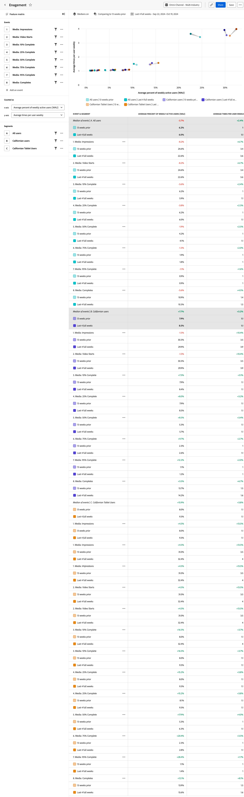

# Análisis de la [!UICONTROL participación] {#engagement}

<!-- markdownlint-disable MD034 -->

>[!CONTEXTUALHELP]
>id="workspace_guidedanalysis_engagement_button"
>title="Participación"
>abstract="Conozca el alcance y la profundidad de la participación de una función."

<!-- markdownlint-enable MD034 -->

El análisis de  **[!UICONTROL Participación]** proporciona información sobre la frecuencia de uso de una función en comparación con la cantidad de personas que la utilizan. Este análisis funciona mejor cuando se comparan varias funciones entre sí. Ayuda a tomar decisiones de inversión al comprender cuáles son sus funciones principales, potentes, puntuales y cuestionables. 

Las funciones que aparecen en la parte superior de esta visualización indican que las utilizan con frecuencia los usuarios activos. Las funciones que se sitúan a la derecha de esta visualización indican que son muy utilizadas por los usuarios activos. El promedio de veces que se utiliza una función divide el gráfico horizontalmente. El porcentaje medio de usuarios activos divide el gráfico verticalmente. Las medianas se calculan en función de los eventos seleccionados en la consulta, no de todos los datos.

* Las funciones de la parte superior izquierda de la matriz son las funciones **potentes**; no están muy extendidas, pero los usuarios activos las utilizan con frecuencia.
* Las funciones de la parte superior derecha de la matriz son las funciones de **alto impacto**; están bastante extendidas y se utilizan con frecuencia.
* Las funciones de la parte inferior izquierda de la matriz son las funciones de **bajo impacto**; no están muy extendidas ni se utilizan con frecuencia.
* Las funciones de la parte inferior derecha de la matriz son las funciones **puntuales**; están bastante extendidas pero no se utilizan con frecuencia.

>[!BEGINSHADEBOX]

Consulte  [Análisis de la participación](https://video.tv.adobe.com/v/3429489/&learn=on){target="_blank"} para ver un vídeo de demostración.

>[!ENDSHADEBOX]

## Casos de uso

Los casos de uso de este análisis incluyen:

* **Participación por función**: puede establecer una correlación directa entre la participación y la adopción de una función específica. Conocer qué funciones se utilizan más puede ayudar a determinar en cuáles hay que invertir más.
* **Descubrir funciones infrautilizadas**: las funciones con pocos usuarios activos, pero con un uso elevado pueden indicar una función potente, que es valiosa, pero que no ha sido descubierta ni utilizada por la población en general. Considere la posibilidad de mejorar la capacidad de descubrimiento de estas funciones para que más usuarios las aprovechen.
* **Mejorar las funciones populares**: las funciones con muchos usuarios activos pero poco uso pueden indicar que una función está muy solicitada pero no se utiliza lo suficiente. Estas situaciones presentan oportunidades para obtener más información de los usuarios sobre las mejoras que harían que la función fuera más valiosa para ellos.
* **Crear segmentos basados en funciones**: esta forma de ver el uso de funciones puede ofrecer oportunidades de análisis adicionales. Cree un segmento para cualquier punto del gráfico para profundizar en ese grupo de usuarios y aplicar esas lecciones a su estrategia de participación del usuario.
* **Pruebas A/B de adopción de funciones**: compare el uso de varias funciones en diferentes grupos de usuarios. Añada segmentos al carril de la consulta para determinar la diferencia en el uso de las funciones entre grupos de usuarios clave.

## Interfaz

Consulte [Interfaz](../overview.md#interface) para obtener información general sobre la interfaz de análisis guiado. Las siguientes configuraciones son específicas de este análisis:

### Carril de consulta

El carril de consulta permite configurar los siguientes componentes:

* **[!UICONTROL Eventos]**: los eventos que desea medir. Cada evento representa el uso de una función determinada y se muestra como un punto dentro de la matriz. Se pueden incluir hasta 10 eventos. La mediana se calcula en función de los eventos seleccionados.
* **[!UICONTROL Contabilizado como]**: a lo largo del eje x, puede medir el porcentaje medio de usuarios activos diarios, semanales, mensuales o trimestrales. El eje Y ajusta automáticamente el promedio de veces por usuario en función de la selección del eje X.
* **[!UICONTROL Segmentos]**: los segmentos que desea medir. Cada segmento seleccionado duplica el número de puntos trazados en el gráfico y las filas de la tabla. Se pueden incluir hasta tres segmentos.

>[!TIP]
>
>Si varios eventos representan el uso de una sola función, puede derivar un nuevo evento que represente la función en Vistas de datos.

### Configuración del gráfico

El análisis de [!UICONTROL Participación] ofrece la siguiente configuración de gráfico, que se puede ajustar en el menú situado encima del gráfico:

* **[!UICONTROL Medianas]**: determine dónde se muestran las líneas medianas y cómo se relacionan los puntos trazados con esas medias.
   * **[!UICONTROL Estándar]**: muestra el valor absoluto de uso y participación.
   * **[!UICONTROL Normalizado]**: muestra los cambios relativos de cada mediana.
* **[!UICONTROL Superposición de eventos principales]**: vea el rendimiento de los eventos en comparación con los 20 eventos principales, según la actualización y relevancia de la empresa y el usuario (el mismo algoritmo aplicado al selector de eventos en el carril de consultas).

### Comparación del tiempo

{{apply-time-comparison}}

### Intervalo de fechas

El intervalo de fechas deseado para el análisis. Esta configuración consta de dos componentes:

* **[!UICONTROL Intervalo]**: la granularidad de fecha por la que desea ver datos de tendencia. Este análisis trata [!UICONTROL Intervalo] de manera similar a [!UICONTROL Contado como] en el carril de consultas. No se admiten usuarios activos por hora.
* **[!UICONTROL Fecha]**: La fecha de inicio y finalización. Los ajustes preestablecidos de intervalo de fechas móviles y los intervalos personalizados guardados anteriormente están disponibles para su comodidad, o puede utilizar el selector de calendario para elegir un intervalo de fechas fijo.

<!--
## Example

See below for an example of the analysis.

-->
