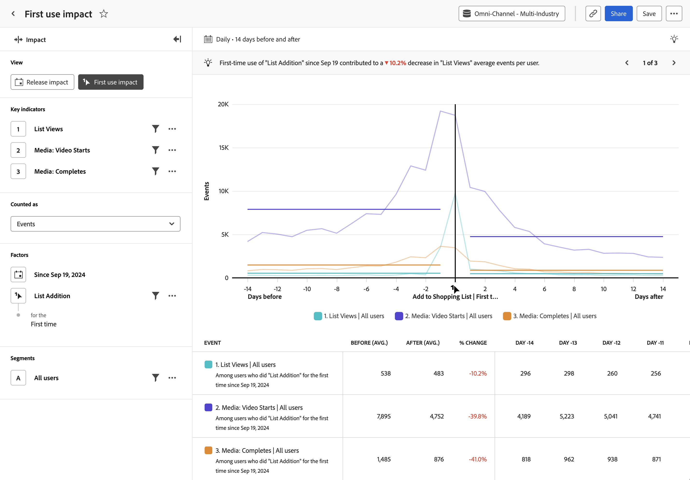

# Análisis del [!UICONTROL impacto del primer uso] {#first-use-impact}

<!-- markdownlint-disable MD034 -->

>[!CONTEXTUALHELP]
>id="workspace_guidedanalysis_firstuseimpact_button"
>title="Impacto del primer uso"
>abstract="Mida el impacto del uso de funciones por primera vez en los indicadores clave."

<!-- markdownlint-enable MD034 -->

El análisis del  **[!UICONTROL impacto del primer uso]** muestra una comparación del rendimiento de los indicadores clave antes y después de que un usuario use una función del producto por primera vez. El eje horizontal de este informe es un intervalo de tiempo relativo antes y después del evento, mientras que el eje vertical mide los indicadores clave deseados. Una barra vertical en medio del gráfico representa el día 0 del momento en que un usuario determinado utiliza por primera vez una función. Dado que los usuarios no siempre adoptan funciones el mismo día y que los despliegues pueden producirse potencialmente durante varios días, el día 0 puede significar algo distinto para cada usuario individual.

>[!VIDEO](https://experienceleague.adobe.com/es/docs/customer-journey-analytics-learn/tutorials/guided-analysis/first-use-impact)

## Casos de uso

Los casos de uso de este análisis incluyen:

* **Análisis de la nueva función**: si va a lanzar una nueva función en su producto, puede comparar el rendimiento de los indicadores clave antes y después de que los usuarios se expusieran a esa nueva función por primera vez.
* **Despliegues por fases**: dado que el análisis busca el primer uso de la función en lugar de una fecha fija, este análisis es útil si se modifica gradualmente el despliegue de las funciones a lo largo del tiempo.
* **Análisis de la nueva versión del producto**: si va a lanzar una nueva versión de su producto, puede comparar el rendimiento de los indicadores clave antes y después de que los usuarios se expusieran a esa nueva versión por primera vez. Seleccione &quot;cualquier evento&quot; como evento de primer uso y fíltrelo en la propiedad Número de versión.
* **Mejoras en las funciones existentes**: si está realizando mejoras en una función existente de su producto, puede comparar el rendimiento de los indicadores clave antes y después de que los usuarios se expusieran a esas nuevas mejoras por primera vez. Este análisis se puede realizar de una o varias formas según la instrumentación de las funciones.
   * Seleccione un evento que represente la mejora como evento de primer uso
   * Seleccione la fecha en que comenzaron a aplicarse los cambios
   * Segmente el análisis al grupo de personas expuestas a las mejoras
* **Eficacia de la campaña**: cuando un usuario hace clic en una campaña determinada, se puede comparar el rendimiento de los indicadores clave antes y después de que el usuario interactuara con esa campaña.

## Interfaz

Consulte [Interfaz](../overview.md#interface) para obtener información general sobre la interfaz de análisis guiado. Las siguientes configuraciones son específicas de este análisis:

### Carril de consulta

El carril de consulta permite configurar los siguientes componentes:

* **[!UICONTROL Vista]**: cambie entre este análisis y [Versión](release-impact.md).
* **[!UICONTROL Indicadores clave]**: los eventos que desea medir por usuario. Cada indicador clave seleccionado se representa como una línea de color. Se añade a la tabla una fila que representa el evento. Se pueden incluir hasta tres eventos.
* **[!UICONTROL Contabilizado como]**: método de contabilización que desea aplicar a los eventos seleccionados. Las opciones incluyen [!UICONTROL Eventos por usuario], [!UICONTROL Eventos], [!UICONTROL Sesiones] y [!UICONTROL Usuarios].
* **[!UICONTROL Factores]**: hay dos factores para este análisis:
   * **[!UICONTROL Fecha]**: hasta qué fecha desea retroceder para empezar a buscar la primera vez que se produjo un evento de uso.
   * **[!UICONTROL Evento]**: el evento del que desea buscar el primer uso, para centrar el análisis en él.
* **[!UICONTROL Segmentos]**: el segmento que desea medir. El segmento seleccionado filtra los datos para centrarse únicamente en las personas que cumplen los criterios del segmento. Para este análisis se admite un solo segmento.

### Configuración del gráfico

El análisis del [!UICONTROL Impacto de primer uso] ofrece la siguiente configuración de gráfico, que se puede ajustar en el menú situado encima del gráfico:

* **[!UICONTROL Tipo de gráfico]**: el tipo de visualización que desea utilizar. Las opciones incluyen Línea.

### Intervalo de fechas

Las selecciones de fecha en el análisis del [!UICONTROL Impacto del primer uso] funcionan de manera diferente que otros análisis, ya que el análisis gira en torno a la fecha especificada en el carril de la consulta. Las opciones disponibles son las siguientes:

* **[!UICONTROL Intervalo]**: la granularidad de fecha por la que desea ver los datos de tendencias. Las opciones válidas incluyen [!UICONTROL Diario], [!UICONTROL Semanal], [!UICONTROL Mensual] y [!UICONTROL Trimestral]. Cambiar el intervalo afecta a las opciones disponibles para el periodo Antes y después.
* **[!UICONTROL Antes y después del período]**: cantidad de tiempo que se debe analizar antes y después del primer evento de uso especificado en el carril de consulta. Las opciones disponibles dependen de la selección [!UICONTROL Intervalo].

<!--
## Example

See below for an example of the analysis.

-->
