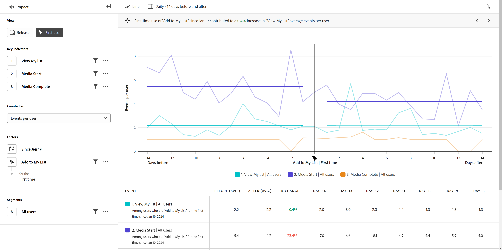

# Vista de primer uso

{{release-limited-testing}}

El **Primer uso** La vista muestra una comparación de cómo se comportan los indicadores clave antes y después de que un usuario toque un evento determinado por primera vez. El eje horizontal de este informe es un intervalo de tiempo relativo antes y después del evento, mientras que el eje vertical mide los indicadores clave deseados. Una barra vertical en medio del gráfico representa cuándo se produjo el evento para un usuario determinado.

## Casos prácticos

Los casos de uso para este tipo de vista incluyen:

* **Análisis de nuevas funciones**: si va a lanzar una nueva función dentro del producto, puede comparar el rendimiento de los indicadores clave antes y después de que los usuarios se expusieran a esa nueva función por primera vez.
* **Eficacia de campañas**: Cuando un usuario ve una campaña determinada, puede comparar el rendimiento de los indicadores clave antes y después de que el usuario viera esa campaña o interactuara con ella.

## Carril de consulta

El carril de consulta permite configurar los siguientes componentes:

* **Indicadores clave**: los eventos que desea medir por usuario. Cada indicador clave seleccionado se representa como una línea de color. Se agrega a la tabla una fila que representa el evento. Se pueden incluir hasta tres eventos.
* **Factores**: Existen dos factores para esta vista:
   * **Fecha**: cuánto tiempo atrás desea buscar por primera vez en un evento.
   * **Evento**: el evento que desea comparar antes y después de tocarlo.
* **People**: El segmento que desea medir. El segmento seleccionado filtra los datos para centrarse únicamente en las personas que coinciden con los criterios del segmento.

## Ajustes del gráfico

La vista Primer uso ofrece la siguiente configuración de gráfico, que se puede ajustar en el menú situado encima del gráfico:

* **Métrica**: La métrica que desea medir. Las opciones incluyen [!UICONTROL Eventos por usuario], [!UICONTROL Eventos], [!UICONTROL Sesiones], y [!UICONTROL Usuarios].
* **Tipo de gráfico**: el tipo de visualización que desea utilizar. Las opciones incluyen Línea.

## Intervalo de fechas

Las selecciones de fechas en los informes de impacto funcionan de forma diferente que otros tipos de análisis, ya que el informe gira en torno a un evento determinado que se está tocando por primera vez (especificado en el carril de consultas). Las opciones disponibles son las siguientes:

* **Intervalo**: La granularidad de fecha por la que desea ver los datos de tendencias. Las opciones válidas incluyen [!UICONTROL Diario], [!UICONTROL Semanalmente], [!UICONTROL Mensual], y [!UICONTROL Trimestral]. Cambiar el intervalo afecta a las opciones disponibles para los periodos Antes y Después.
* **Antes y después del período**: Cantidad de tiempo que se debe analizar antes y después del evento tocado especificado en el carril de consulta. Las opciones disponibles dependen de la variable [!UICONTROL Intervalo] selección.
