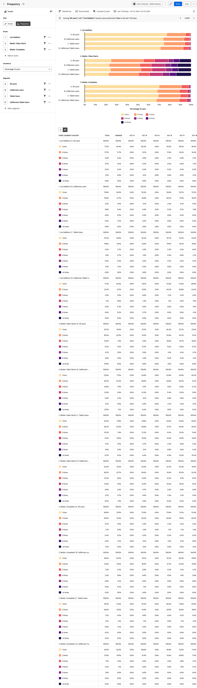

# Análisis de [!UICONTROL frecuencia]

El análisis  **[!UICONTROL Frecuencia]** agrupa los datos de eventos según la frecuencia con la que se producen eventos en el producto. El eje vertical de este análisis contiene bloques que representan la frecuencia del evento. El eje horizontal mide el número de usuarios o sesiones para cada bloque.

>[!VIDEO](https://video.tv.adobe.com/v/3428089/?learn=on)

## Casos prácticos

Los casos de uso de este análisis incluyen:

* **Participación**: haga un seguimiento de la participación de los usuarios en cualquier evento de su producto. Puede hacer clic en cualquier parte del gráfico de barras para guardarla como un segmento. Los segmentos para bloques de participación bajos pueden ayudarle a determinar por qué los usuarios no interactúan con el evento con la frecuencia deseada. Los segmentos para bloques de participación altos pueden ayudarle a comprender por qué los usuarios interactúan con el evento a menudo. A partir de ahí, puede animar a otros usuarios a adoptar un comportamiento similar.
* **Lealtad del cliente**: establezca el evento en Pedidos y la métrica en Usuarios. Este análisis le permite agrupar usuarios según la cantidad de veces que han realizado una compra en el sitio dentro del intervalo de fechas especificado.
* **Optimización de la asistencia**: vea el número de llamadas de asistencia o casos abiertos por usuario para obtener información sobre los usuarios que encuentran la mayor cantidad de problemas. A continuación, puede crear un segmento para centrarse en su experiencia y ayudar a identificar y resolver sus problemas.
* **Servicios de suscripción**: es más probable que los usuarios con poca participación se pierdan. Comprender el comportamiento de los usuarios con un alto nivel de participación puede ayudar a fomentar un comportamiento similar para los usuarios con un bajo nivel de participación, lo que les hace menos propensos a cancelar su suscripción.

## Interfaz

Consulte [Interfaz](../overview.md#interface) para obtener una descripción general de la interfaz de análisis guiado. Las siguientes configuraciones son específicas de este análisis:

### Carril de consulta

El carril de consulta permite configurar los siguientes componentes:

* **[!UICONTROL Vista]**: cambie entre este análisis y [Tendencias](trends.md).
* **[!UICONTROL Eventos]**: los eventos que desea medir. Cada evento seleccionado se representa como un gráfico independiente. Se agrega a la tabla una fila que representa el evento de tendencias. Se pueden incluir hasta cinco eventos.
* **[!UICONTROL Contado como]**: El método de conteo que desea aplicar a los eventos seleccionados. Las opciones incluyen [!UICONTROL Usuarios], [!UICONTROL Sesiones], [!UICONTROL Porcentaje de usuarios] y [!UICONTROL Porcentaje de sesiones]. El denominador de las métricas basadas en porcentajes en este análisis son los usuarios o las sesiones que realizaron los eventos seleccionados, no todos los usuarios activos del producto.
* **[!UICONTROL Segmentos]**: los segmentos que desea medir. Cada segmento seleccionado duplica el número de barras del gráfico y las filas de la tabla. Se pueden incluir hasta cinco segmentos.

### Ajustes del gráfico

El análisis [!UICONTROL Frecuencia] ofrece la siguiente configuración de gráfico, que se puede ajustar en el menú situado encima del gráfico:

* **[!UICONTROL Tipo de gráfico]**: El tipo de visualización que desea utilizar. Las opciones incluyen [!UICONTROL Barra horizontal] y [!UICONTROL Barra apilada].

### Configuración del depósito

Determina cómo se clasifica el evento en grupos (contenedores). En la vista de tabla de tendencias, los usuarios se agrupan en función de la frecuencia de uso en total y en cada intervalo, lo que significa que 1 usuario puede contar hacia diferentes bloques en diferentes intervalos.

* **[!UICONTROL Bloques automáticos]**: Identifique automáticamente el tamaño de bloque óptimo en función de la distribución de datos.
* **[!UICONTROL Bloques personalizados]**: personalice la forma en que los datos se agrupan en bloques.
   * [!UICONTROL De]: El primer bloque. La frecuencia menor que este valor se excluye de los informes.
   * [!UICONTROL Para]: La frecuencia mayor que este valor se agrupa en el último bloque.
   * [!UICONTROL Tamaño]: El intervalo del contenedor.

### Comparación del tiempo

{{apply-time-comparison}}

### Intervalo de fechas

El intervalo de fechas deseado para el análisis. Esta configuración consta de dos componentes:

* **[!UICONTROL Intervalo]**: La granularidad de fecha por la que desea ver los datos de tendencias. El gráfico y la tabla muestran los datos agregados de forma predeterminada, con la opción de expandir la tabla a una vista de tendencias. En la vista de tendencias, los usuarios se agrupan en función de la frecuencia de uso en total y en cada intervalo, lo que significa que 1 usuario puede contar hacia diferentes bloques en diferentes intervalos.
* **[!UICONTROL Fecha]**: La fecha de inicio y finalización. Los ajustes preestablecidos de intervalo de fechas móviles y los intervalos personalizados guardados anteriormente están disponibles para su comodidad, o puede utilizar el selector de calendario para elegir un intervalo de fechas fijo.

<!--
## Example

See below foran example of the analysis.

-->
