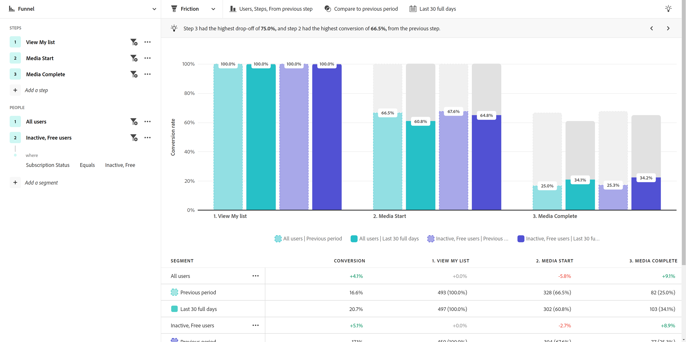

# [!UICONTROL Fricción] vista

El **[!UICONTROL Fricción]** La vista de proporciona una representación visual de un recorrido de usuario crítico en el producto. El eje horizontal representa cada paso que debe pasar un usuario. El eje vertical representa el porcentaje de usuarios o sesiones en cada paso. Todos los pasos deben realizarse en el orden previsto, pero pueden producirse en cualquier momento dentro de la ventana de creación de informes.

>[!VIDEO](https://video.tv.adobe.com/v/3421663/?learn=on)

## Casos prácticos

Los casos de uso para este tipo de vista incluyen:

* **Análisis de conversión**: Puede analizar las conversiones en cada fase del canal. Al rastrear el número de usuarios que progresan de un paso al siguiente, puede identificar cuellos de botella que tienen tasas de conversión inusuales o no deseadas. Esta información es valiosa para saber dónde puede mejorar el producto para obtener resultados inmediatos.
* **Optimización de incorporación**: optimice el proceso de incorporación de su producto examinando el comportamiento del usuario en torno a los eventos clave. Puede identificar con qué pasos luchan los usuarios o no logran completarlos.
* **Adopción y participación de funciones**: comprenda cómo los usuarios interactúan con funciones específicas del producto. Al analizar la progresión de los usuarios a través de los pasos relacionados con las funciones, puede evaluar las tasas de adopción de las funciones e identificar las áreas en las que los usuarios pueden abandonar o infrautilizar determinadas funciones. A continuación, puede utilizar esta información para centrarse en las mejoras de funciones y aumentar las tasas de adopción.
* **Evaluación de campaña**: mida la eficacia de las campañas de marketing. Puede crear un segmento que se centre en los usuarios que han participado en una campaña determinada y comparar su proceso de conversión con otras campañas o con el producto en general.

## Carril de consulta

El carril de consulta permite configurar los siguientes componentes:

* **[!UICONTROL Ver]**: cambie entre este tipo de vista y [Tendencias de conversión](conversion-trends.md).
* **[!UICONTROL Pasos]**: los puntos de contacto del evento que desea rastrear. Cada barra del gráfico representa un paso. Se pueden incluir hasta diez pasos.
* **[!UICONTROL Contabilizado como]**: el ámbito que desea aplicar al canal. Las opciones incluyen [!UICONTROL Sesiones] y [!UICONTROL Usuarios].
   * [!UICONTROL Sesiones]: todos los pasos deben realizarse dentro de la misma sesión para que se cuenten.
   * [!UICONTROL Usuarios]: todos los pasos deben realizarse dentro de la ventana de creación de informes seleccionada para que se puedan contar.
* **[!UICONTROL Segmentos]**: Los segmentos con los que desea comparar el canal. Cada segmento seleccionado divide cada paso en varias barras. Cada color representa un segmento diferente. Se pueden incluir hasta tres segmentos.

## Ajustes del gráfico

La vista de fricción ofrece la siguiente configuración de gráfico, que se puede ajustar en el menú situado encima del gráfico:

* **[!UICONTROL Tipo de gráfico]**: el tipo de visualización que desea utilizar. Las opciones incluyen [!UICONTROL Pasos].
* **[!UICONTROL Conversión de]**: Determina el cálculo de porcentaje de paso a paso. Las opciones incluyen calcular la conversión desde el [!UICONTROL Primer paso] o [!UICONTROL Paso anterior].

## Comparación del tiempo

{{apply-time-comparison}}

{style="border:1px solid gray"}

## Intervalo de fechas

El intervalo de fechas deseado para el análisis. Esta configuración consta de dos componentes:

* **[!UICONTROL Intervalo]**: La granularidad de fecha por la que desea ver los datos de tendencias. Esta configuración no afecta a las vistas sin tendencias, como Fricción.
* **[!UICONTROL Fecha]**: la fecha de inicio y finalización. Los ajustes preestablecidos de intervalo de fechas móviles y los intervalos personalizados guardados anteriormente están disponibles para su comodidad, o puede utilizar el selector de calendario para elegir un intervalo de fechas fijo.
