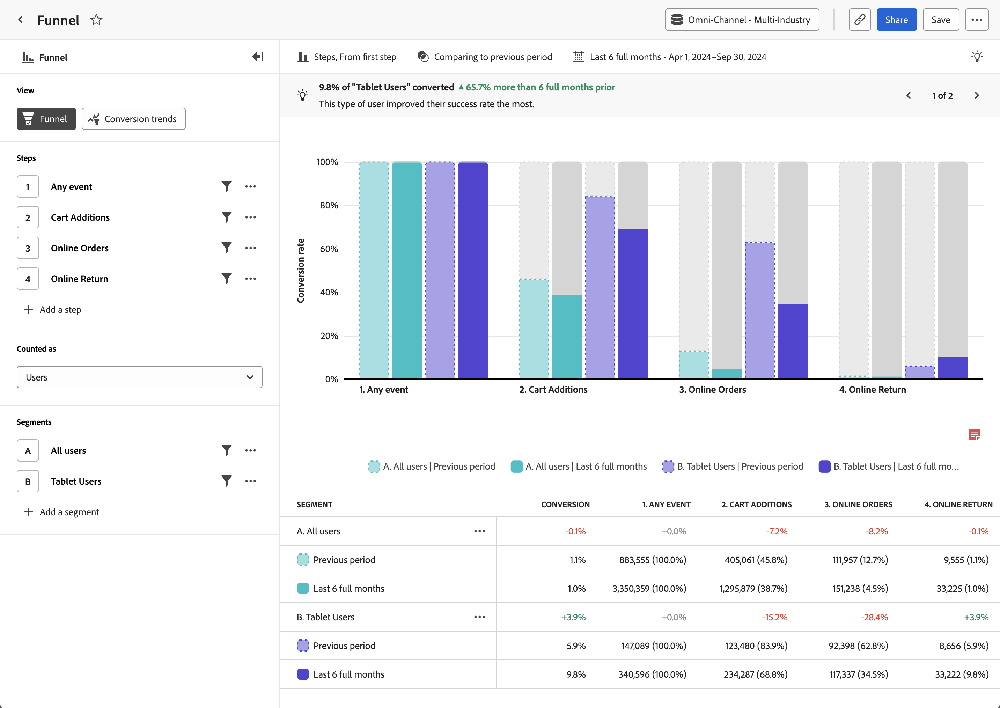

# Análisis del [!UICONTROL canal] {#funnel}

<!-- markdownlint-disable MD034 -->

>[!CONTEXTUALHELP]
>id="workspace_guidedanalysis_funnel_button"
>title="Canal"
>abstract="Compare las tasas de conversión entre pasos."

<!-- markdownlint-enable MD034 -->

El análisis **[!UICONTROL Canal ]**proporciona una representación visual de un recorrido de usuario esencial de su producto. El eje horizontal representa cada paso que debe atravesar un usuario. El eje vertical representa el porcentaje de usuarios o sesiones en cada paso. Todos los pasos deben realizarse en el orden previsto, pero pueden producirse en cualquier momento dentro de la ventana de creación de informes.

>[!VIDEO](https://video.tv.adobe.com/v/3421663/?quality=12&learn=on){width="90%"}

## Casos prácticos

Los casos de uso de este análisis incluyen:

* **Análisis de conversión**: puede analizar las conversiones en cada fase del canal, como un cierre de compra minorista, el registro en la cuenta, el flujo de suscripción o cualquier otro recorrido esencial de la experiencia del producto. Al realizar el seguimiento del número de usuarios que progresan de un paso al siguiente, puede identificar cuellos de botella que tienen tasas de conversión inusuales o no deseadas. Esta información es valiosa para saber dónde puede mejorar el recorrido del producto para obtener resultados inmediatos.
* **Análisis de experimentación**: puede comparar las tasas de conversión en un canal que tenga pasos opcionales o pasos en los que se esté ejecutando un experimento A/B. Esta información puede ayudarle a determinar qué variación del canal conduce a la tasa de conversión más alta, de modo que pueda animar a más usuarios para que sigan ese camino.
* **Optimización de la incorporación**: optimice el proceso de incorporación del producto mediante el examen del comportamiento del usuario en torno a eventos clave. Puede identificar qué pasos dan más problemas a los usuarios o cuáles no logran completar.
* **Participación y adopción de funciones**: comprenda cómo interactúan los usuarios con funciones específicas del producto. El análisis de la progresión de los usuarios a través de pasos relacionados con las funciones le permite ver las tasas de adopción e identificar áreas en las que los usuarios podrían infrautilizar determinadas funciones. A continuación, puede utilizar esta información para centrarse en las mejoras de funciones y aumentar las tasas de adopción.
* **Eficacia del canal de marketing**: mida la eficacia de los canales de marketing. Puede crear un segmento que se centre en usuarios que hayan interactuado con diferentes canales de marketing, como búsqueda de pago, visualización, búsqueda natural o directa. Puede comparar sus recorridos para ver qué canal ofrece los mejores resultados de producto.

## Interfaz

Consulte [Interfaz](../overview.md#interface) para obtener información general sobre la interfaz de análisis guiado. Las siguientes configuraciones son específicas de este análisis:

### Carril de consulta

El carril de consulta permite configurar los siguientes componentes:

* **[!UICONTROL Vista]**: cambie entre este análisis y [Tendencias de conversión](conversion-trends.md).
* **[!UICONTROL Pasos]**: los puntos de contacto del evento que desea rastrear. Cada barra del gráfico representa un paso. Se pueden incluir hasta diez pasos.
   * [!UICONTROL Comparación]: cada paso proporciona una opción para comparar varios eventos en un solo paso de canal y crear un “canal ramificado”. Esta función le permite comparar la fricción de dos recorridos en paralelo sin crear dos análisis independientes. Resulta útil cuando hay opciones de paso o cuando se está ejecutando un experimento A/B en el canal. Consulte [Canal](https://experienceleague.adobe.com/es/docs/customer-journey-analytics-learn/tutorials/guided-analysis/funnel) en los tutoriales de Customer Journey Analytics para ver un vídeo que explica cómo comparar canales.
* **[!UICONTROL Contabilizado como]**: el ámbito que desea aplicar al canal. Las opciones incluyen [!UICONTROL Sesiones] y [!UICONTROL Usuarios].
   * [!UICONTROL Sesiones]: todos los pasos deben realizarse dentro de la misma sesión para que se contabilicen.
   * [!UICONTROL Usuarios]: todos los pasos deben realizarse dentro de la ventana de creación de informes seleccionada para que se contabilicen.
* **[!UICONTROL Segmentos]**: los segmentos con los que desea comparar el canal. Cada segmento seleccionado divide cada paso en varias barras. Cada color representa un segmento diferente. Se pueden incluir hasta tres segmentos.

### Configuración del gráfico

El análisis [!UICONTROL Canal] ofrece la siguiente configuración de gráfico, que se puede ajustar en el menú situado encima del gráfico:

* **[!UICONTROL Tipo de gráfico]**: el tipo de visualización que desea utilizar. Las opciones incluyen [!UICONTROL Pasos].
* **[!UICONTROL Conversión de]**: determina el cálculo de porcentaje de un paso a otro. Las opciones incluyen calcular la conversión desde el [!UICONTROL Primer paso] o [!UICONTROL Paso anterior].

### Comparación del tiempo

{{apply-time-comparison}}

### Intervalo de fechas

El intervalo de fechas deseado para el análisis. Esta configuración consta de dos componentes:

* **[!UICONTROL Intervalo]**: la granularidad de fecha por la que desea ver los datos de tendencias. Esta configuración no afecta a los análisis sin tendencias como [Canal](funnel.md).
* **[!UICONTROL Fecha]**: la fecha de inicio y finalización. Los ajustes preestablecidos de intervalo de fechas móviles y los intervalos personalizados guardados anteriormente están disponibles para su comodidad, o puede utilizar el selector de calendario para elegir un intervalo de fechas fijo.

<!--
## Example

See below for an example of the analysis.

-->
