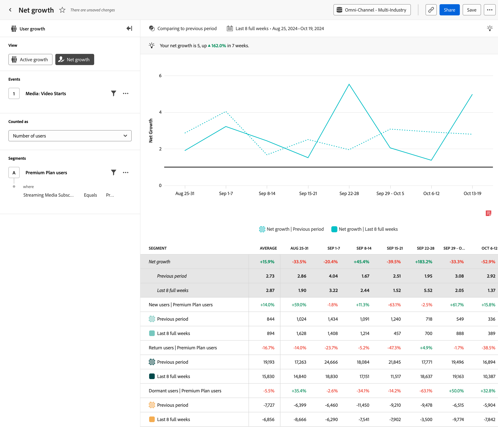

# Análisis de [!UICONTROL crecimiento neto]

El análisis  **[!UICONTROL Crecimiento neto]** proporciona información sobre la velocidad a la que se consiguen o se pierden usuarios durante un período específico. El eje horizontal es un intervalo de tiempo, mientras que el eje vertical es la medida del crecimiento.

Cada punto de datos representa el crecimiento neto, que se calcula mediante la siguiente fórmula:

`([New users] + [Return users]) / [Dormant users]`

El resultado de esta fórmula es una proporción. Un crecimiento neto de `1` representa un equilibrio; el producto ganó el mismo número de usuarios que perdió. Un crecimiento neto mayor que `1` representa un crecimiento positivo; había más usuarios nuevos y con retorno que usuarios inactivos. Del mismo modo, un crecimiento neto menor de `1` representa una pérdida; había más usuarios inactivos que los nuevos usuarios + que regresan.

De manera similar al análisis [Activo](active-growth.md), los usuarios se definen de la siguiente manera:

* **[!UICONTROL Nuevo]**: el usuario estaba activo durante el período actual, pero no anteriormente. Vea hasta qué punto el análisis retrocede para determinar un nuevo usuario pasando el puntero sobre &#39;[!UICONTROL Nuevos usuarios]&#39; en la leyenda del gráfico. El intervalo de retrospectiva se determina dinámicamente en función del intervalo de fechas y del intervalo seleccionados.
* **[!UICONTROL Devolver]**: el usuario estaba activo en el período actual y no estaba activo en el período inmediatamente anterior, pero anteriormente estaba activo en algún momento. Vea hasta dónde retrocede el análisis para determinar un usuario devuelto pasando el puntero sobre &#39;[!UICONTROL Devolver usuarios]&#39; en la leyenda del gráfico. El intervalo de retrospectiva se determina dinámicamente en función del intervalo de fechas y del intervalo seleccionados.
* **[!UICONTROL Inactivo]**: el usuario estaba activo en el período inmediatamente anterior, pero no lo está en el período actual. Los usuarios inactivos no se contabilizan en el número total de usuarios activos.

>[!NOTE]
>
>Los usuarios repetidos no se tienen en cuenta en este cálculo, ya que no representan ninguna ganancia o pérdida de usuarios.

>[!VIDEO](https://video.tv.adobe.com/v/3421664/?learn=on)

## Casos prácticos

Los casos de uso de este análisis incluyen:

* **Evaluación del rendimiento**: Permite evaluar el rendimiento general del producto en cuanto a la adquisición de nuevos usuarios. Al rastrear las tendencias de crecimiento, puede comprender mejor si su producto atrae y retiene a los usuarios a un ritmo deseado.
* **Análisis de adquisición de usuarios**: le permite evaluar la eficacia de sus estrategias de adquisición de usuarios. El análisis de las fuentes de crecimiento de los usuarios, como motores de búsqueda, campañas u otros canales de marketing, permite identificar las fuentes de crecimiento más significativas para poder asignar los recursos en consecuencia.
* **Análisis de pérdida**: el crecimiento neto incluye la desgaste en su fórmula (usuarios inactivos). Puede evaluar el estado general de su base de usuarios a lo largo del tiempo. Si el crecimiento neto es consistentemente inferior a `1`, indica una alta cantidad de desgaste que podría provocar la implementación de estrategias de retención.

## Interfaz

Consulte [Interfaz](../overview.md#interface) para obtener una descripción general de la interfaz de análisis guiado. Las siguientes configuraciones son específicas de este análisis:

### Carril de consulta

El carril de consulta permite configurar los siguientes componentes:

* **[!UICONTROL Vista]**: cambie entre este análisis y [Crecimiento activo](active-growth.md).
* **[!UICONTROL Eventos]**: El evento que desea medir. Dado que este análisis se basa en el usuario, un usuario que interactúa con el evento una vez dentro del periodo se cuenta como un usuario activo. Puede incluir un evento en una consulta.
* **[!UICONTROL Contado como]**: El método de conteo que desea aplicar a los eventos seleccionados. Las opciones incluyen [!UICONTROL Número de usuarios] y [!UICONTROL Porcentaje de usuarios].
* **[!UICONTROL Segmentos]**: El segmento que desea medir. Puede incluir un segmento en una consulta.

### Comparación del tiempo

{{apply-time-comparison}}

### Intervalo de fechas

El intervalo de fechas deseado para el análisis. Esta configuración consta de dos componentes:

* **[!UICONTROL Intervalo]**: La granularidad de fecha por la que desea ver los datos de tendencias. Las opciones válidas incluyen Por hora, Diario, Semanal, Mensual y Trimestral. El mismo intervalo de fechas puede tener diferentes intervalos que afectan al número de puntos de datos del gráfico y al número de columnas de la tabla. Por ejemplo, si se ve un análisis que abarca tres días con granularidad diaria, solo se mostrarían tres puntos de datos, mientras que un análisis que abarca tres días con granularidad horaria, mostraría 72 puntos de datos.
* **[!UICONTROL Fecha]**: La fecha de inicio y finalización. Los ajustes preestablecidos de intervalo de fechas móviles y los intervalos personalizados guardados anteriormente están disponibles para su comodidad, o puede utilizar el selector de calendario para elegir un intervalo de fechas fijo.

## Ejemplo

Consulte a continuación un ejemplo del análisis.

