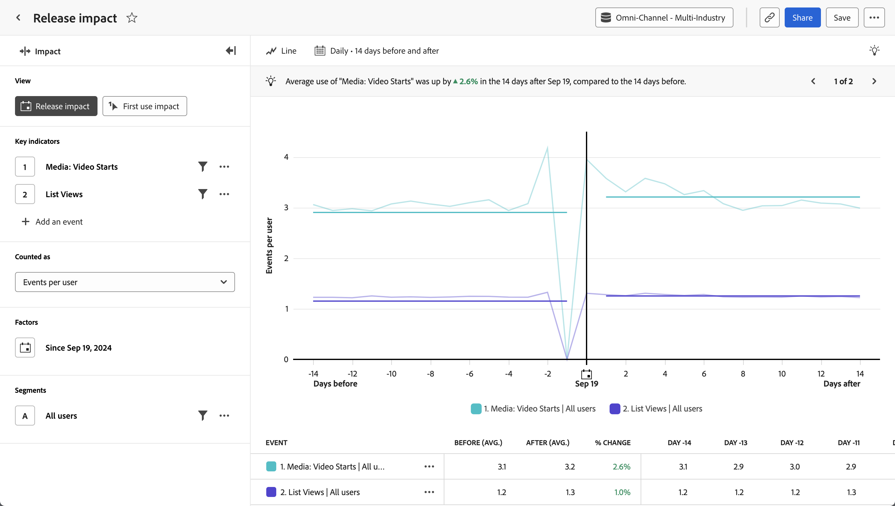

# [!UICONTROL Análisis del impacto de la versión] {#release-impact}

<!-- markdownlint-disable MD034 -->

>[!CONTEXTUALHELP]
>id="workspace_guidedanalysis_releaseimpact_button"
>title="Impacto de la versión"
>abstract="Compare el rendimiento en períodos iguales antes y después de la versión."

<!-- markdownlint-enable MD034 -->

El análisis del  **[!UICONTROL Impacto de la versión]** muestra una comparación del rendimiento de los indicadores clave antes y después de una fecha determinada. El eje horizontal de este informe es un intervalo de tiempo, mientras que el eje vertical mide los indicadores clave deseados. Una barra vertical en el centro del gráfico representa la fecha que desea comparar antes y después. Esta fecha suele representar un cambio notable en el producto que desea medir, como una actualización del producto o el lanzamiento de una campaña.

>[!VIDEO](https://experienceleague.adobe.com/en/docs/customer-journey-analytics-learn/tutorials/guided-analysis/release-impact)

## Casos de uso

Los casos de uso de este análisis incluyen:

* **Evaluación general del rendimiento:** la comparación de indicadores clave generales, como las medidas de participación, puede ayudarle a determinar si una versión determinada tuvo éxito en general.
* **Monitorización**: realice un seguimiento de las métricas vitales que esperaría que se mantuvieran estables cuando se realizan cambios, como el tiempo de carga o la cantidad de inicios de sesión. Utilice este análisis para compararlas antes y después del lanzamiento de una versión para asegurase de que no ha tenido consecuencias no deseadas.
* **Adopción de funciones**: si una actualización de producto se centra en mejorar una función determinada, puede usar este análisis para comparar directamente el uso de esa función antes y después de la actualización del producto.
* **Detección de errores**: realizar un seguimiento del número de errores antes y después del lanzamiento de una versión puede proporcionar un indicador precoz de los problemas de los clientes. Si observa un aumento de errores inmediatamente después de una versión, puede trabajar con los equipos de ingeniería o desarrollo para identificar y corregir el problema, evitando así un mayor impacto en los clientes.

## Interfaz

Consulte [Interfaz](../overview.md#interface) para obtener información general sobre la interfaz de análisis guiado. Las siguientes configuraciones son específicas de este análisis:

### Carril de consulta

El carril de consulta permite configurar los siguientes componentes:

* **[!UICONTROL Vista]**: cambie entre este análisis e [Impacto del primer uso](first-use-impact.md).
* **[!UICONTROL Indicadores clave]**: los eventos que desea medir por usuario. Cada indicador clave seleccionado se representa como una línea de color. Se añade a la tabla una fila que representa el evento. Se pueden incluir hasta tres eventos.
* **[!UICONTROL Contabilizado como]**: método de contabilización que desea aplicar a los eventos seleccionados. Las opciones incluyen [!UICONTROL Eventos por usuario], [!UICONTROL Porcentaje de usuarios], [!UICONTROL Eventos], [!UICONTROL Sesiones] y [!UICONTROL Usuarios].
* **[!UICONTROL Factores]**: la fecha que desea comparar antes y después.
* **[!UICONTROL Segmentos]**: el segmento que desea medir. El segmento seleccionado filtra los datos para centrarse únicamente en las personas que cumplen los criterios del segmento.

### Configuración del gráfico

El análisis del [!UICONTROL Impacto de la versión] ofrece la siguiente configuración de gráfico, que se puede ajustar en el menú situado encima del gráfico:

* **[!UICONTROL Tipo de gráfico]**: el tipo de visualización que desea utilizar. Las opciones incluyen [!UICONTROL Línea] y [!UICONTROL Barra].

### Intervalo de fechas

La selección de fecha en el análisis del impacto funciona de forma diferente a otros análisis, ya que el informe gira en torno a la fecha especificada en el carril de la consulta. Las opciones disponibles son las siguientes:

* **[!UICONTROL Intervalo]**: la granularidad de fecha por la que desea ver los datos de tendencias. Las opciones válidas incluyen [!UICONTROL Diario], [!UICONTROL Semanal], [!UICONTROL Mensual] y [!UICONTROL Trimestral]. Cambiar el intervalo afecta a las opciones disponibles para el periodo Antes y después.
* **[!UICONTROL Antes y después del período]**: la cantidad de tiempo que se debe analizar antes y después de la fecha especificada en el carril de la consulta. Las opciones disponibles dependen de la selección de [!UICONTROL Intervalo].

<!--
## Example

See below for an example of the analysis.

-->
