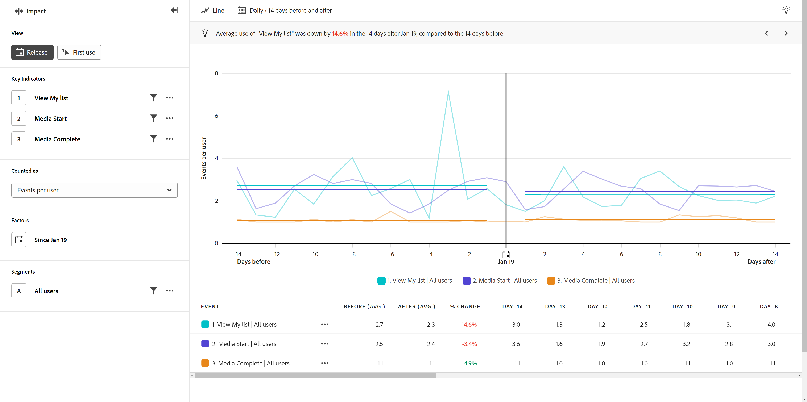

# Vista de versión

El **Versión** La vista muestra una comparación del rendimiento de los indicadores clave antes y después de una fecha determinada. El eje horizontal de este informe es un intervalo de tiempo, mientras que el eje vertical mide los indicadores clave deseados. Una barra vertical en medio del gráfico representa la fecha que desea comparar antes y después de. Esta fecha suele representar un cambio notable en el producto con el que desea medir, como una actualización del producto o un lanzamiento de campaña.

## Casos prácticos

Los casos de uso para este tipo de vista incluyen:

* **Evaluación general del rendimiento:** La comparación de indicadores clave generales, como las medidas de participación, puede ayudarle a determinar si una versión determinada ha tenido éxito en general.
* **Monitorización**: Si espera que haya ciertas medidas que permanezcan planas cuando se realicen cambios, como constantes vitales para la web como tiempo de carga o inicios de sesión, compárelas antes y después para asegurarse de que su lanzamiento no haya tenido consecuencias no deseadas.
* **Adopción de funciones**: si una actualización de producto se centra en mejorar una determinada función, puede utilizar esta vista para comparar directamente el uso de esa función antes y después de la actualización del producto.
* **Detección de errores**: El seguimiento del número de errores antes y después de una versión de puede proporcionar un indicador anticipado de los problemas de los clientes. Si observa un aumento de errores inmediatamente después de una versión, puede trabajar con equipos de ingeniería o desarrollo para identificar y corregir el problema, lo que evita un mayor impacto para los clientes.

## Carril de consulta

El carril de consulta permite configurar los siguientes componentes:

* **Indicadores clave**: los eventos que desea medir por usuario. Cada indicador clave seleccionado se representa como una línea de color. Se agrega a la tabla una fila que representa el evento. Se pueden incluir hasta tres eventos.
* **Factores**: La fecha que desea comparar antes y después de.
* **People**: El segmento que desea medir. El segmento seleccionado filtra los datos para centrarse únicamente en las personas que coinciden con los criterios del segmento.

## Ajustes del gráfico

La vista Lanzamiento ofrece la siguiente configuración de gráfico, que se puede ajustar en el menú situado encima del gráfico:

* **Métrica**: La métrica que desea medir. Las opciones incluyen [!UICONTROL Eventos por usuario], [!UICONTROL Porcentaje de usuarios], [!UICONTROL Eventos], [!UICONTROL Sesiones], y [!UICONTROL Usuarios].
* **Tipo de gráfico**: el tipo de visualización que desea utilizar. Las opciones incluyen Línea.

## Intervalo de fechas

La selección de fechas en el análisis de impacto funciona de forma diferente a otros tipos de análisis, ya que el informe gira en torno a la fecha especificada en el carril de consulta. Las opciones disponibles son las siguientes:

* **Intervalo**: La granularidad de fecha por la que desea ver los datos de tendencias. Las opciones válidas incluyen [!UICONTROL Diario], [!UICONTROL Semanalmente], [!UICONTROL Mensual], y [!UICONTROL Trimestral]. Cambiar el intervalo afecta a las opciones disponibles para los periodos Antes y Después.
* **Antes y después del período**: Cantidad de tiempo que se debe analizar antes y después de la fecha especificada en el carril de consultas. Las opciones disponibles dependen de la variable [!UICONTROL Intervalo] selección.
