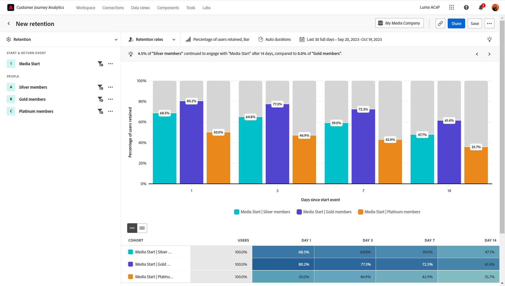

# Tasas de retención

El **[!UICONTROL Tasas de retención]** La vista de mide cómo los usuarios siguen usando su producto a lo largo del tiempo, lo que puede ayudarle a comprender el ajuste del mercado de su producto. El análisis cuenta los usuarios en función de dos eventos importantes:

* Evento Start: el evento utilizado para clasificar a los usuarios para incluirlos en el análisis.
* Evento de retorno: los eventos con los que debe interactuar un usuario para contar como usuario que retorna en el análisis.

En esta vista, el eje x del gráfico representa el tiempo desde el evento de inicio inicial de un usuario y el eje y representa el porcentaje de usuarios que se relacionan con los eventos de retorno. Puede ver tanto la retención como la pérdida en todas las duraciones, y las duraciones mostradas se pueden personalizar a través de la configuración de consulta. Debajo del gráfico, una tabla proporciona datos agregados con la opción de mostrar cohortes individuales, que son un grupo de personas que realizaron el evento de inicio en la misma fecha.

{style="border:1px solid gray"}

## Casos prácticos

Los casos de uso para este tipo de vista incluyen:

* **Análisis de cohorte**: agrupe a los usuarios en cohortes en función de las acciones que realicen, como suscripciones o compras. Puede comparar el rendimiento de estos grupos y determinar cómo abordar la mejora de la experiencia de usuario de cada grupo.
* **Ajuste del mercado de productos**: mida el uso regular del producto y visualícelo como curvas de retención. Una mayor retención significa un mejor ajuste al mercado del producto, y el lugar donde la curva se aplana indica cuánto tiempo se tarda en alcanzar el ajuste. Vea este análisis a nivel general o desglose por funciones de producto individuales para obtener información más detallada.
* **Análisis del servicio de suscripción**: Si su producto utiliza una suscripción u otro tipo de modelo de ingresos recurrentes, puede ver el porcentaje de usuarios que aprovechan al máximo su producto. Puede identificar ciertas cualidades y comportamientos que muestran estos usuarios.
* **Participación del usuario**: evalúe cómo interactúan determinados tipos de usuarios con el producto y compare en paralelo la frecuencia con la que regresan. Un segmento determinado con una retención menor que otros puede proporcionarle una perspectiva sobre la mejora de las posibles experiencias inferiores que podrían tener.

## Carril de consulta

El carril de consulta permite configurar los siguientes componentes:

* **[!UICONTROL Evento Start]**: los criterios de evento con los que debe interactuar un usuario para cumplir los requisitos de inclusión en el análisis. Los usuarios que interactúan con el evento de inicio se cuentan en la columna &quot;Usuarios&quot; de la tabla. Esto sirve como denominador para las tasas de retención mostradas. Se admite un evento y se pueden aplicar filtros de propiedad según sea necesario. De forma predeterminada, los eventos de inicio y retorno están vinculados, lo que significa que un usuario debe realizar el evento seleccionado una vez para incluirlo en la cohorte y, a continuación, volver a contarlo como usuario recurrente. En el menú Más, puede desvincular los eventos de inicio y retorno si desea que la acción de retorno sea diferente de la acción de inclusión.
* **[!UICONTROL Devolver eventos]**: los criterios de evento con los que debe interactuar un usuario para contar como usuarios que regresan en los bloques de duración. Puede seleccionar hasta tres eventos de retorno para comparar la retención entre sí.
* **[!UICONTROL Contabilizado como]**: Método de contabilización que desea aplicar a los usuarios retenidos. Las opciones incluyen: 
   * **[!UICONTROL Métrica]**: Mostrar el número de [!UICONTROL Usuarios] o el [!UICONTROL Porcentaje de usuarios] conservado. El denominador para el porcentaje de usuarios retenidos es el de los usuarios incluidos para la cohorte y es el mismo en todos los bloques de duración.
   * **[!UICONTROL Retorno]**: Permite controlar cómo se cuentan los usuarios que regresan. Las opciones incluyen: 
      * **[!UICONTROL Activado o posterior]**: denominada con frecuencia retención &quot;sin límites&quot;, esta opción cuenta un usuario si regresa en la duración especificada o después de ella. Por ejemplo, en el día 7 o en cualquier momento después del día 7. Esta opción es útil para mostrar cómo los usuarios siguen interactuando y, como resultado, generará una curva de retención más suave.
      * **[!UICONTROL Exactamente el]**: denominada con frecuencia retención &quot;limitada&quot;, esta opción cuenta un usuario si regresa exactamente a la duración especificada. Por ejemplo, el día 7 exactamente. Esta opción es útil para mostrar cómo los usuarios regresan dentro de marcos de tiempo específicos y, como resultado, generará una curva de retención con más ondulación. Nota: El análisis de cohorte en Analysis Workspace utiliza el recuento &quot;exactamente&quot; como base para su análisis.
   * **[!UICONTROL Cada]**: el período de tiempo que desea que sea cada bloque de duración. Las opciones incluyen: 
      * **[!UICONTROL Día/semana/mes]**: las opciones disponibles dependen del intervalo de fechas seleccionado. Estas opciones son idénticas a las de **[!UICONTROL Intervalo]** configuración al seleccionar el intervalo de fechas y actualizará esa configuración automáticamente.
      * **[!UICONTROL Corchetes personalizados]**: esta opción solo está disponible para la configuración &quot;En cada uno&quot;. Permite contar usuarios en un periodo de tiempo mayor; por ejemplo, del día 7 al 10, en lugar de solo el día 7.
   * **[!UICONTROL Configuración de duración]**: Permite controlar los bloques de duración que se muestran en el gráfico y la tabla. Una duración es el período de tiempo después del evento de inicio en el que se produjo el evento de retorno. Nota: Los usuarios que cumplen los requisitos para los bloques de duración se basan en el tiempo transcurrido, no en los días del calendario. Por ejemplo, si un usuario cumple los requisitos para un evento a las 23:55 del 6 de septiembre y luego cumple los requisitos para un evento de retorno a las 12:05 del 7 de septiembre, no aparecerá en el bloque de duración de 1 día. Deben transcurrir 24 horas completas antes de que el usuario cumpla los requisitos del bloque de duración de 1 día. Los bloques de duración disponibles dependen del intervalo de fechas que establezca.
      * **[!UICONTROL Duraciones automáticas]** define automáticamente los bloques de duración en función de la longitud del intervalo de fechas y de la proximidad al día actual que esté el intervalo de fechas.
      * **[!UICONTROL Duraciones personalizadas]** permite personalizar los cuatro bloques de duración que se muestran en el gráfico y la tabla.
* **[!UICONTROL Segmentos]**: los segmentos que desea medir. Cada segmento seleccionado agrega una fila a la tabla de cohorte. Se pueden incluir hasta tres segmentos.

## Ajustes del gráfico

El [!UICONTROL Tasas de retención] La vista ofrece la siguiente configuración de gráfico, que se puede ajustar en el menú situado encima del gráfico:

* **[!UICONTROL Tipo de gráfico]**: el tipo de visualización que desea utilizar. Las opciones incluyen [!UICONTROL Barra] y [!UICONTROL Línea].

## Intervalo de fechas

El intervalo de fechas deseado para el análisis. Esta configuración consta de dos componentes:

* **[!UICONTROL Intervalo]**: La granularidad de fecha según la cual desea ver los datos de retención. Las opciones válidas son Daily, Weekly y Monthly. El mismo intervalo de fechas puede tener diferentes intervalos, lo que afecta a las opciones del bloque de duración.
* **[!UICONTROL Fecha]**: la fecha de inicio y finalización. Los ajustes preestablecidos de intervalo de fechas móviles y los intervalos personalizados guardados anteriormente están disponibles para su comodidad, o puede utilizar el selector de calendario para elegir un intervalo de fechas fijo.

Si selecciona un intervalo de fechas cercano al día actual, no se incluyen los usuarios que inicialmente interactúan demasiado cerca del día actual. Este análisis siempre ofrece a todos los usuarios la oportunidad de ser incluidos en todos los bloques de duración. Un mensaje debajo del selector de calendario proporciona información sobre el intervalo de fechas en el que los usuarios interactúan y el intervalo que se reserva únicamente para los usuarios que regresan:

* **[!UICONTROL Análisis de los usuarios que realizaron el evento de inicio en [Intervalo de fecha]]**: Si un usuario interactúa con el evento dentro de este intervalo de fechas, se incluye en el análisis. Este intervalo de fechas garantiza a todos los usuarios tiempo suficiente para cumplir los requisitos de todos los bloques de duración. Este intervalo de fechas puede ser diferente al seleccionado si está cerca del día actual.
* **[!UICONTROL Datos de [Intervalo de fecha] está reservado para completar el análisis]**: Si un usuario se involucra por primera vez dentro de este período, lo está **no** incluido en el análisis. Para intervalos de fechas recientes, estos usuarios no tendrían la oportunidad de cumplir los requisitos de todos los bloques de duración. Para intervalos de fechas anteriores, estos usuarios estaban activos fuera del intervalo de fechas seleccionado.
