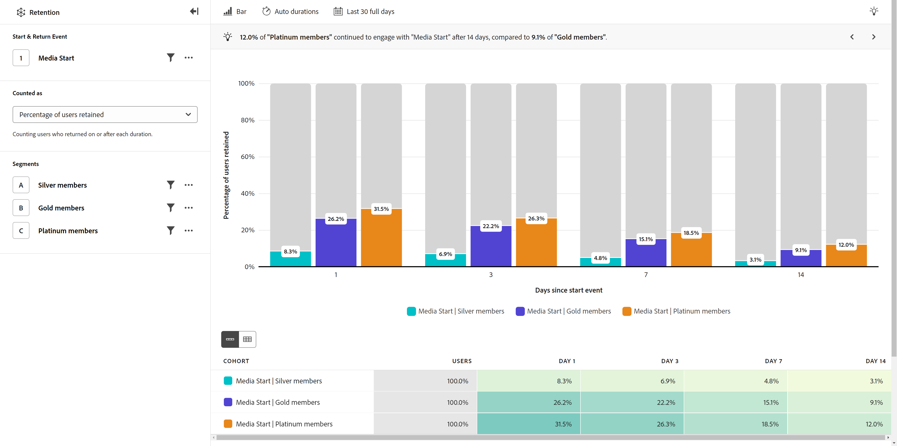

# Tasas de retención

El **[!UICONTROL Tasas de retención]** La vista muestra a los usuarios repetir el comportamiento de uso en su producto a lo largo del tiempo, lo que le ayuda a comprender el ajuste del mercado del producto. En esta vista, el eje horizontal representa el número de días desde la participación inicial de un usuario y el eje vertical representa el porcentaje de usuarios que vuelven a interactuar.

Este análisis cuenta los usuarios en función de dos eventos importantes:

* Evento de inicio: la primera vez que un usuario participó en el evento dentro del intervalo de fechas
* Evento de retorno: la hora más reciente en la que un usuario participó con el evento dentro del intervalo de fechas analizado

El bloque de duración &quot;Día 0&quot; representa el tiempo inicial que un usuario participó en el evento y siempre es igual exactamente al 100 %. Este bloque es el denominador utilizado para calcular el porcentaje de usuarios retenidos.

Los bloques de duración posteriores cuentan el número de usuarios que regresaron en esa duración o después. Este recuento es el numerador que se utiliza para calcular el porcentaje de usuarios retenidos.

* Si un usuario interactúa con el evento solo una vez durante el intervalo de fechas deseado (la participación inicial), solo aparece en el bloque de duración &quot;Día 0&quot;.
* Si un usuario se involucra con el evento varios días después de cumplir los requisitos iniciales para la inclusión en el análisis, aparece en el último bloque de duración correspondiente y en todos los bloques de duración previos al mismo. Este tipo de cálculo se denomina a veces &quot;retención ilimitada&quot;.

{style="border:1px solid gray"}

## Casos prácticos

Los casos de uso para este tipo de vista incluyen:

* **Análisis de cohorte**: agrupe a los usuarios en cohortes en función de las acciones que realicen, como suscripciones o compras. Puede comparar el rendimiento de estos grupos y determinar cómo abordar la mejora de la experiencia de usuario de cada grupo.
* **Ajuste del mercado de productos**: mida el uso regular del producto y visualícelo como curvas de retención. Una mayor retención significa un mejor ajuste al mercado del producto, y el lugar donde la curva se aplana indica cuánto tiempo se tarda en alcanzar el ajuste. Vea este análisis a nivel general o desglose por funciones de producto individuales para obtener información más detallada.
* **Análisis del servicio de suscripción**: Si su producto utiliza una suscripción u otro tipo de modelo de ingresos recurrentes, puede ver el porcentaje de usuarios que aprovechan al máximo su producto. Puede identificar ciertas cualidades y comportamientos que muestran estos usuarios.
* **Participación del usuario**: evalúe cómo interactúan determinados tipos de usuarios con el producto y compare en paralelo la frecuencia con la que regresan. Un segmento determinado con una retención menor que otros puede proporcionarle información sobre cómo mejorar las experiencias inferiores potenciales que pueden tener.

## Carril de consulta

El carril de consulta permite configurar los siguientes componentes:

* **[!UICONTROL Evento de inicio y retorno]**: los criterios de evento con los que debe interactuar un usuario para cumplir los requisitos de inclusión y retención en el análisis. Se admite un evento, pero puede incluir filtros de propiedad.
* **[!UICONTROL Contabilizado como]**: Método de contabilización que desea aplicar a los usuarios retenidos. Las opciones incluyen [!UICONTROL Usuarios retenidos] y [!UICONTROL Porcentaje de usuarios retenidos].
* **[!UICONTROL Segmentos]**: los segmentos que desea medir. Cada segmento seleccionado agrega una fila a la tabla de cohorte. Se pueden incluir hasta tres segmentos.

## Ajustes del gráfico

El [!UICONTROL Tasas de retención] La vista ofrece la siguiente configuración de gráfico, que se puede ajustar en el menú situado encima del gráfico:

* **[!UICONTROL Tipo de gráfico]**: el tipo de visualización que desea utilizar. Las opciones incluyen [!UICONTROL Barra] y [!UICONTROL Línea]. La visualización de líneas muestra el día 0 visualmente en el gráfico.

## Configuración de duración

Permite controlar cómo muestra el análisis los usuarios según el número de días transcurridos.

* **[!UICONTROL Duraciones automáticas]**: establezca automáticamente las duraciones en función de la longitud del intervalo de fechas y de la proximidad al día actual en que se encuentre el intervalo de fechas. Los bloques de duración se depuran para los casos de uso más comunes.
* **[!UICONTROL Duraciones personalizadas]**: configure manualmente los intervalos transcurridos deseados. Puede establecer cuatro duraciones.

Los bloques de duración disponibles dependen del intervalo de fechas que establezca.

## Intervalo de fechas

El intervalo de fechas deseado para el análisis. Esta configuración consta de dos componentes:

* **[!UICONTROL Intervalo]**: La granularidad de fecha según la cual desea ver los datos de retención. Las opciones válidas son Daily, Weekly y Monthly. El mismo intervalo de fechas puede tener diferentes intervalos, lo que afecta a las opciones del bloque de duración.
* **[!UICONTROL Fecha]**: la fecha de inicio y finalización. Los ajustes preestablecidos de intervalo de fechas móviles y los intervalos personalizados guardados anteriormente están disponibles para su comodidad, o puede utilizar el selector de calendario para elegir un intervalo de fechas fijo.

Si selecciona un intervalo de fechas cercano al día actual, no se incluyen los usuarios que inicialmente interactúan demasiado cerca del día actual. Este análisis siempre ofrece a todos los usuarios la oportunidad de ser incluidos en todos los bloques de duración. Un mensaje debajo del selector de calendario proporciona información sobre el intervalo de fechas en el que los usuarios interactúan y el intervalo que se reserva solo para los usuarios que regresan:

* **Análisis de los usuarios que realizaron el evento de inicio en [Intervalo de fecha]**: Si un usuario interactúa con el evento dentro de este intervalo de fechas, se incluye en el análisis. Este intervalo de fechas garantiza a todos los usuarios tiempo suficiente para cumplir los requisitos de todos los bloques de duración. Este intervalo de fechas puede ser diferente al seleccionado si está cerca del día actual.
* **Datos de [Intervalo de fecha] está reservado para completar el análisis**: Si un usuario se involucra por primera vez dentro de este período, lo está **no** incluido en el análisis. Para intervalos de fechas recientes, estos usuarios no tendrían la oportunidad de cumplir los requisitos de todos los bloques de duración. Para intervalos de fechas anteriores, estos usuarios estaban activos fuera del intervalo de fechas seleccionado.

## Tabla de cohortes

La tabla debajo del gráfico proporciona una vista agregada (similar a los datos del gráfico) y una tabla de cohorte completa. La tabla de cohorte completa proporciona detalles sobre cada intervalo de fecha individual y cuándo participan los usuarios.
